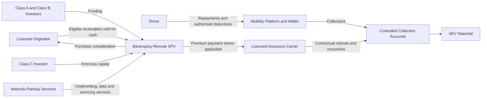

## Document Status and Decision Requested

This memorandum presents a proposed partnership and financing framework for Mwendo Pamoja. It is an illustrative, non-binding basis for commercial, legal, regulatory, accounting, model-validation, and financial diligence. Executed agreements and the approved SPV term sheet will prevail over this memorandum.

The decision requested is approval to proceed with structured diligence for:

- a KES-denominated SPV capitalisation equivalent to USD 9.00 million;
- an optional, legally separate HoldCo facility of USD 1.00 million for platform and transaction-readiness expenditure; and
- a controlled pilot integrating one or more licensed lenders, an authorised insurance carrier, participating mobility platforms, a servicer, a trustee or security agent, and institutional capital providers.

The USD 10.00 million consolidated view is the sum of the SPV and optional HoldCo facilities. HoldCo operating expenditure is not payable through the SPV waterfall. Amounts, rates, losses, recoveries, and scenario outputs in this memorandum are illustrative until supported by executed terms, a validated portfolio tape, and the approved financial model.

## Section 1: Executive Proposition

Gig-economy drivers operate a concentrated income-producing asset: the vehicle, the platform account, the wallet, and the driver's capacity to work form one economic system. Traditional periodic credit assessment often observes arrears after cash-flow deterioration has already affected fuel, maintenance, insurance, and debt service. A modest external shock can therefore produce a sequence of reduced working hours, revolving utilisation, missed instalments, policy lapse, platform restriction, and multi-product default.

Mwendo Pamoja is designed to identify and manage this shared operating state earlier. It combines governed telematics, trip, wallet, repayment, insurance, platform, and macroeconomic information with interpretable liquidity features and probabilistic underwriting. The platform does not assume that prediction alone prevents loss. It uses predictive outputs, uncertainty, contractual controls, portfolio limits, and approved interventions as separate components of a controlled decision process.

The financing proposition is to purchase eligible insurance-premium-financing, microloan, and revolving-credit receivables into a bankruptcy-remote SPV. Collections flow through controlled accounts and a defined waterfall. Class C first-loss capital, Class B subordination, overcollateralisation, a cash reserve, eligibility rules, concentration limits, and early amortisation provide structural protection. Whether a tranche incurs loss remains a calculated scenario result, not a guarantee.

## Section 2: Parties and Responsibilities

| Party | Primary responsibility | Economic or legal boundary |
|---|---|---|
| Mwendo Pamoja HoldCo | Owns intellectual property, governance standards, and approved technology | Does not own SPV collections; any Class C investment and support obligation are disclosed separately |
| Operating company or service company | Operates integrations, underwriting services, and agreed servicing functions | Acts only within licences and executed contracts |
| Licensed lender or originator | Originates credit and approves customer pricing and terms | Retains regulatory and customer obligations assigned by law and contract |
| Insurance carrier | Issues and administers the insurance contract, handles claims and refunds | Owns insurance risk and applies IFRS 17 within its reporting perimeter |
| SPV | Purchases eligible receivables and applies collections under the waterfall | Conducts only permitted activities and observes separateness covenants |
| Servicer and backup servicer | Maintains contractual balances, collections, customer records, and reports | Operates under defined standards, transition rights, and audit controls |
| Mobility platform | Supplies authorised data and performs agreed split-settlement or collection services | No deduction, routing, or data right is assumed without an executed agreement |
| Trustee or security agent | Controls security, accounts, reporting, and enforcement rights | Acts under definitive finance documents |
| Class A and Class B investors | Provide senior and subordinated funding | Rely on SPV assets and contracted credit enhancement, subject to disclosed risks |
| Class C investor | Funds first-loss or residual capital | Bears portfolio loss before debt only to the extent and in the order defined by the waterfall |

The carrier, lender, SPV, platform, and technology provider are not interchangeable. Policy issuance, credit origination, servicing, receivables ownership, data processing, and final policy decisions must each have one accountable party.



Bankruptcy remoteness depends on legal and operational measures, including true sale, perfection, separateness, limited-purpose restrictions, controlled accounts, non-petition and limited-recourse provisions where appropriate, servicing continuity, commingling controls, and legal opinions. Separate ledgers and systems support evidence but do not create legal remoteness.

## Section 3: Underwriting and Policy Architecture

### 3.1 Canonical Decision Stack

```text
Raw telematics, trip, wallet, repayment and policy events
                         |
                  Flink feature services
                    /                 \
        GRU/Transformer          Explicit Liquidity
        neural embeddings        Feature Path
                    \                 /
          Hierarchical Bayesian underwriting
                         |
          Credit Policy and Compliance Gate
                         |
     Approve, decline, limit, freeze, restructure or intervene
```

The neural branch learns latent temporal patterns from governed raw or minimally transformed sequences. The Explicit Liquidity Feature Path is the low-latency feature-computation and serving path for interpretable variables. The following engineered metrics belong only to the explicit path:

- Wallet Cash-Flow Asymmetry, or CFA;
- Dynamic Debt-to-Liquidity Ratio, or DLR;
- Earnings Velocity;
- Repayment Velocity;
- wallet cash-flow volatility;
- reserve-pocket balance;
- time since depletion;
- revolving utilisation and aggregate exposure; and
- approved product, platform, and macroeconomic interactions.

Raw wallet-event sequences may support neural timing and behavioural learning, but the named engineered liquidity metrics are not duplicated as neural inputs. This ownership rule reduces leakage, redundancy, unstable attribution, and multicollinearity at the Bayesian interface.

### 3.2 Redundancy-Controlled Hierarchical Logistic Regression

For driver or facility observation \(i\), the underwriting model begins with the uncalibrated linear predictor:

$$
\eta_i
=\alpha+a_{g[i]}+b_{p[i]}+c_{t[i]}
+\mathbf q_i^{\top}\boldsymbol\beta_z
+\widetilde{\mathbf h}_i^{\top}\boldsymbol\beta_h
+\boldsymbol\psi_i^{\top}\boldsymbol\gamma
+\mathbf m_i^{\top}\boldsymbol\delta,
$$

where \(a_{g[i]}\) is a partially pooled cluster effect, \(b_{p[i]}\) is a product effect, \(c_{t[i]}\) is an approved residual time or cohort effect, \(\mathbf q_i\) is an orthonormal basis derived from centred explicit spline terms, \(\widetilde{\mathbf h}_i\) is a neural representation residualised against the explicit design using training-fold data only, \(\boldsymbol\psi_i\) contains a limited set of centred interactions that satisfy strong heredity, and \(\mathbf m_i\) contains approved missingness and source-health indicators.

The residualisation step is estimated on development folds, for example through a regularised projection:

$$
\widehat{\mathbf A}_{\lambda}
= (\mathbf B_Z^{\top}\mathbf B_Z + \lambda\mathbf I)^{-1}
\mathbf B_Z^{\top}\mathbf H,
\qquad
\widetilde{\mathbf H}=\mathbf H-\mathbf B_Z\widehat{\mathbf A}_{\lambda}.
$$

This does not claim that the branches are statistically independent. It limits the neural block's ability to reproduce the same linear information already represented by explicit liquidity features. QR orthogonalisation, grouped regularised-horseshoe priors, interaction heredity, VIF and condition-index diagnostics, and out-of-time ablation tests provide additional controls. If the residual neural block lacks stable incremental value or harms calibration, the approved production fallback is the explicit-only hierarchical model.

The model produces a real-world probability of default, \(PD_{\mathbb P}\), and uncertainty. A separate calibration layer, estimated only on a time-forward validation set, is applied as:

$$
\operatorname{logit}(PD^{\text{cal}}_i)
= \kappa_{p[i]} + s\eta_i,
$$

with partially pooled product intercepts where sample size permits and a positive calibration slope \(s\). Calibration intercept and slope, Brier score, log score, discrimination, uncertainty coverage, stability, and subgroup outcomes must pass approval thresholds. The model output is not relabelled as a risk-neutral probability.

### 3.3 Credit Policy and Compliance Gate

The downstream gate applies approved legal, contractual, credit, portfolio, and operational rules. These can include product eligibility, affordability and minimum cash sufficiency, maximum aggregate exposure, insurance status, uncertainty limits, data-quality fallbacks, fraud controls, platform and geography concentration, reserve and OC status, NPL triggers, and distribution restrictions. Rules, models, and interventions have separate owners, versions, approvals, explanations, and audit trails.

The system does not claim to eliminate algorithmic bias. It measures approval, price, limit, calibration, error rates, interventions, complaints, appeals, and customer outcomes across legally reviewed groups, with uncertainty and minimum sample controls. Customers receive the actual policy reason plus an appropriately validated model reason where relevant.

## Section 4: Products, Collections, and Interventions

The asset pool contains three products, not three capital tranches:

1. Insurance premium financing receivables, supported by contractual premium-refund mechanics where enforceable.
2. Short-duration microloan receivables for approved operating needs.
3. Revolving working-capital receivables subject to utilisation, aggregate exposure, and freeze controls.

Each product requires a state machine defining current, arrears, cure, restructuring, default, write-off, recovery, cancellation, and prepayment. An insurance policy grace period does not itself determine credit default, and a carrier refund is not cash until contractually due and collected.

Platform split settlement is a proposed collection mechanism subject to the platform agreement, customer authorisation, applicable law, deduction caps, cash-sufficiency protection, reconciliation, disputes, reversals, outages, and insolvency. Driver reserve pockets are legally and operationally separate from the SPV cash reserve account. The model does not count driver property as SPV collateral without enforceable rights.

Interventions can include a premium holiday, payment rescheduling, a bounded liquidity bridge, draw freeze, limit reduction, fatigue-related safety escalation, or alternative routing. Each intervention must identify the authorised decision-maker, contractual basis, funding source, duration, customer notice and consent where required, accounting treatment, override, appeal, safety effect, and outcome measure. Intervention effectiveness is an empirical assumption until validated and may be set to zero or adverse in stress testing.

## Section 5: SPV Capital and Cash Waterfall

### 5.1 Primary Capitalisation

| Class | USD-equivalent amount | Share | Proposed economic role |
|---|---:|---:|---|
| Class A | 6.75 million | 75% | Senior secured notes |
| Class B | 1.35 million | 15% | Subordinated or mezzanine notes |
| Class C | 0.90 million | 10% | First-loss equity or residual certificate |
| Total SPV | 9.00 million | 100% | Primary capitalisation |

The operating and waterfall currency is KES. USD values are presentation equivalents unless definitive documents elect a USD obligation and a documented cross-currency hedge. A cash reserve is a liquidity resource, not an FX hedge.

Class A is proposed to accrue compounded KESONIA in arrears plus negotiated margin \(m_A\). Class B accrues compounded KESONIA plus \(m_B\), or a fixed negotiated coupon if elected. The 91-day T-bill is retained as a comparison benchmark rather than the canonical liability basis. The note benchmark, customer rate, asset yield, funds-transfer price, and investor discount rate are separate measures.

### 5.2 Borrowing Base and Overcollateralisation

Class A's 75% capital share must not be confused with a collateral advance rate. Under the illustrative total-capital funding convention:

$$
\text{Eligible receivables at close}
= \frac{\text{KES equivalent of USD 9.00 million}}{75\%}
= \text{KES equivalent of USD 12.00 million}.
$$

The controlling debt-note OC test is:

$$
\text{OC ratio}
= \frac{\text{eligible receivables}}
{\text{Class A outstanding}+\text{Class B outstanding}}.
$$

Using the illustrative closing amounts, the ratio is \(12.00/8.10=148.15\%\), above the proposed 125% minimum. Definitive documents must define eligible receivables, product advance rates, concentration, dilution, arrears, data defects, carrier-refund haircuts, and borrowing-base deficiencies.

### 5.3 Cash Reserve and Waterfall

The proposed cash reserve target is three months of defined Class A and B debt service. Definitive documents must state whether this includes scheduled principal, interest, trustee costs, hedge payments, and backup-servicing costs.

The normal waterfall is proposed as:

1. taxes and statutory or trustee costs that are legally senior;
2. servicing and backup-servicing costs;
3. Class A interest;
4. Class A scheduled principal and required sweeps;
5. Class B interest;
6. Class B scheduled principal and required sweeps;
7. reserve replenishment;
8. permitted receivable purchases during an active revolving period; and
9. Class C residual distribution, subject to distribution conditions.

During early amortisation, new purchases and residual distributions stop and available cash sweeps sequentially to debt after senior expenses. The term sheet must separately define enforcement proceeds and any hedge termination amount.

## Section 6: Pricing, Accounting, and Regulatory Boundaries

For variable-rate KES customer credit within the applicable CBK framework:

```text
Total lending rate = KESONIA + K_RBCP
Total cost of credit = KESONIA + K_RBCP + fees and charges
```

`K_RBCP` includes lending-related costs, shareholder return, and the borrower's risk profile. It is not restricted to expected loss, and no generic additional bank margin is added without an authorised contractual basis. Internal decomposition can identify expected loss, operating and funding cost, capital or shareholder return, liquidity, uncertainty, and borrower risk while preventing double counting.

IFRS 9 applies to financial assets held by the relevant lender or SPV reporting entity. Underwriting \(PD_{\mathbb P}\) may be a governed input, but expected credit loss also requires EAD, LGD, forward-looking scenarios, SICR, default, cure, write-off, modification, validation, and financial-close controls. The carrier applies IFRS 17 to insurance contracts within its reporting perimeter. Carrier accounting results do not automatically create SPV cash.

Regulatory capital treatment belongs to each regulated lender under applicable Kenyan implementation and supervisory permission. Internal hierarchical or copula models may support risk management and stress testing but do not replace prescribed Basel correlations or create automatic capital relief. Statistical thresholds such as PSI 0.25 are internal or contractual monitoring conventions unless an authoritative rule states otherwise.

## Section 7: Covenants and Monitoring

Proposed thresholds for lender negotiation are:

| Test | Proposed threshold | Status and consequence |
|---|---:|---|
| Debt-note OC | Minimum 125% | Purchase restriction, cure, and sweep if breached |
| Cash reserve | Three months of defined debt service | Replenishment and distribution block |
| NPL | 6.5% over the defined window | Early amortisation when the contractual test is met |
| Platform concentration | Maximum 25% of the defined exposure measure | Purchase restriction or haircut |
| Urban-geography concentration | Maximum 15% of the defined exposure measure | Purchase restriction or haircut |
| PSI | 0.25 monitoring escalation | Investigation, challenger review, and possible purchase suspension under contract |

Each test requires a numerator, denominator, population, source system, observation period, calculation date, agent, dispute process, cure, and consequence. PSI is monitored with data quality, missingness, calibration, discrimination, uncertainty, fairness, and realised outcomes. It is not a proxy for all model risk.

## Section 8: Scenario and Evidence Framework

The current default, recovery, yield, and origination figures are illustrative assumptions pending portfolio evidence. The financial model will report at least Base, Mild Shock, Severe Contagion, and reverse-stress cases. Each case must show product default and recovery timing, collection lag, KESONIA, operating cost, reserve movement, OC, DSCR, trigger month, interest shortfall, principal loss by class, and Class C return.

The permitted conclusion is conditional. For example: “Under the selected assumptions and enforceable waterfall, the model projects no Class A principal loss.” The model must also identify the combinations of default, recovery, concentration, servicing failure, and FX exposure at which Class A begins to incur loss.

Before investment approval, diligence should include:

- executed or substantially agreed platform, carrier, origination, servicing, data, and cash-management terms;
- loan, policy, collection, default, recovery, cancellation, and intervention data;
- legal opinions on true sale, perfection, non-consolidation, licensing, customer deductions, and data processing;
- tax and accounting advice;
- independent model validation, fairness assessment, privacy impact assessment, and security review;
- a tested backup-servicing and operational-resilience plan; and
- a formula-driven 36-month cohort and waterfall model reconciled to the SPV term sheet.

## Section 9: Next Decision

Approval is requested to proceed to data-room diligence, definitive partner negotiations, independent model and financial review, legal structuring, and a bounded shadow pilot. Funding should close only after the conditions precedent, model acceptance criteria, customer safeguards, and operational-readiness tests are satisfied.

## Primary References

1. Central Bank of Kenya, “Revised Risk-Based Credit Pricing Model,” Aug. 2025. Available: https://www.centralbank.go.ke/wp-content/uploads/2025/08/Revised-Risk-based-Credit-Pricing-Model.pdf
2. Central Bank of Kenya, “Issuance of a Revised Risk-Based Credit Pricing Model,” Aug. 2025. Available: https://www.centralbank.go.ke/uploads/press_releases/2044081907_Press%20Release%20-%20Issuance%20of%20a%20Revised%20Risk-Based%20Credit%20Pricing%20Model.pdf
3. Central Bank of Kenya, “Kenya Shilling Overnight Interbank Average (KESONIA).” Available: https://www.centralbank.go.ke/kesonia/
4. IFRS Foundation, “IFRS 9 Financial Instruments.” Available: https://www.ifrs.org/issued-standards/list-of-standards/ifrs-9-financial-instruments/
5. IFRS Foundation, “IFRS 17 Insurance Contracts.” Available: https://www.ifrs.org/issued-standards/list-of-standards/ifrs-17-insurance-contracts/
6. Kenya Law, “Data Protection Act, 2019,” current consolidated text. Available: https://new.kenyalaw.org/akn/ke/act/2019/24
