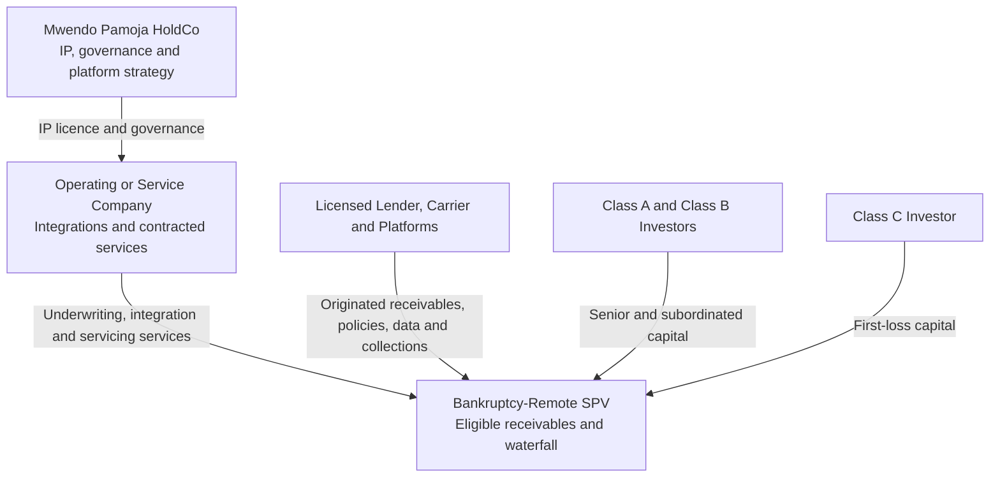

## Investment Snapshot

Mwendo Pamoja HoldCo is building the technology, data-governance, underwriting, and intervention platform for financing gig-economy drivers as operating businesses rather than conventional salaried borrowers. HoldCo does not rely on the SPV's receivables or collections as operating revenue. It earns contracted technology, integration, analytics, monitoring, and servicing-related income and may separately own a disclosed Class C investment.

The proposed financing programme comprises:

- a KES-denominated SPV capitalisation equivalent to USD 9.00 million; and
- an optional USD 1.00 million HoldCo facility for engineering, data and platform integration, regulatory and legal readiness, independent model validation, privacy and fairness assurance, security, servicing readiness, and transaction costs.

The consolidated USD 10.00 million view does not merge the two cash-flow perimeters. The HoldCo facility and all valuation examples are illustrative until approved by investors and reconciled to a detailed operating budget.

Claims in this memorandum use five evidence states: observed, contracted, prototype result, illustrative assumption, and target. Predictive performance, gross margin, recovery, intervention effectiveness, and market scale must not be described as achieved without supporting evidence and an as-of date.

## Section 1: Investment Thesis

Gig drivers earn through an asset that is simultaneously operational, financial, and insurable. Vehicle condition, driving hours, platform demand, fuel cost, insurance status, wallet liquidity, and debt service interact. A static score can miss the change from temporary working-capital use to persistent cash-flow distress. Mwendo Pamoja's thesis is that governed real-time data, explicit liquidity features, probabilistic underwriting, and well-controlled interventions can improve access and portfolio performance together.

The company is not presented as a balance-sheet lender or a data monopoly. Its potential defensibility arises from five assets:

1. contracted access to relevant platform, wallet, carrier, servicing, and telemetry data;
2. lawful and reusable labelled outcomes across credit, insurance, operations, and interventions;
3. integration into partner decision and cash workflows;
4. a validated model and policy-control environment that can satisfy institutional governance; and
5. operational evidence that earlier assistance improves customer and portfolio outcomes.

These advantages are hypotheses to validate. More data does not automatically create better prediction, and a unique data source can lose value if rights expire, quality deteriorates, customer trust is damaged, or competitors obtain substitutes.

## Section 2: Corporate and Financing Structure



HoldCo owns the intellectual property and controls corporate strategy. The operating entity performs only licensed or contracted activities. The SPV purchases eligible receivables and applies cash through a lender-controlled waterfall. Neither an ERP ledger nor a corporate diagram establishes true sale or bankruptcy remoteness; those outcomes require definitive legal arrangements and operational separateness.

### 2.1 HoldCo Exposure to the SPV

HoldCo is asset-light only to the extent that it does not retain receivables or broad recourse. If HoldCo or an affiliate provides Class C, a repurchase undertaking, indemnity, liquidity support, or servicing advance, that exposure must be recognised in HoldCo cash planning and investor disclosure. “Ring-fenced” does not mean “zero risk.”

The base SPV capital structure is:

| Class | Amount | Share | Position |
|---|---:|---:|---|
| Class A | USD 6.75 million equivalent | 75% | Senior secured notes |
| Class B | USD 1.35 million equivalent | 15% | Subordinated notes |
| Class C | USD 0.90 million equivalent | 10% | First-loss or residual capital |

### 2.2 Illustrative Ownership and Governance

The current ownership proposal must be shown on a fully diluted basis and should distinguish economic ownership from voting control. A founder's economic percentage cannot be described as permanently non-dilutable while future investors and employees receive new shares. If founders seek continuing voting control, the mechanism should be addressed through lawful share rights, board composition, reserved matters, pre-emption, vesting, and shareholder agreements.

Before fundraising, the company should model at least:

- current pre-financing ownership;
- the proposed financing and employee option pool on a post-money, fully diluted basis;
- a future institutional round; and
- a strategic partner issuance.

The board should approve related-party transactions between HoldCo, OpCo, and the SPV, including the IP licence, servicing fees, data sharing, and any Class C investment. These arrangements must be arm's length, documented, and auditable.

## Section 3: Data Rights and Technical Moat

The technical moat begins with rights, not sensors. Every source requires a contract and a data-governance record identifying the provider, purpose, legal basis, fields, frequency, retention, controller and processor roles, cross-border treatment, permitted model use, output ownership, revocation, and deletion.

Candidate sources include:

- IMU and GNSS signals, diagnostic events, and trip summaries;
- platform trip, commission, incentive, and settlement events;
- wallet credits and debits;
- repayment, balance, and limit records;
- insurance status, premium, cancellation, claim, and refund events;
- reserve-pocket events; and
- dated macroeconomic, fuel, KESONIA, and regulatory information.

Raw collection should be minimised. High-frequency data should be retained only where incremental decision value, safety need, contractual right, security, cost, and privacy proportionality are demonstrated. A privacy impact assessment, driver notice, access and correction process, retention schedule, and incident response are launch prerequisites.

### 3.1 Canonical Feature Architecture

```text
Raw telematics, trip, wallet, repayment and policy events
                         |
                  Flink feature services
                    /                 \
        GRU/Transformer          Explicit Liquidity
        neural embeddings        Feature Path
                    \                 /
          Hierarchical Bayesian underwriting
                         |
          Credit Policy and Compliance Gate
```

The Explicit Liquidity Feature Path computes CFA, DLR, Earnings Velocity, Repayment Velocity, wallet volatility, reserve balance, time since depletion, utilisation, and approved interactions. These named engineered metrics bypass the neural encoders. The neural branch may observe raw wallet timing but does not also receive the named explicit metrics.

This distinction is central to both interpretability and defensibility. It reduces semantic duplication, feature leakage, and unstable attribution and allows the company to explain which financial variables influenced a prediction and which policy rule controlled the final decision.

## Section 4: Redundancy-Controlled Bayesian Underwriting

The model combines a neural representation with an explicit, interpretable design in a hierarchical logistic regression. To reduce multicollinearity and redundant signals, the design applies five controls:

1. **Feature ownership:** Explicit Liquidity Features are excluded from neural input tensors as engineered variables.
2. **Orthogonal explicit design:** Centred spline and main-effect columns are converted to an orthonormal basis using a training-only QR decomposition.
3. **Residualised neural representation:** Neural embeddings are projected against the explicit design using cross-fitted ridge projection, and only the residual component enters the HLR.
4. **Hierarchical shrinkage:** Regularised-horseshoe or comparable grouped shrinkage priors limit redundant embedding dimensions and interactions.
5. **Strong interaction heredity:** An interaction is retained only where both main effects are present and stable, with centred products and out-of-time evidence.

The linear predictor is:

$$
\eta_i
=\alpha+a_{g[i]}+b_{p[i]}+c_{t[i]}
+\mathbf q_i^{\top}\boldsymbol\beta_z
+\widetilde{\mathbf h}_i^{\top}\boldsymbol\beta_h
+\boldsymbol\psi_i^{\top}\boldsymbol\gamma
+\mathbf m_i^{\top}\boldsymbol\delta.
$$

Here, \(\mathbf q_i\) is the orthonormal explicit basis, \(\widetilde{\mathbf h}_i\) is the cross-fitted residual neural embedding, \(\boldsymbol\psi_i\) contains the restricted interaction set, and \(\mathbf m_i\) contains approved missingness and source-health indicators. Group, product, and time effects are partially pooled and subject to sum-to-zero or centred identification constraints.

The model is calibrated on a time-forward validation set:

$$
\operatorname{logit}(PD^{\text{cal}}_i)
= \kappa_{p[i]} + s\eta_i,\qquad s>0.
$$

Approval requires acceptable calibration intercept and slope, Brier and log scores, discrimination, uncertainty coverage, temporal stability, and subgroup outcomes. VIF, condition index, singular values, posterior correlation, coefficient stability, and ablations of explicit-only, neural-only, and combined models are reported. If the combined model does not provide stable incremental value, the simpler model is used.

NUTS or HMC is an offline development and validation method, not a per-request production dependency. Approved posterior artifacts or representative draws are published to a deterministic online scorer with latency, versioning, fallback, rollback, and reproducibility controls.

## Section 5: Tail Dependence and Portfolio Stress

Common shocks can create conditional dependence across IPF, microloan, and revolving exposures held by the same driver. The system therefore does not assume that three products create three independent obligors. It preserves driver-level joint exposure and estimates portfolio loss after applying product-specific marginal PD, EAD, LGD, recovery timing, and contractual cash flows.

The Clayton copula is a candidate for asymmetric lower-tail dependence after correct variable orientation. It is not assumed to be universally correct. Development compares Gaussian, Student-t, Clayton, rotated Clayton, Gumbel, Frank, and vine specifications where data permit. The selected model must pass out-of-sample fit, marginal recovery, tail-count, sensitivity, and stability tests. Sparse data require management stresses and parameter uncertainty, not an assertion that shock severity directly determines the Clayton parameter.

Copula outputs inform economic-capital and SPV waterfall stress. They do not change prescribed Basel correlations or create regulatory capital relief. Structural lender protection comes from enforceable subordination, OC, reserves, eligibility, controlled accounts, servicing, and the waterfall.

## Section 6: Credit Policy, Fairness, and Customer Outcomes

The Bayesian model returns \(PD_{\mathbb P}\), uncertainty, and approved explanatory contributions. The Credit Policy and Compliance Gate applies eligibility, affordability, minimum cash sufficiency, maximum aggregate exposure, insurance status, data quality, uncertainty, fraud, concentration, reserve, OC, NPL, and distribution rules.

Fairness is an operating and governance programme, not a mathematical guarantee. Maximum Mean Discrepancy, representation constraints, feature exclusion, or orthogonalisation may be evaluated as mitigations. The company should monitor:

- application and approval;
- rate and limit;
- calibration and error rates;
- data missingness and source availability;
- interventions and resulting income or safety effect;
- complaints, explanations, overrides, and appeals; and
- downstream insurance continuity, delinquency, and net customer outcomes.

Metrics require confidence intervals, minimum sample sizes, intersectional review where lawful, and documented trade-offs. Kenyan legal and data-protection review determines applicable groups, data use, notices, automated-decision rights, and customer remedies. Foreign fair-lending frameworks may serve as comparative practice but are not represented as Kenyan law.

## Section 7: Commercial Model

HoldCo revenue should be presented by contract and payer, not by SPV asset yield. Potential categories include:

| Revenue category | Payer | Basis | Key evidence |
|---|---|---|---|
| Underwriting and monitoring licence | Lender, SPV, or platform | Per active account, score, or contracted minimum | Executed service agreement and measured service levels |
| Integration and implementation | Partner | Milestone or fixed fee | Statement of work and acceptance |
| Servicing or intervention administration | SPV or originator | Contractual fee on defined balance or activity | Servicing agreement and cost allocation |
| Carrier analytics | Carrier | Licence or service fee | Carrier contract and permitted-use rights |
| Class C distributions | Class C holder | Residual SPV cash | Separate investment cash flow, not operating revenue |

Gross margin must include cloud, data, customer support, servicing operations, security, compliance, model validation, partner support, and allocated infrastructure. It should not be reduced to marginal model inference cost. Revenue quality should be assessed through contract duration, recurring share, implementation burden, concentration, renewal, churn, credit exposure, and capital need.

Valuation should use scenario ranges based on contracted revenue, gross margin, retention, dilution, and milestones. SaaS or deep-technology comparables are relevant only to economically comparable revenue. SPV assets and gross customer yield are not HoldCo recurring revenue.

## Section 8: Data Flywheel and Defensibility Metrics

The flywheel is measured as:

```text
Contracted data coverage
        |
Usable event completeness and lawful retention
        |
Mature outcome labels
        |
Validated incremental model and intervention value
        |
Partner operating integration and renewal
        |
More governed observations and improved unit economics
```

Key metrics include connected, eligible, scored, approved, funded, and active drivers; usable event completeness; feature freshness; label maturity; online-offline parity; incremental calibration and utility; intervention treatment effect; partner concentration; contract duration; gross and contribution margin; renewal; customer complaints; and appeal outcomes.

Defensibility weakens if platform concentration increases, data use is revoked, labels remain immature, model uplift disappears, costs rise, privacy or fairness controls fail, or a partner can reproduce the service at lower switching cost. These risks should appear alongside the investment upside.

## Section 9: Milestones and Use of HoldCo Proceeds

The illustrative USD 1.00 million HoldCo facility should fund defined evidence milestones:

1. partner and data-contract readiness;
2. governed event and Explicit Liquidity Feature Path pilot;
3. explicit-only benchmark and redundancy-controlled HLR development;
4. independent model validation, fairness review, privacy impact assessment, and security testing;
5. servicing, accounting, and cash-reconciliation integration;
6. shadow scoring and accounting parallel run;
7. bounded live pilot under exposure and customer-protection limits; and
8. lender and investor scale decision.

The final budget must identify people, advisers, licences, cloud, data, devices, security, validation, legal, accounting, servicing, transaction costs, and contingency. Related-party and SPV charges require approved agreements and allocation.

## Section 10: Principal Investment Risks

- Inability to secure durable platform, carrier, and wallet data rights.
- Insufficient mature outcomes to validate complex models or dependence.
- Platform, geography, carrier, lender, or servicing concentration.
- Customer harm or loss of trust from surveillance, deductions, or automated action.
- Model instability, calibration failure, unfair outcomes, or weak incremental value.
- HoldCo exposure through Class C, repurchase, indemnity, or servicing support.
- Regulatory, accounting, tax, and licensing uncertainty.
- High integration and support cost that reduces expected software margins.
- Execution dependency on external partner timelines and specialist staff.
- Funding shortfall before contracts and validated revenue mature.

## Section 11: Investment Decision Requested

Approval is requested for structured investor and partner diligence, not an unconditional financing commitment. The next gate requires a fully diluted cap table, approved governance rights, IP assignments, partner and data terms, detailed HoldCo budget, D03 term sheet, validated SPV model, architecture decisions, model-development and validation plan, privacy and security assessments, and a bounded pilot design.

## Primary References

1. Central Bank of Kenya, “Revised Risk-Based Credit Pricing Model,” Aug. 2025. Available: https://www.centralbank.go.ke/wp-content/uploads/2025/08/Revised-Risk-based-Credit-Pricing-Model.pdf
2. Board of Governors of the Federal Reserve System and Office of the Comptroller of the Currency, “Guidance on Model Risk Management,” SR 11-7, Apr. 2011. Available: https://www.federalreserve.gov/supervisionreg/srletters/sr1107.htm
3. Kenya Law, “Data Protection Act, 2019,” current consolidated text. Available: https://new.kenyalaw.org/akn/ke/act/2019/24
4. Basel Committee on Banking Supervision, “Calculation of RWA for credit risk: IRB approach.” Available: https://www.bis.org/basel_framework/chapter/CRE/31.htm
