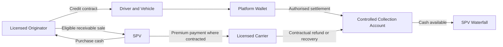
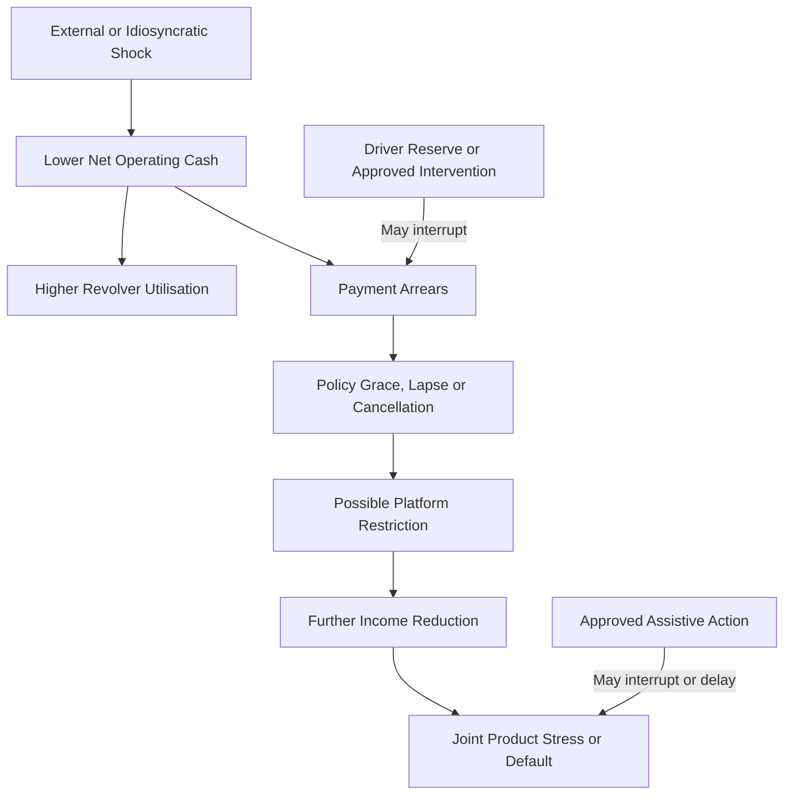

# Purpose and Controlled Definitions

This document defines the customer products, counterparties, cash events, product states, common shock channels, and SPV interface for Mwendo Pamoja. It is the authoritative product specification for Parts 2a through 6. Commercial contracts, definitive finance documents, applicable law, and approved accounting policies prevail where they differ.

`CREDIT_RISK_MODEL_AND_LOSS_ARCHITECTURE_SPECIFICATION.md` governs the shared driver-product-risk episode, three credit clocks, dependence order, and the conversion of product states into timing and cash-loss components. This product specification remains authoritative for the contractual meaning of those states.

The product pool contains three asset types:

1. Insurance Premium Financing, or IPF.
2. Short-duration operating microloans.
3. Revolving working-capital credit.

These products are receivables, not capital tranches. Class A, Class B, and Class C are the SPV capital stack.

## The Driver Operating Cash-Flow Identity

For driver \(i\) and period \(t\), define:

$$
I^{\text{operating}}_{i,t}
= F_{i,t}-C^{\text{platform}}_{i,t}-C^{\text{fuel}}_{i,t}
-C^{\text{maintenance}}_{i,t}-C^{\text{insurance}}_{i,t}
-C^{\text{other}}_{i,t},
$$

where \(F\) is gross fare or platform income and each \(C\) is a cash operating cost. Net disposable cash after contracted credit payments is:

$$
I^{\text{net}}_{i,t}
= I^{\text{operating}}_{i,t}
-P^{\text{IPF}}_{i,t}-P^{\text{micro}}_{i,t}
-P^{\text{revolver}}_{i,t}-D^{\text{reserve}}_{i,t}
+R^{\text{reserve}}_{i,t}.
$$

Reserve deposits \(D^{\text{reserve}}\) and releases \(R^{\text{reserve}}\) are shown separately because a driver reserve pocket is not the SPV cash reserve account. The driver's sufficiency constraint is based on net cash after essential operating and household requirements, not gross fare.

# Counterparty and Contract Architecture

| Party | Product responsibility | Required boundary |
|---|---|---|
| Licensed lender or originator | Credit approval, contract, price, disbursement, and customer obligations | Acts within licence and applicable CBK requirements |
| Licensed carrier | Insurance policy issuance, claims, cancellation, and contractual refund | Owns insurance risk and IFRS 17 accounting |
| Mwendo Pamoja service entity | Data, underwriting, integration, and agreed servicing services | Does not become lender or carrier merely through technology |
| SPV | Purchases eligible receivables and applies cash through the waterfall | Owns only transferred assets and permitted rights |
| Mobility platform | Agreed data and split-settlement functions | No collection or routing power without contract and customer authority |
| Servicer | Contractual balances, cash allocation, arrears, modifications, and reports | Maintains one product and customer state of record |
| Driver | Customer, policyholder where applicable, and operating-business owner | Receives disclosures, explanations, hardship treatment, and appeal |

Platform settlement is proposed credit enhancement, not inherent legal seniority. Contracts must specify consent, deduction cap, priority, cash-sufficiency floor, notice, revocation, disputes, refunds, reversals, platform set-off, outages, insolvency, and fallback collection.

# The Three-Product Receivables Pool

| Attribute | IPF | Microloan | Revolving credit |
|---|---|---|---|
| Primary purpose | Finance an insurance premium | Bounded operating need | Temporary working-capital flexibility |
| Asset | Instalment receivable under financing contract | Amortising loan receivable | Funded revolving balance, not unused commitment |
| Core cash source | Driver payment and contractual carrier refund where applicable | Driver and authorised platform collection | Driver and authorised platform collection |
| Key risk | Policy cancellation, refund timing, lapse, and income shock | Short-tenor affordability and collection | Persistent utilisation, full draw, and adverse selection |
| Prepayment | Early settlement and carrier reconciliation | Early principal repayment | Draw repayment restores availability only if policy permits |
| Default | Defined by contract and approved credit policy | Defined days past due or other approved event | Defined delinquency or termination event |
| SPV eligibility | Current, documented, enforceable, and within policy and concentration | Current, documented, enforceable, and within policy and concentration | Funded balance only, within utilisation, limit, and concentration rules |

## Product 1: Insurance Premium Financing

The carrier issues the insurance policy. The lender or financing provider advances premium under a separate credit contract. The SPV may purchase the financing receivable, subject to eligibility. The technology provider does not issue the policy unless separately authorised.

The simplified unearned-premium amount for modelling is:

$$
UP_t=P_0\max\left(0,1-\frac{d_t}{T}\right),
$$

where \(P_0\) is initial premium, \(d_t\) is elapsed covered days, and \(T\) is the policy term. This is an illustrative accrual proxy, not a substitute for carrier policy wording or IFRS 17 measurement.

Net cash recovery from a cancellation is:

$$
R^{\text{IPF}}_t
=UP_t(1-h_{\text{admin}}-h_{\text{collection}})
-C^{\text{recovery}}_t,
$$

subject to contractual refund, claims, cancellation timing, taxes, fees, counterparty risk, and actual collection. The model must separately record refund calculated, refund contractually due, refund receivable, and refund collected.

### IPF State Machine

| State | Entry event | Cash and eligibility consequence |
|---|---|---|
| Quoted | Product and carrier quotation | No receivable |
| Accepted | Customer accepts financing and policy terms | Await funding and policy confirmation |
| Premium paid | Premium transferred to carrier | Financing receivable recognised subject to policy |
| Policy active and current | Coverage confirmed; instalments current | Potentially eligible SPV asset |
| Grace or delinquent | Contractual payment missed | Eligibility and customer notice follow defined rules |
| Cancellation requested | Valid cancellation process initiated | Estimate refund but do not recognise collected cash |
| Refund due | Carrier confirms enforceable amount | Refund receivable subject to haircut and timing |
| Refund collected | Cash reaches controlled account | Recovery cash enters waterfall as defined |
| Default | Contractual default event | Ineligible; impairment and recovery process begin |
| Written off | Approved write-off | Balance removed subject to recovery tracking |
| Recovered | Post-default cash collected | Recovery allocated under waterfall |

## Product 2: Operating Microloans

Microloans fund approved, bounded operating needs. Repayment can use authorised split settlement. For period \(t\):

$$
P^{\text{micro}}_{i,t}
=\min\left(r_{i,t}F_{i,t},
P^{\text{scheduled}}_{i,t}+A^{\text{arrears}}_{i,t}
\right),
$$

subject to the customer contract, deduction cap, sufficiency floor, reversals, and collection availability. A proportional gross-fare deduction cannot override minimum subsistence or essential vehicle operating cash under approved policy.

The state machine includes approved, disbursed, current, delinquent by defined buckets, cured, modified, forborne where applicable, defaulted, written off, and recovered. Each transition records event time, effective time, cash, customer notice, model label, SPV eligibility, accounting handoff, and permitted intervention.

## Product 3: Revolving Working-Capital Credit

The revolving product separates approved limit from funded exposure:

$$
U_{i,t}=\frac{B^{\text{funded}}_{i,t}}
{L^{\text{approved}}_{i,t}},
$$

where \(U\) is utilisation, \(B^{\text{funded}}\) is the drawn balance, and \(L^{\text{approved}}\) is the approved limit. Only funded, eligible balances enter the receivables pool.

The product must distinguish operational smoothing from persistent income substitution. Warning indicators may include high utilisation, repeated minimum payments, prior delinquency, falling Earnings Velocity, high DLR, and reserve depletion. These indicators inform the Bayesian model and policy gate; they do not automatically prove distress.

States include limit approved, available, drawn and current, utilisation warning, frozen, over-limit if permitted, delinquent, cured, restructured, terminated, defaulted, written off, and recovered. A limit change cannot retroactively alter the price or terms of an existing funded balance unless the contract and applicable requirements permit it.

# Unified Product Events and Ledgers

Every product event contains:

- unique event and contract identifiers;
- customer, driver, vehicle, platform, product, and policy identifiers where applicable;
- event time, source commit time, first availability time, effective date, and accounting date;
- opening balance, debit, credit, cash, and closing balance where financial;
- state before and after;
- source system, correction version, and lineage;
- customer notice or consent where applicable;
- model-label effect, SPV eligibility effect, and policy consequence; and
- approval, override, and evidence reference.

Product and cash balances must satisfy:

$$
B^{\text{close}}_t
=B^{\text{open}}_t+O_t+I_t+F_t
-P_t-W_t+R^{\text{reversal}}_t,
$$

where \(O\) is new origination or draw, \(I\) interest, \(F\) fees, \(P\) principal or payment allocation, \(W\) write-off, and \(R^{\text{reversal}}\) is a properly linked correction. Recovery after write-off is tracked as recovery cash and does not recreate original principal without an approved reversal.

# The Correlated Cash-Flow Cascade

## External Shock Channels

The core hypothesis is that common shocks can raise conditional dependence among products held by the same driver. Candidate shocks include:

| Shock | Primary transmission | Timing control |
|---|---|---|
| Fuel-price increase | Raises operating cost and reduces net cash | From effective retail price and driver usage |
| Platform commission change | Reduces net fare income | From contract or platform effective date |
| Demand reduction | Reduces trips and fare income | Measured by platform and location data |
| Vehicle downtime | Stops or reduces income | From diagnostic, trip, repair, and manual confirmation |
| Policy lapse or cancellation | May restrict platform eligibility and expose vehicle | Based on actual carrier and platform rules |
| KESONIA increase | Raises variable credit cost at contractual reset | No instant effect before contract permits |
| Regulatory or ZEV change | Alters vehicle eligibility, cost, or residual value | From dated, applicable legal requirement |

This graph is a causal hypothesis, not proof that pairwise correlation converges to one. Empirical work should estimate the timing and size of each edge, identify confounders, and evaluate heterogeneity by product, platform, geography, vehicle, and driver history.

## Dependence Modelling

Unconditional linear correlation can understate conditional clustering, but no single copula is assumed. Development should compare Gaussian, Student-t, Clayton, rotated Clayton, Gumbel, Frank, and vine specifications with consistent marginals. The chosen orientation must match the definition of adverse outcomes.

For correlated Bernoulli default simulation, draw dependent uniforms ((U_1,U_2,U_3)) from the selected copula and set:

$$
D_p=\mathbf 1\{U_p\le PD^{\text{cal}}_p\}.
$$

Loss then depends on exposure, LGD, and recovery timing. Copula parameters are estimated with uncertainty or deliberately stressed. They are not mechanically determined by a fuel-price scenario. Portfolio VaR and expected shortfall are loss-distribution measures and remain separate from Bayesian credible intervals.

# Portfolio Mitigation

## Aggregate Exposure and Concentration

The platform calculates aggregate exposure per driver across products. Policy can restrict new draw or purchase when aggregate exposure, utilisation, platform concentration, geography, product concentration, carrier risk, data quality, reserve, or uncertainty exceeds an approved limit. Limits must be versioned, disclosed where required, and tested for customer and portfolio effect.

## Driver Reserve Pockets

A driver reserve pocket requires a clear legal owner, custodian, permitted use, contribution rule, interest, withdrawal, hardship, lien or set-off, disclosure, dispute, exit, death, and insolvency treatment. Its balance can inform Explicit Liquidity Features. It is not treated as SPV collateral unless an enforceable security or payment right exists.

The reserve roll-forward is:

$$
R^{\text{close}}_t
=R^{\text{open}}_t+D_t+I^{\text{reserve}}_t-W_t,
$$

where \(D\) is deposit and \(W\) is a permitted release or withdrawal.

## Assistive Interventions

| Intervention | Owner and authority | Required safeguards | Model treatment |
|---|---|---|---|
| Premium holiday | Carrier and lender as contract requires | Notice, duration, funding, coverage, accounting, cure | Effect estimated, not assumed |
| Liquidity bridge | Authorised lender or approved fund | Amount, eligibility, repayment, affordability, disclosure | Separate exposure and treatment flag |
| Limit reduction or draw freeze | Lender under contract and policy | Reason, notice, appeal, sufficiency effect | Policy-gate action |
| Payment restructure | Lender and servicer | Modification and forbearance assessment | New contractual schedule and label |
| Fatigue safety action | Platform or authorised safety process | Safety evidence, income effect, override, appeal | Outcome measured separately from default |
| Alternative routing | Platform under agreement | Availability, fairness, driver choice, effect | Treatment-effect evaluation |

Interventions must not be selected to improve accounting classification. They can fail or cause harm, and stress testing should include zero and adverse effectiveness.

# SPV and Model Interfaces

The product system supplies the SPV financial model with monthly cohort fields: origination, opening balance, scheduled principal, interest, fees, prepayment, arrears, default, write-off, recovery, refund, collection lag, closing balance, eligibility, platform, geography, and product. It supplies the feature pipeline with point-in-time events and the Bayesian model with defined outcomes and interventions.

The same default event must not be counted independently across three product rows where one driver creates joint exposure. The portfolio model should preserve driver identity through loss aggregation and then apply product-specific cash and recovery.

# Validation and Diligence Requirements

Before product launch, the programme should obtain and test:

- proposed or executed product contracts and customer disclosures;
- carrier policy, cancellation, claim, grace, and refund wording;
- platform settlement and deduction specification;
- wallet, servicing, carrier, and bank sample files;
- legal analysis of lending, insurance, assignment, deduction, reserve, set-off, and data rights;
- state-transition, cash, reversal, late-event, and reconciliation golden cases;
- customer research on sufficiency, explanations, appeals, and interventions;
- outcome-label maturity and causal evaluation plan; and
- SPV eligibility and financial-model reconciliation.

The initial pilot can validate state accuracy, cash reconciliation, and safe intervention execution before claiming that the complete cascade is empirically proven.

# References

1. Central Bank of Kenya, “Revised Risk-Based Credit Pricing Model,” Aug. 2025. Available: https://www.centralbank.go.ke/wp-content/uploads/2025/08/Revised-Risk-based-Credit-Pricing-Model.pdf
2. IFRS Foundation, “IFRS 9 Financial Instruments.” Available: https://www.ifrs.org/issued-standards/list-of-standards/ifrs-9-financial-instruments/
3. IFRS Foundation, “IFRS 17 Insurance Contracts.” Available: https://www.ifrs.org/issued-standards/list-of-standards/ifrs-17-insurance-contracts/
4. Kenya Law, “Data Protection Act, 2019,” current consolidated text. Available: https://new.kenyalaw.org/akn/ke/act/2019/24
