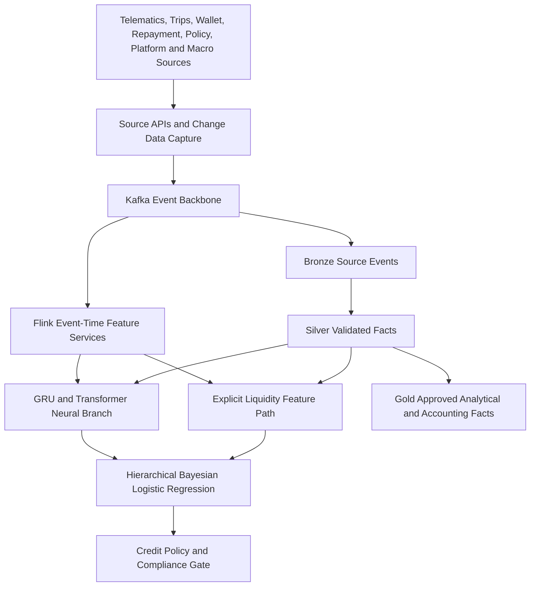

# Scope and Design Principles

This document specifies how source events become reproducible neural representations and Explicit Liquidity Features. It ends at the versioned input contract consumed by the hierarchical logistic regression in Part 2b. It does not define final credit rules, financial-accounting authority, or regulatory obligations.

The observation-unit key, five connected ledgers, clock semantics, P-spline artifact metadata, and online scoring contract are governed jointly with `CREDIT_RISK_MODEL_AND_LOSS_ARCHITECTURE_SPECIFICATION.md`.

The architecture follows seven principles:

1. **Availability-time correctness:** A historical score uses only information actually available at that decision time.
2. **Single semantic owner:** Each engineered financial variable has one formula, owner, and serving path.
3. **Online-offline parity:** Training and serving use the same versioned transformation.
4. **Bounded complexity:** Neural components must add stable out-of-time value over an explicit-only benchmark.
5. **Privacy proportionality:** Collection frequency and retention require a documented purpose and incremental value.
6. **Replay without mutation:** Historical artifacts and corrections remain reproducible and linked.
7. **Separation of concerns:** Data quality, model uncertainty, and policy action are separate controls.

# Canonical Architecture



The selected open table format must be named explicitly. If Apache Iceberg is used, the documents should say “Iceberg table format.” Bronze, Silver, and Gold are medallion data-quality zones. Kappa describes a streaming pattern. “Delta architecture,” “Delta Lake,” “medallion,” and “Kappa” are not interchangeable terms.

# Edge and Source Event Contracts

## Telematics and Trip Data

Telemetry sources can include:

- IMU acceleration and angular velocity;
- GNSS location, speed, bearing, and quality;
- OBD diagnostic and vehicle-state events;
- device health, clock quality, and connectivity; and
- trip start, trip end, distance, duration, route, and platform status.

Each message must define device, driver and vehicle binding, units, coordinate system, sampling, firmware, calibration, timestamp precision, sequence, quality, offline buffer, compression, and schema version. Raw 10 Hz collection is retained only where it provides validated incremental value. Trip summaries and derived windows can reduce cost and privacy exposure.

Capacity is calculated from record grain. With \(N\) active vehicles, sampling frequency \(f\), active duty cycle \(d\), message size \(s\), and \(86{,}400\) seconds per day:

$$
\text{events per day}=Nfd(86{,}400),
$$

$$
\text{bytes per day}=Nfd(86{,}400)s.
$$

For 50,000 continuously active vehicles at 10 Hz, the result is 43.2 billion timestamp events per day if one message holds all sensor fields. A 30 billion-row statement is not used without a compatible duty cycle and row definition. Pilot, base, and peak cases must show active devices, duty cycle, message grain, bytes, compression, retention, throughput, and cost.

## Wallet, Credit, Insurance, and Platform Events

Wallet records distinguish credit, debit, reversal, cash-out, platform settlement, deduction, fee, reserve movement, and correction. Credit records distinguish approval, contract, disbursement, draw, interest, fee, payment allocation, arrears, restructure, default, write-off, and recovery. Insurance records distinguish quotation, premium paid, policy active, grace, cancellation request, cancellation confirmation, claim, refund due, and refund collected.

Platform and macro records include commission, incentive, demand, restriction, fuel, KESONIA, inflation, and dated regulatory events. Macro records carry release date and vintage so a later revision cannot enter an earlier score.

# Time Semantics and Point-in-Time Correctness

## Clock Dictionary

Every source should preserve the clocks relevant to its business process:

| Clock | Meaning | Typical use |
|---|---|---|
| Event time | When the source event occurred | Sequence, windows, and business state |
| Source transaction time | When the source committed the change | Source ordering and reconciliation |
| CDC capture time | When the connector captured the change | Pipeline diagnosis |
| Kafka append time | When the event entered the backbone | Operational latency |
| First-availability time | Earliest time the decision system could lawfully use the fact | Historical training and scoring cut-off |
| Correction-availability time | When a corrected version became usable | Reproduction and later decisions |
| Business-effective date | Period the fact governs contractually | Policy and product state |
| Accounting date | Financial reporting period | D365 and close controls |
| Feature-calculation time | When transformation completed | Freshness and lineage |
| Decision time | When the score and rule decision were made | Point-in-time spine |

A Debezium connector timestamp is not automatically the legal event time or first-availability time. Source-specific contracts select the authoritative clocks and fallbacks.

## As-Of Rule

For decision \(i\) at time \(t_i^{d}\), a candidate source record \(r\) is eligible only if:

$$
t_r^{\text{available}}\le t_i^d,
$$

and the business-effective interval contains the required observation time. Among eligible versions, the join selects the latest valid version under the source's correction rule. A record effective last month but received tomorrow is not available today. Lakehouse time travel assists reproduction but does not enforce this rule by itself.

Training snapshots retain:

- decision spine and label specification;
- source snapshot and rate vintages;
- feature-set and code versions;
- entity-resolution version;
- excluded late or invalid records; and
- a manifest hash.

Golden tests should inject backdated corrections, late repayments, duplicate settlements, restated macro values, and policy cancellations received after the decision. None may leak into the historical feature row.

# Ingestion and Stream Processing

## Change Data Capture and APIs

CDC specifications identify source log, primary key, transaction order, initial snapshot, delete semantics, schema, source timestamp, and restart behaviour. API and file sources identify pagination, version, watermark, acknowledgement, correction, and control totals. Producers cannot silently change units or null meaning.

## Kafka Event Backbone

Topics are owned by domain. Partition key is chosen for required ordering, normally contract, wallet, vehicle, or driver. Kafka ordering is guaranteed only within a partition. Schema registry compatibility, retention, encryption, service identity, dead-letter handling, and replay boundaries are defined for each topic.

## Flink Event-Time Processing

Flink services define event-time extraction, watermark, allowed lateness, keyed state, state TTL, checkpoint, savepoint, backpressure, idempotent output, and recovery. Source incidents and late events are measured by platform and geography.

“Exactly once” is claimed only within the boundaries that support it. Financial postings and external APIs use explicit idempotency keys, acknowledgements, control totals, and reconciliation.

# Lakehouse and Medallion Controls

## Bronze

Bronze retains source events, source payload, original clocks, schema, ingestion metadata, and corrections under approved retention. It is a governed record of received data, not the sole legal authority for contracts, cash, or journals.

## Silver

Silver contains standardised, validated, deduplicated, effectively dated facts. It performs identity resolution, unit conversion, reference joins, quality flags, correction linkage, and reconciliation. Facts failing controls remain quarantined and cannot silently enter features or accounting.

## Gold

Gold contains approved analytical aggregates and accounting facts. It supplies controlled interfaces to the feature system, SPV model, investor reporting, and journal staging. It does not replace the servicing ledger, bank statement, legal contract, or D365 general ledger as the authoritative record for their respective domains.

## Replay and Schema Evolution

Every replay records run ID, source offset or snapshot, schema, feature version, code, output namespace, control totals, validation, approval, promotion, and rollback. A replay cannot overwrite an approved historical release. Breaking schema changes receive a new major version and coexist during migration.

# Feature Engineering

## Feature Registry

Each feature record contains:

- stable feature ID and name;
- owner path: neural preparation or explicit liquidity;
- business definition and formula;
- sources and entity grain;
- units, sign, and valid range;
- observation window, lag, and minimum history;
- first-availability and freshness rule;
- null, missing, clipping, and correction behaviour;
- monotonic or shape expectation where justified;
- privacy class and permitted use;
- interaction eligibility;
- version, tests, and model consumers; and
- prohibited future information and label window.

## Explicit Liquidity Feature Path

The following engineered metrics have one canonical owner and do not enter GRU or Transformer inputs as named variables.

### Wallet Cash-Flow Asymmetry

For positive wallet inflows \(C^+\) and absolute outflows \(C^-\) over window \(W\):

$$
CFA_{i,t}^{(W)}
=\frac{\sum_{\tau\in W}C^+_{i,\tau}
-\sum_{\tau\in W}C^-_{i,\tau}}
{\sum_{\tau\in W}C^+_{i,\tau}
+\sum_{\tau\in W}C^-_{i,\tau}+\epsilon}.
$$

The registry states which flows are included and excludes internal wallet transfers or reversals according to a controlled taxonomy.

### Dynamic Debt-to-Liquidity Ratio

$$
DLR_{i,t}
=\frac{D^{\text{due}}_{i,t,H}+B^{\text{funded}}_{i,t}}
{C^{\text{available}}_{i,t,H}+R^{\text{accessible}}_{i,t}+\epsilon},
$$

where \(H\) is the approved horizon. Unused limits are not liquid cash. Reserve is included only to the extent accessible under the product terms.

### Earnings Velocity

$$
EV_{i,t}
=\frac{\operatorname{mean}(I^{\text{net}}_{i,t-6:t})}
{\operatorname{mean}(I^{\text{net}}_{i,t-89:t})+\epsilon}.
$$

The final window, minimum days, winsorisation, seasonality, and zero-denominator rule must be validated. Values below one indicate recent earnings below the longer baseline, but the model estimates the relationship.

### Repayment Velocity

$$
RV_{i,t}
=\frac{\sum_{\tau\in W}P^{\text{received}}_{i,\tau}}
{\sum_{\tau\in W}P^{\text{scheduled}}_{i,\tau}+\epsilon}.
$$

Prepayment and reversals are separate fields. A high ratio caused by one large cure payment does not erase prior delinquency.

### Other Explicit Features

- wallet volatility using an approved robust dispersion measure;
- reserve balance and reserve coverage;
- time since the last zero-balance or depletion event;
- revolving utilisation and aggregate exposure;
- cash-out ratio;
- near-term debt coverage;
- policy and product status; and
- centred interactions approved under strong heredity.

Candidate interactions include high utilisation with prior delinquency, commission increase with DLR, late-night driving concentration with arrears, and ZEV-policy proximity with vehicle type. Interactions remain limited, centred, and shrinkage-controlled.

## Neural Sequence Branch

The GRU branch receives sequences such as trip-level kinematics, driving duration, circadian timing, vehicle events, and raw wallet-event timing after governed encoding. The Transformer branch receives dated sequences of macro, fuel, platform, and regulatory context with release vintage and missingness masks.

The neural branch may learn timing patterns from raw wallet events but does not receive CFA, DLR, Earnings Velocity, Repayment Velocity, or their aliases. A feature-manifest test rejects duplicate semantic inputs.

### GRU Interface

For sequence \(\mathbf X_i\in\mathbb R^{T_h\times d_h}\), the GRU produces one or more masked hidden tokens. Input units, aggregation, length, padding, and state reset are versioned. Corrupted gate formulas from earlier drafts are replaced by tested library definitions.

### Transformer Context Interface

The macro sequence is \(\mathbf M_i\in\mathbb R^{T_m\times d_m}\), with multiple dated context tokens. Publication vintage, positional encoding, and attention mask prevent future information.

### Fusion

Cross-attention is used only if the context supplies more than one meaningful key and value token. Driver-state tokens can query dated macro tokens:

$$
\operatorname{Attention}(Q,K,V)
=\operatorname{softmax}\left(\frac{QK^{\top}}{\sqrt{d_k}}+M\right)V.
$$

If macro context is pooled to one vector, the implementation uses gated fusion or concatenation instead of calling the block temporal attention. Ablation must compare explicit-only, GRU-only, context-only, concatenated, gated, and cross-attention designs.

# Redundancy-Controlled HLR Input Contract

Part 2b consumes:

```text
decision_id
decision_time
entity and product identifiers
Phi_neural_raw
Z_liquidity_raw
source-quality and missingness flags
feature_set_version
neural_model_version
source_snapshot_manifest
```

To reduce redundant linear signal, the training pipeline constructs:

1. a centred explicit main-effect and spline design \(\mathbf B_Z\);
2. a training-fold QR basis \(\mathbf Q_Z\);
3. a cross-fitted ridge projection of raw neural embeddings \(\mathbf H\) on \(\mathbf B_Z\); and
4. residual neural embeddings \(\widetilde{\mathbf H}\).

For training fold \(k\):

$$
\widehat{\mathbf A}^{(-k)}_{\lambda}
=\left((\mathbf B_Z^{(-k)})^{\top}\mathbf B_Z^{(-k)}
+\lambda\mathbf I\right)^{-1}
(\mathbf B_Z^{(-k)})^{\top}\mathbf H^{(-k)},
$$

$$
\widetilde{\mathbf H}^{(k)}
=\mathbf H^{(k)}-\mathbf B_Z^{(k)}
\widehat{\mathbf A}^{(-k)}_{\lambda}.
$$

The projection is cross-fitted to avoid information leakage. Production uses projection parameters fitted on the approved development window. Residualisation reduces linear redundancy but does not claim causal separation or statistical independence. Its value must be confirmed by out-of-time calibration, coefficient stability, posterior correlation, singular-value, and ablation diagnostics.

If the residual neural block adds no stable value or materially harms calibration, the approved fallback is the explicit-only hierarchical model. Complexity is optional; reproducibility and stability are mandatory.

# Missingness and Source Health

Missingness is classified as structural absence, random packet loss, device failure, source outage, stale data, customer choice, or suspicious suppression. The feature layer supplies missingness, age, and source-health indicators and approved imputations. The Bayesian model reflects uncertainty. The policy gate determines manual review, limited product, or unavailable-score action.

A population-wide platform outage must not cause mass adverse action. Missingness and fallbacks are evaluated by device, network, platform, geography, product, and legally reviewed customer groups.

# Data Quality, Privacy, Security, and SLOs

SLOs cover source availability, completeness, duplicates, invalid schema, clock skew, lateness, identity resolution, reconciliation difference, feature freshness, online-offline parity, serving error, and correction backlog. Each has formula, threshold status, owner, alert, policy consequence, and recovery evidence.

Privacy controls identify purpose, lawful basis, field minimisation, access, processor, cross-border treatment, retention, deletion, restriction, export, and customer rights. Security controls include service identity, encryption, key management, network boundaries, secrets, audit, vulnerability management, backup, disaster recovery, and incident response.

# Validation and Acceptance

The pipeline is ready for shadow scoring only when:

- point-in-time leakage tests pass;
- source-to-Silver and servicing reconciliations pass;
- duplicate, reorder, late, correction, delete, and replay tests pass;
- online-offline parity remains within tolerance;
- feature ownership has no duplicate named liquidity metric;
- tensor shapes and fusion tests pass;
- capacity, latency, backpressure, recovery, and cost meet pilot limits;
- privacy impact, retention, access, and deletion controls are approved;
- missingness fallback does not cause unsafe population action; and
- a second team can reproduce a historical input from the retained manifest.

# References

1. Apache Flink, “Timely Stream Processing.” Available: https://nightlies.apache.org/flink/flink-docs-stable/docs/concepts/time/
2. Apache Iceberg, “Documentation.” Available: https://iceberg.apache.org/docs/latest/
3. Debezium, “Documentation.” Available: https://debezium.io/documentation/
4. Kenya Law, “Data Protection Act, 2019,” current consolidated text. Available: https://new.kenyalaw.org/akn/ke/act/2019/24
