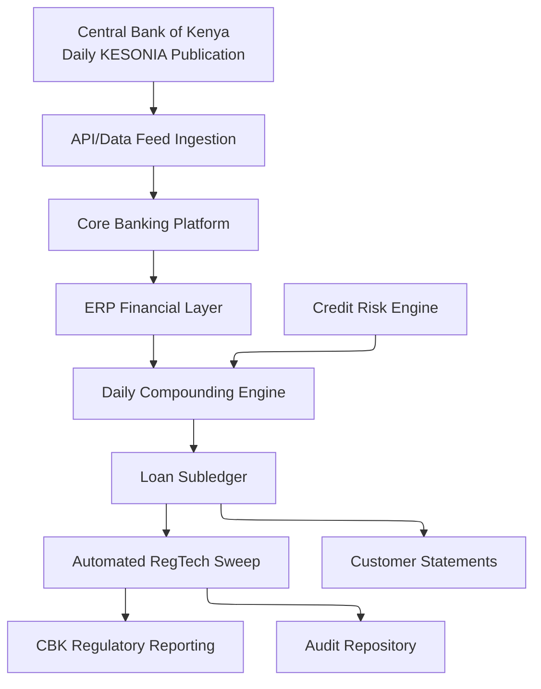
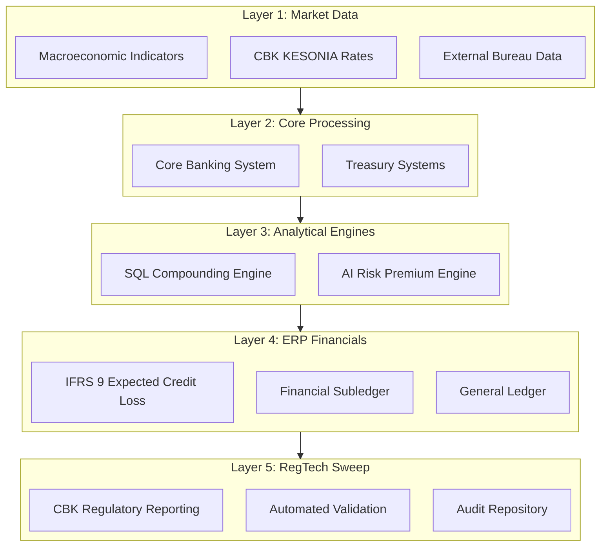

# Part 1: The CBK KESONIA Reform and Enterprise Architecture Transformation

**Series:** Operationalizing KESONIA within Enterprise ERP Systems for Commercial Banks and Traditional Lenders

## Abstract

Kenya's transition from the Risk-Based Credit Pricing Model (RBCPM) to
the Kenya Shilling Overnight Interbank Average (KESONIA) represents a
systemic architectural reform rather than a simple benchmark
substitution. This structural shift obligates commercial banks and
traditional lenders to redesign pricing pipelines, loan accounting
**Research Question:** How do commercial banks and traditional lenders operationalize KESONIA within enterprise ERP systems to automate pricing, accounting, and regulatory reporting?

To address this, the report pursues the following core business objectives:

1. Map the required five-layer enterprise architecture for automated KESONIA compliance.

2. Outline the deterministic computational pipelines needed to replace legacy pricing models.

3. Establish the role of the ERP platform as the primary system of regulatory truth.

4. Provide a strategic blueprint for migrating away from static rate tables to continuous data engineering frameworks.

The first article in this four-part series examines the
regulatory rationale behind the KESONIA framework, situating it within
the global movement toward transaction-based overnight reference rates.
Furthermore, the analysis maps the comprehensive enterprise architecture
that commercial banks and traditional lenders must implement to operationalize this framework
effectively. By addressing the computational and integration challenges
inherent in daily compounding models, the report provides a strategic
blueprint for institutions seeking to achieve compliance while
maintaining operational resilience.

## I. From RBCPM to KESONIA: The Regulatory Rationale

For more than a decade, the Kenyan banking sector priced variable-rate
credit using the Risk-Based Credit Pricing Model (RBCPM), a framework
granting institutions substantial discretion in anchoring lending rates
to internally determined base rates. While this model permitted
necessary risk differentiation, it simultaneously introduced significant
opacity into the credit market. Borrowers frequently struggled to verify
whether pricing changes reflected genuine shifts in market funding costs
or merely internally administered margin adjustments [1]. The Central
Bank of Kenya (CBK) ultimately concluded that such opacity remained
structurally inconsistent with the consumer protection and transparency
objectives embedded in modern financial regulation [2]. To resolve
these deficiencies, the KESONIA framework derives the reference rate
exclusively from observable, transaction-confirmed overnight unsecured
interbank lending. Published daily by the CBK, KESONIA strictly reflects
actual liquidity conditions in the interbank market rather than relying
on expert judgment, panel submissions, or administrative decisions. This
benchmark design actively eliminates the manipulation surface that
historically plagued submission-based rates and aligns Kenya with the
definitive trajectory of global post-LIBOR benchmark reform [3].

The global regulatory context heavily influences this transition.
Following the Financial Stability Board's 2014 recommendation to develop
alternative reference rates, regulators in major financial jurisdictions
moved decisively to replace fragile benchmarks [4]. The United States
adopted the Secured Overnight Financing Rate (SOFR), the United Kingdom
implemented the Sterling Overnight Index Average (SONIA), the Eurozone
introduced the Euro Short-Term Rate (€STR), and Switzerland adopted the
Swiss Average Rate Overnight (SARON) [3]. These international
benchmarks share a defining mathematical characteristic, specifically
that interest obligations are determined retrospectively by compounding
realized overnight observations over the accrual period, rather than by
quoting a forward-looking term rate at period inception [5]. KESONIA
inherits this precise compounded-in-arrears methodology, transferring
information from the interbank market into lending contracts through a
deterministic computational process. For commercial banks and traditional lenders, mastering
this mathematical requirement constitutes the central operational
challenge. Research by Kim, Wang and Wu [6] documents that LIBOR
discontinuation significantly tightened loan terms across banking
systems. The KESONIA transition presents analogous integration
challenges that only a robust, modern Enterprise Resource Planning (ERP)
architecture can successfully resolve.

## II. The Contractual Lending Rate Formula

Under the KESONIA framework, the total variable lending rate applicable
during any specific interest period is defined by the formula
$R_{t} = CCR_{t} + K$. In this equation, $R_{t}$ represents the
contractual lending rate for the period, $CCR_{t}$ denotes the
cumulative compounded KESONIA over the observation window, and $K$
stands for the customer-specific risk premium established by the lending
institution. This decomposition carries profound architectural
significance for banking systems. The $CCR_{t}$ component operates as a
purely market-determined quantity, depending entirely on the sequence of
KESONIA observations published by the CBK and the precise mathematical
compounding procedure applied to those figures. Conversely, the $K$
component functions as an institution-determined quantity, reflecting
the borrower's distinct credit quality, collateral position, facility
tenor, and historical behavioural profile. Separating these two elements
creates a highly transparent pricing architecture where systemic
liquidity conditions and individual credit risk remain independently
verifiable [7]. Empirical research by Muchai, Ndung'u and Githae
[7] confirms that Kenya's post-rate-cap credit market exhibits
distinct risk-premium behaviour that strongly supports this structural
separation.

For enterprise financial systems, this mathematical separation
necessitates the deployment of two distinct, highly resilient
computational pipelines that must operate with absolute precision before
their respective outputs are combined into the final contractual rate.
Any operational failure within the benchmark pipeline, such as a missing
KESONIA observation, an improperly configured business-day calendar, or
a flawed compounding engine, immediately produces an incorrect $CCR_{t}$
value. This error subsequently propagates through every downstream
accounting entry, customer statement, and regulatory disclosure.
Parallel risks exist within the risk premium pipeline, where a stale
credit model, a miscoded borrower segment, or an unapproved margin
adjustment produces an incorrect $K$ value. Such discrepancies directly
undermine pricing consistency, violate regulatory transparency mandates,
and expose the institution to severe compliance penalties and
reputational damage.

## III. ERP Systems as the Regulatory System of Truth

The most profound architectural implication of the KESONIA transition is
conceptual in nature. The enterprise resource planning (ERP) platform
ceases to function merely as a passive recording system and
fundamentally transforms into the institution's primary system of
regulatory truth. Under the legacy RBCPM framework, ERP platforms
primarily recorded the finalized accounting consequences of decisions
made elsewhere, typically within disconnected treasury systems,
independent loan origination platforms, and standalone risk engines. In
that paradigm, the ERP simply received aggregated inputs and posted
standardized ledger entries. Under the KESONIA mandate, this operational
relationship inverts completely. The modern ERP environment must now
dynamically ingest daily market reference rates directly from the CBK
through secure APIs or managed file transfers. Furthermore, the system
must compute compounded-in-arrears interest at the granular contract
level using highly optimized SQL-based processing engines before
seamlessly applying borrower-specific risk premiums generated by
advanced AI credit risk models.

Following computation, the integrated ERP architecture must post these
validated accruals to dedicated loan subledgers, ensuring complete,
unbroken traceability back to the source market observations. The system
is required to validate all intermediate calculations against
contractual parameters, specialized business calendars, and predefined
regulatory tolerance thresholds. Consequently, the platform generates
comprehensive regulatory disclosures, including Total Cost of Credit
reports, pricing transparency analytics, and standard prudential
returns, all of which must remain perfectly reproducible during formal
supervisory examinations. To support this reproducibility, the
architecture must maintain immutable audit trails linking every reported
lending rate directly to its originating KESONIA publication, its
compounding calculation, and its specific risk assessment. This
operational reality demands a decisive shift from traditional batch
accounting processes to continuous data engineering frameworks. Every
business day, raw market data must successfully traverse multiple
interconnected computational layers before arriving at the final
contractual rate. Interruptions anywhere in this critical chain
compromise both financial reporting accuracy and regulatory compliance
simultaneously [2].

**Figure 1** illustrates the conceptual data flow from CBK publication
to regulatory submission and customer statement.

*Figure 1: Data flow from CBK KESONIA publication through the enterprise
architecture to regulatory reporting and customer disclosure. See
Section IV for detailed layer descriptions.*

## IV. The Five-Layer Enterprise Architecture

Successful KESONIA operationalization fundamentally requires the
deployment of five tightly integrated computational layers. Unlike the
independent, isolated silos characteristic of legacy banking
architectures, these modern layers must engage in continuous bilateral
data exchange throughout the entire lending lifecycle [8]. **Figure
2** maps this comprehensive five-layer architecture, demonstrating how
each component interacts to ensure regulatory compliance and operational
accuracy.

*Figure 2: Five-layer enterprise architecture for automated KESONIA
operationalization. Each layer validates the integrity of its
predecessors, creating end-to-end auditability.*

The operational sequence proceeds as follows:

- **Layer 1 (Market Data Acquisition)**: Each morning, the CBK publishes the daily KESONIA rate. An automated integration service systematically retrieves this critical value through a secure API or a managed file transfer protocol. The system then strictly validates the publication timestamp, comprehensively checks for data completeness, and securely stores the observation in an immutable staging repository. Crucially, no downstream computation occurs until this initial ingestion layer affirmatively confirms complete data integrity [9].
- **Layer 2 (Core Banking Platform)**: This layer supplies the contract-level attributes essential to the compounding engine, including loan identifiers, origination dates, maturity dates, outstanding principal balances, specific interest calculation bases, and the contractual currency. Concurrently, this layer receives validated interest accruals from the ERP financial layer and utilizes them to generate accurate customer-facing payment schedules and detailed periodic statements.
- **Layer 3 (ERP Financial Layer)**: This layer rigorously records all accounting consequences. Depending on the institution's specific platform choice, systems like Oracle OFSAA, SAP S/4HANA with Financial Products Subledger (FPSL), or Microsoft Dynamics 365 Finance receive validated compounded rates directly from Layer 4. This financial layer posts daily interest accruals to the appropriate loan subledgers, meticulously maintains amortized-cost balances, and generates fully IFRS 9-compliant financial statements. It serves as the institution's ultimate system of accounting record and stands as the primary, authoritative source for all regulatory financial disclosures.
- **Layer 4 (Analytics and Risk Engine)**: This layer executes the intensive computational heavy lifting. Sophisticated SQL-based compounding engines calculate $CCR_{t}$ directly from the daily KESONIA sequence. Advanced AI credit risk models accurately estimate Probability of Default (PD), Loss Given Default (LGD), and Exposure at Default (EAD) for each individual borrower, thereby producing a validated, personalized risk premium $K$. Furthermore, dedicated IFRS 9 Expected Credit Loss (ECL) models systematically generate required impairment provisions, while Asset-Liability Management and Interest Rate Risk in the Banking Book (IRRBB) engines quantify the institution's structural exposure to KESONIA movements across the entire consolidated lending portfolio.
- **Layer 5 (RegTech and Regulatory Reporting)**: This layer encompasses the Automated ERP RegTech Sweep. This orchestrated, highly secure workflow extracts validated data from Layers 3 and 4, applies rigorous governance controls including automated validation, advanced encryption, required digital signatures, and strict maker-checker approvals, before seamlessly transmitting regulatory artefacts to the CBK's supervisory platforms. This final layer also actively maintains the immutable audit repository that permanently sustains calculation reproducibility during all future regulatory examinations [5].

## V. ERP Platform Overview

Three distinct enterprise platforms currently dominate major commercial
banking implementations across African markets and globally. These
include Oracle Financial Services Analytical Applications (OFSAA), SAP
S/4HANA utilizing the Financial Products Subledger (FPSL), and Microsoft
Dynamics 365 Finance. Oracle OFSAA operates as a highly specialized
financial risk and regulatory analytics platform rather than a
generalized ERP solution. Its primary architectural strength lies in the
seamless integration of Funds Transfer Pricing (FTP), Asset-Liability
Management (ALM), complex IFRS 9 ECL modelling, comprehensive Basel III
regulatory reporting, and detailed Interest Rate Risk in the Banking
Book (IRRBB) analytics within a singular, cohesive data model. As
KESONIA establishes itself as Kenya's primary domestic benchmark,
OFSAA's sophisticated FTP engine can effectively incorporate compounded
overnight rates directly into internal funding-cost calculations. This
capability ensures that internal profitability analysis accurately
reflects actual market liquidity rather than relying on administratively
assigned, static transfer rates. Research by Tarashev, Zabai and Zhu
[10] establishes the rigorous theoretical foundation for this
matched-maturity FTP design. While OFSAA clearly excels in both
analytical depth and regulatory breadth, its primary implementation
challenges typically involve substantial configuration complexity, the
requirement for highly specialized domain expertise, and notably
extended enterprise deployment timelines.

Conversely, SAP S/4HANA functions primarily as the definitive financial
system of record for numerous Tier-1 banking institutions worldwide. For
KESONIA compliance, the critical architectural component is not the
general ERP itself, but specifically the Financial Products Subledger
(FPSL). The FPSL maintains highly granular, contract-level accounting
records for all financial instruments throughout their entire lifecycle.
This specialized subledger calculates the precise Effective Interest
Rate (EIR) required under strict IFRS 9 guidelines, systematically
records all daily accruals, seamlessly handles complex contract
modifications, and simultaneously generates diverse multi-GAAP
accounting views stemming from a single contractual event [11].
Furthermore, the SAP Universal Journal (ACDOCA) effectively consolidates
financial accounting, internal controlling, and detailed profitability
analysis into a single, unified transactional repository that completely
eliminates the need for error-prone cross-system reconciliation.
Alternatively, Microsoft Dynamics 365 Finance operates as a highly
scalable, cloud-native financial management platform. Its advanced
analytical capabilities emerge primarily through deep integration with
specialized Azure cloud services. The intense KESONIA-specific
computational workload, which includes benchmark ingestion, SQL-based
compounding, and AI-assisted pricing calculation, is typically
distributed efficiently across Azure SQL Database, Azure Synapse
Analytics, Azure Data Factory, and Azure Machine Learning. Following
computation, validated accounting entries are securely posted directly
to the Finance module's primary general ledger. Arner et al. [12]
extensively document that the recent global pandemic significantly
accelerated this strategic shift toward cloud-native banking ERP
deployments, fundamentally validating the architecture's commercial
viability and operational resilience. Specialized Power Platform
components seamlessly manage critical workflow governance, exception
routing protocols, and real-time executive dashboards. This highly
modular architecture makes Dynamics 365 particularly attractive for
mid-sized commercial banks, development finance institutions, and agile
digital lenders seeking robust, cloud-first regulatory compliance
without requiring a heavily customized, specialized banking ERP stack.
Philippon [13] effectively contextualizes how these AI-assisted cloud
architectures significantly extend broad financial access, supporting a
vital strategic objective of the CBK's KESONIA framework alongside its
primary compliance goals. Ultimately, no single platform independently
satisfies every complex KESONIA requirement. Successful enterprise
implementations depend entirely on the integrated five-layer
architecture described previously, ensuring that each platform
contributes its strongest functional capabilities to the overall
compliance pipeline [14].

## VI. Why KESONIA Is Architecturally Irreversible

Unlike conventional historical benchmark transitions that generally
required only straightforward interest-rate model recalibration,
KESONIA's structural compounded-in-arrears methodology completely
eliminates the possibility of pre-computing interest at the inception of
a period. The final contractual rate mathematically cannot be known
until the observation period officially ends and all daily overnight
rates have been successfully published. This single, unalterable
constraint generates a cascading series of complex engineering
requirements for the institution:

- **Obsolescence of Static Rate Tables:** Every single accrual now depends strictly on a time-ordered sequence of daily market observations, rendering static tables obsolete.
- **Continuous Daily Processing:** Traditional batch monthly processing is no longer viable because interest accrues continuously, demanding that the ERP accurately compute these figures on a daily basis.
- **Zero Tolerance for Data Gaps:** The system cannot tolerate any data gaps, as a single missing KESONIA observation for any calendar date within the period completely invalidates the Cumulative Compounded Rate (CCR) for that entire period.
- **Machine-Executable Logic:** Business-day conventions, holiday schedules, and weekend weighting rules must be translated into mathematically precise and perfectly machine-executable logic to prevent rounding or dating errors.
- **Full Reproducibility:** The architecture must guarantee full reproducibility, ensuring that regulatory auditors can independently recalculate any historical interest charge directly from the raw, published rate sequence.

These stringent requirements make the required
architectural transformation deeply structural rather than merely
incremental. Institutions attempting to implement KESONIA compliance
through fragile spreadsheet patches or manual system overrides will
inevitably fail both mathematically and operationally when deploying at
enterprise scale [15].

## VII. Conclusion and Series Roadmap

The implementation of the KESONIA framework fundamentally transforms the
core ERP platform from a basic financial recording system into a highly
integrated, continuous regulatory intelligence infrastructure. Every
major component of the enterprise architecture, spanning market data
acquisition, core banking operations, financial accounting, risk
analytics, and supervisory reporting, must be comprehensively redesigned
to support continuous, deterministic, and fully auditable interest
computation. Part 2 of this comprehensive series examines the daily
compounding mathematics in precise technical detail. It covers the exact
CCR formula derivation, specific business-day and calendar-day
conventions, appropriate holiday weighting mechanisms, required
observation lag techniques, and the complete SQL implementation of the
compounding engine, including essential Common Table Expressions, window
functions, and automated daily reconciliation routines. Part 3
meticulously addresses the advanced AI pricing engine designed for
calculating the risk premium $K$. This section explores gradient-boosted
trees, neural networks, and necessary Explainable AI governance
protocols. It also thoroughly integrates IFRS 9 Effective Interest Rate
accounting, floating-rate loan accrual journals, precise contract
modification accounting, Funds Transfer Pricing, ALM, and IRRBB into a
fully unified interest rate risk management framework. Finally, Part 4
presents the complete Automated ERP RegTech Sweep architecture in full
detail, providing extensive deep-dive coverage of Oracle OFSAA, SAP
S/4HANA with FPSL, and Microsoft Dynamics 365 Finance. This concluding
article delivers a practical seven-phase implementation roadmap and
offers a forward-looking discussion regarding future systemic
integration with emerging ISO 20022 supervisory technology standards.

## References

[1] Central Bank of Kenya (CBK). (2025). *Risk-Based Credit Pricing
Model (RBCPM): Revised Framework Circular* (effective September 1-2025). Nairobi: CBK. https://www.centralbank.go.ke/

[2] Coase, I., & Lawler, J. (2020). Bank systems transformation in the
digital age: Enterprise architecture as regulatory infrastructure.
*Journal of Financial Regulation*, 6(1), 1-34.
https://doi.org/10.1093/jfr/fjz012

[3] Schrimpf, A., & Sushko, V. (2019). Beyond LIBOR: A primer on the
new benchmark rates. *BIS Quarterly Review*, March 2019, pp. 29-52.
https://www.bis.org/publ/qtrpdf/r_qt1903e.pdf

[4] Financial Stability Board (FSB). (2021). *Global Transition
Roadmap for LIBOR* (updated June 2021).
https://www.fsb.org/2021/06/fsb-publishes-updated-global-transition-roadmap-for-libor/

[5] International Swaps and Derivatives Association (ISDA). (2021).
*Supplement 70 to the 2006 ISDA Definitions: Overnight rate compounding
and fallbacks*. https://www.isda.org/book/2006-isda-definitions/

[6] Kim, J.-B., Wang, C., & Wu, F. (2024). LIBOR discontinuation and
the cost of bank loans. *Management Science*, 71(5), 4413-4432.
https://doi.org/10.1287/mnsc.2022.03133

[7] Muchai, J., Ndung'u, N., & Githae, M. (2022). Interest rate
liberalization and credit market dynamics in Kenya: Evidence from the
post-interest-rate-cap era. *African Journal of Economics and Finance*,
11(2), 45-67.

[8] Yu, T. (2025). Data as collateral: Open banking for small business lending. *SSRN Electronic Journal*.

[9] Paleti, S. (2025). Data-first finance: Architecting scalable data engineering pipelines for AI-powered risk intelligence in banking. *SSRN Electronic Journal*.

[10] Tarashev, N., Zabai, A., & Zhu, H. (2021). Funds transfer pricing
in banking. *BIS Working Papers*, No. 948.
https://www.bis.org/publ/work948.htm

[11] IFRS Foundation / IASB. (2019). *Interest Rate Benchmark Reform,
Amendments to IFRS 9, IAS 39, and IFRS 7 (Phase 1 and Phase 2)*.
https://www.ifrs.org/news-and-events/news/2019/09/iasb-issues-amendments-for-interest-rate-benchmark-reform/

[12] Arner, D.W., Barberis, J., Walker, J., Buckley, R.P., Dahdal,
A.M., & Lanteri, A. (2020). Digital finance & the COVID-19 crisis.
*University of Hong Kong Faculty of Law Research Paper No. 2020/017*.
https://ssrn.com/abstract=3558889

[13] Philippon, T. (2020). On fintech and financial inclusion. *NBER
Working Paper No. 26330*. https://www.nber.org/papers/w26330

[14] Arner, D.W., Barberis, J., & Buckley, R.P. (2017). FinTech,
RegTech, and the reconceptualization of financial regulation.
*Northwestern Journal of International Law & Business*, 37(3), 371-413.
https://scholarlycommons.law.northwestern.edu/njilb/vol37/iss3/2/

[15] Albanese, C., & Iabichino, S. (2020). Risk managing the LIBOR transition. *SSRN Electronic Journal*.

*Word count (excluding abstract, diagrams, and references):
approximately 2,000 words.* *Diagrams: Figure 1 (data flow), Figure 2
(five-layer architecture).*
