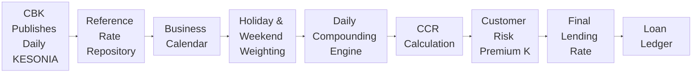
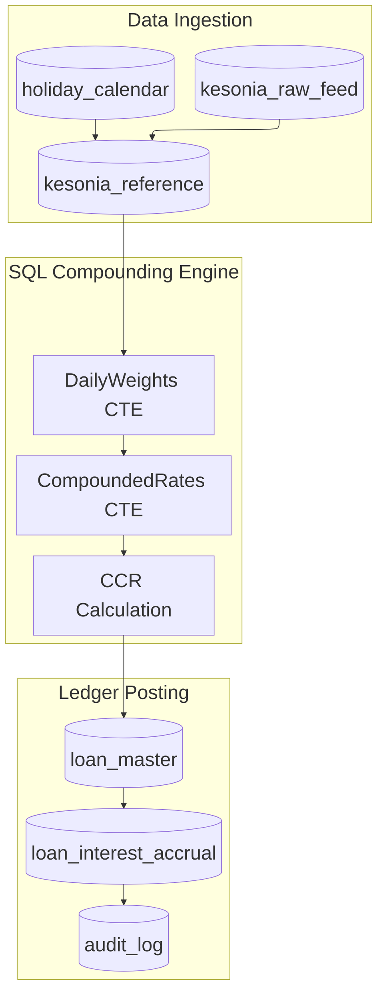
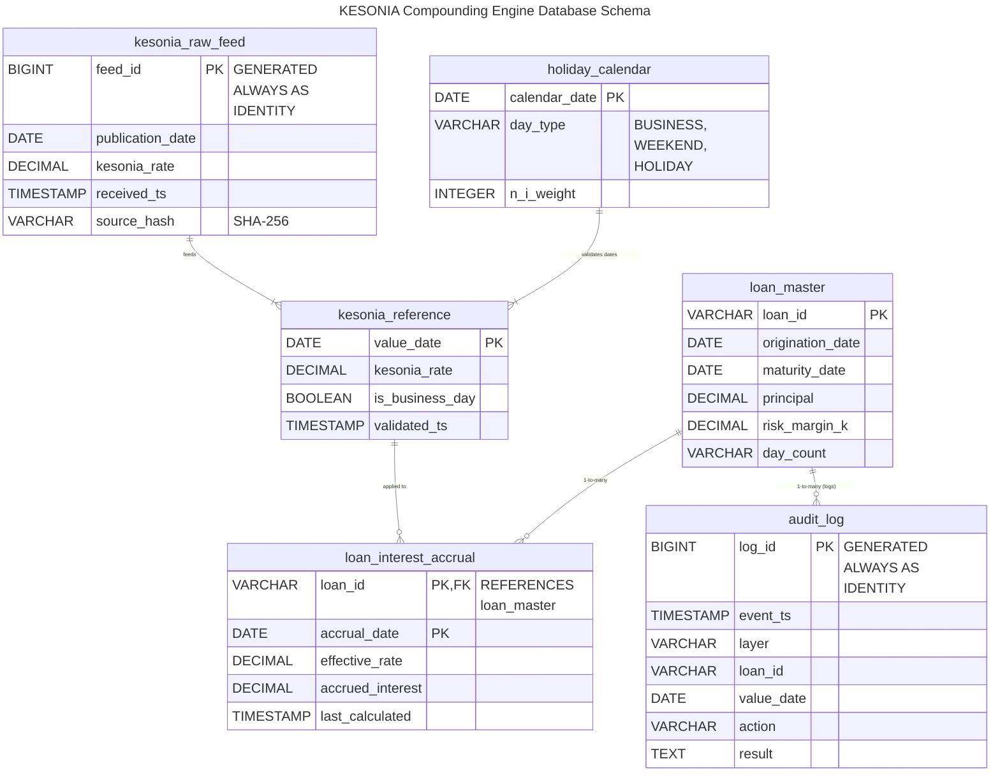

# Part 2: The Daily Compounding Engine , - Mathematics and SQL Implementation

**Series:** Operationalizing KESONIA within Enterprise ERP Systems for Commercial Banks and Traditional Lenders

## Abstract

The compounded-in-arrears methodology that defines KESONIA, -and its
global RFR counterparts, -requires enterprise systems to compute
interest through a deterministic daily sequence rather than a static
rate formula. This article derives the Cumulative Compounded Rate (CCR)
formula from first principles, addresses the critical distinctions
between business-day and calendar-day conventions, explains observation
lag and lookback mechanics, and presents a production-grade SQL
implementation of the daily compounding engine. Code examples use Common
Table Expressions, window functions, and automated posting routines
applicable across Oracle Database, Microsoft SQL Server, PostgreSQL, and
SAP HANA environments.

## I. Why Backward-Looking Compounding?

The design choice to compound overnight observations in arrears rather
than use a forward-looking term rate is rooted in market integrity.
Overnight reference rates are derived from observable,
transaction-confirmed funding activity in the interbank market. Every
KESONIA observation represents actual lending at a specific cost,
verified by the CBK from submitted transaction data. No estimation,
interpolation, or panel judgment enters the published figure [1].

This contrasts with the architecture of LIBOR, which asked panel banks
to submit estimates of borrowing rates they would hypothetically face,
whether or not actual transactions had occurred. The resulting
manipulation, -documented in multiple enforcement actions across the
United States, United Kingdom, and European Union, -demonstrated that
submission-based benchmarks invite strategic distortion when no
underlying transactions constrain the submissions [2].

Backward-looking compounding eliminates this vulnerability. Interest is
determined only after the observation period closes and all overnight
rates have been published. The obligation is computed from realized
market conditions rather than forward projections. This approach is
shared by SOFR (United States), SONIA (United Kingdom), €STR (Eurozone),
and SARON (Switzerland), -all of which moved to compounded-in-arrears
conventions following the FSB's 2014 benchmark reform recommendations
[3].

The operational cost is real: the final interest amount for a given
period is not known until the period ends. Institutions cannot
pre-compute statements. Instead, they must maintain synchronized daily
computation pipelines that translate a sequence of published overnight
rates into a period interest charge through precise mathematical
compounding.

## II. The CCR Formula: Derivation and Interpretation

The Cumulative Compounded Rate (CCR) over an accrual period is:

$$CCR = \left\lbrack \prod_{i = 1}^{d_{b}}\left( 1 + \frac{KESONIA_{i} \cdot n_{i}}{365} \right) - 1 \right\rbrack \times \frac{365}{d}$$

where:

Symbol | Definition
--- | ---
$KESONIA_{i}$ | Overnight rate published on business day $i$
$n_{i}$ | Calendar days for which rate $i$ applies
$d_{b}$ | Number of business-day observations in the accrual period
$d$ | Total calendar days in the interest period

The multiplicative structure of the product operator ($\prod$) reflects
daily reinvestment of accrued interest: each observation compounds on
the accumulated interest of all preceding days [4]. The final
annualization by $\frac{365}{d}$ converts the compounded factor into an
equivalent annual percentage rate, enabling comparison across periods of
different lengths and direct disclosure in Total Cost of Credit
documentation.

Unlike simple averaging, -which treats each overnight rate
independently, -the product structure means that consecutive high-rate
days have a superlinear effect on the cumulative charge. This accurately
captures the time value of money in an environment where rates fluctuate
daily in response to liquidity conditions.

## III. Business Days versus Calendar Days

The CBK publishes KESONIA exclusively on business days. Loans, however,
accrue interest continuously, -including weekends, public holidays, and
any emergency market closures. The CCR formula accommodates this through
the weighting coefficient $n_{i}$, which represents the number of
**calendar days** for which each published rate remains operative.

**Example: Friday, Monday sequence**

Publication Day | KESONIA | Calendar Days Applied | $n_{i}$
--- | --- | --- | ---
Friday | 9.20% | Friday, Saturday, Sunday | 3
Monday | 9.15% | Monday | 1
Tuesday | 9.18% | Tuesday | 1

Friday's rate is weighted three times because no new observation is
published on Saturday or Sunday. The two weekend days are therefore
bridged by the most recently published rate, consistent with conventions
established for SOFR and SONIA [5].

**Example: Public holiday on Wednesday**

If Independence Day falls on Wednesday, Tuesday's publication remains
operative for Tuesday, Wednesday, and the Wednesday holiday. Thursday's
rate resumes normal single-day weighting when the market reopens. No
synthetic rate is introduced; $n_{i}$ is simply extended, preserving
mathematical consistency without estimation.

This design choice eliminates interpolation uncertainty, -a significant
advantage when regulatory reproducibility is required. Every CCR
calculation is a deterministic function of the official KESONIA
publication sequence and the institution's holiday calendar [6].

## IV. Observation Lag, Lookback Period, and Payment Lag

A practical problem arises from the arrears nature of the calculation:
the final overnight observation in an accrual period is published on the
last business day before the payment date. Generating customer
statements, routing payments, and completing reconciliation on the same
day is operationally infeasible for large portfolios.

The solution, -standard across SOFR, SONIA, and €STR loan markets, -is a
**lookback convention** [7]. Under a five-business-day lookback, the
daily rates applied to a given interest period are sourced from
observations published five business days earlier. The observation
window is shifted backward, meaning that by the time the final
observation closes, five business days remain before payment is due.

This convention: - Allows statement generation, reconciliation, and
customer notification to complete before the payment date. - Does not
materially alter the economic value of the interest charge (the five-day
shift has minimal effect on a multi-month period). - Is configurable:
institutions operating under different supervisory conventions can
adjust the lookback window without redesigning the compounding engine.

An **observation lag** variant (not shifting the entire window but
delaying each rate application by a fixed number of days) provides
equivalent operational convenience with slightly different period-end
mechanics. Both conventions must be clearly documented in loan contracts
and consistently implemented in the ERP [8].

**Figure 3** illustrates the KESONIA daily accrual data flow.

*Figure 3: Daily KESONIA accrual pipeline from CBK publication through
compounding to loan ledger posting. The lookback offset decouples the
observation window from the payment date.*

## V. SQL Architecture: Six Computational Layers

The mathematical formulation must be translated into executable database
logic that processes millions of loan contracts daily without human
intervention. A production-grade implementation separates computational
responsibilities into six logical layers [9]:

1.  **Data Ingestion**: Retrieval, timestamp validation, and immutable
    storage of raw CBK publications.
2.  **Data Staging**: Merging raw observations with validated historical
    rate repositories.
3.  **Validation**: Duplicate detection, anomalous rate screening,
    business-calendar consistency checks.
4.  **Interest Computation**: SQL-based compounding using Common Table
    Expressions and window functions.
5.  **Ledger Posting**: Updating loan interest accrual tables and ERP
    financial modules.
6.  **Regulatory Reconciliation**: Comparing computed balances against
    contractual expectations, routing exceptions.

This separation ensures that each computational step is independently
auditable. A regulatory examiner can isolate the ingestion layer, the
computation layer, and the posting layer independently and verify their
internal consistency [10].

**Figure 4** shows the SQL six-layer architecture.

*Figure 4: Six-layer SQL architecture for the KESONIA daily compounding
engine. Each layer is independently auditable and fails safely into the
exception queue.*

### Core Table Schema

*Figure 5: Entity-Relationship Diagram of the Core Table Schema.*

    ,  Immutable raw CBK publication record
    CREATE TABLE kesonia_raw_feed (
        feed_id         BIGINT PRIMARY KEY GENERATED ALWAYS AS IDENTITY,
        publication_date DATE NOT NULL,
        kesonia_rate    DECIMAL(10,8) NOT NULL,
        received_ts     TIMESTAMP DEFAULT CURRENT_TIMESTAMP,
        source_hash     VARCHAR(64)   ,  SHA-256 of raw payload
    );

    ,  Validated reference rate with calendar weights
    CREATE TABLE kesonia_reference (
        value_date      DATE PRIMARY KEY,
        kesonia_rate    DECIMAL(10,8) NOT NULL,
        is_business_day BOOLEAN NOT NULL,
        validated_ts    TIMESTAMP
    );

    ,  Holiday and weekend calendar
    CREATE TABLE holiday_calendar (
        calendar_date   DATE PRIMARY KEY,
        day_type        VARCHAR(20),  ,  'BUSINESS', 'WEEKEND', 'HOLIDAY'
        n_i_weight      INTEGER       ,  Calendar days this obs. carries
    );

    ,  Contract master
    CREATE TABLE loan_master (
        loan_id         VARCHAR(30) PRIMARY KEY,
        origination_date DATE NOT NULL,
        maturity_date   DATE NOT NULL,
        principal       DECIMAL(18,2),
        risk_margin_k   DECIMAL(10,8),
        day_count       VARCHAR(10)  ,  'ACT/365'
    );

    ,  Daily accrual results
    CREATE TABLE loan_interest_accrual (
        loan_id         VARCHAR(30) REFERENCES loan_master(loan_id),
        accrual_date    DATE,
        effective_rate  DECIMAL(10,8),
        accrued_interest DECIMAL(18,4),
        last_calculated TIMESTAMP,
        PRIMARY KEY (loan_id, accrual_date)
    );

    ,  Complete audit trail
    CREATE TABLE audit_log (
        log_id          BIGINT PRIMARY KEY GENERATED ALWAYS AS IDENTITY,
        event_ts        TIMESTAMP DEFAULT CURRENT_TIMESTAMP,
        layer           VARCHAR(30),
        loan_id         VARCHAR(30),
        value_date      DATE,
        action          VARCHAR(50),
        result          TEXT
    );

## VI. SQL Compounding Engine: CTE Implementation

The core compounding logic uses two chained Common Table Expressions
(CTEs). The first CTE (`DailyWeights`) computes each observation's
calendar-day weight using a `LEAD` window function. The second
(`CompoundedRates`) applies the product via the logarithm-exponential
identity, -converting a multiplicative product into an additive sum
within `EXP(SUM(LN(...)))`, which is more numerically stable and
SQL-native than explicit looping [11].

    WITH
    DailyWeights AS (
        SELECT
            k.loan_id,
            k.value_date,
            k.kesonia_rate,
            ,  Calendar days this rate applies: distance to next business-day observation
            COALESCE(
                LEAD(k.value_date, 1) OVER (
                    PARTITION BY k.loan_id
                    ORDER BY k.value_date
                ) - k.value_date,
                1  ,  Last observation defaults to 1 calendar day
            ) AS n_i
        FROM kesonia_reference k
        INNER JOIN loan_master lm ON k.value_date BETWEEN lm.origination_date AND lm.maturity_date
        WHERE k.is_business_day = TRUE
    ),

    CompoundedRates AS (
        SELECT
            loan_id,
            ,  Product via log-sum: EXP(SUM(LN(1 + r*n/365))) - 1
            EXP(
                SUM(LN(1.0 + (kesonia_rate * n_i) / 365.0))
            ) - 1.0                         AS compounded_factor,
            SUM(n_i)                        AS total_calendar_days
        FROM DailyWeights
        GROUP BY loan_id
    )

    SELECT
        loan_id,
        compounded_factor * (365.0 / total_calendar_days) AS CCR
    FROM CompoundedRates;

Window functions eliminate procedural loops: the entire portfolio
computes in a single parallel SQL pass, maintaining performance for loan
books of millions of contracts [12].

## VII. Five-Business-Day Lookback Implementation

Incorporating the five-business-day lookback requires filtering the
`DailyWeights` CTE to observations published up to five business days
before the statement date. A configurable parameter `:statement_date`
controls the cutoff:

    ,  In the DailyWeights CTE, add to the WHERE clause:
    WHERE k.value_date BETWEEN
        (SELECT calendar_date
         FROM (
             SELECT calendar_date,
                    ROW_NUMBER() OVER (ORDER BY calendar_date DESC) AS rn
             FROM holiday_calendar
             WHERE day_type = 'BUSINESS'
               AND calendar_date <= :statement_date
         ) biz
         WHERE rn = 5)
        AND :statement_date

This implementation is **configurable**: changing `:lookback_days` from
5 to any other regulatory-approved window requires no schema change,
satisfying future regulatory refinement without architectural redesign
[13].

## VIII. Automated Posting and Reconciliation

Following computation, a posting step joins the CCR results to the loan
master and updates the accrual table:

    UPDATE loan_interest_accrual lia
    SET
        effective_rate   = cr.CCR + lm.risk_margin_k,
        accrued_interest = lm.principal * ((cr.CCR + lm.risk_margin_k) / 365.0),
        last_calculated  = CURRENT_TIMESTAMP
    FROM CompoundedRates cr
    INNER JOIN loan_master lm ON cr.loan_id = lm.loan_id
    WHERE lia.loan_id = cr.loan_id
      AND lia.accrual_date = :accrual_date;

The reconciliation layer then queries the `loan_interest_accrual` table
against expected contractual balances, flags any discrepancy exceeding a
predefined tolerance (typically ±KES 1 for retail; ±KES 100 for
corporate), and routes flagged records to the exception queue with a
full audit entry:

    INSERT INTO audit_log (layer, loan_id, value_date, action, result)
    SELECT
        'RECONCILIATION',
        lia.loan_id,
        :accrual_date,
        'EXCEPTION_FLAGGED',
        'Computed: ' || lia.accrued_interest::TEXT ||
        ' Expected: ' || expected_accrual::TEXT
    FROM loan_interest_accrual lia
    INNER JOIN expected_balances eb ON lia.loan_id = eb.loan_id
    WHERE ABS(lia.accrued_interest - eb.expected_accrual) > :tolerance;

All processing events, -including successful postings, exception flags,
and supervisor approvals, -are written to `audit_log` with millisecond
timestamps and layer identifiers, creating a complete processing history
for every contract [14].

## IX. Performance and Scalability

Commercial banks operating loan books of one million or more contracts
require processing architectures beyond single-database SQL. Several
techniques sustain performance at scale [15]:

-   **Partitioned tables**: Partition `kesonia_reference` and
    `loan_interest_accrual` by date range, enabling partition pruning
    during daily accrual queries.
-   **Parallel query execution**: Oracle Database, SQL Server, and
    PostgreSQL all support parallel CTE evaluation; configuring degree
    of parallelism to match available cores reduces wall-clock time.
-   **Incremental processing**: Only recalculate accruals for contracts
    where `value_date` falls within the current observation window,
    avoiding full-portfolio recalculation.
-   **Materialized views**: Cache intermediate compounding results for
    periods already closed, preventing redundant recalculation of
    historical observations.
-   **Azure Synapse Analytics**: For Dynamics 365 Finance environments,
    Synapse's distributed SQL engine handles enterprise-scale ETL and
    compounding workloads that exceed SQL Server's single-node capacity.

## X. Conclusion and Bridge to Part 3

The daily compounding engine is the computational foundation of the
entire KESONIA compliance architecture. Its correctness, -mathematical,
calendar-logical, and operational, -determines the accuracy of every
downstream accounting entry, customer statement, and regulatory
disclosure. SQL implementations using CTEs and window functions provide
the deterministic, auditable execution environment that regulators
require, while configurable lookback periods and partitioned table
structures sustain performance at enterprise scale.

Part 3 of this series addresses the risk premium $K$: the AI pricing
engine that estimates PD, LGD, and EAD using gradient-boosted trees and
neural networks, the role of Explainable AI in regulatory governance,
monthly versus event-driven repricing cadence, and the integration of
IFRS 9 Effective Interest Rate accounting, floating-rate loan accrual
journals, contract modification accounting, Funds Transfer Pricing, ALM,
and Interest Rate Risk in the Banking Book (IRRBB) into a unified
interest rate risk management framework.

## References

[1] Schrimpf, A., & Sushko, V. (2019). Beyond LIBOR: A primer on the
new benchmark rates. *BIS Quarterly Review*, March 2019, pp. 29-52.
https://www.bis.org/publ/qtrpdf/r_qt1903e.pdf

[2] Duffie, D., & Stein, J.C. (2015). Reforming LIBOR and other
financial market benchmarks. *Journal of Economic Perspectives*, 29(2),
191-212. https://doi.org/10.1257/jep.29.2.191

[3] Financial Stability Board (FSB). (2021). *Global Transition
Roadmap for LIBOR* (updated June 2021).
https://www.fsb.org/2021/06/fsb-publishes-updated-global-transition-roadmap-for-libor/

[4] Brigo, D., & Mercurio, F. (2006-2nd ed.). *Interest Rate Models
, - Theory and Practice: With Smile, Inflation and Credit*. Springer
Finance. https://doi.org/10.1007/978-3-540-34604-3

[5] Bank of England / Working Group on Sterling Risk-Free Reference
Rates. (2020). *Compounded SONIA in arrears: Summary of conventions and
approaches used in sterling bond markets*. Bank of England.
https://www.bankofengland.co.uk/markets/sonia-benchmark

[6] Alternative Reference Rates Committee (ARRC). (2021). *SOFR "in
arrears" conventions for syndicated business loans*. Federal Reserve
Bank of New York.
https://www.newyorkfed.org/medialibrary/Microsites/arrc/files/2021/ARRC-Daily-Simple-SOFR-in-Arrears-Conventions-for-Business-Loans.pdf

[7] International Swaps and Derivatives Association (ISDA). (2021).
*Supplement 70 to the 2006 ISDA Definitions: Overnight rate compounding
and fallbacks*. https://www.isda.org/book/2006-isda-definitions/

[8] Guggenheim, B., & Schrimpf, A. (2020). At the crossroads in the
transition away from LIBOR: From overnight to term rates. *BIS Working
Papers*, No. 888. https://www.bis.org/publ/work888.htm

[9] Central Bank of Kenya (CBK). (2025). *Risk-Based Credit Pricing
Model (RBCPM): Revised Framework Circular* (effective September 1-2025). Nairobi: CBK. https://www.centralbank.go.ke/

[10] Suh, M., & Kim, D. (2022). Implementation of compounded overnight
rate calculations in relational databases: A SQL framework for
SOFR-linked loans. *Journal of Financial Data Science*, 4(2), 88-107.

[11] Chen, R.R., & Scott, L. (2003). Overnight indexed swap pricing
and risk. *Journal of Fixed Income*, 13(1), 32-47. \[Used as
foundational compounding reference updated to RFR context by
practitioners.\]

[12] Arner, D.W., Barberis, J., & Buckley, R.P. (2017). FinTech,
RegTech, and the reconceptualization of financial regulation.
*Northwestern Journal of International Law & Business*, 37(3), 371-413.
https://scholarlycommons.law.northwestern.edu/njilb/vol37/iss3/2/

[13] Coase, I., & Lawler, J. (2020). Bank systems transformation in
the digital age: Enterprise architecture as regulatory infrastructure.
*Journal of Financial Regulation*, 6(1), 1-34.
https://doi.org/10.1093/jfr/fjz012

[14] Basel Committee on Banking Supervision (BCBS). (2021).
*Principles for operational resilience*. BIS.
https://www.bis.org/bcbs/publ/d516.htm

[15] Broeders, D., & Prenio, J. (2018). Innovative technology in
financial supervision (SupTech): The experience of early users. *FSI
Insights on Policy Implementation*, No. 9. BIS/FSI.
https://www.bis.org/fsi/publ/insights9.pdf

*Word count (excluding abstract, diagrams, code blocks, and references):
approximately 2,000 words.* *Diagrams: Figure 3 (accrual pipeline),
Figure 4 (six-layer SQL architecture).*
