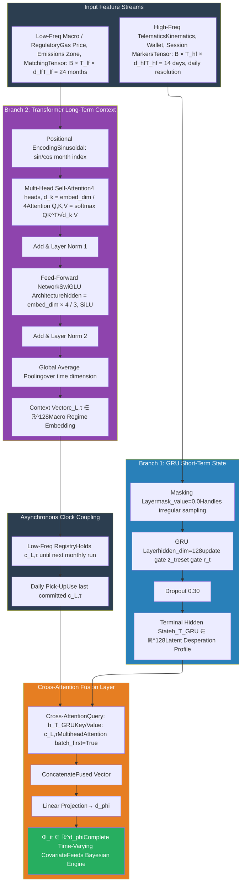
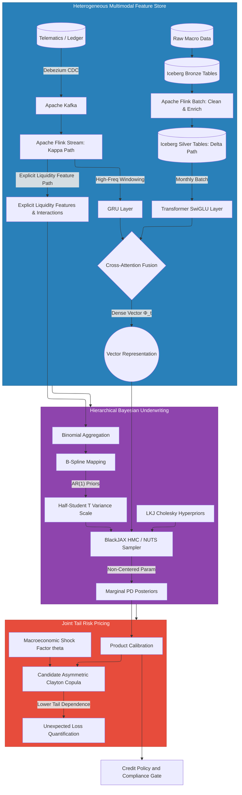

## Executive Vision & Mission

A driver loses an afternoon to a broken alternator. The repair is small beside the value of the vehicle, yet the vehicle is the driver's workplace. Four missed earning windows later, a fuel advance is overdue; a premium instalment is threatened; the ride-hailing account may soon be inactive. The lender sees several deteriorating products. The driver experiences one interrupted productive asset.

Mwendo Pamoja begins with that mismatch. Its mission is to engineer risk infrastructure for the African gig economy that can recognise a developing liquidity constraint while there is still time to act. The company combines insurtech, embedded-finance servicing, streaming data, interpretable liquidity features, temporal representation learning, Bayesian uncertainty, and portfolio controls. The human objective is continuity of viable work. The commercial objective is better-timed decisions and interventions. The financing objective is a receivable pool that institutional partners can inspect, stress, and fund.

The first wave of African digital lending demonstrated how mobile data could widen access. Its limitation is not that wallet history is useless, but that a trailing aggregate can miss the order in which a driver's day deteriorates. Fuel rises before fares adjust. A repair removes working hours. A fixed repayment claims a larger share of net cash. An insurance lapse can then stop the activity that would have cured the arrears. Kenyan platform-work research documents the practical weight of fuel, insurance, repairs, vehicle financing, cancellations, and unpaid waiting time in driver economics [7].

**Our mission:** Replace a single static score with a continuous, uncertainty-aware decision system that protects driver livelihoods when a proportionate intervention is viable and restricts exposure when it is not.

**Our venture thesis:** Mwendo Pamoja HoldCo is not proposed as a conventional deposit-taking bank or an unlicensed insurer. It is the technology, orchestration, and servicing company. Eligible financial assets sit in separately governed SPVs or on licensed partners' books. That separation can make the HoldCo more capital-efficient, but it does not make credit, conduct, data, model, servicing, or reputational risk disappear.

This paper is deliberately ambitious. Its equations describe candidate mechanisms to be calibrated, its diagrams describe a target architecture, and its commercial assumptions describe a venture case to be validated. The companion documents under **documentation/controlled_specifications** record the controlled implementation baseline. This paper preserves the reason a company should exist.

## Section 1: Corporate Structure & Equity Financing (HoldCo vs. SPV)

This memorandum is addressed to Venture Capital (VC) and Private Equity (PE) partners evaluating an equity investment into the **Mwendo Pamoja HoldCo**.

It is critical to distinguish the HoldCo equity structure from our operational debt facilities:

- **The HoldCo (Where VCs Invest):** The Holding Company owns the intellectual property (IP), the proprietary Dual-Regime Neural Architecture, the codebase, and employs the engineering and underwriting teams. VC capital is deployed here to fund R&D, market expansion, and talent acquisition.

- **Founder-control objective:** The founding sponsor's planning case begins at **51% on a fully diluted pre-money basis**. This is a governance objective, not a permanent anti-dilution guarantee. New issuances, option-pool changes, conversions, down rounds, and investor protections can dilute every holder unless transaction documents provide otherwise. Mission continuity should therefore also be protected through board composition, reserved matters, intellectual-property controls, and a clear model-risk charter.

- **The SPV (Where Banks Lend):** Completely separate from the HoldCo, we utilize a Bankruptcy-Remote Special Purpose Vehicle (SPV) to house the actual gig-worker loan assets. Institutional banks lend debt into this SPV. *This structure does not conflict with VC equity; it actively protects it.* If the loan portfolio underperforms, the losses are contained within the SPV, protecting the HoldCo's balance sheet and your VC equity from debt contagion. Vice versa, because the SPV is explicitly bankruptcy-remote, if the HoldCo fails, the SPV's loan assets and institutional debt are completely shielded from the HoldCo's creditors.

### 1.1 Equity Distribution Strategy & Cap Table

The following table is a **pre-money planning case**, not an executed cap table. It shows how the first 100% could be allocated before the proposed investment is priced and before securities, warrants, or option grants are negotiated:

1. **The Employee Stock Ownership Plan (ESOP) Pool: 15%**
   * **Target:** Future AI/ML engineers, Chief Risk Officers, Actuaries, and key executives.
   * **Strategic Purpose:** A 15% planning pool provides room to recruit engineers, actuaries, risk leaders, and executives. Whether it is calculated pre-money or post-money materially changes dilution and must be explicit in the term sheet.

2. **The Venture Capital Allocation (The "Raise" Bucket): 20%**
   * **Target:** The Lead VC, syndicate investors, and strategic Private Equity.
   * **Strategic Purpose:** We are allocating 20% of the HoldCo for the Seed/Series A capital injection. This provides institutional investors with substantial "skin in the game" to dedicate board resources, while leaving sufficient dilution room on the cap table for future rounds.

3. **Co-Founders and Key Early Management: 14%**
   * **Target:** The CTO, technical co-founders, and architects building the deep-tech IP.
   * **Strategic Purpose:** This equity is placed on a standard 4-year vesting schedule with a 1-year cliff, heavily incentivizing technical leads to remain for the long term.

4. **Strategic Advisors & Ecosystem Partners: no current allocation**
   * **Target:** Highly connected advisors (former bank executives, regulators) or critical ecosystem integrators.
   * **Strategic Purpose:** Any future warrants should purchase documented services or commercial value. Equity must never be described as a means to "unlock regulatory doors."

**Target Pre-Money Cap Table Profile**

For discussion purposes, the pre-money fully diluted planning profile is:

**Founder:** 51.0% *(control objective before the financing)*

**Key Co-Founders / Early Execs:** 14.0% *(Subject to 4-year vesting)*

**Unallocated ESOP (Talent Pool):** 15.0% *(Reserved for future hires)*

**Available for VC Investment:** 20.0% *(What is being sold in this round)*

## Section 2: The Technological Moat & Proprietary Underwriting Engine

The moat is not a fashionable model name. It is the disciplined assembly of difficult components: consented data partnerships, point-in-time ledgers, event-time processing, features with clear ownership, representation learning that adds measurable signal, calibrated uncertainty, lawful intervention, and a financing feedback loop. Code can be copied. A validated system of data rights, operating history, partner integration, model governance, and portfolio evidence is harder to reproduce.

The hybrid engine addresses two structural weaknesses in gig-worker credit: **temporal blindness**, where a monthly view misses a fast cash-flow deterioration, and **correlated cascades**, where many apparently separate exposures respond to the same platform, fuel, geographic, or vehicle shock. It combines neural representations with explicit financial variables and a hierarchical Bayesian model, but retains a conventional explicit-only fallback when complexity does not earn its place.

### 2.1 Edge Capture and Data Engineering Pipeline
The foundation of the engine is a massive, real-time data ingestion pipeline. The driver's vehicle acts as a rolling sensor array, streaming data through a Lakehouse architecture designed for point-in-time correctness.

- **Telematics (10Hz):** Inertial Measurement Units (IMUs) capture tri-axial acceleration and angular velocity, translating raw physical movement into behavioral indicators (e.g., harsh braking, cornering stress).

- **Streaming CDC and point-in-time controls:** A Debezium Change Data Capture layer can stream relevant ledger changes through Kafka to Apache Flink. Event time, ingestion time, immutable event identifiers, versioned features, watermarks, and as-of joins are used to reproduce what was knowable at the decision timestamp. These controls reduce look-ahead leakage; they do not guarantee that every upstream correction, late event, label, or data contract is unbiased.

### 2.2 The Dual-Regime Neural Architecture
The engine splits feature extraction into two temporal regimes, processed by distinct neural networks:

1. **The high-frequency GRU branch:** A Gated Recurrent Unit processes a configurable recent window of raw or minimally transformed telematics, operating-session, trip-timing, and permitted wallet-event sequences [8]. It learns short-term kinematic state, operational consistency, and temporal rhythm. It does **not** receive the canonical engineered CFA, DLR, Earnings Velocity, or Repayment Velocity measures. Its output \(\mathbf h_T^{\mathrm{GRU}}\) is called a short-term state embedding, not a diagnosis of "desperation."

2. **The lower-frequency Transformer branch:** A Multi-Head Self-Attention Transformer processes a configurable history of fuel prices, rates, platform supply and demand, regulatory events, seasonality, and geographic context [9]. Twenty-four months is an initial design window, not a universal optimum. It outputs a contextual regime representation \(\mathbf c_{L,\tau}\).

These branches can be fused through cross-attention, allowing the short-term operating sequence to be interpreted in its longer market context. Incremental value must be shown by ablation and out-of-time tests against simpler baselines.
**Figure 1: The Dual-Regime Neural Architecture**

### 2.3 Solving the explainability problem through explicit ownership

Explainability is not achieved by calling an entire pathway "regulatory." The architecture instead gives important engineered financial variables a single, inspectable owner.

> **Explicit Liquidity Feature Path:** A low-latency Kappa/Redis feature service that computes interpretable financial variables, including CFA, DLR, Earnings Velocity, Repayment Velocity, wallet volatility, reserve balance, and time since depletion. These variables bypass the GRU and Transformer encoders and enter the Hierarchical Bayesian Logistic Regression directly through spline and interaction terms.

The same raw wallet event may be visible to the sequence branch, but the same engineered metric is not duplicated. This avoids a common failure mode in hybrid models, where a latent embedding quietly reconstructs an explicit ratio and the final regression treats both as separate evidence.

### 2.4 Continuous underwriting via redundancy-controlled hierarchical Bayesian logic

The Hierarchical Bayesian Logistic Regression receives the fused neural representation and the Explicit Liquidity Features. Its purpose is to estimate risk with uncertainty while borrowing strength across smaller platform, geography, product, and time cohorts. A practical specification is

\[
\operatorname{logit}(p_i)=
\alpha+a_{g[i]}+b_{p[i]}+c_{t[i]}
+\mathbf q_i^{\mathsf T}\boldsymbol\beta_z
+\widetilde{\mathbf h}_i^{\mathsf T}\boldsymbol\beta_h
+\boldsymbol\psi_i^{\mathsf T}\boldsymbol\gamma
+\mathbf m_i^{\mathsf T}\boldsymbol\delta .
\]

\(\mathbf q_i\) is a centered, scaled, and orthogonalized spline basis for explicit liquidity variables. \(\mathbf h_i\) is the fused neural vector. Before it enters the regression, it is residualized out of fold:

\[
\widetilde{\mathbf h}_i
=
\mathbf h_i-\widehat{\mathbb E}_{-k(i)}
\left[\mathbf h_i\mid\mathbf q_i,\mathbf m_i\right].
\]

This cross-fitted projection reduces leakage between the explicit and latent blocks. A block-shrinkage prior, such as a regularized horseshoe [10], suppresses weak or redundant terms. Interactions follow strong heredity, and hierarchical effects use non-centred parameterisations. The production probability is then recalibrated by product:

\[
\operatorname{logit}(PD_i^{\mathrm{cal}})
=\kappa_{p[i]}+s_{p[i]}\eta_i,\qquad s_{p[i]}>0.
\]

These controls lower the chance of redundancy and unstable multicollinearity; they do not make it impossible. Validation must examine posterior correlations, condition indices, variance inflation in the explicit block, representation similarity, calibration slope, subgroup calibration, and the incremental lift of each block. If the neural representation does not add stable, out-of-time value, the explicit-only model remains the fallback.

The posterior estimate, interval, and tail probability then move to a distinct **Credit Policy and Compliance Gate**. The gate applies hard product, affordability, consent, uncertainty, insurance, concentration, and contractual rules. It returns approve, decline, reduce, freeze, restructure, or intervene. Bayesian inference informs the decision; it does not replace the licensed decision owner.

The consumer hook remains the original one: make the risk engine useful before collections become punitive. A driver-facing view should translate a model action into concrete reasons, available choices, duration, and recourse without exposing sensitive security logic.

**Figure 2: End-to-End Underwriting Pipeline (Data Engineering to Joint Tail Risk Pricing)**

### 2.5 The Deep-Tech Investment Precedent (Case Studies)

Mwendo Pamoja sits in a recognisable fintech tradition: a simple customer interaction can rest on difficult infrastructure, risk, and operating work. The comparison is useful as an analogy, not a promise to reproduce another company's trajectory. The African gig economy also has its own data rights, cash rails, insurance market, credit practices, unit economics, and institutional constraints.

- **Stripe and the ledger abstraction:** Stripe's developer experience made a complex payment system easier to use. Its published engineering material illustrates why idempotency, event handling, and fraud infrastructure can matter as much as a visible API [1], [2]. Mwendo Pamoja draws the narrower lesson that a friendly driver experience needs a disciplined ledger and evidence trail beneath it.
- **Affirm and machine-learning underwriting:** Affirm provides a comparison for combining point-of-sale context with underwriting and a distinctive consumer proposition [3], [4]. The lesson is to test whether higher-frequency context adds value beyond a conventional score, while retaining responsible pricing and product controls.
- **Nubank and cloud-native decision systems:** Nubank illustrates how software, data, operations, and customer experience can be combined at scale [5], [6]. Public material should not be stretched into claims about specific models, customer counts, profitability, or market conditions that the cited page does not establish.

*The equations are publishable and therefore copyable. The harder moat is the governed system around them: lawful data access, longitudinal outcomes, point-in-time features, calibrated models, partner integrations, intervention evidence, servicing performance, and the trust required to finance receivables.*

## Section 3: Tail-Risk Modeling via Asymmetric Copulas

Gig workers can share the same platform commission change, fuel-price movement, rain event, strike, regulation, or geographic demand shock. Thousands of driver records do not therefore imply thousands of independent risks. The venture's underwriting value increases if it can identify the common driver of stress and propagate that information into limits, pricing, reserves, and the SPV cash-flow model.

The Clayton copula is retained as an innovative **candidate** for lower-tail dependence, not as proof that contagion is contained. For two uniform marginal default variables \(u\) and \(v\),

\[
C_{\theta}^{\mathrm{Clayton}}(u,v)
=
\left(u^{-\theta}+v^{-\theta}-1\right)^{-1/\theta},
\qquad \theta>0,
\]

with lower-tail dependence

\[
\lambda_L=2^{-1/\theta}.
\]

The useful intuition is that joint distress can be more likely than independence would suggest. The limitation is equally important: one copula family cannot be assumed to describe every platform, product, horizon, or regime. The model-selection process should compare independence, Gaussian, Student-\(t\), Clayton, rotated families, mixtures, and stress overlays using held-out likelihood, tail calibration, stability, and economic interpretability. Marginal PDs must be calibrated before dependence is estimated. The SPV model should then translate joint losses into the timing of collections, recoveries, reserve draws, and note impairment.

## Section 4: Algorithmic Fairness & Redlining Prevention (ESG Compliance)

Fairness is not a single penalty term. MMD regularization and equalized-odds diagnostics may be useful tools, but neither guarantees that geography, work schedule, device quality, or platform assignment is free of proxy effects. Some differences may reflect exposure; others may reproduce structural disadvantage; still others may come from missingness or label bias.

The governance approach is therefore layered:

1. Define the decision, affected population, protected and vulnerable groups, lawful data basis, and foreseeable harm.
2. Measure data coverage, missingness, approval, limit, pricing, false-positive, false-negative, calibration, intervention, complaint, and outcome differences.
3. Test candidate mitigation, including representation constraints, reweighting, threshold review, MMD penalties, policy overrides, and feature removal.
4. Review whether the intervention itself creates a new harm, such as freezing credit for night workers because a fatigue proxy is poorly calibrated.
5. Provide a reason, challenge route, human review where appropriate, and documented monitoring.

For investors, the defensible asset is not "mathematical protection from fines." It is a repeatable governance system that can identify, measure, respond to, and document model and conduct risk under Kenya's data-protection framework [11].

## Section 5: The Depth of Financial Engineering (Beyond Software)

Software, APIs, and neural networks are execution tools. The deeper intellectual property is the connection among driver microeconomics, actuarial exposure, credit timing, portfolio dependence, cash control, and institutional funding. Traditional retail scorecards can treat each product as a separate obligation. Mwendo Pamoja treats the vehicle and its daily cash cycle as a productive system, while still preserving the legal and accounting boundaries among insurer, lender, servicer, SPV, and driver.

We have constructed an architecture that natively understands:

- **Duration matching and interest-rate volatility:** The finance model compounds KESONIA according to the note convention and compares asset repricing, collections, and reinvestment to note service. Customer limits do not mechanically rise or fall with the HoldCo's cost of capital; affordability, product policy, licensed-lender pricing, and customer-protection rules remain separate.

- **Systemic risk and tail dependence:** Candidate copulas and cohort stress models estimate a range of joint-loss outcomes. They do not reveal an "exact" probability. Their value is the disciplined translation of common shocks into concentration, reserve, subordination, and intervention decisions.

- **Currency translation and macro constraints:** The Transformer may ingest inflation, rate, fuel, and currency regimes. The primary SPV case remains KES-funded against KES receivables. A USD liability requires an actual hedge or an explicit risk allocation; a forecast is not a hedge.

For a venture investor, the defensibility lies in execution across these boundaries. A competitor can reproduce an equation from a paper. It is harder to reproduce negotiated data access, consented longitudinal outcomes, product integrations, intervention evidence, servicing discipline, calibrated models, transaction history, and trust among regulated partners.

## Section 6: The Data Network Effect (The "Flywheel")

Mwendo Pamoja may develop a compounding evidence advantage, but more data is not automatically better data. A gig mile becomes useful only when its collection is lawful and necessary, its device and context are understood, its outcome label is reliable, and the approved training process selects it. Production models do not update their weights after every mile. Data accumulate into governed training and validation windows, followed by independent approval and controlled release.

1. **Phase 1, representative evidence:** With contracted platform integrations and appropriate data rights, the HoldCo can observe different work and settlement contexts. Cross-platform use requires explicit purpose, identity resolution, minimisation, and validation. A kinematic pattern from one activity is not assumed to transfer to another credit product without evidence.

2. **Phase 2: The Bayesian learning effect:** More representative outcome data can narrow uncertainty about stable, identified effects. It does not create near-perfect certainty about a future macro shock. Structural change, selection, missingness, product changes, and dependence remain. The investable advantage is faster detection of where the model is uncertain and more disciplined updating, not the disappearance of uncertainty.

3. **Phase 3: The evidence and integration flywheel:** Better evidence can support more selective pricing, safer limits, more useful interventions, and potentially lower funding costs. Better products can attract partners and drivers, producing more consented outcome data. The result may be a defensible network and integration advantage. It is neither a guaranteed monopoly nor permission to increase leverage before the loss evidence supports it.

## Section 7: Valuation Multiples & The "Asset-Light" Thesis

A critical component of the venture case is how the HoldCo's revenue quality and retained risk shape valuation. A properly structured SPV can separate purchased receivables and their waterfall from HoldCo operations. It does not completely detach HoldCo value from credit performance when HoldCo earns origination or servicing revenue, retains Class C, gives representations, funds support, or depends on continued investor appetite.

### 7.1 Avoiding the "Balance Sheet Lender" Trap
Balance-sheet lenders and software-led fintechs can attract different valuation frameworks, but no universal one to two times book-value rule is assumed. Investors will examine retained credit and operational risk, funding durability, growth quality, contribution margin, partner concentration, compliance, and losses through a cycle.

Mwendo Pamoja HoldCo is designed to avoid directly warehousing ordinary receivables. It may nevertheless retain Class C, provide representations, fund reserves, absorb servicing costs, face indemnities, or suffer revenue and reputational loss when a portfolio underperforms. Those exposures must be shown in the HoldCo model. The SPV separates legal assets and cash flows only to the extent that true sale, security, servicing continuity, account control, and insolvency analysis support the structure.

### 7.2 SaaS and Deep-Tech Revenue Multiples
The proposed HoldCo revenue mix includes platform integration, decisioning, servicing, and IP-licensing fees. A 3.0 percent servicing fee is an illustrative transaction assumption, not yet recurring contracted revenue. Origination-linked revenue can be cyclical and may be constrained when portfolio triggers stop purchases.

- **Gross-margin planning case:** An 85 percent gross margin can remain an upside scenario, but the cost of data, telemetry hardware, inference, customer support, model validation, compliance, security, insurance integration, servicing, and partner revenue share belongs in cost of revenue where economically appropriate.
- **Valuation paradigm:** A recurring software component may support a revenue-multiple comparison. Credit-linked concentration, partner dependence, regulatory exposure, implementation services, and retained first-loss risk can justify a different multiple. Valuation should follow the quality and durability of revenue, not the label applied to it.

## Section 8: Strategic Market Expansion and Licensing

The African gig economy is the proving ground, but several design ideas can travel: an operating asset can anchor income, cash-flow timing can matter more than a static snapshot, products can share common shocks, and early support can sometimes preserve value. The data, labels, model effects, products, and legal authority are not geography-agnostic and must be rebuilt or revalidated in each market.

The long-term venture option is the **white-label licensing of the decision and orchestration architecture** to institutions in other markets. Expansion is not a matter of exporting weights. Each jurisdiction changes data rights, credit and insurance licensing, consumer protection, reference rates, accounting, fairness analysis, language, mobility patterns, and available interventions. The product becomes portable when its interfaces and governance are modular, while its models remain locally validated.

## Section 9: A reader's map of the core ideas

This compact map is local to the investor paper. The repository glossary remains the controlled vocabulary. The purpose here is to let a business reader move between the human problem, the model, and the financing structure without interrupting the narrative.

### 1. Economic & Domain Concepts

- **Correlated Default Cascade:** The phenomenon where a gig driver's default on a small microloan triggers a cascading inability to pay larger obligations (like vehicle leases or Insurance Premium Financing).

- **Suffocation Threshold ($I_{\text{net}} < S$):** The critical boundary where a driver's net operational income falls below their minimum structural debt service requirements.

- **Insurance Premium Financing (IPF):** A credit product that allows drivers to pay expensive annual insurance premiums in small daily/weekly installments, collateralized by the unearned premium.

- **Algorithmic redlining:** A risk that variables, representations, labels, or policies reproduce unjustified geographic or demographic disadvantage. Equalized-odds diagnostics and MMD regularization are candidate controls, not complete remedies.

### 2. Neural representations

- **Algorithmic Matching Elasticity:** A proposed contextual measure of how trip opportunities respond to local driver supply, rider demand, platform rules, time, and place. Its final definition and units require calibration.

- **Circadian Fatigue Accumulation:** The integration of trailing hours driven during a driver's historical biological sleep window.

- **Short-term state embedding:** The GRU representation learned from permitted raw or minimally transformed telematics, session, trip-timing, and event sequences.

- **Macroeconomic context embedding:** The Transformer representation learned from lower-frequency external and market sequences.

### 3. Engineered Variables: The Explicit Liquidity Feature Path

- **Wallet Cash-Flow Asymmetry (CFA):** A documented measure of the extent to which cash availability depends on infrequent high-income events. Its numerator, denominator, window, clipping, and minimum-observation rule must be fixed in the feature registry.

- **Earnings Velocity (\(\nu_{\text{earn}}\)):** The ratio of recent net settled earnings, initially seven days, to a longer historical baseline, initially 90 days. It belongs only to the Explicit Liquidity Feature Path.

- **Dynamic Debt-to-Liquidity Ratio (DLR):** Debt due over a defined horizon divided by currently available wallet cash, available driver reserve, and reliable earned-but-pending settlement over the same decision horizon. Restricted balances are excluded or haircutted. The dimensionless ratio enters through an explicit nonlinear spline.

- **Repayment Velocity ($v_{\text{repay}}$):** Principal actually repaid divided by principal scheduled over the same trailing window, with explicit treatment for prepayment, restructuring, reversals, and no scheduled principal. It enters through an explicit nonlinear spline.

- **Explicit Interaction Set ($\mathcal{G}$):** Specific pairwise interactions routed directly to the Bayesian layer.

### 4. Deep Learning & Data Architecture

- **Dual-Regime Neural Architecture:** The core predictive engine split into two temporal regimes: High-frequency telematics (GRU) and Low-frequency macro context (Transformer).

- **Gated Recurrent Unit (GRU):** A sequential neural network that processes a validated recent window of permitted event sequences to produce a short-term hidden state $\mathbf{h}_T^{\text{GRU}}$. Fourteen days is an initial candidate window.

- **Multi-Head Self-Attention Transformer:** A neural architecture that processes a versioned, lower-frequency context window and produces $\mathbf{c}_{L,\tau}$. Twenty-four months is an initial candidate, subject to data history, regime relevance, and validation.

- **Cross-attention fusion:** A candidate mechanism through which the short-term representation queries lower-frequency context. It is compared with simpler concatenation and gated fusion, then residualised against the explicit block before the HLR.

- **Point-in-time correctness:** The requirement that a training or replay record contain only information available at the historical decision timestamp. CDC, event time, ingestion time, as-of joins, lineage, and late-event rules are controls supporting it.

### 5. Bayesian & Probabilistic Architecture

- **Hierarchical Bayesian Logistic Regression:** The final underwriting engine outputting a full posterior probability distribution of default, explicitly quantifying uncertainty.

- **B-Splines:** Mathematical functions used to explicitly model non-linear relationships directly in the Bayesian layer without using a neural network.

- **Hamiltonian Monte Carlo (HMC):** One high-fidelity inference method for the Bayesian posterior. Production may use another validated approximation with periodic HMC comparison where scale or latency requires it.

- **Asymmetric Clayton copula:** One candidate family for lower-tail dependence among product outcomes. It competes with other copulas and stress methods; it is not the default by title.

- **Credit Policy and Compliance Gate:** The separate downstream rule layer that applies contractual, product, affordability, consent, concentration, uncertainty, and regulatory controls to the Bayesian output.

## Section 10: Why this can become venture-scale

The venture case is not that Mwendo Pamoja will know the future perfectly. It is that a fragmented market contains repeated coordination failures with measurable economic cost. Drivers receive products on incompatible clocks. Insurers see exposure but not always liquidity. Lenders see repayment but may not see vehicle continuity. Platforms see work and settlement but do not structure institutional receivables. Investors see yield but need cash control, loss evidence, and enforceable boundaries.

Mwendo Pamoja can become valuable by reducing the cost of that coordination. The same event infrastructure can support underwriting, intervention, policy servicing, receivable eligibility, account reconciliation, and investor reporting, provided each output has a lawful owner and an audit trail. The technical stack is therefore not an ornament attached to a lending pitch. It is the mechanism through which an operating event becomes an explainable decision and, eventually, a financeable cash flow.

The next proof points are concrete:

1. Demonstrate point-in-time data and consented coverage for a defined pilot population.
2. Beat transparent baseline models on calibration and decision value, not only ranking metrics.
3. Show that interventions preserve productive continuity without increasing over-indebtedness or unfair restriction.
4. Reconcile product cash flows into an SPV cohort model with realistic timing, fees, recoveries, and stress.
5. Convert partner interest into executed data, product, servicing, and financing agreements.
6. Show HoldCo revenue, costs, and retained risk without mixing them into SPV asset yield.

If those proofs accumulate, the flywheel becomes credible: evidence improves decisions, decisions improve outcomes, outcomes strengthen partner confidence, and partner confidence widens the data and distribution network. That is a more durable venture story than certainty, monopoly, or mathematics by proclamation.

## Selected IEEE references

[1] Stripe Engineering, "Designing robust and predictable APIs with idempotency," *Stripe Blog*. [Online]. Available: https://stripe.com/blog/idempotency. Accessed: Aug. 25, 2026.

[2] Stripe Engineering, "How we built it: Stripe Radar," *Stripe Blog*. [Online]. Available: https://stripe.com/blog/how-we-built-it-stripe-radar. Accessed: Aug. 25, 2026.

[3] M. Levchin, "The new underwriting: Machine learning versus traditional scoring," *Affirm Investor Relations*, 2021. [Online]. Available: https://investors.affirm.com/. Accessed: Aug. 25, 2026.

[4] PYMNTS, "Affirm's Max Levchin on the data science of consumer credit," *PYMNTS.com*. [Online]. Available: https://www.pymnts.com/. Accessed: Aug. 25, 2026.

[5] Nubank Engineering, "Building a cloud-native core banking system," *Building Nubank*. [Online]. Available: https://building.nubank.com.br/. Accessed: Aug. 25, 2026.

[6] Nubank Data Science, "Sequential modeling for credit underwriting," *Building Nubank*. [Online]. Available: https://building.nubank.com.br/data-science/. Accessed: Aug. 25, 2026.

[7] International Labour Organization, *Digital Labour Platforms in Kenya: Exploring Women's Opportunities and Challenges Across Various Sectors*, Geneva, Switzerland, Mar. 2024. [Online]. Available: https://www.ilo.org/publications/digital-labour-platforms-kenya-exploring-women%E2%80%99s-opportunities-and. Accessed: Aug. 24, 2026.

[8] K. Cho *et al*., "Learning phrase representations using RNN encoder-decoder for statistical machine translation," arXiv:1406.1078, 2014. [Online]. Available: https://arxiv.org/abs/1406.1078. Accessed: Aug. 24, 2026.

[9] A. Vaswani *et al*., "Attention is all you need," in *Advances in Neural Information Processing Systems 30*, 2017. [Online]. Available: https://papers.nips.cc/paper/2017/file/3f5ee243547dee91fbd053c1c4a845aa-Paper.pdf. Accessed: Aug. 24, 2026.

[10] J. Piironen and A. Vehtari, "Sparsity information and regularization in the horseshoe and other shrinkage priors," *Electronic Journal of Statistics*, vol. 11, no. 2, pp. 5018-5051, 2017, doi: 10.1214/17-EJS1337SI.

[11] Republic of Kenya, *Data Protection Act, 2019*, No. 24 of 2019. [Online]. Available: https://new.kenyalaw.org/akn/ke/act/2019/24. Accessed: Aug. 24, 2026.

[12] F. Liu, Z. Hua, and A. Lim, "Identifying future defaulters: A hierarchical Bayesian method," *European Journal of Operational Research*, vol. 241, no. 1, pp. 202-211, 2015, doi: 10.1016/j.ejor.2014.08.008.

[13] Central Bank of Kenya, "Kenya Shilling Overnight Interbank Average (KESONIA)." [Online]. Available: https://www.centralbank.go.ke/kesonia/. Accessed: Aug. 24, 2026.

[14] Central Bank of Kenya, *Revised Risk-Based Credit Pricing Model*, Nairobi, Kenya, Aug. 2025. [Online]. Available: https://www.centralbank.go.ke/wp-content/uploads/2025/08/Revised-Risk-based-Credit-Pricing-Model.pdf. Accessed: Aug. 24, 2026.
