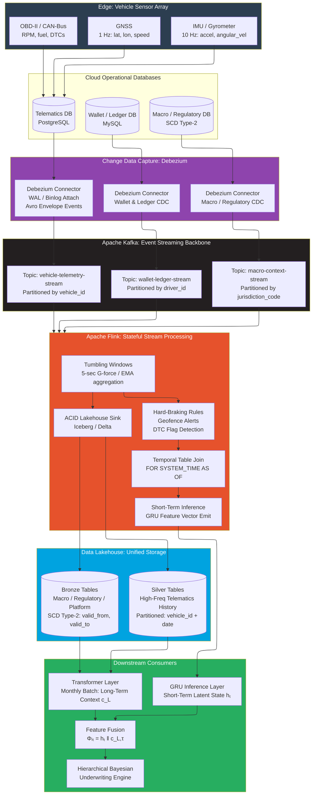
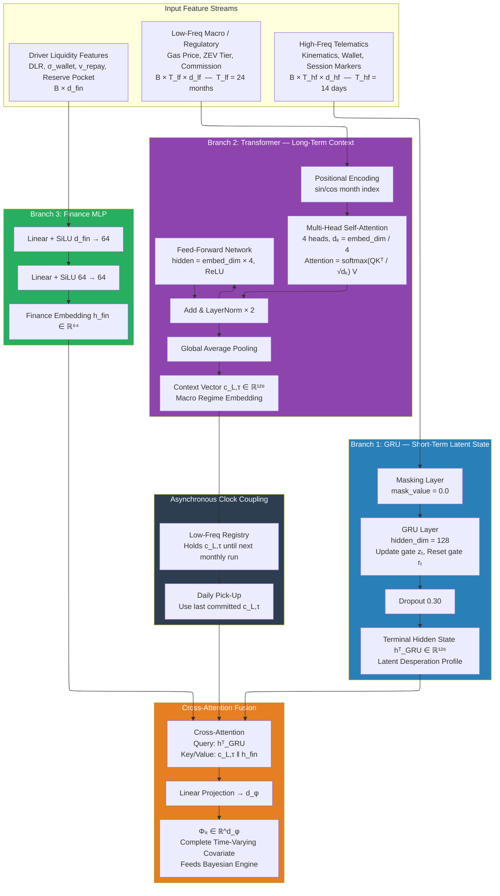

# Structural Resilience in Gig-Economy Insurtech Partnerships
*Part 2a: Streaming Data Engineering and Multi-Frequency Feature Architecture*

---

## Why Static Credit Scoring Fails the Gig Worker

A bureau score reflecting a driver's financial position three months prior carries zero predictive weight at the moment a fuel shock crosses the cash-flow suffocation boundary. A driver's net income Iₙₑₜ can fall below the subsistence threshold S within 48 hours of a platform take-rate adjustment. Static scoring has two structural failure modes that make it unsuitable for continuous underwriting in this context:

**Temporal blindness** — the score reflects state at the last bureau pull, not the moment of the credit decision. At 30-day reporting cadence, the bank is flying blind through every intra-month shock.

**Population mismatch** — bureau models are trained on salaried employment with near-Gaussian income distributions. Gig income is heavy-tailed and power-law: the majority of drivers cluster around a median, but extreme upside (surge windfall weeks) and extreme downside (mechanical failures, weather disruptions) occur far more frequently than any Gaussian model predicts. Fitting a Gaussian model to a power-law population produces a systematic underestimate of tail default risk — precisely the failure that destroys banking partner capital in a cascade event.

The architecture in this article replaces the bureau score with a **live posterior probability distribution** updated daily from a dual-regime deep learning pipeline. Two neural networks process fundamentally different temporal scales: a **Gated Recurrent Unit (GRU)** processing daily high-frequency telematics, wallet, and kinematic data; and a **Multi-Head Transformer** consuming monthly macro conditions, platform configuration changes, and regulatory regime shifts. Their outputs are fused via cross-attention into a single dense covariate vector Φᵢₜ that feeds the Hierarchical Bayesian underwriting engine in Part 2b.

---

## The Physical Data Origin: What the Vehicle Generates

Before any streaming architecture, we need to understand what the vehicle actually produces at the edge.

**IMU / Gyrometer** — tri-axial linear acceleration (aₓ, aᵧ, a_z) and tri-axial angular velocity (ωₓ, ωᵧ, ω_z: roll, pitch, yaw) at 10 Hz. Hard braking events appear as |abrake| > 0.6g sustained over 500ms. Cornering stress appears as elevated lateral G-force. Fatigue-induced lane drift appears as oscillating low-amplitude yaw at anomalous frequencies during highway segments.

**GNSS** — latitude, longitude, altitude, speed, and heading at 1 Hz. Provides GPS-verified mileage for the UBI per-kilometre premium: Premiumdaily = Basestatic + γ × MilesDriven.

**OBD-II / CAN-Bus** — engine RPM, throttle, fuel level, coolant temperature, and Diagnostic Trouble Codes (DTCs). A P0301 cylinder misfire DTC is a 72-hour leading indicator of an engine failure that will sideline the driver entirely — a precursor to default that appears in the data days before any financial signal.

A fleet of 50,000 active vehicles at 10 Hz produces approximately 30 billion raw rows per day. Polling this with periodic SELECT queries introduces multi-second latency, creates lock contention, and is constitutionally incompatible with the sub-minute underwriting update cadence required for real-time credit limit management. A fundamentally different architecture is required.

---

## The Refined Data Engineering Pipeline

The four-layer streaming architecture — Change Data Capture → Event Streaming → Real-Time Processing → Lakehouse Storage — guarantees that high-frequency telematics reach the GRU inference layer in near real time while building an immutable historical record for Transformer batch processing.

**Debezium (Change Data Capture):** Attaches directly to the PostgreSQL Write-Ahead Log (WAL) or MySQL binary log. Every committed row-level INSERT, UPDATE, or DELETE reaches the pipeline within ~50ms of transaction commit. Each event carries a dual-timestamp envelope — source commit time Tₑ and Debezium processing time Tₛ — which is critical for enforcing point-in-time correctness downstream.

**Apache Kafka:** Acts as the fault-tolerant event backbone. The `vehicle-telemetry-stream` topic is partitioned by `vehicle_id`, guaranteeing sequential ordering per driver — essential for GRU processing, which requires xₜ₋₁ to always precede xₜ. Tiered storage: 7-day hot window on NVMe SSD for low-latency GRU consumption, long-term archival on object storage for Transformer training.

**Apache Flink:** Executes four real-time operations in parallel — 5-second tumbling window aggregations (mean speed, peak G-force, hard-braking counts), hard-braking and DTC rule evaluation, asynchronous as-of temporal table joins for macro context, and ACID Lakehouse sinks via Apache Iceberg's transactional write protocol.

**Lakehouse — Silver and Bronze Tables:** Silver tables store the high-frequency Flink-windowed feature vectors, partitioned by vehicle and date — the GRU's daily input sequences. Bronze tables store macro conditions, regulatory schedules, and platform configurations as SCD Type-2 records with `valid_from`/`valid_to` columns, preserving the complete temporal history of the macro state for Transformer consumption.

---

## Point-in-Time Correctness: Eliminating Look-Ahead Bias

The greatest engineering hazard in building a retrospective underwriting model is **look-ahead bias** — allowing a historical feature to contain information not yet available at the time of the decision the model trains on. If a training record at `2024-03-15 11:30` contains a gas price index only committed to the Lakehouse at `2024-03-15 12:00` due to pipeline latency, the model learns spurious correlations that evaporate in production.

The dual-timestamp Debezium envelope enables rigorous prevention. The operational constraint for every join:

> **max(Tₛ) ≤ Thf**

A high-frequency event at time Thf may only join to low-frequency records whose system commit time Tₛ is strictly ≤ Thf. Flink's `FOR SYSTEM_TIME AS OF` SQL syntax implements this natively. When no new low-frequency record has been committed, a **Zero-Order Hold** broadcasts the last macro state unchanged until a new commitment arrives — the pipeline equivalent of the GRU/Transformer dual-rate clock: the Transformer context c_L,τ is held constant across all daily GRU cycles until a new monthly Transformer run produces c_L,τ₊₁.

**Business impact:** Every model trained on this pipeline is guaranteed to be deployable in production without overstated backtest accuracy. The backtested AUC is the production AUC. This is the single most important data engineering property for regulatory model validation under SR 11-7 and Basel IV internal model standards.

---

## Exhaustive Feature Engineering for the Gig Economy

### High-Frequency Behavioral Features (GRU Input)

**Kinematic stress signature:** Speed exponential moving averages (1-min, 5-min, 15-min trailing windows). Braking delta Δ|abrake| — change in peak braking G-force between consecutive windows. Cornering lateral G-force. Angular velocity variance (yaw oscillation — a diagnostic for fatigue-driven lane instability). DTC code presence (binary flag; any non-empty OBD-II fault code immediately alerts the underwriting engine).

**Temporal session markers:** Consecutive driving hours within the current session (reset on breaks > 30 min). Shift-start time encoded cyclically as sin(2πh/24) and cos(2πh/24) to preserve the circular topology of time. Late-night concentration ratio: fraction of trailing 7-day earnings generated between 22:00 and 05:00 — the highest-surge but highest-accident-risk window.

**Wallet transaction microfeatures:** Daily net deposit velocity (wallet balance change per hour driven). Trip-to-trip income variance within a session (high variance signals erratic demand — a DLR deterioration precursor). Daily cash-out ratio (proportion of wallet balance withdrawn within 24 hours — high values indicate the driver is living on platform earnings with no buffer).

### Low-Frequency Structural Context (Transformer Input)

Four categories of structural features affect gig-driver credit risk on timescales longer than the GRU's daily lookback window — and must be injected via the Transformer:

**Macroeconomic:** Gas price index (7-day percentage change from 30-day trailing mean — removes level effects, captures rate-of-change signal). CPI-adjusted real wage index for the driver's metro area. Central bank policy rate (affects consumer discretionary spending on ride-hailing).

**Platform configuration:** Surge dampening coefficient. Base fare floor change from prior month. New competitor market entry indicator (binary — entry of a new ride-hailing competitor compresses surge across the market almost immediately). Platform commission rate.

**Regulatory environment:** ZEV mandate transition tier (ordinal: 0 = no mandate, 1 = announced, 2 = subsidy phase, 3 = active enforcement). Gig-worker classification statute status (binary: employee vs independent contractor). Metropolitan vehicle permit utilisation rate (proxy for market saturation).

**Urban infrastructure:** Major corridor disruption indicator for geohashes where the driver earns > 30% of trips. Highway reconstruction duration in weeks — permanent earning capacity depression for affected corridors.

### Driver Liquidity and Solvency Features (MLP Input)

**Dynamic Debt-to-Liquidity Ratio (DLR):**

> **DLRᵢ(t) = (Microloan Balance + Revolving Balance + Daily IPF Premium) / 7-day Rolling Avg Net Wallet Balance**

A DLR > 1.0 defines technical cash-flow insolvency: the driver is servicing yesterday's debt with today's algorithmic ride-matching, with zero surplus. At DLR = 2.0, the driver would need twice their current trailing daily earnings just to service obligations.

**Wallet Cash Flow Volatility (σwallet):** 30-day rolling standard deviation of daily net earnings. Two drivers with identical mean earnings but different variances carry radically different cascade probabilities. High σ dramatically elevates the probability that a single bad day crosses the threshold Iₙₑₜ < S.

**Repayment Velocity (vrepay):**

> **vrepay = Principal Repaid (7d) / Scheduled Due (7d)**

Velocity < 1.0 signals cash-flow suffocation onset. Velocity > 1.0 signals overcoverage — a strong negative PD signal. A decelerating velocity trend (was > 1.0, trending toward < 1.0 over consecutive windows) is the single strongest leading indicator of impending cascade onset.

**Time Since Last Delinquency — Exponential Recency Decay:**

> **Recency weight = e^(−λ × ΔT)**

where ΔT is days since last delinquency and λ = 0.01, calibrated to the empirical half-life of delinquency recurrence in microloan cohort survival analysis. Combined with a binary ever-delinquent indicator — the decay captures recency, the indicator captures permanent credit history.

**Reserve Pocket Balance Rᵢ(t):** As a fraction of total outstanding liability. A depleting reserve (fraction declining toward zero) signals the driver is drawing the emergency buffer and has no remaining cushion. Feeds directly into the Bayesian engine as a tail-risk signal.

### The Four Gig-Economy Specific Interaction Effects

Standard credit models use generic interaction terms. These four encode structural economic relationships specific to the gig-economy context:

1. **High revolving utilisation (Uᵢ > 0.80) × prior delinquency indicator** — captures adverse utilisation trap onset. A previously delinquent driver at 85% utilisation is not merely at elevated risk; they are likely already inside the cascade mechanism.

2. **Platform commission increase event × high DLR** — models the non-linear amplification of platform take-rate changes on marginal drivers. A driver at DLR = 0.90 who experiences a 3% commission increase may cross DLR = 1.0 instantly.

3. **Late-night driving concentration × microloan arrears** — the "desperation driving" profile: a driver who has shifted to late-night high-surge hours specifically because they are behind on payments. Maximum short-term earnings at maximum personal risk, with zero remaining behavioural flexibility.

4. **ZEV mandate deadline proximity × ICE vehicle ownership** — models the forced capital expenditure diverting repayment cash flow. As transition deadlines approach, ICE owners face accelerating depreciation, compliance costs, and potential platform deactivation notices.

---

## The Dual-Regime Neural Architecture

### Branch 1: GRU — Encoding the Desperation Profile

The GRU processes the telematics sequence x₁, …, xₜ_hf one step at a time, updating hidden state hₜ through three gates:

> **Update gate:** zₜ = σ(Wz xₜ + Uz hₜ₋₁ + bz) — how much of the past to carry forward

> **Reset gate:** rₜ = σ(Wr xₜ + Ur hₜ₋₁ + br) — how much of the past to discard

> **Candidate state:** h̃ₜ = tanh(Wh xₜ + Uh(rₜ ⊙ hₜ₋₁) + bh)

> **Final state:** hₜ = (1 − zₜ) ⊙ hₜ₋₁ + zₜ ⊙ h̃ₜ

The terminal hidden state hᵀ_GRU ∈ ℝ¹²⁸ is the compressed representation of the driver's short-term behavioural trajectory — the **latent desperation profile**. When a driver is accumulating consecutive driving hours, experiencing declining wallet velocity, and showing elevated braking G-forces simultaneously, the GRU's update gate learns to suppress the reset of relevant state dimensions — carrying the compounding distress signature forward across multiple days.

GRUs are preferred over LSTMs here for three reasons: fewer learnable parameters (2 gate matrices vs 3), lower per-step inference latency (critical for sub-minute SLA at credit API gateways), and equivalent empirical performance on bounded-horizon sequence tasks.

### Branch 2: Transformer — Encoding the Macro Regime

The Transformer processes all 24 monthly macro tokens simultaneously via self-attention — no sequential bottleneck, no vanishing gradient over long sequences. The scaled dot-product attention:

> **Attention(Q, K, V) = softmax(QKᵀ / √dₖ) × V**

The √dₖ scaling term prevents dot-product magnitude from growing with embedding dimension, which would push softmax into saturation and kill gradients. With H = 4 parallel heads, each head specialises on different dependency structures: one head may track platform commission regime changes, another ZEV mandate escalation trajectories, another fuel price cyclical patterns.

Global average pooling over the 24-month token sequence produces a single dense context vector c_L,τ ∈ ℝ¹²⁸. This vector is held in the **low-frequency registry** until the next monthly Transformer run — the Zero-Order Hold mechanism that decouples the expensive monthly Transformer computation from the daily GRU inference cycle.

### Branch 3: Finance MLP and Cross-Attention Fusion

The driver liquidity features (DLR, σwallet, vrepay, reserve pocket ratio) pass through a two-layer MLP with SiLU activations — chosen over ReLU because SiLU preserves gradient information near zero, which is essential for the smooth distress boundaries that characterise the DLR and vrepay features.

**Cross-attention fusion** resolves the limitation of naive concatenation (Φᵢₜ = hᵀ_GRU ‖ c_L,τ ‖ hfin). Concatenation treats all streams as equally weighted and models no cross-stream interaction. Cross-attention uses hᵀ_GRU as the **Query** and [c_L,τ ‖ hfin] as **Keys and Values**: the GRU asks "given my current behavioural state, which structural factors are most relevant?" The attention mechanism amplifies macro-structural context precisely when the behavioural state signals imminent cascade onset — DLR > 1.0 during a detected fuel spike gets a very different attention weight than DLR > 1.0 during a macro-stable period.

The result, Φᵢₜ ∈ ℝ^d_φ, is the complete time-varying covariate vector — the input to the Hierarchical Bayesian Logistic Regression engine in Part 2b.

---

## Handling Missing Data: MNAR is a Risk Signal

Low-frequency credit streams are subject to **Missing Not At Random (MNAR)** patterns. A driver who has intentionally avoided credit bureau reporting to conceal prior debts is not randomly missing — the absence is itself a risk signal. Standard mean-substitution artificially compresses risk variance and masks this signal.

Three strategies handle MNAR in this architecture:

**Strategy A — Learned Masking Tokens:** For every feature xₖ, a binary indicator mₖ ∈ {0, 1} is appended. Both pass through the Transformer's input projection: zₖ = Wₓ xₖ + Wₘ mₖ. The model learns independent projection weights Wₘ for missingness — converging to a penalised attention weight that explicitly encodes the risk signature of intentional data concealment.

**Strategy B — Bayesian Generative Imputation:** Missing variables are treated as unknown parameters with a hierarchical prior from the driver's geographic cohort j: Xmissing,j ~ 𝒩(μ_γj, σ²_γj). Uncertainty of the missing value propagates fully into the posterior PD distribution — a driver with missing bureau data gets a wider credible interval, which automatically triggers the Uncertainty Kill-Switch (Part 2b) compressing credit limits until data arrives.

**Strategy C — Decoupled Multi-Engine Cascade:** Three pre-trained engine configurations (Full, Behavioral-Only, Macro-Only) are maintained simultaneously. A real-time data quality router hot-swaps the active inference engine based on available stream completeness, generating automatically more conservative PD estimates during infrastructure outages.

---

## Business Impact: What This Architecture Delivers

For **credit risk teams**: the daily posterior update cycle converts the underwriting function from a quarterly scorecard review into a continuous monitoring operation. Deteriorating DLR, decelerating repayment velocity, and rising late-night driving concentration are flagged 10–21 days before a first missed payment — a window wide enough to trigger assistive interventions before the cascade detonates.

For **data engineers**: the Debezium → Kafka → Flink → Iceberg pipeline is the industry standard for sub-second CDC-based streaming. The architecture described here is not bespoke — it is the same stack used by fintech scale-ups globally, deployable on any major cloud provider and maintainable by standard data engineering teams.

For **model risk managers**: dual-timestamp point-in-time correctness eliminates the most common cause of backtest-to-production performance collapse. Every model trained on this pipeline is production-safe by construction.

---

*Part 2b develops the Hierarchical Bayesian Logistic Regression layer that converts Φᵢₜ into a full posterior probability distribution over default — with explicit credible intervals, partial pooling across driver clusters, Clayton Copula joint tail risk quantification, and five exhaustive posterior predictive checks.*
