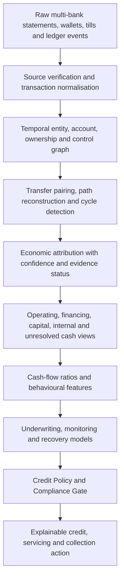

# Before the Ratio: Entity-Resolved Cash Flow for Credit Underwriting

## Extending *Underwrite for Collection* from account movement to sustainable repayment evidence

**By Nevil Maloba**

**Industry article | 15 September 2026**

> A cash-flow ratio is only as credible as the economic identity and transaction paths beneath its numerator.

My first article, *Underwrite for Collection*, argued that credit should be designed backward from sustainable collection. It connected product structure, underwriting, monitoring, fair intervention, recovery, expected credit loss, capital and funding. Its central proposition was simple: a loan is not successfully underwritten merely because it was approved and disbursed. It is successfully underwritten when its structure and continuing management support repayment from sustainable cash flow.

That argument raises a prior question. What, exactly, counts as the borrower's cash flow?

This question becomes difficult when an MSME operates through several bank accounts, mobile-money wallets, tills, payment aggregators and related businesses. A lender may receive a perfectly authentic bank statement showing a large credit. The payment may have settled before the review date. The account balance may be available for use. Yet none of those facts, by themselves, establishes that the credit was new operating income earned by the enterprise.

It could be a transfer from another account controlled by the same proprietor. It could be a loan drawdown, owner capital, an insurance or tax refund, a reversal of an earlier debit, a settlement sweep from a merchant till, or money temporarily routed through the account by a related party. It could also be a legitimate customer payment from a related company. The objective is to recognise this legitimate complexity and determine which economic explanation is sufficiently supported for the intended credit decision.

This is where cash-flow underwriting must mature. Transaction data should not move directly from statement ingestion into ratios and artificial-intelligence models. It first needs an economic cash provenance and entity-resolution layer. That layer asks who or what generated the flow, which accounts and entities are connected, how the money moved, whether the path recycled earlier funds, what economic class best describes the transaction and how confident the institution is in that conclusion.

The practical sequence becomes:

This extension makes cash-flow lending more credible. It gives lenders a constructive answer to a recurring problem: a ratio can be mathematically flawless and still economically misleading because its inputs describe account traffic rather than enterprise performance.

## 1. The week before the review

Consider a small distributor whose lender reviews the latest ninety days of transaction history. The final week contains several unusually large deposits. A conventional cash-flow engine may interpret the deposits as accelerating sales, improving debt-service coverage and supporting a higher limit.

The deposits have cleared. They are not fabricated statement entries. Their timestamps precede the credit decision. At the level of data engineering, they are point-in-time correct.

A wider view shows that one deposit originated from another bank account owned by the same proprietor. A second came from a related enterprise that received a similar amount from the borrower two days earlier. A third was a new loan from another provider. A fourth was a genuine payment from a longstanding customer. A fifth was settlement from a payment aggregator covering dozens of retail transactions completed during the previous week.

Each amount increased the reviewed account balance. Their economic meanings are different.

The customer's payment and aggregator settlement may support operating revenue, subject to reversal, refund and duplication controls. The intra-owner transfer consolidates liquidity but should not be counted again as new sales if its source was already observed. The new loan increases near-term cash and debt simultaneously. The related-party round trip may require clarification before it affects an affordability ratio. None should disappear from the ledger. They should enter different analytical views.

This example reveals the distinction between four questions:

1. **Did the transaction occur?** Source authentication, statement integrity and ledger reconciliation address this.
2. **Was the money settled and available?** Payment status and account controls address this.
3. **What economic event does it represent?** Entity resolution, path reconstruction and classification address this.
4. **How should that event affect a particular decision?** The approved feature, model and policy contract address this.

Many architectures answer the first two questions well and assume the third. That assumption flows into the fourth as if it were observed truth.

The problem is not limited to intentional manipulation. MSME financial lives are genuinely entangled. Proprietors move funds among personal and business accounts because payment channels, supplier relationships, taxes, family obligations and working-capital needs do not align neatly. Merchant settlements arrive net of charges. Platforms batch transactions. Groups centralise procurement. Customers pay the wrong entity and balances are reallocated. A useful architecture must recognise this operating reality while preserving the distinction between observable facts and inferred economic meaning.

## 2. Settlement finality is necessary, but it is not economic provenance

A lender must know whether a payment was initiated, settled, allocated, reversed or made available. These states matter for collections, cash forecasting and expected credit loss. A promise to pay is not cash. A payment instruction is not a settled receipt. A settled receipt may still be reversed or legally restricted. A collection deposited into a controlled account may have different availability from a payment sitting with an intermediary.

Yet settlement status cannot answer whether the amount was operating income.

Suppose KSh500,000 arrives in an enterprise account and remains available. For liquidity management, the cash exists. For revenue analysis, its treatment depends on origin and purpose. If it is a three-month working-capital loan, counting it as revenue inflates the apparent capacity that justified the borrowing while ignoring the liability created by the same transaction. If it is owner capital, it may strengthen loss absorption but says less about recurring sales. If it is a transfer between observed accounts, including it in both accounts' inflow totals double counts one economic amount. If it is a genuine invoice payment, it may represent recurring operating capacity, although concentration and payment regularity still matter.

This distinction should shape the feature contract. A measure called “total inflow” can remain a descriptive account measure. A measure called “eligible operating inflow” should require evidence that the amount represents external operating cash, has not already been counted through another rail, and meets the institution's approved classification and confidence rules.

One useful decomposition is:

**Observed credits = external operating receipts + financing inflows + owner or investor capital + internal transfers + refunds or reversals + exceptional receipts + unresolved amounts**

The components answer different questions. Financing and owner capital can improve immediate liquidity. They should not be silently treated as recurring turnover. Internal transfers can show liquidity concentration and treasury behaviour. They should not manufacture revenue. Exceptional receipts may be real and available but weak predictors of normal repayment capacity. Unresolved amounts should remain visible and affect confidence rather than being forced into a favourable or adverse class.

Underwriting therefore needs at least three linked cash views:

- **Operating cash view:** externally generated receipts and operating payments, adjusted for duplicates, reversals and defined exceptions.
- **Liquidity view:** cash legally and operationally available to meet obligations, regardless of whether it arose from operations, financing or capital.
- **Financing and capital view:** borrowings, owner injections, investor funds, distributions and debt service, retained so that liquidity is interpreted alongside the claims created against it.

This is more informative than one universal “cash flow” field.

## 3. An account is not the economic entity

Cash-flow underwriting often begins with an account because that is what a bank or aggregator can observe. The risk, however, usually belongs to a borrower, enterprise, facility or connected economic group. Those objects do not always map one-to-one.

A sole proprietor may use a personal account for business receipts. A registered company may operate multiple tills and bank accounts. A business group may divide sales, inventory and payroll across legal entities. A digital platform may settle several merchants through one pooled account. A borrower may have legitimate relationships with relatives, directors, suppliers and affiliated businesses. The same phone number, device, address or director can connect records without proving common economic control.

Entity resolution is the discipline of matching and reconciling records that refer to the same real-world object. The literature covers rule-based matching, pairwise classification, clustering and richer relational or probabilistic approaches [2]. In credit, the relevant extension is temporal: ownership and control can change, accounts can open or close, signatories can be added, and a relationship that was valid last year may not be valid on the decision date.

The architecture therefore needs a temporal graph. Its nodes can include:

- borrower persons and legal entities;
- beneficial owners, directors and authorised signatories;
- bank accounts, wallets, tills and merchant identifiers;
- loan facilities and repayment mandates;
- counterparties, customers, suppliers and related entities;
- invoices, settlements, transfers, refunds and reversals;
- devices, addresses and contact identifiers where lawful and necessary.

Its edges can represent:

- legal ownership or control;
- authorised access;
- payment from and payment to;
- settlement aggregation;
- facility liability or guarantee;
- invoice or contract relationship;
- observed account transfer;
- asserted, verified or inferred association.

Every material edge should have an effective period, evidence source, confidence, verification status and purpose restriction. This avoids treating a graph as timeless truth. It also supports reproducibility: the lender can reconstruct which relationships were known and approved when a decision was made.

International risk-data principles emphasise integrated taxonomies, consistent identifiers, reconciliation and the ability to aggregate exposures accurately [3]. The principle is relevant even when implementation is proportionate to a smaller lender. A unified identifier does not require centralising every raw transaction. It requires a governed method for knowing when two records refer to the same credit object and when they remain uncertain.

Ownership information deserves particular care. Beneficial ownership and control records can help identify related exposures and connected counterparties, while FATF guidance emphasises adequate, accurate and up-to-date information about the true owners of legal persons [5]. Credit use should remain purpose-specific. A related-party link establishes a relationship that may change how a flow, exposure or concentration is interpreted; its economic meaning comes from the supporting transaction and business evidence.

## 4. Follow the path, not only the transaction label

Bank statements and payment feeds often provide descriptions, transaction codes and counterparty text. These are useful evidence, but labels are not economic proof. A credit marked “sales” could be a manual narrative. A transfer code may conceal the merchant settlements aggregated behind it. A reversal may arrive through a separate entry. The same economic transfer may appear differently across banks.

Path analysis asks where the money came from, where it moved next and whether connected observations describe one economic event or several.

Three patterns illustrate its value.

**Transfer pairing.** If KSh100,000 leaves one account controlled by the borrower and KSh99,970 reaches another shortly afterward, with KSh30 charged as a fee, the system can propose an internal-transfer pair. The evidence may include amount tolerance, temporal proximity, sender and receiver ownership, channel, reference text and subsequent reconciliation. Once approved, the movement remains visible in liquidity analysis but is counted once in consolidated inflow.

**Settlement decomposition.** A KSh250,000 credit from a payment aggregator may represent hundreds of customer payments less fees, refunds and reserves. The statement entry alone is concentrated. The underlying settlement report may demonstrate diversified operating receipts. The model should preserve both layers: one bank credit and the economic transactions it settles.

**Cycle detection.** Funds can travel from Enterprise A to a proprietor's wallet, into Enterprise B, through a payment account and back to Enterprise A. A cycle does not prove misconduct. It may reflect centralised purchasing, treasury concentration, refund correction or temporary support. It does show that gross credits across the participating accounts overstate new external cash unless the system distinguishes the original source, intermediate movements and final use.

Path reconstruction should combine deterministic and probabilistic methods. Exact references, controlled account identifiers and known settlement reports support deterministic matches. Amount and time tolerances, counterparty similarity and graph context can support probabilistic candidates. High-impact uncertain matches should be reviewable. The output should include a classification and a reasoned confidence, not a hidden binary verdict.

This is particularly important for multiple banks. No single provider may see the entire path. A bank-controlled research sandbox, consented data-sharing arrangement or borrower-supplied multi-account evidence may enable a consolidated view without making unrestricted raw data available across institutions. Where the evidence remains incomplete, the architecture should state that limitation through coverage and unresolved-value metrics.

## 5. Classify economic purpose without pretending to know intent

The classification taxonomy should be economically useful and operationally modest. It should describe the supported purpose of a flow, not speculate about a customer's motive.

A workable first taxonomy includes:

| Cash class | Typical examples | Primary analytical use |
|---|---|---|
| External operating | Customer receipts, verified merchant settlement | Turnover, margin, recurring repayment capacity |
| Operating outflow | Inventory, payroll, rent, utilities, tax | Working-capital cycle and residual liquidity |
| Financing | Loan drawdown, overdraft funding, debt repayment | Leverage, liquidity and debt-service burden |
| Capital or owner | Equity injection, proprietor contribution, distribution | Support, capital dependence and withdrawal behaviour |
| Internal transfer | Movement among resolved accounts of the same unit | Consolidation, liquidity location and double-counting control |
| Refund or reversal | Chargeback, returned payment, correction | Net cash and transaction finality |
| Exceptional | Asset sale, grant, insurance proceeds | One-off liquidity and scenario analysis |
| Unresolved | Insufficient evidence or conflicting classification | Coverage, sensitivity and review |

Related-party transactions need a second dimension rather than automatic exclusion. A sale to an affiliated distributor can be genuine operating revenue. A transfer from a director can be financing or capital. A round trip can be an internal movement. The system should represent both the relationship and the economic class.

Classification may use account codes, transaction narratives, counterparty registries, invoice links, settlement files, regular patterns and graph context. Artificial intelligence can assist by learning from sequences and text, but material classes require governance, benchmark rules and review samples. A model's probability is evidence about classification, not a licence to relabel cash invisibly.

The institution should monitor class-level precision, recall, stability and monetary error. A rare misclassification of a small receipt may be immaterial. A small number of misclassified large financing inflows can materially distort a portfolio. Validation should therefore be value-weighted as well as event-weighted.

## 6. Put uncertainty inside the ratio

The usual response to uncertain data is either to discard it or to choose one label. Both lose information. A better approach preserves the unresolved amount, the confidence attached to each proposed class and the effect of plausible reclassification on the credit decision.

Let cⱼ be credit transaction j, pⱼ be the approved probability or confidence that it is eligible operating cash, and aⱼ indicate that it is available before the decision cutoff. A confidence-weighted operating-inflow estimate can be written in Unicode as:

**Eligible operating inflow = Σⱼ aⱼ pⱼ cⱼ**

This is not a universal accounting definition. It is a governed analytical estimator. The institution can also calculate conservative and inclusive bounds:

**Lower operating inflow = sum of verified eligible receipts**

**Upper operating inflow = lower operating inflow + unresolved receipts that could plausibly qualify**

An affordability or collection feature should then expose the range. Eligible receipts are an input to repayment capacity, not the final debt-service numerator. First derive cash available for debt service after operating cash costs and taxes, with an explicit working-capital and necessary-investment convention. When using settled cash receipts and payments, do not deduct a working-capital movement already represented by those flows. Uncertainty in material outflows belongs in the bounds too. Match the economic entity, currency and period to scheduled principal and interest, and state any contractual adjustments. This uses the cash-availability principle described in the World Bank's project-finance guidance [7], adapted here as a declared MSME analytical convention.

**Debt-service coverage range = [lower cash available for debt service ÷ scheduled debt service, upper cash available for debt service ÷ scheduled debt service]**

The expression assumes a common, positive debt-service denominator. If contractual payments are uncertain, evaluate matched cash-flow scenarios; a period with no scheduled debt service needs a cash-surplus measure rather than division by zero.

If the policy outcome changes across that range, classification uncertainty is decision-material. The case may need additional evidence, a lower initial limit, a shorter review interval or human assessment. If the decision is stable across the range, the unresolved amount may not justify delay.

Useful provenance diagnostics include:

- resolved-account coverage as a share of declared operating accounts;
- verified external operating cash as a share of total observed credits;
- unresolved credit value as a share of gross credits;
- internal-transfer value and number of paired transfers;
- circular-flow value and maximum cycle length;
- related-party operating exposure;
- financing-inflow dependence;
- settlement-feed reconciliation rate;
- classification confidence by economic class;
- sensitivity of the decision to plausible reclassification.

These diagnostics should not become crude reasons to exclude thin-file businesses. Some MSMEs will naturally have low digital coverage or mixed personal and business use. The architecture can respond through smaller limits, alternative evidence, staged graduation and review. Uncertainty should change the confidence and conditions of a decision, not be confused with adverse intent.

## 7. Behavioural scoring begins after the trust layer

Once economic cash views are established, familiar behavioural features become more credible. Earnings velocity can measure the change in eligible operating receipts rather than the movement of all account credits. Cash-flow asymmetry can compare verified inflow and outflow patterns. Debt-to-liquidity can distinguish available financing from recurring cash generation. Wallet volatility can be calculated across consolidated, non-duplicated flows. Repayment velocity can connect actual allocated payment to due amounts and prior interventions.

Artificial-intelligence neural embeddings can then study residual sequence information that explicit variables do not capture. The same discipline developed in *Underwrite for Collection* still applies: explicit features should have one canonical owner; neural representations should be cross-fitted and tested for incremental contribution; overlapping explicit information can be residualised from the neural block; shrinkage can control a high-dimensional residual representation; and the final score should be validated across time, segments and operating regimes.

Advanced modelling begins with a credible numerator. A hierarchical Bayesian logistic model can estimate product, platform, geographic and cohort differences while sharing information across sparse groups. P-splines can capture nonlinearities. Survival challengers can estimate when deterioration may occur. Causal models can test whether an intervention improves payment. Each method draws its economic meaning from the evidence passed to it.

The provenance layer therefore belongs before the inference layer, while its quality metrics travel with the evidence object. The underwriting model can include a missingness or coverage effect, and the policy layer can restrict actions when material flows remain unresolved. This preserves the separation among data quality, economic inference and policy.

## 8. Continue the chain from underwriting to collection

The provenance problem does not end at approval. Collections teams also need to know what generated a payment, whether it settled, whether it was retained, which obligation received the allocation and whether it represented sustainable cure.

A borrower may clear arrears using another short-term loan. The cash is real and the account may technically cure. The event does not demonstrate restored operating capacity. A payment from recurring customer receipts provides different evidence from a liquidation of productive inventory. A one-off owner injection may justify a cure classification while also triggering closer monitoring of the business's continuing cash generation.

This distinction improves lifecycle states:

- **Payment initiation** records an attempt.
- **Settlement** records final movement under the payment rail.
- **Allocation** records the contractual obligation reduced.
- **Economic source** records the supported origin of the cash.
- **Cure** records compliance with the approved arrears rule.
- **Durable cure** records continued performance across the governed observation horizon.

It also improves treatment evaluation. If an intervention is intended to restore payment from business cash flow, its outcome should distinguish operating recovery from refinancing. A randomised or quasi-experimental pilot can compare net cash, re-default, complaints and business continuity, while stratifying or adjusting for the source of cure cash. This keeps the institution from declaring success because arrears moved temporarily to another lender.

Recovery modelling benefits in the same way. Gross recovery cash should be linked to source, time, direct workout cost, legal restriction and reversals. A guarantee payment, collateral realisation, customer payment and debt sale can all reduce loss, but they have different timing, cost and repeatability. Net recovery value remains the correct economic focus.

## 9. Carry provenance into finance, Treasury and risk transfer

Expected credit loss measures discounted expected cash shortfalls. Treasury manages liquidity and funding based on contractual and behavioural cash flows. A ring-fenced receivables-finance vehicle allocates realised collections through controlled accounts and a waterfall. Each process needs accurate settlement data, but each also needs to understand the economic source and durability of cash.

The distinction is practical. A large financing inflow may strengthen today's liquidity while increasing tomorrow's debt service. Internal transfers can change which account holds cash without improving consolidated liquidity. Owner support may protect a junior tranche but may not recur in stress. An aggregator settlement may look concentrated at the bank-entry level while representing diversified retail customers underneath. A related-party receipt may create concentration even when it qualifies as genuine operating revenue.

For expected credit loss, provenance can improve forecasts of cure, modification, re-default, recovery amount and recovery timing. For economic capital, a resolved graph can reveal common ownership, platform, geography, supply-chain or funding dependencies that create correlated loss. For Treasury, contractual cash-flow ladders can be complemented by recognised behavioural assumptions only after the data, provenance and validation gates are satisfied.

For a ring-fenced special-purpose vehicle, eligible purchased receivables should be linked to authoritative originator records, controlled collection accounts and reconciled payment allocations. Investor reporting should distinguish scheduled cash, customer collections, recoveries, support payments, reserve movements and new financing. A waterfall can allocate only the cash that exists, but its risk interpretation depends on where that cash came from and whether it can recur.

BCBS 239's concern with accuracy, completeness, timeliness and adaptability remains relevant to this chain [3]. Its 2026 implementation work reinforces that effective risk-data aggregation remains an active supervisory concern rather than a completed technology project [4]. The proportionate lesson is not that every fintech must reproduce the infrastructure of a global bank. It is that any material risk number should be traceable through consistent identities, reconciled sources, transformations and controls.

## 10. Design a governed human route

Some cases will remain ambiguous. The right response is not to hide uncertainty inside a score or to accuse the borrower. It is to create a governed review route.

A reviewer should see the proposed entity matches, transaction paths, evidence sources, classification alternatives, confidence and decision sensitivity. The interface should explain why a flow was paired or flagged. Reviewers should be able to confirm, reject or defer a classification using controlled reason codes. Their decisions should feed quality monitoring and model improvement without becoming unexamined labels.

The borrower may be able to provide an invoice, settlement report, contract or explanation. Requests should be proportionate to decision materiality. A KSh2,000 unresolved transfer should not create the same burden as a KSh2 million receipt that changes the approved limit. Repeated requests for evidence can itself become a barrier to access, so the institution should measure review time, abandonment, correction rate and segment impact.

Data protection must remain integral. Kenya's Data Protection Act establishes principles including lawful, fair and transparent processing, purpose limitation, data minimisation and accuracy [6]. Entity and relationship data should therefore be collected for defined purposes, protected through access controls and retention rules, and exposed only to roles that require it. The system should separate verified facts from inferred links and preserve meaningful human intervention where a material automated decision is contested.

## 11. A practical implementation path

The first stage is definitional. Agree the economic entity, account, counterparty, facility, transaction and cash-class definitions. Decide which accounts can be consolidated, how ownership and control are evidenced, which transaction types remain visible but excluded from operating inflow, and how unresolved amounts affect decisions. Establish a joint forum involving credit, collections, finance, Treasury, data engineering, compliance, operations and model risk.

The second stage is observational. Inventory data sources and coverage. Reconcile bank statements, mobile-money feeds, tills, aggregator settlements, loan ledgers and general-ledger events. Preserve effective time, processing time, source time and decision time. Build deterministic account and facility identifiers before introducing probabilistic matching.

The third stage is relational. Construct the temporal entity graph in a bank-controlled or equivalently governed environment. Begin with verified legal ownership, account control, facility liability and direct transfer relationships. Add probabilistic candidate links only where they materially improve coverage and can be validated. Measure false merges and false splits, not only aggregate accuracy. A false merge can incorrectly combine independent businesses; a false split can double count one enterprise or miss connected exposure.

The fourth stage is transactional. Implement transfer pairing, settlement decomposition, reversal linkage and cycle detection. Retain every underlying event and attach the proposed economic-event identifier. Test across payment channels, fees, batch settlements and delayed posting. Reconcile consolidated cash to source accounts.

The fifth stage is analytical. Create operating, liquidity, financing, capital, internal and unresolved cash views. Publish coverage and confidence metrics beside ratios. Recalculate existing cash-flow features and compare decisions with the former account-level method. Investigate changes by product, sector, business size, geography and data coverage.

The sixth stage is experimental. Run the new layer in shadow mode. Ask whether it improves out-of-time default calibration, collection forecasts, cure interpretation and reviewer consistency. Use matched or randomised workflows where possible to evaluate whether requests for additional evidence improve decisions enough to justify their cost and burden.

The seventh stage is operational. Introduce policy thresholds for unresolved value, related-party concentration and decision sensitivity. Establish manual review, override, customer explanation, model monitoring and rollback. Version the graph, classification model, rule set and feature definitions. Production scoring should retrieve an approved evidence object; it should not rebuild entity resolution through uncontrolled real-time logic.

The eighth stage is institutional. Feed realised classification outcomes back into collections, expected credit loss, capital, Treasury and receivables-finance reporting. Report not only model performance, but identity coverage, classification error by value, unresolved cash, decision reversals, customer burden and downstream reconciliation breaks.

## Conclusion

*Underwrite for Collection* began with a lifecycle proposition: credit should be designed around sustainable repayment and realised, risk-adjusted cash. This follow-on argument moves one step upstream.

Before a lender calculates a cash-flow ratio, it should know which economic entity the ratio describes. Before it treats a deposit as income, it should understand the transaction path and economic class. Before an artificial-intelligence model learns from a sequence, the institution should know whether the sequence contains duplicated transfers, financing proceeds, reversals or unresolved flows. Before a Treasury forecast or SPV waterfall relies on behavioural collections, the underlying cash should be reconciled, available and economically interpretable.

The practical answer is a governed evidence architecture that separates occurrence, settlement, identity, provenance, inference and policy. It uses only purpose-relevant evidence, permits uncertainty, exposes its materiality and creates a human route where evidence remains incomplete.

The resulting credit sequence is more demanding, but also more honest:

> Resolve the economic entity. Reconstruct the transaction path. Classify the cash with disclosed confidence. Then calculate the ratio, estimate risk and choose the action.

That is how cash-flow underwriting moves from reading statements to understanding the economic system that must ultimately repay the loan.

## References

[1] N. Maloba, “Underwrite for Collection: Rebuilding credit architecture around sustainable cash recovery,” *SokoIntel Platform*, 2026. [Online]. Available: https://sokointel-platform-production.up.railway.app/read/ambc-02/. [Accessed: Sep. 15, 2026].

[2] L. Getoor and A. Machanavajjhala, “Entity resolution: Theory, practice and open challenges,” *Proceedings of the VLDB Endowment*, vol. 5, no. 12, pp. 2018-2019, Aug. 2012, doi: 10.14778/2367502.2367564.

[3] Basel Committee on Banking Supervision, *Principles for Effective Risk Data Aggregation and Risk Reporting*. Basel, Switzerland: Bank for International Settlements, Jan. 2013. [Online]. Available: https://www.bis.org/publications/201301-guidelines-principles-effective-risk-data-aggregation-and-risk-reporting. [Accessed: Sep. 15, 2026].

[4] Basel Committee on Banking Supervision, “Implementation of the Principles for effective risk data aggregation and risk reporting,” Bank for International Settlements, Jan. 2026. [Online]. Available: https://www.bis.org/publications/implementation-principles-effective-risk-data-aggregation-and-risk-reporting-bcbs-239-principles. [Accessed: Sep. 15, 2026].

[5] Financial Action Task Force, *Guidance on Beneficial Ownership of Legal Persons*. Paris, France: FATF, Mar. 2023. [Online]. Available: https://www.fatf-gafi.org/en/publications/Fatfrecommendations/Guidance-Beneficial-Ownership-Legal-Persons.html. [Accessed: Sep. 15, 2026].

[6] Republic of Kenya, *Data Protection Act*, No. 24 of 2019. [Online]. Available: https://new.kenyalaw.org/akn/ke/act/2019/24/eng@2019-11-15. [Accessed: Sep. 15, 2026].

[7] World Bank, “Key Issues in Developing Project Financed Transactions,” § “Debt Service Cover Ratio (DSCR),” *Public-Private Partnership Legal Resource Center*. [Online]. Available: https://ppp.worldbank.org/print/pdf/node/3537. [Accessed: Sep. 28, 2026].
