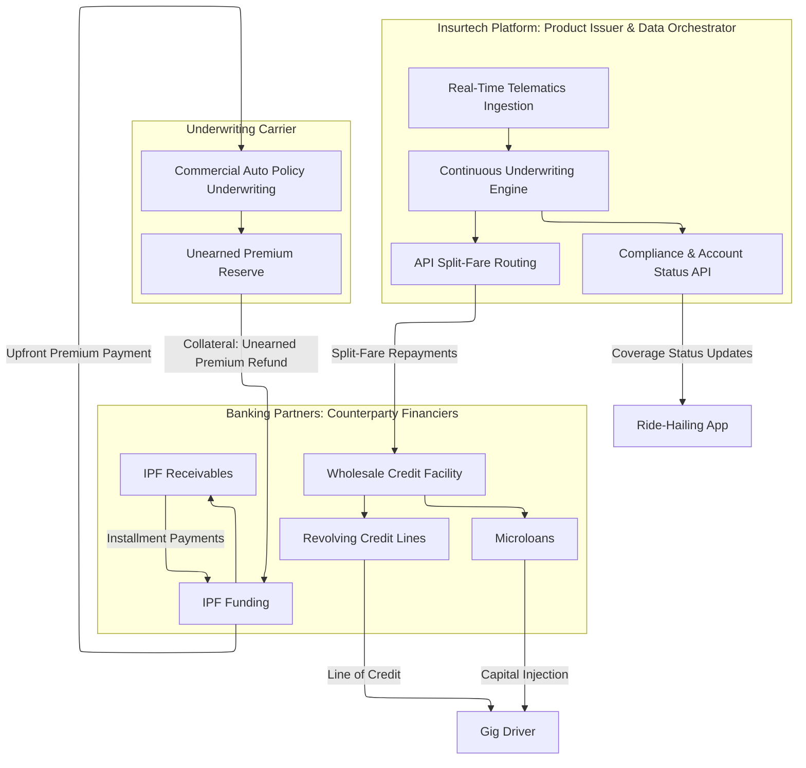
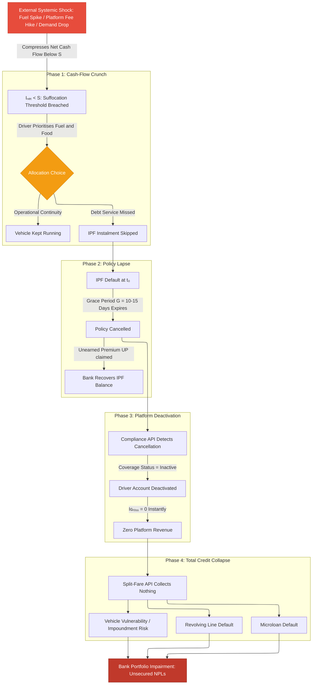
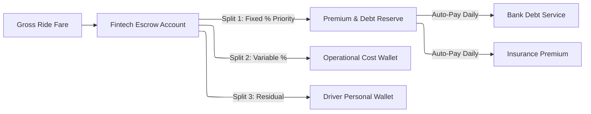
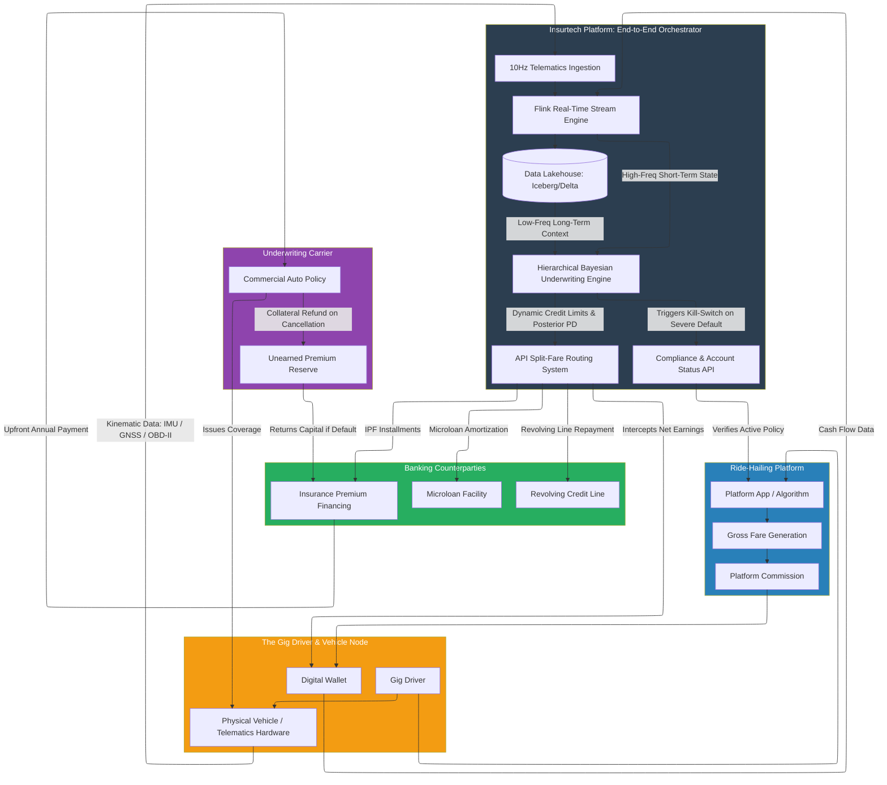

# Structural Resilience in Gig-Economy Insurtech Partnerships
*Part 1: Architecture of the Insurtech Product, Multi-Product Capital Stack, and the Default Cascade*

---

## The Gig Driver as a Unified Asset Class: Why Traditional Credit Fails Here

In traditional consumer finance, risk underwriting rests on a comfortable structural assumption: borrowers are diversified. A salaried employee's mortgage, auto loan, and credit card are each backed by an employer, a physical asset, and discretionary income: three independent pillars. Stress one, the others hold. For the gig-economy driver, this entire paradigm collapses.

The gig driver is what we call a **unified asset class**: a single economic entity whose entire capacity to service debt is concentrated in one place: an active platform account on a ride-hailing or delivery application. Income, insurance, debt repayment, and operational continuity are not separate domains. They are a single, indivisible cash-flow chain running through one digital node.

The financial consequence is severe. Net daily income for a gig driver can be expressed as:

> **Iₙₑₜ = Iɢᵣₒₛₛ × (1 − τ) − Cₒₚₛ − r × Iɢᵣₒₛₛ**

Where τ is the platform commission rate, Cₒₚₛ is daily operating cost (fuel, wear, levies), and r is the automated split-fare debt repayment rate. The **cash-flow suffocation boundary**: the threshold at which the driver cannot meet basic subsistence needs S: is reached when:

> **Iɢᵣₒₛₛ × (1 − τ − r) − Cₒₚₛ < S**

Once this inequality holds, every automated debt deduction happens *before* the driver eats. The split-fare payment is constitutionally senior to basic survival. This is not a behavioural failure: it is a structural arithmetic certainty whenever gross earnings compress, operating costs spike, or both simultaneously.

Understanding this suffocation boundary is the foundation of everything else. It is the trigger for the default cascade, the rationale for the Bayesian underwriting engine, and the justification for every assistive intervention described across this series.

---

## The Triple-Product Capital Stack

The embedded finance partnership deploys three distinct financial products against this single cash-flow engine: each serving a different operational need, each with its own maturity profile, collateral structure, and failure mode.

### Product 1: Insurance Premium Financing (IPF)

Commercial auto insurance is a mandatory, non-negotiable cost for any gig driver. High-utilisation ride-hailing vehicles attract substantial annual premiums: often 150,000 to 300,000 LCU per year. Most drivers cannot pay this upfront. The banking partner pays the premium to the underwriting carrier at t₀. The driver repays in weekly or monthly instalments.

The bank's collateral is the **Unearned Premium Reserve**: the portion of the annual premium the insurer must legally refund if the policy is cancelled mid-term:

> **UP(t) = Pₜₒₜₐₗ × (1 − t/T)**

At any point during the policy year, the outstanding loan balance must stay below UP(t) minus a safety haircut δ:

> **Lₒᵤₜₛₜₐₙ𝒹ᵢₙ𝓰(t) < UP(t) × (1 − δ)**

This structure is elegant under normal conditions. Its hidden vulnerability: when the driver misses an IPF payment, the policy enters a contractual **grace period of 10-15 days** before cancellation. During this window, the vehicle continues to operate: technically uninsured. A single major accident in this window destroys the primary income-generating asset, eliminates the collateral, and simultaneously triggers default on every other credit product. The IPF grace period is the detonator of the cascade.

### Product 2: Microloans (7-30 Day Facilities)

Microloans are high-frequency, short-duration capital injections: 5,000 to 25,000 LCU: designed to patch acute weekly cash-flow gaps. Repayment is automated via the split-fare API: every completed trip triggers an immediate deduction at the contractual rate r, routed directly to the banking partner's escrow.

The critical risk is **pro-cyclical compression**. When a fuel shock hits, the driver must earn more gross volume just to maintain the same net income: but the automated deduction rate r is fixed as a percentage of gross earnings. So as fuel costs Cₒₚₛ rise, the deduction takes a growing absolute share of a shrinking net. The squeeze operates from both sides simultaneously, and the driver has no lever to pull. There is no grace period, no discretionary payment option: the API intercepts before the wallet is credited.

### Product 3: Revolving Credit Lines (25,000-100,000 LCU)

Revolving credit lines serve as working capital buffers for lumpy operational shocks: vehicle repairs, tyre replacements, regulatory compliance costs. The credit utilisation ratio is:

> **Uᵢ(t) = Bᵢ(t) / Lᵢ**

Under normal conditions, Uᵢ(t) oscillates as the driver cycles draws and repayments. Under a sustained income shock, the dynamic transforms completely. The driver is no longer using the line to smooth transient operational costs: they are using it as permanent income supplementation for basic consumption. Once in this **adverse utilisation trap**, the approach to full drawdown is mathematically inevitable:

> **lim(Δt → ∞) P(Uᵢ = 1.0 | Iₙₑₜ < S) = 1.0**

When this happens across an entire cohort simultaneously, the revolving portfolio stops revolving. Assets freeze. Exposure at Default (EAD) for every line reaches its maximum simultaneously, and Loss Given Default (LGD) spikes: these are unsecured claims with no physical collateral and a cash-flow engine that has been permanently severed.

---

## Partnership Structure: Who Owns What Risk

The tripartite structure of the partnership determines how risk is distributed across institutions:

The **Insurtech** owns the data pipeline, the customer relationship, and the operational control levers: it can deactivate accounts, pause premiums, and reroute traffic. It does **not** carry credit risk on its own balance sheet.

The **Banking Partner** carries all credit risk but depends entirely on the Insurtech's real-time data for underwriting signals. This asymmetry: risk sitting with one institution, data sitting with another: is the core governance challenge the continuous underwriting architecture must resolve.

The **Underwriting Carrier** prices and holds the insurance risk, provides the unearned premium collateral, and is the first line of defence in an IPF default. Its continued willingness to write commercial auto policies for the fleet is the structural prerequisite for the entire ecosystem.

---

## The Correlated Default Cascade: Phase-by-Phase

The cascade is not a theoretical scenario. It is the deterministic consequence of the suffocation boundary being crossed. Here is the sequence:

**Phase 1: The Cash-Flow Crunch.** The external shock compresses Iₙₑₜ below S. Faced with a rational choice between operating tomorrow and paying the IPF instalment, the driver chooses fuel. The IPF payment is missed at t₀. This is not financial irresponsibility: it is survival arithmetic.

**Phase 2: The Policy Lapse.** The grace period [t₀, t₀ + G] expires. The commercial auto policy is officially cancelled. The bank claims UP(t₀ + G) from the carrier: its IPF exposure may be largely recovered. But the cascade consequences are about to dwarf this recovery.

**Phase 3: The Platform Deactivation.** The Insurtech's compliance API detects the cancellation and transmits it to the ride-hailing platform in real time. The platform's compliance engine deactivates the driver's account. Iɢᵣₒₛₛ drops to zero the moment deactivation completes.

**Phase 4: Total Credit Collapse.** With no platform activity, the split-fare API has nothing to intercept. Microloan and revolving line repayments cease at exactly the same moment: not sequentially, but in lockstep. Both products default simultaneously, precisely when the driver's earning capacity has been permanently severed and the bank's recovery is most impaired.

---

## The Diversification Illusion: Why Gaussian Models Fail Here

Portfolio theory tells us that diversification across multiple products reduces aggregate risk. The standard portfolio variance formula is:

> **σ²ₚ = w₁²σ₁² + w₂²σ₂² + 2w₁w₂ρ₁₂σ₁σ₂**

In a typical retail bank, the correlation ρ between auto insurance lapses, microloan defaults, and revolving credit defaults is low: 0.15 to 0.30: because borrowers' income sources are diversified across different employers and economic sectors.

In the gig-economy partnership, every product is backed by the identical cash-flow engine: the single platform account. Under normal conditions, drivers experience idiosyncratic shocks (one driver's vehicle breaks down; another's does not), producing apparent diversification. Under a systemic shock: a fuel spike, a platform-wide fee change: the default correlation does not merely rise. It converges:

> **lim(Shock → ∞) ρᵢⱼ → 1.0**

The joint probability P(Dmicro ∩ Drevol ∩ DIPF) increases non-linearly. Standard Gaussian Copula models assume symmetric tail dependence: the same co-movement in good times and bad. Empirically, gig-economy defaults cluster exclusively in the lower tail. The Gaussian model cannot produce this asymmetry. This is why Part 2b develops the **Clayton Copula** with lower tail dependence coefficient:

> **λ_L = 2^(−1/αc) > 0, λ_U = 0**

As macro shock severity increases, the Clayton parameter αc increases, λ_L → 1.0, and the model accurately reflects the near-certain simultaneous default across the full product stack.

---

## The Four Portfolio-Level Mitigations

Structural risk cannot be eliminated: but it can be attenuated. Four specific controls suppress the Clayton Copula's αc during stress periods by directly interrupting the cascade transmission mechanism.

**1. Cross-Product Exposure Caps (Dynamic)**
Rather than independent credit limits per product, the system maintains a unified aggregate exposure cap per driver, continuously updated from the Bayesian posterior:

> **ECᵢ(t) = f(Iɢᵣₒₛₛ,ᵢ(t), Uᵢ(t), θᵢ(t))**

When Uᵢ(t) > 0.80 or the posterior PD θᵢ(t) crosses a calibrated threshold, further revolving draws are frozen, new microloan principal is reduced, and the split-fare rate r is adjusted to preserve Iₙₑₜ > S.

**2. Usage-Based Insurance (Dynamic Premiums)**
Fixed monthly IPF instalments are structurally incompatible with highly variable weekly earnings. The dynamic premium model:

> **Premiumdaily = Basestatic + γ × MilesDriven**

During low-earning weeks, the mileage component drops toward zero. The driver never accumulates a large unpaid balance: the primary trigger for the grace-period cascade.

**3. Direct Platform Escrows**
Gross fares route directly to an Insurtech-managed escrow before reaching the driver's personal wallet, operating a priority split:

Insurance and debt service are carved out at source. The policy remains active as long as *any* revenue flows through the platform.

**4. Collateralised Reserve Pockets**
5% of funded capital plus a 1% daily fare sweep routes into a locked reserve pocket pledged as collateral. On a missed payment, the deficit Δ𝒫 is drawn from the pocket:

> **Rᵢ(t) ← Rᵢ(t) − Δ𝒫**

The pocket covers at least two weeks of premium obligations and microloan interest: buying the driver a recovery window without deactivating the platform account. A depleting reserve pocket feeds directly into the Bayesian underwriting engine as a real-time signal of distress onset.

---

## Business Impact: Why This Architecture Matters to Partners

For **banking partners**: the cascade mechanics prove that holding all three products against the same driver without real-time monitoring is not diversification: it is concentrated, correlated exposure. The dynamic exposure cap and reserve pocket architecture directly suppress EAD and LGD during stress, protecting Tier 1 Capital from the non-linear UL spike that Gaussian models systematically miss.

For **insurtechs**: the IPF grace period vulnerability is the structural detonator. Dynamic UBI pricing, real-time compliance APIs, and reserve pocket buffers are the three levers that keep the detonator from firing: and each intervention simultaneously extends the driver relationship and the ongoing premium and service fee income.

For **regulators**: the cascade mechanics justify IFRS 9 forward-looking ECL staging *before* a missed payment occurs, Basel IV Advanced IRB capital calibration informed by Clayton Copula tail risk, and Solvency II Partial Internal Model recognition for telemetry-driven capital relief. The continuous underwriting architecture described in Parts 2a, 2b, and 3 is the mathematical bridge between these obligations.

---

## The Integrated End-to-End Architecture

The structural and data-driven complexities underlying these products, mitigations, and cascade mechanics are orchestrated by a central technology platform. The following diagram provides a comprehensive end-to-end mapping from initial telematics ingestion to continuous Bayesian underwriting and resulting cash-flow cascades:

*The structural interdependencies of the triple-product stack are orchestrated by this central real-time technology platform. Part 2a develops the full data engineering pipeline and dual-regime neural architecture that powers continuous underwriting.*
