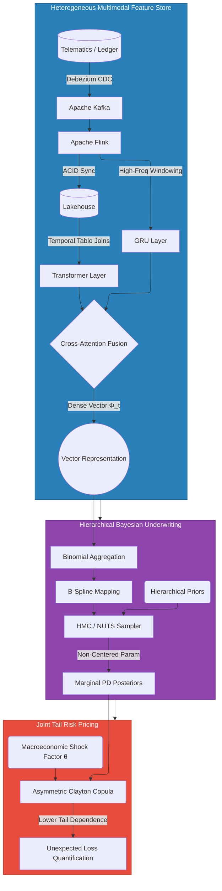

# Structural Resilience in Gig-Economy Insurtech Partnerships
*Part 2b: Hierarchical Bayesian Inference, MCMC Scaling, and Asymmetric Copulas*

---

## From a Score to a Distribution: Why Point Estimates Are Not Enough

Part 2a's dual-regime neural architecture outputs a deterministic fused covariate vector Φᵢₜ ∈ ℝ^d_φ for each driver daily. This is a sufficient statistic for the driver's observable risk state: but it is not a probability. A deterministic score cannot tell the bank *how uncertain* it should be about a credit decision. A driver with an estimated PD of 4.5% backed by 2 years of transaction history is structurally different from a driver with the same estimated PD but only 14 days of platform data since onboarding: yet both would receive identical treatment under a point-estimate threshold.

The Hierarchical Bayesian Logistic Regression (HBLR) layer converts Φᵢₜ into an explicit **posterior probability distribution** over each driver's default probability θᵢⱼₜ. Three business-critical capabilities this unlocks:

**1. Quantified uncertainty**: credible intervals around PD estimates directly drive the Uncertainty Kill-Switch: if the 95th posterior percentile of θ exceeds a regulatory safety cap, credit limit extensions are frozen automatically, regardless of what the posterior mean says.

**2. Partial pooling across driver clusters**: data from Nairobi's Westlands cluster informs estimates for a newly launched Thika corridor cluster where no defaults have been observed yet. Thin-file borrowers are protected from zero-default pathology.

**3. Interpretable causal structure**: every component of Φᵢₜ has an explicit coefficient linking it to the default outcome. This interpretability is not optional: it is required by IFRS 9 model governance, Basel IV internal model validation, and algorithmic fairness auditing.

---

## Why Partial Pooling: Not Complete Pooling or No Pooling

The choice of partial pooling over the two naive alternatives is the most consequential modelling decision in this architecture.

**Complete pooling (standard logistic regression)** estimates a single global coefficient vector β across all drivers, treating the portfolio as homogeneous. A driver in a dense Nairobi CBD corridor faces fundamentally different surge patterns, traffic kinematics, and macro exposure than a driver on a peri-urban Kisumu route. A single global β systematically mis-estimates PD for every specific cluster.

**No pooling (independent models per cluster)** fits an independent logistic regression per cluster j = [geohash, platform]. For newly launched clusters with zero observed defaults, the maximum likelihood PD estimate is identically zero: the model concludes default is impossible simply because it hasn't happened yet. This is not a feature. It is catastrophic overfitting in sparse data, precisely where the risk is highest.

**Partial pooling (hierarchical Bayesian)** treats cluster-specific parameters as random variables drawn from a global portfolio-level distribution. Data-sparse clusters are pulled toward the portfolio mean: preventing zero-default pathology. Data-rich clusters have sufficient evidence to pull their estimates away from the mean: capturing genuine local heterogeneity. The degree of shrinkage is not set by the analyst; it is inferred from the data through the hyperprior on between-cluster variance.

---

## Full Mathematical Model Specification

The three-level hierarchy:

**Level 1: Individual Driver Likelihood:**
> **Yᵢⱼₜ^(p) ~ Bernoulli(θᵢⱼₜ^(p))**

for driver i, cluster j, product p ∈ {micro, revol, IPF}, time t.

**Level 2: Cluster Priors (Partial Pooling):**
> **αⱼ^(p) ~ 𝒩(μα^(p), σα^(p)²)**
> **βⱼ^(p) ~ 𝒩(μβ^(p), diag(σβ^(p)²))**

**Level 3: Portfolio Hyperpriors:**
> **μα^(p) ~ 𝒩(0, 2),    σα^(p) ~ Half-Cauchy(0, 1)**
> **μβ^(p) ~ 𝒩(0, 2·I),  σβ^(p) ~ Half-Cauchy(0, 1)**

The Half-Cauchy prior on scale parameters is critical. Its heavy tail: probability density ∝ σ⁻² for large σ: places non-negligible prior mass on configurations where the baseline default risk in a peri-urban corridor is an order of magnitude higher than in the CBD. This is precisely the situation in gig-economy portfolios spanning heterogeneous geographies. The alternative (Inverse-Gamma prior) concentrates too much mass away from zero and over-regularises in the presence of genuine heterogeneity: the Gelman critique.

The full log-odds predictor for driver i in cluster j, product p, at time t:

> **logit(θᵢⱼₜ^(p)) = αⱼ^(p) + (βⱼ^(p))ᵀΦᵢₜ + Σₖ ζₖBₖ(xᵢₜ) + Σ_(m,n)∈𝒢 γₘₙ xᵢₘ xᵢₙ + δᵀMₜ + γⱼₜ**

Where: αⱼ is the cluster baseline (partial-pooled); βⱼᵀΦᵢₜ is the neural embedding effect; Σ ζₖBₖ are B-spline nonlinear terms; Σ γₘₙ xᵢₘ xᵢₙ are the four gig-specific interactions; δᵀMₜ is the macro module; and γⱼₜ is the AR(1) time-varying cohort shock effect.

---

## B-Splines: Why Not Binning, Why Not Linear

Several key covariates exhibit strongly nonlinear relationships with default probability. DLR risk is approximately log-linear below 0.5, then accelerates non-linearly above the 1.0 insolvency threshold. Repayment velocity vrepay has protective power that plateaus above 1.5: doubling from 1.5× to 3× scheduled repayment adds negligible incremental safety. Driver tenure has a steep early-period risk that plateaus after 90 days.

Binning these covariates (grouping into intervals) produces **boundary collapse**: a hard discontinuity in predicted risk at every bin edge. A driver at DLR = 0.999 and a driver at DLR = 1.001 are treated as radically different, despite being financially indistinguishable. This is a decision-tree artefact masquerading as statistical analysis.

**B-splines** replace binning with smooth piecewise polynomials defined by the Cox-de Boor recursion:

> **Bₖ,₁(x) = 1 if ξₖ ≤ x < ξₖ₊₁, else 0**
> **Bₖ,d(x) = (x − ξₖ)/(ξₖ₊d − ξₖ) × Bₖ,d₋₁(x) + (ξₖ₊d₊₁ − x)/(ξₖ₊d₊₁ − ξₖ₊₁) × Bₖ₊₁,d₋₁(x)**

The resulting function f(x) = Σ ζₖBₖ(x) is topologically continuous with continuous derivatives up to degree d−1 at every interior knot. No hard thresholds. No boundary artefacts.

Adjacent spline coefficients {ζₖ} are modelled with a **First-Order Random Walk (RW1) prior** that enforces smoothness by penalising first-derivative jumps:

> **ζₖ ~ 𝒩(ζₖ₋₁, σ_ζ²),   k = 2, …, K**

The innovation variance σ_ζ² controls smoothing and is **inferred from the data**: no manual bandwidth selection. B-splines are introduced only where diagnostic evidence (randomised quantile residuals, calibration curve curvature) confirms genuine nonlinearity, validated by LOO-CV ELPD difference before deployment.

---

## AR(1) Time-Varying Coefficients for Macro Sensitivity

IFRS 9 requires forward-looking ECL estimates incorporating macroeconomic scenarios. A static macro coefficient δₖ estimated on a 2020-2023 training window will systematically mis-estimate the PD sensitivity of a 2025 portfolio operating under a different energy price regime, post-COVID demand recovery, and advanced ZEV regulatory environment.

The solution: model macro coefficients as time-indexed parameters governed by **First-Order Autoregressive (AR(1)) priors**:

> **δₖ,ₜ ~ 𝒩(μₖ + ρₖ(δₖ,ₜ₋₁ − μₖ),  σ²_δₖ)**

Where μₖ is the long-run stationary mean, ρₖ ∈ (−1, 1) is persistence (empirically 0.85-0.95 for macro regimes: sticky but mean-reverting), and σ²_δₖ is the innovation variance controlling sensitivity to new macro information.

The AR(1) is stationary: in the absence of new data, the coefficient mean-reverts to μₖ with variance bounded by σ²_δₖ/(1 − ρₖ²). This contrasts with the **Random Walk (RW1) special case** (ρₖ = 1): non-stationary, no mean-reversion: which is appropriate for permanent structural regime shifts (e.g., a platform permanently changing its commission structure), not cyclical macro variation.

The **time-varying cohort shock effect** γⱼₜ follows the same AR(1) structure:

> **γⱼₜ ~ 𝒩(ρⱼ γⱼ,ₜ₋₁,  σ²_γ)**

When an unobserved systemic shock hits cluster j: a regional fuel disruption, a localised labour strike: the posterior of γⱼₜ shifts upward for the entire cluster simultaneously. A driver with healthy GRU embedding (stable kinematics, reasonable DLR) still has their θᵢⱼₜ inflated by the cluster shock. This is the Bayesian mechanism capturing **default clustering**: an unobserved common factor driving multiple drivers to default simultaneously, even when individual observables look healthy.

---

## MCMC Scaling: Making Bayesian Inference Production-Ready

### Bernoulli → Binomial Aggregation

Full MCMC over individual Bernoulli likelihoods at N = 200,000 drivers produces an O(N) gradient cost per leapfrog step. At daily update cadence, this renders NUTS infeasible at the required SLA.

Drivers sharing identical (or near-identical, after quantisation) covariate patterns within a cluster are aggregated:

> **Kⱼ = Σᵢ Yᵢⱼ ~ Binomial(nⱼ, θ̄ⱼ)**

The Kⱼ defaults observed out of nⱼ trials carry identical Fisher information about θ̄ⱼ as nⱼ individual Bernoulli observations: the aggregation is a sufficient statistic. Gradient cost drops from O(N) to O(J) where J ≪ N is the number of distinct covariate-quantised groups. Typical speedup: 50-100× for large portfolios.

### Non-Centered Parameterisation and Neal's Funnel

The central computational pathology of hierarchical models is **Neal's Funnel**: when σα → 0, the joint posterior takes the shape of a narrow funnel with extremely high curvature at the neck. The HMC leapfrog integrator cannot navigate this with a fixed step size, producing divergent transitions and biased hyperparameter estimates.

**Non-centered parameterisation** decouples the scale from the cluster parameters during sampling. Instead of sampling αⱼ ~ 𝒩(μα, σα²) directly:

> **ã_j ~ 𝒩(0, 1),   αⱼ = μα + ã_j × σα**

ãⱼ and σα are a priori independent: the posterior dependency enters only through the likelihood. The leapfrog integrator navigates the de-correlated (ãⱼ, σα) space without encountering funnel geometry. Practical result: R̂ for scale hyperparameters drops from ~1.08 to ~1.003, and Effective Sample Size increases 3-10×.

### Production Inference: BlackJAX on GPU/TPU

The probabilistic model is re-implemented in **BlackJAX**: a JAX-native library that compiles the NUTS kernel to XLA, enabling GPU/TPU acceleration. For 200,000 drivers aggregated into ~4,000 Binomial groups, XLA-compiled NUTS achieves approximately 50× wall-clock speedup over CPU NUTS. **Warm-start incremental updates**: seeding each day's chain from yesterday's posterior samples: reduce daily update compute from hours (cold chain) to minutes.

---

## Convergence Diagnostics: Non-Negotiable Before Deployment

Before any posterior credible interval enters regulatory capital calculations, IFRS 9 staging decisions, or automated credit limit adjustments, four mandatory diagnostics must pass:

**R̂ (Rank-Normalised Gelman-Rubin):** Compares within-chain to between-chain variance across M = 4 parallel chains. Production threshold: R̂ < 1.005 for all parameters. Scale hyperparameters σα^(p) are most susceptible to R̂ > 1.01; non-centered parameterisation is the fix.

**Effective Sample Size (ESS):**

> **ESS = S / (1 + 2Σₖ ρₖ)**

where ρₖ are lag-k autocorrelations. Minimum: ESS > 400 per parameter for reliable 95% credible intervals. Critical for Half-Cauchy scale hyperparameters which often exhibit high lag-1 autocorrelation in weakly identified models.

---

## Five Exhaustive Posterior Predictive Checks

Posterior Predictive Checks (PPCs) answer: "Can the model reproduce the statistical properties of the observed data?" Each PPC generates S simulated datasets Ỹ^(s) from the posterior predictive distribution and computes a Bayesian p-value p_B = P(T(Ỹ) ≥ T(Y_obs)).

**PPC 1: Central Tendency:** T(Y) = mean(Y), the overall default rate. Bayesian p_B near 0.5 indicates correct baseline intercept specification. p_B < 0.05 or > 0.95 means the model's baseline αⱼ^(p) are systematically wrong.

**PPC 2: Tail-Risk Cascade Clustering:** T(Y) = maxⱼ(mean default rate within cluster j). This captures whether the model can reproduce the extreme cluster-level default spikes observed during macro shocks. A tail p_B near 0 indicates an underdispersed model that will systematically underestimate cascade severity: and undercapitalise the Clayton Copula's αc parameter.

**PPC 3: Repayment Velocity Nonlinearity:** Posterior mean predicted PD plotted against empirical default rates in 10 quantile bins of vrepay. Systematic curvature remaining after fit: especially in the critical transition zone 0.8 < vrepay < 1.2: is diagnostic evidence warranting a B-spline. Run at every model update to detect emerging nonlinearity as the portfolio matures.

**PPC 4: Cluster Heterogeneity:** Observed between-cluster default rate variance compared to the posterior predictive distribution of between-cluster variance from the model's αⱼ^(p). If the model's posterior σ̂²α is systematically smaller than the observed variance, the Half-Cauchy prior scale is too tight: real geographic heterogeneity is being over-regularised away.

**PPC 5: Time-Varying Cohort Effect:** For each calendar month, the posterior predicted monthly default rate per cluster is compared to the observed rate. Residual temporal autocorrelation in the prediction error: systematic over-prediction for several consecutive months followed by under-prediction: indicates that the AR(1) persistence parameter ρⱼ is misspecified and must be updated.

---

## Production Monitoring: PSI as the Model Health Tripwire

The **Population Stability Index** measures the symmetrised KL-divergence between the model's current scoring distribution and the training-time distribution:

> **PSI = Σ_b (Aᵦ − Eᵦ) × ln(Aᵦ / Eᵦ)**

| PSI | Signal | Action |
|---|---|---|
| < 0.10 | Stable | No action |
| 0.10-0.25 | Minor shift | Investigate; flag for model risk review |
| ≥ 0.25 | Major drift | Immediate automated retraining |

A PSI ≥ 0.25 on the GRU stress embedding hᵀ_GRU constitutes a **material model change trigger** under SR 11-7 / Basel Model Risk governance: the distribution of behavioral risk profiles in the current portfolio no longer resembles the training distribution. Automated retraining fires before IFRS 9 Stage 3 impairments materialise. PSI is computed continuously in Flink, emitted weekly to the model governance dashboard without offline computation overhead.

---

## Bayesian Decision Boundaries: Replacing the Binary Threshold

### The Expected Value Framework

The Bayesian decision framework integrates over the entire posterior. For Action a₁ (approve a credit limit extension), the expected financial value is computed over all S MCMC posterior samples θ^(s):

> **𝔼[V(a₁)] = (1/S) Σₛ [(1 − θ^(s)) × Lgain − θ^(s) × Lloss]**

Setting 𝔼[V(a₁)] = 𝔼[V(a₀)] (cost of denial) yields the **Bayesian break-even threshold** p*:

> **p* = (Lgain + Lopp) / (Lgain + Lopp + Lloss)**

This threshold differs materially by product. For **microloans**: thin fee income but strong garnishment recovery → p*_micro ≈ 12-18%. For **revolving credit lines**: large potential drawdown at distress, high contagion factor → p*_revol ≈ 3-6%.

### Three Automated Decision Rules

**1. Dynamic Soft Cap (Mean Trigger):** Approve if 𝔼[V(a₁)] > 𝔼[V(a₀)]. Primary approval criterion, updated daily from the posterior.

**2. Uncertainty Kill-Switch (Variance Trigger):** Even if the posterior mean PD < p*, if the tail exceedance probability exceeds a configurable threshold ε_kill:

> **P(θᵢⱼₜ^(p) > θ_cap) > ε_kill → Freeze limit extension**

A posterior PD that is *on average* acceptable but has a 12% probability of the true rate exceeding 15% gets frozen automatically.

**3. Portfolio Shock Buffer (Cluster Trigger):** If the cohort shock γⱼₜ spikes for cluster j: posterior mean increase > 2σ from the prior: the system initiates defensive limit rollbacks across the entire cluster before individual driver defaults propagate. The AR(1) prior absorbs the shock and adjusts all drivers' posterior PDs simultaneously from the shared cluster signal.

---

## Tail Risk Pricing: The Clayton Copula

### Why Not Gaussian

The HBLR engine produces accurate **marginal** PDs for each product separately. For the bank holding all three products against the same driver, the relevant quantity is the **joint** default probability across all three simultaneously. Standard Gaussian Copulas assume symmetric tail dependence: the same co-movement in good times and bad. Empirically, gig-economy defaults cluster exclusively in the lower tail. The Gaussian model cannot produce this asymmetry. Using it produces a systematic underestimate of joint capital requirements during stress.

### Sklar's Theorem and the Clayton Copula

By Sklar's Theorem, any joint distribution F decomposes into its marginals and a copula C:

> **F(t^micro, t^revol, t^IPF) = C(F₁(t^micro), F₂(t^revol), F₃(t^IPF); αc)**

The **Clayton Copula** (Archimedean generator φ(t) = (1/αc)(t^(−αc) − 1), αc > 0):

> **C(u₁, u₂, u₃; αc) = (u₁^(−αc) + u₂^(−αc) + u₃^(−αc) − 2)^(−1/αc)**

**Lower tail dependence coefficient:**

> **λ_L = 2^(−1/αc) > 0**

**Upper tail dependence coefficient:**

> **λ_U = 0**

This asymmetry is the defining property. As macro shock severity increases, αc increases and λ_L → 1.0: absolute lockstep default across the full product stack. Three stress scenarios:

| Scenario | αc | λ_L | Business Meaning |
|---|---|---|---|
| A: Localised Cluster Shock | 2.5 | 0.82 | Single corridor affected; strong co-movement |
| B: Macro Liquidity Crunch | 5.0 | 0.87 | Jurisdiction-wide; near-lockstep |
| C: Systemic Tail Spillover | → ∞ | → 1.0 | Full cascade; complete lockstep |

### MCMC-Based Portfolio Loss Simulation

1. For each MCMC sample s: compute marginal PD vector (θ^micro^(s), θ^revol^(s), θ^IPF^(s))
2. Apply probability integral transform: uₚ^(s) = Φ(θₚ^(s))
3. Generate Clayton Copula sample (v₁^(s), v₂^(s), v₃^(s)) with parameter αc
4. Compute default indicators: Yₚ^(s) ~ Bernoulli(C⁻¹(vₚ^(s)))
5. Portfolio loss: L^(s) = Σₚ EADₚ × LGDₚ × Yₚ^(s)

Sorting {L^(s)} and taking the 95th percentile yields VaR₀.₉₅. The 90% central Bayesian credible interval [L₀.₀₅, L₀.₉₅] is formally equivalent to VaR₀.₉₅: the mathematical bridge between Bayesian posterior simulation and Basel IV regulatory VaR reporting.

---

## Business Impact: What the Bayesian-Copula Layer Delivers

For **capital management teams**: the Clayton Copula-based UL quantification eliminates the systematic underestimate of joint default risk that Gaussian capital models carry. The difference between a Gaussian UL and a Clayton UL under Scenario B (αc = 5.0) can represent a 30-60% underestimate in required regulatory capital: a material model risk exposure.

For **credit officers**: the Uncertainty Kill-Switch converts posterior uncertainty into a concrete, automated operational decision. Thin-file drivers are protected from both over-extension (uncertainty kill-switch blocks approvals) and systematic denial (partial pooling ensures they receive cohort-informed PD estimates, not model-blind rejections).

For **model risk functions**: five exhaustive PPCs and continuous PSI monitoring on the Flink pipeline provide a production-grade model health infrastructure that satisfies SR 11-7 model risk governance requirements without requiring a separate offline monitoring stack.

---

## Comprehensive End-to-End Architecture Diagram

*Part 3 maps these model outputs into IFRS 9 forward-looking ECL staging, Basel IV Advanced IRB capital, Solvency II Partial Internal Model, IFRS 17 PAA/BBA onerous contract triggers, Equalized Odds fairness constraints, and four assistive ecosystem interventions that prevent the default cascade rather than reporting it after the fact.*
