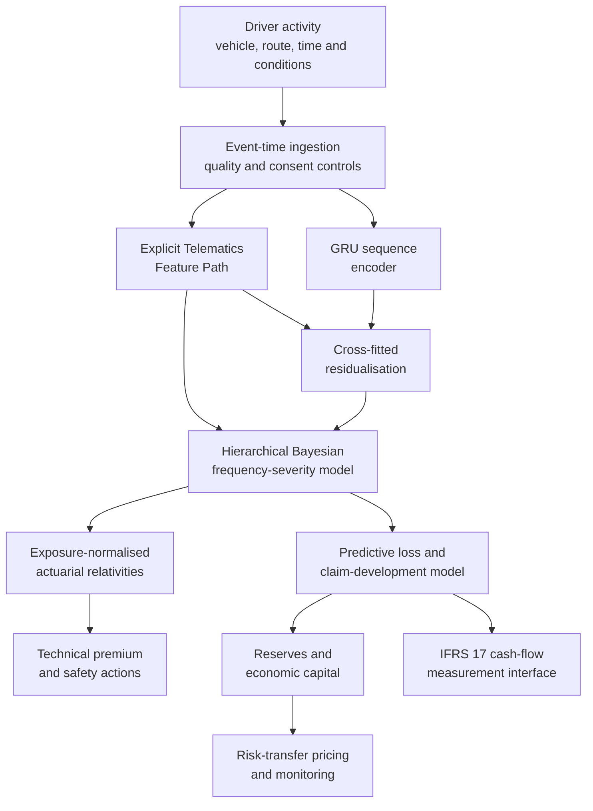
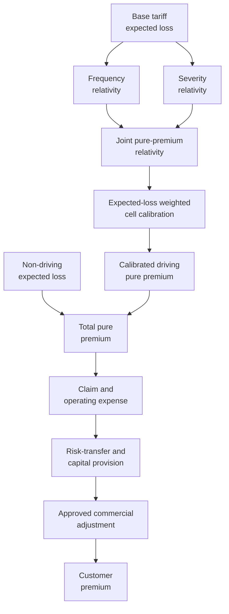
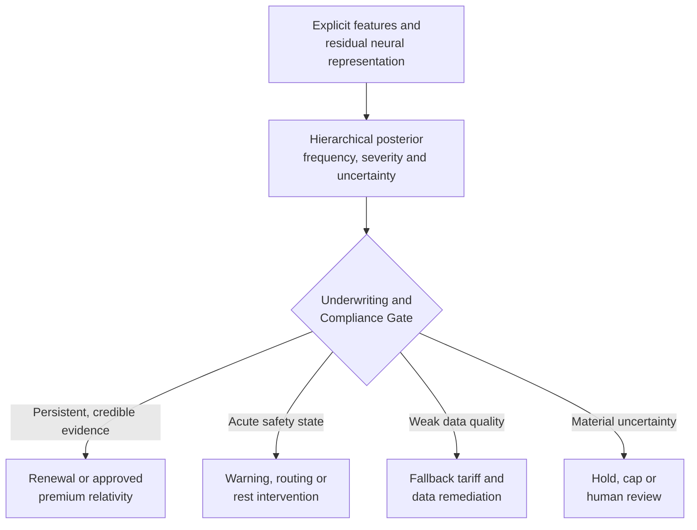
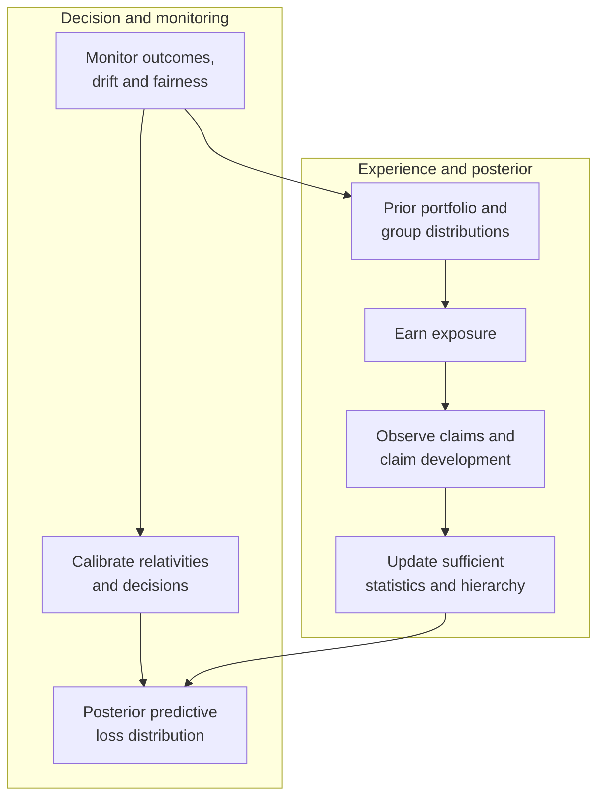
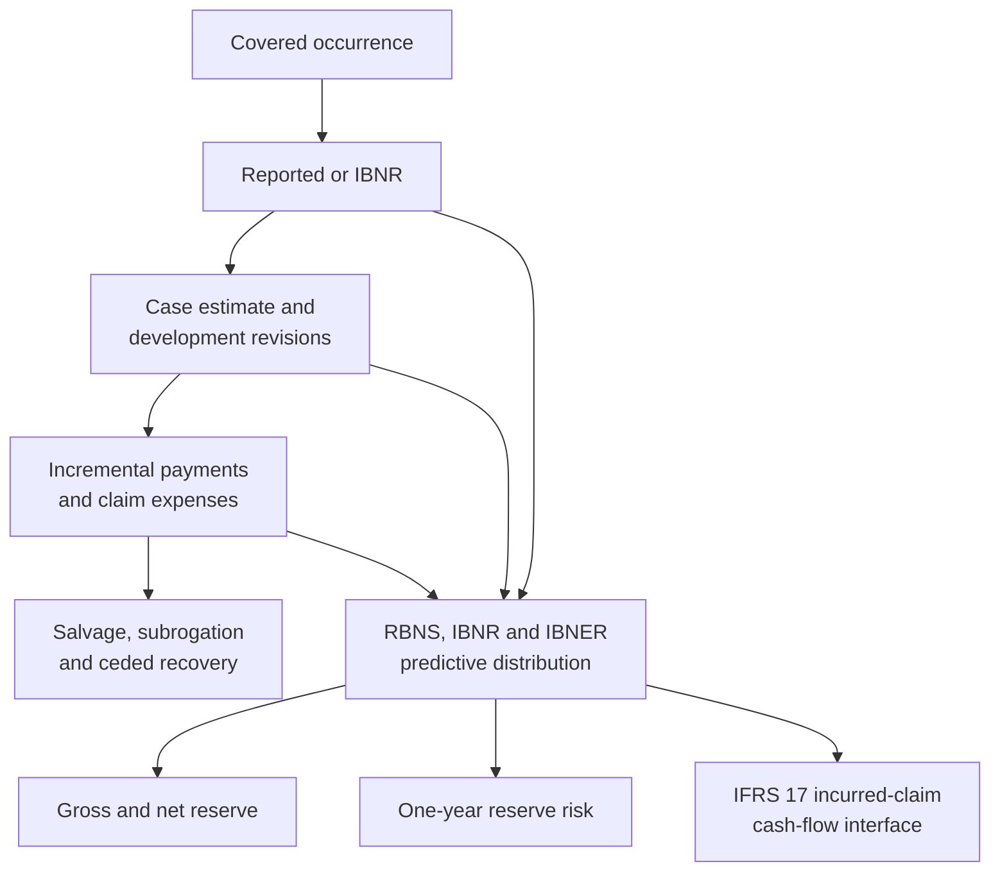
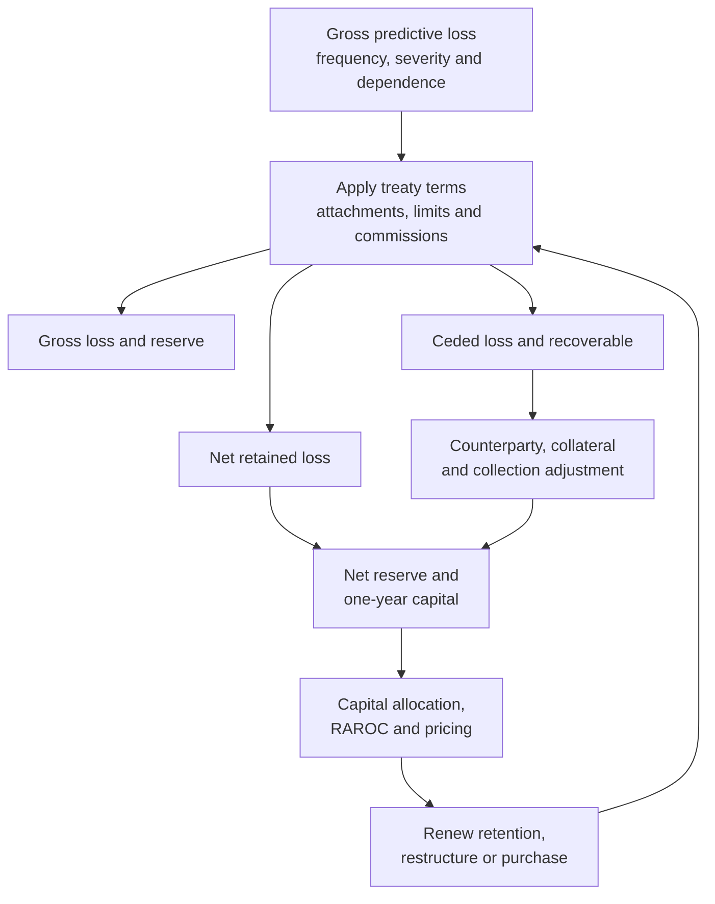
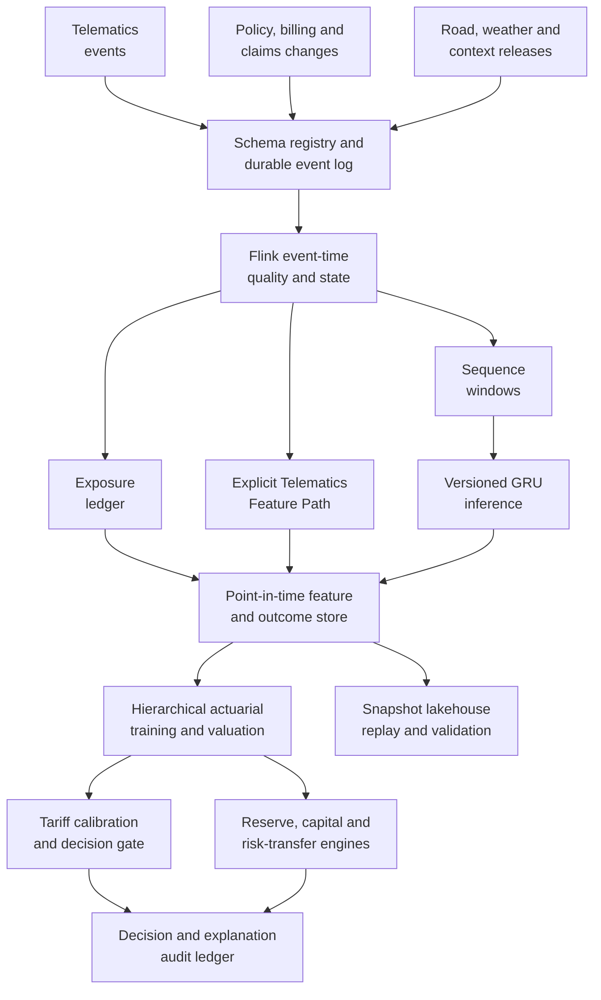

# Bayesian Credibility and Exposure-Normalised Telematics Relativities

## A unified actuarial architecture for pricing, reserving, capital and risk transfer in gig-economy motor insurance

**Author:** Neville Maloba  
**Contact:** nevillemaloba@gmail.com  
**Status:** Brian Hey Prize 2026 submission edition  
**Date:** 31 August 2026

## Abstract

Two drivers can operate the same vehicle in the same city and still create materially different insurance risks because their exposure, operating conditions and safety state evolve differently between annual rating observations. This paper asks how high-frequency telematics can contribute credible and explainable evidence to an actuarial tariff while the same predictive distribution supports claims reserving, economic capital and risk-transfer decisions.

The paper's principal contribution is an exposure-normalised actuarial modulating variable. A hierarchical frequency-severity model combines approved tariff factors, governed P-splines, explicitly owned telematics variables and cross-fitted residual neural representations. A regularised horseshoe prior controls the remaining embedding block. Posterior frequency and severity relativities are then recalibrated within approved tariff populations, preserving the portfolio expected-loss foundation while redistributing indicated risk within it. Exposure remains an offset rather than a hidden risk score, temporary safety state remains separate from persistent premium evidence, and the predictive distribution continues into claim development, reserves, capital and reinsurance.

A controlled synthetic experiment follows 2,800 drivers over 18 months and compares a traditional tariff GLM with four progressively richer specifications. The final six months form a driver-grouped future-period holdout containing behavioural drift and common shocks. Relative to the traditional model, the hierarchical explicit model reduces absolute pure-premium error by 26.2%; the residual-neural model reduces it by 26.9%; and the regularised-horseshoe specification reduces it by 25.8% while producing the best severity deviance. Cross-fitted residualisation lowers the maximum absolute correlation between explicit variables and neural coordinates from 0.628 to 0.006, while horseshoe shrinkage reduces the effective frequency embedding from eight coordinates to two. The richer model also reduces the synthetic unpaid-claim reserve error from 12.4% to 3.7%. Its higher indicated loss raises the 99.5% VaR capital amount and the attachment probability of a fixed aggregate layer, demonstrating that improved risk recognition can increase rather than mechanically reduce capital and reinsurance needs.

The evidence is computational and synthetic, not an empirical estimate for Kenyan drivers. It nevertheless shows how the proposed transformations can be reproduced, challenged and connected to decisions. The resulting architecture links human driving conditions to exposure, calibrated technical price, claim settlement, reserve uncertainty, capital consumption and risk transfer while preserving actuarial interpretation and auditable ownership of every material variable.

**Keywords:** actuarial credibility; telematics; usage-based insurance; hierarchical Bayes; frequency-severity modelling; neural residualisation; horseshoe prior; claims reserving; economic capital; reinsurance

## 1. The human and economic setting

### 1.1 Two drivers, one tariff cell, different working lives

Consider Amina and Kamau, two app-based drivers in Nairobi. They use vehicles of the same age and value, live in the same broad rating territory and buy the same annual motor cover. On the proposal form they look similar. During an ordinary week, however, their economic lives diverge.

Amina works five planned daytime shifts. She rejects long pick-ups that would place her far from her preferred corridor, takes regular breaks and finishes before the evening traffic becomes most volatile. Kamau works whenever household cash is tight. A platform incentive encourages him to complete a late-night trip sequence, fuel prices reduce the margin on each kilometre, and a loan repayment is due the next morning. He continues after fatigue has begun to alter his reactions. The additional distance matters because it creates more opportunities for a claim. The altered braking, cornering and rest pattern matters because it may change the expected claim rate per kilometre. The road, vehicle and speed at impact matter because they influence the cost if a collision occurs.

These are related but different actuarial questions:

- **Exposure** asks how much insured activity took place, measured through an approved base such as kilometres, active driving hours or covered days.
- **Frequency risk** asks how many claims are expected per exposure unit.
- **Severity risk** asks how much a claim is expected to cost, conditional on occurrence.
- **Temporary safety state** describes an acute condition, such as fatigue or sensor-detected instability, that may justify a warning, routing intervention or rest recommendation.
- **Persistent actuarial risk** describes sufficiently stable and validated evidence that may support a future tariff relativity.
- **Claims development** describes the path from occurrence through reporting, case estimation, payment, recovery and closure.
- **Capital risk** describes adverse variation beyond the central estimate that the insurer must be able to absorb.
- **Risk transfer** allocates selected portions of the gross loss distribution to a reinsurer or another protection provider.

The driver experiences these distinctions as one economic reality. A disrupted working week can reduce income, change operating choices and weaken the capacity to maintain the vehicle. The insurer experiences them across different ledgers, models and decision horizons. A sound architecture connects those views without collapsing them.

### 1.2 The tariff remains the foundation

Risk classification is an actuarial system for grouping risks with similar expected outcomes, not a claim that all members of a class behave identically. ASOP No. 12 emphasises that a classification system should relate differences in expected outcomes to differences in risk characteristics and should be reviewed as experience emerges [1]. Property and casualty ratemaking guidance likewise treats the selection of a measurable, verifiable and reasonably proportional exposure base as a central design decision [2].

For Mwendo Pamoja, established rating variables remain the tariff foundation: vehicle class and value, coverage, territory, driver and vehicle history, use class, deductibles and other approved factors. Telematics adds two capabilities. First, it measures exposure more faithfully. Second, it supplies behavioural and contextual evidence that may distinguish risks within an existing cell. The model therefore begins with a base expected loss, not with a neural score.

The Kenyan operating context adds clear institutional boundaries. Insurance business is conducted by licensed insurers under the Insurance Act, which also establishes record-keeping and prudential responsibilities [3]. Compulsory third-party motor cover is grounded in the Insurance (Motor Vehicle Third Party Risks) Act [4]. Location, device and behavioural data are personal-data processing activities. High-risk profiling therefore belongs within a purpose-limited governance design, supported by a data-protection impact assessment where the processing is likely to create high risk to a data subject's rights and freedoms [5]. The model architecture must be commercially useful inside those boundaries.

### 1.3 The core architectural question

The central question is not whether a neural network can predict claims. It is:

> How can high-frequency telematics contribute incremental, credible and explainable evidence to an actuarial tariff, while the same predictive distribution supports claims reserves, capital decisions and risk-transfer monitoring?

The answer requires a sequence of controlled transformations. Raw events become validated exposure and features. Explicit variables and neural sequence representations enter a hierarchical model through distinct paths. Posterior estimates become calibrated relativities. Claims then emerge and settle through a separate development process. Gross losses are converted to gross and net reserves, capital and treaty metrics. Accounting receives governed cash-flow outputs; safety operations receive timely interventions.

Figure 1 summarises that chain.

**Figure 1. From human driving conditions to price, reserves, capital and risk transfer.**

### 1.4 Research contribution

The research contribution is a governed way to introduce high-frequency information without allowing either exposure or a neural score to replace the approved tariff foundation. The proposed actuarial modulating variable has three defining properties:

1. It is built from separately estimated frequency and conditional-severity relativities, so a reader can distinguish more claim opportunity from higher risk per exposure unit and higher cost given a claim.
2. It assigns explicit variables and learned sequence information to distinct modelling paths, then uses cross-fitted residualisation and shrinkage to limit duplicate representation.
3. It is normalised using expected-loss weights within the approved calibration population, so the weighted mean relativity is one before approved caps, floors and commercial adjustments.

The supporting contribution is an end-to-end actuarial use of the same predictive distribution. Pricing, unpaid-claim estimation, one-year and ultimate capital, and risk-transfer analysis retain distinct decision purposes, but they share reconciled exposure, claim and cash-flow definitions. This makes the architecture implementable as a chain of controlled actuarial transformations rather than a collection of unrelated predictive models.

### 1.5 Objectives and scope

This paper has eight objectives:

1. Define exposure-consistent claim frequency and conditional-severity models.
2. Construct transparent frequency, severity and pure-premium modulating variables.
3. Connect hierarchical Bayes to actuarial credibility and recursive learning.
4. Integrate explicit telematics variables and neural sequence representations without duplicate ownership.
5. Establish calibration, uncertainty, fairness and model-governance controls.
6. Extend the model from expected loss into claim development and reserves.
7. Measure economic capital and price and monitor risk-transfer structures against gross and net loss distributions.
8. Describe a production data architecture and a controlled pilot pathway.

The primary statistical measure is the real-world probability measure, denoted by $\mathbb P$. The paper estimates insured outcomes and operational cash flows from experience under $\mathbb P$. Market-consistent valuation questions may require different measures and assumptions, but they do not alter the physical-measure underwriting model developed here.

## 2. Actuarial foundations

### 2.1 Frequency, severity and aggregate loss

Non-life pricing commonly decomposes aggregate loss into a claim count and positive claim amounts. Let $N_{it}$ be the number of covered claims for driver $i$ during period $t$, let $Y_{itk}>0$ be the ultimate cost of claim $k$, and let $E_{it}$ be exposure. The driving-related ultimate loss is

$$
L^{\mathrm{drive}}_{it}=\sum_{k=1}^{N_{it}}Y_{itk}.
\tag{1}
$$

The conditional expectation follows from the frequency-severity decomposition:

$$
\mathbb E_{\mathbb P}\!\left[L^{\mathrm{drive}}_{it}\mid\mathcal D_t\right]
=
\mathbb E_{\mathbb P}[N_{it}\mid\mathcal D_t]\,
\mathbb E_{\mathbb P}[Y_{itk}\mid N_{it}>0,\mathcal D_t],
\tag{2}
$$

when the conditional structure makes that product appropriate. Dependence can instead be introduced through shared random effects, copulas, common shocks or a marked point process. Modern actuarial analytics retains the decomposition because frequency and severity respond to different mechanisms and require different validation [6].

The gross portfolio loss in accounting period $t$ is broader:

$$
L_t^{G}
=
\sum_i\sum_{k=1}^{N_{it}}Y_{itk}
+L_t^{\mathrm{cat}}
+L_t^{\mathrm{expense}},
\tag{3}
$$

where catastrophe and claim-expense components are modelled explicitly. Theft, flood, fire while parked and other non-driving coverages may be weakly related or unrelated to distance. Those costs remain outside a driving-behaviour relativity unless evidence supports a defined link.

### 2.2 Credibility as disciplined learning from sparse experience

Classical credibility addresses a practical tension: the portfolio knows more than a new driver's short record, but the individual's experience should matter as it becomes informative. Bühlmann's linear credibility estimator has the familiar form

$$
\widehat\Theta_i=Z_i\overline X_i+(1-Z_i)m,
\qquad 0\le Z_i\le1,
\tag{4}
$$

where $m$ is the collective mean and $Z_i$ is the weight attached to the risk's own experience [7]. Bühlmann-Straub extensions allow unequal exposure. Contemporary credibility texts show how the same variance-components logic supports experience rating across heterogeneous volumes [8]. Hierarchical credibility can also be estimated across more than two levels, including driver, fleet, territory and vehicle class [9].

Hierarchical Bayes generalises this idea by assigning probability distributions to latent risk parameters and learning their posterior distributions from observed data. Sparse groups are partially pooled toward relevant portfolio levels; mature groups retain more of their own experience. The result includes a posterior predictive distribution rather than only a weighted point estimate. That distinction matters because price, reserve and capital decisions respond to different parts of the distribution. Bayesian workflow also makes assumptions, prior predictive behaviour and posterior uncertainty visible for review [10].

### 2.3 Generalised linear models as the interpretable core

Generalised linear models link an exponential-family response to a linear predictor and remain a central foundation for insurance ratemaking [11]. Their value here is structural: the exposure offset, explicit link function and additive predictor provide a stable base into which nonlinear functions, hierarchical effects and controlled neural corrections can be introduced.

A negative-binomial marginal distribution is useful when claim counts are more variable than a Poisson model permits [12]. A Gamma severity model is useful for positive, right-skewed claim costs, while lognormal, inverse Gaussian, Tweedie and mixture distributions remain alternatives to be selected through empirical comparison. Dependence between longitudinal frequency and severity can be material, so the production model should test shared effects or copula structures rather than assume independence by convention [13].

### 2.4 Premium layers and distinct financial quantities

The model keeps six amounts distinct:

| Quantity | Purpose | Primary owner |
|---|---|---|
| Pure premium | Expected insured loss under $\mathbb P$ | Actuarial pricing |
| Claim expense provision | Expected allocated and unallocated claim expense | Claims and actuarial |
| Operating expense provision | Acquisition, administration, technology and distribution cost | Finance and pricing |
| Risk-transfer cost | Expected and risk-loaded cost of reinsurance or other protection | Reinsurance and capital |
| Capital and contingency provision | Compensation for adverse deviation and capital consumption | Capital and pricing committees |
| Commercial adjustment | Profit objective, strategy and approved market considerations | Product governance |

Accordingly, a technical and commercial premium can be expressed as

$$
P^{\mathrm{commercial}}_{it}
=PP^{\mathrm{drive}}_{it}
+PP^{\mathrm{non-drive}}_{it}
+C^{\mathrm{claim-exp}}_{it}
+C^{\mathrm{op}}_{it}
+C^{\mathrm{risk-transfer}}_{it}
+C^{\mathrm{capital}}_{it}
+M^{\mathrm{commercial}}_{it}.
\tag{5}
$$

This identity prevents the behavioural model from absorbing unrelated costs. It also creates an audit trail between observed loss, technical indication, accounting cash flows and the final filed or approved price.

## 3. Canonical hierarchical frequency-severity model

### 3.1 Exposure-consistent claim frequency

Let $\lambda_{it}$ be the expected claim rate per exposure unit and let $\theta_i$ be persistent individual heterogeneity with portfolio mean one. The conditional count model is

$$
N_{it}\mid\theta_i,\lambda_{it},E_{it}
\sim\operatorname{Poisson}(E_{it}\lambda_{it}\theta_i),
\qquad
\theta_i\sim\operatorname{Gamma}(a_\theta,b_\theta),
\tag{6}
$$

using the shape-rate convention. Calibrating $a_\theta=b_\theta$ gives $\mathbb E[\theta_i]=1$. Integrating out $\theta_i$ produces a negative-binomial marginal count distribution. This is preferable to simultaneously including an unexplained driver intercept and a second driver frailty: $\theta_i$ is the single canonical owner of persistent driver-level count heterogeneity.

The dynamic rate predictor is

$$
\log\lambda_{it}
=
\log\lambda_{0,c(i)}
+f_f(X_{it})
+\boldsymbol\beta_{hf}^{\top}\widetilde{\mathbf h}_{it}
+u^{f}_{g(i)}+u^{f}_{v(i)}+\delta^{f}_{t}.
\tag{7}
$$

Here $\lambda_{0,c(i)}$ is the base rate for approved tariff cell $c(i)$; $X_{it}$ contains explicit rating variables; $\widetilde{\mathbf h}_{it}$ is the residual neural representation; $u^f_g$ and $u^f_v$ are geography and vehicle-class effects; and $\delta^f_t$ is a controlled calendar or state component. Exposure is outside the rate and inside the Poisson mean. A doubling of distance therefore doubles expected count when the rate is unchanged; it does not make the driver twice as risky per kilometre.

### 3.2 Conditional claim severity

For positive ultimate cost, let $m_{it}$ be expected severity and $\Omega_i$ persistent individual severity heterogeneity. A conjugate specification is

$$
Y_{itk}\mid\Omega_i,m_{it}
\sim
\operatorname{Gamma}\!\left(\kappa,\frac{\kappa}{m_{it}\Omega_i}\right),
\qquad
\Omega_i\sim\operatorname{InvGamma}(a_\Omega,b_\Omega),
\tag{8}
$$

where the Gamma distribution again uses shape-rate notation. Since $\mathbb E[\Omega_i]=b_\Omega/(a_\Omega-1)$ for $a_\Omega>1$, selecting $b_\Omega=a_\Omega-1$ anchors the prior mean at one.

The severity predictor is

$$
\log m_{it}
=
\log m_{0,c(i)}
+f_s(X_{it})
+\boldsymbol\beta_{hs}^{\top}\widetilde{\mathbf h}_{it}
+u^{s}_{g(i)}+u^{s}_{v(i)}+\delta^{s}_{t}.
\tag{9}
$$

Severity data should be consistently defined. The production target can be paid-to-date plus an approved case estimate, an ultimate estimate, or a developed outcome, provided the target date and expense basis are explicit. Large losses may require a mixture, spliced distribution or separate catastrophe treatment. The Gamma specification is the transparent working model, not a universal claim that every motor severity follows one family.

### 3.3 Posterior pure premium

Given information $\mathcal D_t$, the driving pure premium is the posterior expectation

$$
PP^{\mathrm{drive}}_{it}
=
E_{it}\,
\mathbb E_{\mathbb P}
\!\left[\lambda_{it}\theta_i m_{it}\Omega_i\mid\mathcal D_t\right].
\tag{10}
$$

If posterior dependence is material, the expectation is evaluated jointly rather than as a product of posterior means. The model can share geography, vehicle or common-shock effects across frequency and severity. A dependent longitudinal frequency-severity formulation is particularly valuable where repeated claims and claim size respond to the same unobserved operating regime [13].

Non-driving pure premium is added separately:

$$
PP^{\mathrm{total}}_{it}
=PP^{\mathrm{drive}}_{it}+PP^{\mathrm{non-drive}}_{it}.
\tag{11}
$$

This protects the intuitive principle that zero kilometres can reduce collision exposure without making theft, fire, weather or fixed coverage obligations disappear.

### 3.4 Worked exposure example

Suppose Amina and Kamau share a base claim rate of 0.08 claims per 10,000 kilometres and a base conditional severity of KES 180,000. During a month, Amina drives 2,000 kilometres and receives posterior multipliers of 0.85 for frequency and 0.95 for severity. Kamau drives 3,200 kilometres and receives multipliers of 1.20 and 1.10. Ignoring frailty uncertainty for the illustration:

$$
PP_A=0.2\times0.08\times0.85\times180{,}000\times0.95
=\text{KES }2{,}325.60,
\tag{12}
$$

$$
PP_K=0.32\times0.08\times1.20\times180{,}000\times1.10
=\text{KES }6{,}082.56.
\tag{13}
$$

The difference is not a single behavioural penalty. It decomposes into more exposure, a higher expected count rate per kilometre and a higher expected cost conditional on a claim. That decomposition is the beginning of an explanation a policyholder, actuary and regulator can inspect.

## 4. Exposure-normalised actuarial modulating variables

### 4.1 Raw frequency, severity and pure-premium relativities

Define the posterior rate relativities

$$
M^{f}_{it}=\frac{\lambda_{it}}{\lambda_{0,c(i)}},
\qquad
M^{s}_{it}=\frac{m_{it}}{m_{0,c(i)}},
\qquad
M^{pp}_{it}=M^{f}_{it}M^{s}_{it}.
\tag{14}
$$

The separate terms support explanation. A high $M^f$ may reflect repeated harsh-event sequences, fatigue or a risky operating window. A high $M^s$ may reflect speed regime, road type, vehicle repair cost or a pattern associated with more forceful impacts. The combined $M^{pp}$ expresses the multiplicative change in driving expected loss before portfolio calibration.

### 4.2 Why residualisation is not tariff calibration

Residualisation answers a representation question: how much of the neural vector can already be predicted from explicit variables? Tariff calibration answers a financial question: does the resulting relativity preserve the approved aggregate expected-loss level within the chosen calibration population? One does not imply the other.

The calibration base uses expected baseline loss weights

$$
w^{0}_{it}=E_{it}\lambda_{0,c(i)}m_{0,c(i)}.
\tag{15}
$$

Within tariff cell $c$ and calibration period $t$, define

$$
A_{c,t}
=
\frac{\sum_{i\in c}w^{0}_{it}M^{pp}_{it}}
{\sum_{i\in c}w^{0}_{it}},
\qquad
M^{pp,*}_{it}=\frac{M^{pp}_{it}}{A_{c,t}}.
\tag{16}
$$

It follows exactly that

$$
\frac{\sum_{i\in c}w^{0}_{it}M^{pp,*}_{it}}
{\sum_{i\in c}w^{0}_{it}}=1.
\tag{17}
$$

The calibrated driving pure premium is

$$
PP^{\mathrm{drive,*}}_{it}
=w^{0}_{it}M^{pp,*}_{it}\,
\mathbb E[\theta_i\Omega_i\mid\mathcal D_t],
\tag{18}
$$

with a joint expectation when the frailties are dependent. If the collective frailty means within the cell are not one after posterior updating, the calibration can include them in the numerator so that the financial identity remains exact.

### 4.3 Separate and joint calibration

Frequency and severity can each be normalised when product governance requires separate neutral indices. Joint pure-premium calibration is the primary financial control because it preserves aggregate expected driving loss. Separate calibration is useful for reporting and diagnostic stability:

$$
M^{f,*}_{it}=\frac{M^f_{it}}{A^f_{c,t}},
\qquad
M^{s,*}_{it}=\frac{M^s_{it}}{A^s_{c,t}}.
\tag{19}
$$

The chosen population, exposure period, credibility threshold and refresh cadence are contractual model-governance parameters. A small or rapidly changing cell may be normalised at a broader credible level, then constrained by approved caps and floors. Portfolio drift is monitored by comparing raw and calibrated distributions, indicated premium, observed loss and the movement of $A_{c,t}$ over time.

### 4.4 From indicated relativity to customer price

Figure 2 separates statistical indication from commercial price construction.

**Figure 2. Premium construction preserves distinct actuarial and commercial layers.**

Customer implementation can use a continuous factor, a bounded band, a renewal score or a bonus-malus transition. Weekly telematics scoring has been proposed as a way to combine timely behavioural evidence with credibility and a bounded bonus-malus structure [14]. The commercial mechanism should match the coverage contract and the insurer's ability to explain and administer changes. Acute safety interventions can be immediate; persistent premium adjustments should follow the approved observation window, credibility standard and notice process.

## 5. Explicit features, neural representations and controlled shrinkage

### 5.1 One owner for each engineered variable

Usage-based motor insurance research shows that mileage, time of use, road context and driving signals can add information beyond traditional rating variables, although performance and interpretation depend on the exposure definition, sample and target [15]. Integration studies also show value in combining traditional and telematics data rather than forcing one source to replace the other [16]. The architecture therefore gives every engineered quantity one canonical owner.

Raw events include GNSS position and speed, accelerometer readings, angular velocity, device health, trip start and end, road context, weather joins, policy status and claims events. They divide into two modelling paths:

| Signal or feature | Canonical path | Modelling role | Operational role |
|---|---|---|---|
| Distance, active time and covered days | Exposure service | Offset and earned exposure | Billing and reconciliation |
| Speed distribution by road class | Explicit Telematics Feature Path | Nonlinear frequency/severity term | Explanation and monitoring |
| Harsh braking per 100 km | Explicit Telematics Feature Path | Frequency term | Coaching and safety review |
| Cornering intensity and stability | Explicit Telematics Feature Path | Frequency and severity terms | Safety intervention |
| Night-driving share | Explicit Telematics Feature Path | Frequency interaction | Work-pattern explanation |
| Rest-gap and shift-duration measures | Explicit Telematics Feature Path | Fatigue spline and interaction | Rest recommendation |
| Vehicle diagnostics and sensor quality | Explicit Telematics Feature Path | Eligibility and model-quality terms | Maintenance and fallback |
| Ordered multichannel event sequence | GRU encoder | Latent temporal representation | None without downstream rule |
| Claim, policy and recovery events | Claims-development path | Reserving and validation | Claims operations |

The neural branch may observe the same validated raw event stream, but it does not receive the named engineered features as duplicate inputs. For example, the GRU may learn the rhythm of speed and acceleration over time, while the explicit path owns the defined harsh-braking rate. This distinction controls feature duplication and improves explanation.

### 5.2 The GRU as a sequence representation layer

Insurance-pricing benchmarks increasingly compare GLMs, boosting and neural architectures across frequency and severity, with calibration and out-of-sample deviance considered alongside predictive fit [17]. A gated recurrent unit is useful when order and persistence matter: a harsh brake after a long stable period may mean something different from repeated oscillation during an extended shift. The GRU introduced by Cho and co-authors uses reset and update gates to retain or replace information in a hidden state [18]. For telematics, its input can be a fixed-duration sequence of standardised sensor channels and quality masks.

Let $\Phi_{it}\in\mathbb R^d$ be the learned representation for driver-period $(i,t)$. It is a predictive summary, not a tariff on its own. Training targets may include future claim count, claim occurrence, severity proxy, near-miss or representation-learning objectives, provided the final pricing model is validated against insured outcomes. Labels must use a clear prediction cut-off so that information created after the pricing date cannot leak into training.

The encoder design register records:

- event window and sampling frequency;
- channel definitions and units;
- missingness and device-quality treatment;
- trip segmentation and padding;
- outcome horizon and label construction;
- training population and exclusions;
- model version, seed and data snapshot;
- calibration and out-of-time validation results.

### 5.3 Cross-fitted neural representation residualisation

The explicit variable vector $X_{it}$ and neural representation $\Phi_{it}$ can contain overlapping information. To reduce redundancy, partition the development sample into folds. For observation $(i,t)$ in fold $k$, estimate the conditional representation from all other folds:

$$
\widehat{\mathbf m}^{(-k)}(X_{it})
\approx
\mathbb E[\Phi_{it}\mid X_{it}],
\tag{20}
$$

then define

$$
\widetilde{\mathbf h}_{it}
=
\Phi_{it}-\widehat{\mathbf m}^{(-k)}(X_{it}).
\tag{21}
$$

This is **cross-fitted neural representation residualisation**. Cross-fitting is used to reduce in-sample leakage from the nuisance model. It is inspired by the sample-splitting discipline used in double/debiased machine learning [19], but the paper does not claim the full Neyman-orthogonal score construction or causal guarantees required for DML inference. The residual vector is interpreted narrowly: it is the part of the representation not predicted by the chosen explicit variables and residualisation model in held-out data.

Residualisation is performed within development folds and repeated inside each outer validation split. Grouping by driver and respecting time prevents the same driver's future sequence from teaching the nuisance model how to residualise that driver's past. Point-in-time feature joins are mandatory.

### 5.4 Optional whitening and what orthogonality means

The neural embeddings are not assumed to be mutually orthogonal. After residualisation, an optional fold-specific whitening transform can improve numerical conditioning:

$$
\mathbf z_{it}
=
\left(\widehat\Sigma_h^{(-k)}+\varepsilon I\right)^{-1/2}
\widetilde{\mathbf h}_{it}.
\tag{22}
$$

Whitening decorrelates coordinates with respect to the estimated fold covariance; it does not remove all nonlinear dependence, establish causal independence or make the dimensions economically interpretable. The transform, eigenvalue floor $\varepsilon$ and retained rank must be learned only on training data and applied unchanged to validation and production observations.

Three diagnostics govern whether whitening is useful:

1. The condition number of the embedding design and posterior geometry.
2. The stability of coefficients and predictions across folds and refits.
3. The incremental predictive value after explicit variables, measured on untouched future periods.

If whitening adds complexity without improving stability, residualised but unwhitened embeddings remain the preferred input.

### 5.5 Regularised horseshoe priors for the embedding block

Residualisation reduces overlap; it does not guarantee that every one of $d$ embedding coordinates has useful actuarial signal. A regularised horseshoe prior supplies aggressive global shrinkage, local escape for supported coordinates and a finite slab for weakly identified large coefficients [20]. For the frequency embedding coefficient $\beta_{hf,j}$:

$$
\beta_{hf,j}\sim\mathcal N(0,\tau_f^2\widetilde\lambda_{f,j}^2),
\qquad
\widetilde\lambda_{f,j}^2
=
\frac{c_f^2\lambda_{f,j}^2}
{c_f^2+\tau_f^2\lambda_{f,j}^2},
\tag{23}
$$

$$
\lambda_{f,j}\sim\operatorname{HalfCauchy}(0,1),
\qquad
\tau_f\sim\operatorname{HalfNormal}(0,s_f),
\qquad
c_f^2\sim\operatorname{InvGamma}(a_c,b_c).
\tag{24}
$$

An analogous block is used for severity. Separate global scales $\tau_f$ and $\tau_s$ recognise that a temporal pattern may affect occurrence and cost differently. The expected effective number of nonzero coordinates informs the prior scale rather than defaulting to a diffuse prior.

This construction lowers the chance that correlated embedding coordinates compete to explain the same weak signal. It complements, rather than replaces, residualisation and posterior diagnostics. The explicit feature coefficients receive their own regularising priors, with monotonic or shape constraints where actuarial reasoning supports them.

### 5.6 Hierarchical implementation and posterior computation

Group effects are represented non-centrally when that improves sampling geometry:

$$
u_g^f=\sigma_g^f z_g^f,
\qquad z_g^f\sim\mathcal N(0,1),
\qquad \sigma_g^f\sim\operatorname{HalfNormal}(0,s_g).
\tag{25}
$$

Inference reports rank-normalised $\widehat R$, bulk and tail effective sample sizes, Monte Carlo standard errors, divergent transitions and energy diagnostics [21]. Non-centred and centred parameterisations are compared because sparse and data-rich groups can favour different geometries [22]. Posterior predictive checks examine counts, zero proportions, tails, large-loss frequency, group dispersion and temporal persistence. A model is not accepted merely because coefficient intervals are finite.

## 6. Temporal state, dependence and intervention

### 6.1 Persistent risk versus acute state

Pricing and safety operate on different clocks. A sudden fatigue pattern can justify an immediate warning even when it is too transient to support a renewal price change. The model therefore separates:

- a persistent actuarial component, supported by a defined experience window and credibility standard;
- a short-lived latent state that can influence near-term risk and safety action;
- a portfolio or common-shock state affecting many drivers at once.

A simple persistent calendar effect can use a stationary autoregression:

$$
\delta_t^f=\rho_f\delta_{t-1}^f+\epsilon_t^f,
\qquad
\epsilon_t^f\sim\mathcal N(0,\sigma_{\delta f}^2),
\qquad |\rho_f|<1.
\tag{26}
$$

Its stationary prior variance is $\sigma_{\delta f}^2/(1-\rho_f^2)$. State-space, hidden Markov or dynamic linear alternatives can be compared when regime switching is evident.

### 6.2 Event clustering and common shocks

Claims and near-misses may cluster after a weather event, platform incentive change or infrastructure disruption. Hawkes processes provide one formal language for self-exciting and mutually exciting event arrivals [23]. They are useful only where excitation improves out-of-time prediction and produces stable parameters; a common exogenous shock may be the better explanation when many drivers are affected simultaneously.

Linear correlation alone is insufficient for skewed and heavy-tailed insurance variables. Dependence analysis should consider rank dependence, tail concentration, copulas and scenario co-movement, with clear recognition that marginal distributions and correlations do not determine a joint distribution outside special families [24]. The candidate dependence layers are:

1. Shared hierarchical effects across frequency and severity.
2. A common-shock process for weather, road closure, platform or economic disruptions.
3. A copula joining selected longitudinal or aggregate components.
4. A marked point process linking occurrence time, reporting delay and payment marks.

The simplest adequately validated layer is selected. Complexity is justified by predictive and decision value, not by mathematical novelty alone.

### 6.3 Decision stack

Posterior estimates enter a separate Credit, Underwriting and Compliance Gate. For insurance use, this gate applies filed or approved rating constraints, coverage rules, data-quality fallbacks, consent status, minimum credibility, caps and floors, and human-review requirements. It also separates premium action from safety action:

**Figure 3. The decision gate separates statistical prediction, tariff action and safety intervention.**

## 7. Sequential credibility updating

### 7.1 Frequency sufficient statistics

The Gamma-Poisson structure supports transparent recursive learning. If the posterior at the end of period $t-1$ is

$$
\theta_i\mid\mathcal D_{t-1}
\sim\operatorname{Gamma}(a_{\theta,i,t-1},b_{\theta,i,t-1}),
\tag{27}
$$

and period $t$ contributes count $\Delta N_{it}$ with modelled base exposure-rate $q_{it}=E_{it}\lambda_{it}$, then

$$
a_{\theta,it}=a_{\theta,i,t-1}+\Delta N_{it},
\qquad
b_{\theta,it}=b_{\theta,i,t-1}+q_{it}.
\tag{28}
$$

The posterior mean is $a_{\theta,it}/b_{\theta,it}$. A claim-free period increases the rate parameter and can lower the mean, but it never resets the accumulated experience. If a model version changes $\lambda_{it}$ materially, the update ledger retains the rate version and supports controlled restatement or grandfathering.

### 7.2 Severity sufficient statistics

Under the model in (8), define period claim costs $Y_{it1},\ldots,Y_{it,\Delta N_{it}}$. If

$$
\Omega_i\mid\mathcal D_{t-1}
\sim\operatorname{InvGamma}(a_{\Omega,i,t-1},b_{\Omega,i,t-1}),
\tag{29}
$$

then the recursive update is

$$
a_{\Omega,it}
=a_{\Omega,i,t-1}+\kappa\Delta N_{it},
\qquad
b_{\Omega,it}
=b_{\Omega,i,t-1}
+\kappa\sum_{k=1}^{\Delta N_{it}}\frac{Y_{itk}}{m_{it}}.
\tag{30}
$$

When no claim occurs, the severity posterior is carried forward. The absence of a claim informs frequency, not conditional severity. Where claim costs are immature, the update can use a governed ultimate estimate and later reconcile development revisions so that the model does not learn from inconsistent maturity.

### 7.3 A practical credibility ledger

Every update stores:

- driver and policy identifiers under the approved pseudonymisation scheme;
- observation and valuation dates;
- earned exposure and quality status;
- claim count, maturity and ultimate-cost basis;
- prior and posterior sufficient statistics;
- feature, encoder and actuarial-model versions;
- calibration population and normalisation factor;
- resulting relativity, cap or floor and reason codes.

Figure 4 shows the learning loop.

**Figure 4. Sequential credibility preserves prior evidence while learning from new exposure and loss.**

## 8. Controlled synthetic demonstration

### 8.1 Purpose and evidence status

The architecture is most useful when its transformations can be observed numerically. A controlled synthetic experiment was therefore constructed to test five questions. Does explicit telematics improve a traditional tariff on a genuinely future period? Does a raw neural representation duplicate the explicit feature path? Does cross-fitted residualisation remove the intended overlap outside the nuisance model's fitting sample? Does regularised horseshoe shrinkage reduce the effective neural dimension without erasing supported signal? Finally, do the resulting changes propagate coherently into unpaid-claim estimates, economic capital and a fixed risk-transfer layer?

The portfolio contains 2,800 synthetic drivers observed monthly for 18 months. Months 1 to 12 form the development period and months 13 to 18 form the untouched future-period test. The split is grouped by driver for residualisation, so an observation is never residualised by a nuisance model fitted on another observation from the same held-out fold. The holdout includes a gradual rise in night driving and fatigue, together with common shocks in months 15 and 16. This makes the evaluation a test of temporal transport rather than a random resampling exercise.

No record represents an actual policyholder, claim, insurer or Kenyan driver. The numerical values demonstrate computational behaviour under a declared data-generating process; they do not estimate real-world effect sizes or market rates. The script, seed, generated sample, parameter manifest and output tables accompany the submission.

### 8.2 Data-generating process

Each driver is assigned a vehicle class, region, working-intensity profile and schedule preference. Monthly insured distance is drawn first and becomes the exposure offset. Five explicit telematics variables are then generated: night-driving share, harsh braking per 100 kilometres, fatigue index, speed volatility and wet-road share. The data-generating process gives each variable a known nonlinear relationship with frequency or severity. Vehicle, region and season contribute traditional tariff information.

The 12-dimensional raw representation contains two kinds of information. The first is deliberately correlated with the five explicit variables. The second is constructed from latent temporal factors that cannot be recovered fully from those variables. This overlap is essential to the test. A residualisation method that appears successful only when the neural and explicit paths were independent at generation would not demonstrate its intended role.

Claim counts follow an exposure-offset Poisson process with persistent Gamma driver heterogeneity. Claim amounts follow a Gamma distribution conditional on occurrence, with vehicle, region, road, behaviour and latent sequence effects. Reporting and payment lags are simulated separately so that unpaid future cash flows can be valued at the end of month 18. The financial extension applies common frequency and severity shocks to an annualised aggregate distribution.

Continuous explicit variables are represented by cubic B-spline bases with a second-difference penalty. For coefficient vector $\boldsymbol b$, the P-spline contribution to the penalised log likelihood contains

$$
\lambda_s\left\|\Delta^2\boldsymbol b\right\|^2,
\tag{S1}
$$

where the smoothing parameter $\lambda_s$ is fixed in the reproducible experiment. The basis allows a feature such as fatigue to bend where the data support it, while the difference penalty discourages unsupported local oscillation. In production, the smoothing scale would be estimated or selected inside the training resample and reviewed through partial-effect stability.

### 8.3 Candidate specifications

All five models use the same development and test records, exposure definition and outcome basis.

| Model | Specification | Role in the comparison |
|---|---|---|
| M0 | Traditional vehicle, region and seasonal tariff GLM | Establishes the interpretable portfolio benchmark |
| M1 | M0 plus explicit telematics P-splines and Gamma-Poisson driver credibility | Tests governed telematics and hierarchical pooling |
| M2 | M1 plus the standardised raw 12-dimensional embedding | Shows the result when overlap is not explicitly controlled |
| M3 | M1 plus a five-fold, driver-grouped, cross-fitted residual embedding | Tests incremental sequence evidence after explicit variables |
| M4 | M3 plus regularised-horseshoe shrinkage on the residual embedding block | Tests whether a smaller supported neural contribution can be retained |

**Table 1. Candidate models in the controlled synthetic comparison.**

The experiment uses penalised-likelihood and conditional-mode calculations to keep the complete package lightweight and reproducible. M1's persistent frequency effect is updated from Gamma-Poisson sufficient statistics. M4 uses the conditional Gaussian variance implied by regularised-horseshoe global, local and slab scales in an iteratively reweighted fit. This is a deterministic approximation to the corresponding Bayesian blocks, not a substitute for the full posterior workflow described in Sections 5.5, 5.6 and 12.2. Its purpose is to compare architectural choices under identical data and decision definitions.

The residualisation model maps the explicit P-spline design to each embedding coordinate using four driver folds and predicts the fifth. A full-development mapping is then frozen and applied to the six future months. The calculation follows (20) and (21). The raw and residual coordinates are standardised using development-period parameters only. Neither claim outcomes nor future covariates enter the nuisance mapping.

### 8.4 Predictive results

Table 2 reports future-period results. Frequency deviance is averaged across driver-month records. Severity deviance is weighted by the number of claims contributing to each observed mean severity. Pure-premium error is the absolute difference between aggregate predicted and observed loss divided by observed loss. The calibration slope is calculated across predicted frequency deciles. Predictive coverage is the proportion of region-quarter aggregate losses falling inside a simulated 90% compound frequency-severity interval.

| Model | Frequency deviance | Severity deviance | Loss O/E | Absolute pure-premium error | Frequency calibration slope | 90% predictive coverage |
|---|---:|---:|---:|---:|---:|---:|
| M0 | 0.2014 | 0.4863 | 1.243 | 19.6% | 0.934 | 58.3% |
| M1 | 0.2003 | 0.4551 | 1.169 | 14.4% | 0.803 | 75.0% |
| M2 | 0.1996 | 0.4454 | 1.167 | 14.3% | 0.780 | 75.0% |
| M3 | 0.1996 | 0.4451 | 1.167 | 14.3% | 0.792 | 75.0% |
| M4 | 0.1997 | 0.4383 | 1.170 | 14.5% | 0.839 | 75.0% |

**Table 2. Future-period predictive performance on the synthetic portfolio. Lower deviance and pure-premium error are better; loss O/E and calibration slope are ideally close to one.**

The explicit hierarchical model provides the largest first step. Relative to M0, M1 reduces absolute pure-premium error by 26.2% and improves severity deviance by 6.4%. The neural specifications add smaller incremental changes. M2 and M3 produce the lowest frequency deviance and aggregate pure-premium error, while M4 produces the best severity deviance and a calibration slope closer to one than either M2 or M3. The results do not identify a universal winner. They illustrate a practical model-selection decision: a modest reduction in one point metric may be exchanged for a more compact and stable representation if the resulting financial outputs remain well calibrated.

The common shocks leave every model with loss O/E above one. That outcome is useful. A telematics architecture should reveal misspecification and emerging portfolio conditions rather than create an appearance of perfect fit. The predictive interval coverage improves from 58.3% for M0 to 75.0% for M1 to M4, yet remains below the nominal 90%. In a production review this would trigger stronger common-shock or parameter-uncertainty treatment before the model was approved for capital use.

{width=96%}

**Figure 5. Improvements relative to the traditional tariff on the six-month synthetic holdout.**

### 8.5 Representation control and portfolio balance

The maximum absolute correlation between an explicit variable and a raw neural coordinate is 0.628 in development data. After driver-grouped cross-fitted residualisation, the corresponding maximum is 0.006. This is the sample moment the procedure is designed to control. It does not establish nonlinear independence, causal separation or permanent orthogonality in production. Those stronger properties are neither required nor claimed.

Using an absolute frequency-coefficient threshold of 0.02, M2 and M3 retain eight effective neural coordinates. The regularised-horseshoe approximation in M4 retains two. Residualisation and shrinkage therefore answer different questions: residualisation controls representation already predictable from explicit variables, whereas horseshoe shrinkage controls weak contribution that remains after that step.

{width=96%}

**Figure 6. Cross-fitted residualisation reduces explicit overlap, while horseshoe shrinkage reduces the effective neural dimension.**

The raw expected-loss-weighted mean M4 relativity against M0 is 1.0627. Applying the normaliser in (16) returns the weighted mean to exactly 1.0000. This distinction matters because the normalisation does not force observed holdout loss to equal predicted loss. It preserves the approved expected-loss foundation within the calibration population. Emerging loss experience remains available for the separate base-tariff and assumption review.

### 8.6 Reserve, capital and risk-transfer consequences

At the end of month 18, the synthetic future payments arising from months 13 to 18 total KES 37.09 million. Applying the declared payment-lag distribution to M0's predicted ultimate loss produces a central unpaid-claim estimate of KES 32.50 million, an absolute error of 12.4%. The corresponding M4 estimate is KES 35.70 million, an error of 3.7%. This is a compact demonstration of the pricing-to-reserving bridge: a better occurrence and severity indication improves the prospective ultimate by origin month, while the development process converts that ultimate into unpaid cash flow.

For the financial extension, the six-month test portfolio is annualised and subjected to correlated frequency and severity shocks. A fixed aggregate layer attaches at KES 198.17 million and provides KES 47.02 million of limit. The terms are held constant across models so that the indicated change comes from the predictive distribution rather than a redesigned treaty.

| Measure | M0 | M4 |
|---|---:|---:|
| Mean annual loss, KES million | 167.80 | 178.04 |
| 99.5% VaR, KES million | 293.42 | 314.09 |
| VaR economic capital above mean, KES million | 125.62 | 136.04 |
| Layer attachment probability | 19.7% | 28.4% |
| Layer exhaustion probability | 4.2% | 6.5% |
| Expected ceded loss, KES million | 4.89 | 7.30 |

**Table 3. Synthetic annualised capital and aggregate-layer indications under fixed treaty terms.**

M4 indicates more risk under the shifted holdout than M0. Its mean, capital amount, attachment probability and expected ceded loss are consequently higher. This is economically important: an improved model is not defined by producing a lower premium, reserve, capital requirement or reinsurance price. It is defined by producing a more decision-relevant distribution, with the direction of the indication determined by the evidence.

### 8.7 Reproducibility and interpretation

The experiment package records seed 260831, the complete data-generating parameters, Python and dependency versions, the train-test split, spline construction, residualisation folds, model specifications, output tables and figure-generation code. The generated 250-row sample supports inspection without treating the synthetic dataset as a separate empirical contribution. Re-running `experiment/run_synthetic_comparison.py` recreates every reported number and figure.

Three conclusions are supported by this controlled evidence. First, governed explicit telematics produces the largest improvement over the traditional model in this data-generating process. Second, residualisation successfully controls the intended linear overlap outside the nuisance model's own fold. Third, shrinkage can materially reduce effective neural dimension while retaining competitive predictive and financial performance. The evidence also identifies the next research task: a full posterior implementation on a lawful empirical portfolio, with nested out-of-time validation, explicit parameter uncertainty, richer common shocks and formal subgroup assessment.

## 9. Loss emergence and reserve modelling

### 9.1 From insured event to settlement cash flow

Pricing asks what future covered loss is expected from prospective exposure. Reserving asks what future cash flows remain from events that have already occurred by a valuation date. The telematics model can support both, but the data target and time index must change.

For claim $k$ occurring at time $T_{ik}$, define reporting delay $R_{ik}$, payment lags $D_{ikd}$ and incremental payments $P_{ikd}$. Ultimate claim cost is

$$
Y^{\mathrm{ult}}_{ik}
=\sum_{d\ge0}P_{ikd}
+A^{\mathrm{claim}}_{ik}
-S_{ik}-U_{ik},
\tag{31}
$$

where $A^{\mathrm{claim}}$ denotes claim-adjustment expense and $S$ and $U$ denote salvage and subrogation or other recoveries under the chosen sign convention. The event, report, estimate, payment, recovery and closure timestamps are retained separately.

### 9.2 Central reserve equation

At valuation date $v$, the central undiscounted unpaid-claim estimate is the conditional expectation of future net payments from events that occurred on or before $v$:

$$
R_v^{\mathrm{central}}
=
\mathbb E_{\mathbb P}\!\left[
\sum_{i,k:T_{ik}\le v}\sum_{d:t_{ikd}>v}
P^{\mathrm{net}}_{ikd}
\,\middle|\,\mathcal F_v
\right].
\tag{32}
$$

The reserve inventory separates:

- **RBNS:** reported claims with remaining payments;
- **IBNR:** incurred claims not yet reported;
- **IBNER:** development beyond current case estimates;
- reopened claims and late adjustments;
- allocated and unallocated claim expenses;
- salvage, subrogation and other recoveries;
- ceded recoverables and counterparty adjustment.

ASOP No. 43 provides a useful professional framework for selecting methods, considering process, parameter and model uncertainty, and presenting an estimate or distribution appropriate to purpose [25]. The Kenyan statutory and accounting basis remains governed by applicable local requirements and the insurer's approved policies.

### 9.3 Granular occurrence-development model

The proposed granular reserve model uses the same exposure and risk architecture to estimate:

1. event occurrence by coverage and cohort;
2. reporting delay conditional on event and data source;
3. initial case estimate and subsequent revisions;
4. payment timing and amount;
5. closure, reopening, salvage and subrogation;
6. ceded allocation and recoverability.

Telematics can add occurrence-time and contextual evidence for reported claims and may help estimate unreported events when legally and operationally appropriate. It does not replace claim validation. The reserve model receives frozen, governed features as known at each historical valuation date to prevent hindsight leakage.

### 9.4 Portfolio benchmarks and reconciliation

Granular estimates are reconciled to established aggregate benchmarks. The distribution-free chain-ladder model provides development-factor estimates and a prediction-error framework [26]. The Bornhuetter-Ferguson method blends an a priori expected loss with observed development, which is particularly useful for immature periods [27]. Stochastic reserving methods and over-dispersed Poisson formulations support uncertainty analysis and diagnostics [28]. Occurrence-and-development models provide a direct bridge between pricing and reserving when transaction timing and marks are available [29].

The quarterly reserve pack therefore includes:

- paid and incurred chain-ladder indications;
- Bornhuetter-Ferguson and expected-loss-ratio indications;
- the granular posterior central estimate;
- movement analysis by exposure, frequency, severity, reporting and settlement;
- back-testing of prior valuations;
- process, parameter and model uncertainty;
- gross, ceded and net views;
- management overlays with owner, evidence and release criteria.

### 9.5 Discounting and claim-cash-flow basis

Discounting is a separate measurement choice. If future claim estimates are discounted, cash-flow timing, yield curve, liquidity characteristics, currency and sensitivity are documented. Professional guidance on discounting claim estimates stresses the basis, timing and recoverables being discounted [30]. The central model first produces nominal payment distributions. Accounting and economic views then apply their approved discount and risk-adjustment bases.

Figure 7 connects occurrence to reserve and subsequent use.

**Figure 7. Claim emergence is modelled as a cash-flow process, not only an ultimate-loss scalar.**

## 10. Economic capital and portfolio resilience

### 10.1 Economic, regulatory, accounting and commercial margins

Four concepts must remain distinct:

- **Regulatory capital** is determined under the applicable supervisory framework.
- **Economic capital** is the insurer's internal assessment of financial resources needed for its risk appetite and decision horizon.
- **IFRS 17 risk adjustment** expresses the compensation the insurer requires for bearing non-financial risk in the measurement of insurance contracts.
- **Commercial contingency or capital provision** is a pricing component approved through product governance.

The IAIS Insurance Core Principles connect risk appetite, risk limits, regulatory capital, economic capital, reinsurance and the own risk and solvency assessment, while requiring material risks and interdependencies to be managed in an integrated framework [31]. The internal model developed here informs those processes; it does not replace the legal capital calculation.

### 10.2 One-year and ultimate loss views

Let $L^{1y}$ be the change in available economic resources over the next year caused by underwriting, reserve, catastrophe, market, counterparty, liquidity, operational and model outcomes under a defined management-action policy. A VaR-based internal capital measure is

$$
EC_{q}^{\mathrm{VaR}}
=\operatorname{VaR}_{q}(L^{1y})-\mathbb E[L^{1y}].
\tag{33}
$$

A tail-value-at-risk measure is

$$
EC_{q}^{\mathrm{TVaR}}
=\operatorname{TVaR}_{q}(L^{1y})-\mathbb E[L^{1y}],
\qquad
\operatorname{TVaR}_{q}(L)=\mathbb E[L\mid L\ge\operatorname{VaR}_{q}(L)],
\tag{34}
$$

for continuous losses, with the appropriate general definition for distributions containing atoms. VaR is widely used, while coherent-risk-measure theory makes clear why subadditivity and tail behaviour matter for aggregation [32]. Conditional value-at-risk can also be formulated and optimised through convex methods [33].

The one-year view captures new-business underwriting result plus the change in prior-year reserve estimates, investment and operational effects during the year. The ultimate view follows each cohort to settlement. The former supports annual solvency and risk appetite; the latter supports pricing, reinsurance and lifetime profitability. Both are reported because short-duration gig-economy exposure can coexist with long-tailed bodily-injury settlements.

### 10.3 Risk modules

The internal model contains at least the following modules:

1. **Premium risk:** variation in count, severity, mix, exposure and expenses for unearned and future business.
2. **Reserve risk:** adverse development of claims already incurred.
3. **Catastrophe and common-shock risk:** flood, civil disruption, road-system events or other accumulations affecting many insureds.
4. **Reinsurance credit risk:** delay, dispute or default on expected recoveries.
5. **Market and asset-liability risk:** currency, interest-rate and investment effects on assets and claim cash flows.
6. **Liquidity risk:** timing mismatch between claim, expense and reinsurance cash flows and liquid resources.
7. **Operational, cyber and data risk:** outages, fraud, device compromise, data corruption and control failures.
8. **Model risk:** misspecification, drift, weak extrapolation and implementation error.
9. **Concentration risk:** platform, geography, vehicle, repair-network or data-provider dependence.

For calibration context, Solvency II's standard approach is associated with a 99.5 percent one-year VaR objective, while the chosen internal metric should reflect the insurer's own risk appetite and jurisdiction [34]. The Insurance Capital Standard demonstrates a factor-and-correlation approach for non-life premium and reserve risk aggregation at an international group level [35]. These are comparators, not automatic Kenyan parameters.

### 10.4 Aggregation and dependence

Four aggregation views are maintained:

- variance-covariance for a transparent first approximation;
- copula or common-shock simulation for nonlinear and tail dependence;
- deterministic stress and reverse-stress scenarios;
- nested simulation when underwriting, reserve, reinsurance and financial states interact materially.

The model prohibits unreviewed diversification credit. Dependence assumptions are calibrated to relevant data, supplemented by structured stress where observations are sparse, and challenged under stronger tail association. A weather shock, for example, may simultaneously raise collision frequency, claim severity, repair time, reserve uncertainty and operational workload. Treating these as independent would overstate diversification.

### 10.5 Capital allocation and decision use

Where the risk measure is differentiable and homogeneous, Euler allocation assigns marginal contributions that add to total capital. For business unit $j$:

$$
EC_j
=x_j\frac{\partial\rho(L)}{\partial x_j},
\qquad
\sum_j EC_j=\rho(L),
\tag{35}
$$

under the regularity conditions of the selected risk measure. Coherent capital-allocation principles support allocations that avoid penalising a subportfolio more than its stand-alone risk contribution [36]. Allocation is reported by product, geography, platform, vehicle class and risk module.

Risk-adjusted return can then be expressed as

$$
\operatorname{RAROC}_j
=
\frac{\mathbb E[\text{underwriting and investment result}_j]}
{EC_j},
\tag{36}
$$

with numerator and denominator definitions fixed by policy. Capital output supports pricing, concentration limits, reinsurance purchase, growth plans and contingency actions. It is not inserted into the neural model as another target.

## 11. Risk-transfer pricing and monitoring

### 11.1 Gross, ceded and net loss

Risk transfer begins with the gross predictive distribution generated by the pricing and reserving architecture. For a per-risk excess-of-loss layer with attachment $A$ and limit $U$, the ceded amount for gross loss $L^G$ is

$$
L^{\mathrm{ceded}}
=\min\left((L^G-A)^+,U\right),
\tag{37}
$$

and the contractual net loss before counterparty effects is $L^N=L^G-L^{\mathrm{ceded}}$. A counterparty shortfall variable $C$ produces the economic net amount

$$
L^{N,\mathrm{econ}}=L^G-L^{\mathrm{ceded}}+C.
\tag{38}
$$

The same simulation engine can represent quota share, per-risk and catastrophe excess of loss, aggregate stop loss, facultative protection, adverse-development cover, reinstatement premiums and annual aggregate limits.

### 11.2 Technical treaty price

Reinsurance pricing begins with the expected ceded loss, then adds the costs required to supply and administer the layer:

$$
P^{RI}
=\mathbb E[L^{\mathrm{ceded}}]
+RL^{RI}+E^{RI}+B^{RI}+RP^{RI}+CM^{RI},
\tag{39}
$$

where $RL^{RI}$ is the selected risk load, $E^{RI}$ expenses, $B^{RI}$ brokerage, $RP^{RI}$ expected reinstatement cost and $CM^{RI}$ a capital or capacity margin. Clark's framework remains a practical reference for exposure, experience and layer methods and for consistent loss and expense definitions [37]. Expected layer loss comes from the posterior gross distribution, not a point estimate. Where data are thin, a range of plausible tail parameters is more informative than a single fitted curve.

### 11.3 Treaty choice as a portfolio decision

| Structure | Primary protection | Key model sensitivity |
|---|---|---|
| Quota share | Growth, volatility and proportional capital relief | Commission, gross margin and reinsurer alignment |
| Per-risk excess of loss | Individual severe claims | Severity tail, exposure profile and claims inflation |
| Catastrophe excess of loss | Event accumulation | Event definition, geospatial accumulation and hours clause |
| Aggregate stop loss | Adverse annual frequency-severity outcome | Aggregate dependence, attachment and exhaustion |
| Adverse-development cover | Prior-year reserve deterioration | Claim maturity, commutation and coverage definition |

A treaty can reduce volatility, capital and insolvency risk while also ceding expected profit. Multi-year capital analysis illustrates why reinsurance may improve the distribution and durability of shareholder returns even when the ceded premium exceeds expected ceded loss [38]. The purchase decision compares net expected result, tail capital, liquidity, counterparty exposure and strategic resilience.

### 11.4 Live risk-transfer monitoring

The reinsurance dashboard reports attachment probability, incurred and paid layer loss, limit erosion, exhaustion probability, event aggregation, reinstatement use, gross-to-net loss ratios, recoverable aging, disputes, reinsurer credit, collateral, concentration, exclusions, data-submission compliance and actual-versus-priced trend. Controls reconcile claim-level cessions to the treaty register and general ledger. The IAIS framework expects reinsurance strategy, credit risk and programme controls to be integrated into risk management and capital assessment [31]. A ceded amount becomes an economic benefit only to the extent that the contract responds and the counterparty pays.

### 11.5 Gross-to-net capital feedback

**Figure 8. Treaty terms transform the gross distribution, net capital and portfolio strategy.**

## 12. Validation, fairness and governance

### 12.1 Validation by model component

A single AUC or accuracy score cannot validate a frequency-severity-reserve-capital system. The validation framework aligns metrics with the statistical target.

**Frequency validation** includes Poisson or negative-binomial deviance, calibration by predicted-risk decile, observed-to-expected counts, zero frequency, dispersion, lift, stability by exposure band and temporal holdout performance.

**Severity validation** includes Gamma or alternative-family deviance, mean calibration, quantile and tail calibration, large-loss capture, residuals by coverage and maturity, and sensitivity to inflation and case-estimate basis.

**Pure-premium validation** includes out-of-sample loss-ratio calibration, ordered Lorenz or lift measures, portfolio balance after calibration, and stability of the indicated premium distribution.

**Reserve validation** includes back-tests by historical valuation date, paid and incurred run-off, one-year claims-development result, prediction-interval coverage, emergence by claim state, and reconciliation to benchmark methods.

**Capital validation** includes probability integral transform or scenario diagnostics for component distributions, tail sensitivity, dependence challenge, stress reproduction, use tests and comparison of forecasted versus realised annual variation.

**Risk-transfer validation** includes historical treaty replay, layer-loss back-testing, attachment and exhaustion calibration, recoverable collection, and gross-to-net reconciliation.

### 12.2 Posterior predictive validation

Posterior predictive checks generate replicated outcomes $\widetilde y$ from the fitted model and compare them with observed data. The review includes central and tail statistics, subgroup patterns, counts per driver, claim-free durations, large-loss frequency and temporal clustering. The model is challenged under prior predictive simulation before fitting and under out-of-time prediction after fitting.

For MCMC estimation, convergence diagnostics in Section 5.6 are necessary but not sufficient. Stable computation can faithfully estimate a poorly specified model. Predictive calibration, residual structure and decision impact determine fitness for use.

### 12.3 Fairness for insurance outcomes

Fairness review begins with the legal and product context, the protected or sensitive attributes relevant to that context, and the consequences of the pricing or intervention decision. Simply omitting a protected attribute does not prevent proxy effects. Discrimination-free insurance-pricing research distinguishes direct use from indirect reconstruction and offers model-agnostic formulations for removing proxy discrimination [39].

Equalized odds was developed for classification decisions and compares error rates conditional on the true binary outcome [40]. It can be useful for a binary claims-intervention classifier, but it is not the sole or automatic fairness metric for a count rate, positive severity or continuous premium. The pricing review therefore uses observed-to-expected count and loss calibration, mean and quantile error, premium-to-risk and error-ratio comparisons, residual and proxy association, distributional change, intersectional analysis where credible, and the stability of explanations, caps and manual-review rates.

Telematics fairness studies illustrate the practical trade-off between risk differentiation and social outcomes in auto insurance [41]. The insurer documents the selected fairness definition, why it fits the decision, what trade-offs it creates and how concerns are remediated. Safety interventions and pricing decisions are tested separately.

### 12.4 Model governance and communication

ASOP No. 56 provides a useful model-governance structure covering intended purpose, data, assumptions, model testing, output validation, controls and communication [42]. ASOP No. 41 reinforces the need to disclose data, assumptions, methods, responsibility and uncertainty in actuarial communications [43]. Applicable Kenyan standards and supervisory expectations remain controlling for local implementation.

The inventory records the model owner, developer, independent validator, purpose, permitted decisions, data sources, target definitions, priors, calibration rules, limitations, validation, fallback arrangements, thresholds, escalation actions and material-change history. Approval is attached to a specific data snapshot, code version, feature register, model object and implementation configuration.

### 12.5 Privacy, consent and automated decisions

Kenya's Data Protection Act establishes principles and rights governing personal-data processing, including provisions relevant to automated decisions and high-risk processing [44]. The telematics service implements data minimisation, purpose limitation, encryption, role-based access, retention limits, pseudonymisation and subject-right workflows. Consent is evaluated within the actual lawful basis and proportionality of each purpose.

A data-protection impact assessment maps collection, enrichment, model use, sharing, retention, intervention and deletion. Drivers receive understandable information about what is observed, how exposure and behaviour influence decisions, when human review is available and how to challenge materially adverse outcomes. A fallback tariff ensures that device failure or temporary data loss does not create an uncontrolled price.

## 13. IFRS 17 measurement interface

### 13.1 Different purposes, governed connections

IFRS 17 governs recognition, measurement, presentation and disclosure of insurance contracts; it is not a ratemaking standard. The accounting model separates liability for remaining coverage from liability for incurred claims and measures fulfilment cash flows using current estimates, discounting where required and a risk adjustment for non-financial risk [45].

The actuarial platform supplies expected claim and expense cash flows, occurrence and payment timing, uncertainty distributions, actual-versus-expected experience, reinsurance cash flows and full model lineage. Accounting policy determines grouping, eligibility for the premium allocation approach, discounting, risk-adjustment technique, acquisition-cash-flow treatment and presentation. A telematics relativity does not directly become a contractual service margin or risk adjustment.

### 13.2 Liability for incurred claims and risk adjustment

A conceptual measurement bridge for incurred claims is

$$
LIC_v
=PV_v(\text{future fulfilment cash flows from incurred claims})
+RA_v^{NF},
\tag{40}
$$

subject to IFRS 17 and the entity's accounting policies. The risk adjustment represents the compensation the entity requires for bearing non-financial risk [46]. A posterior credible or highest-density interval is evidence about uncertainty; it is not itself the risk-adjustment amount. The accounting technique may use a confidence-level, cost-of-capital or other permitted approach, with required disclosures.

### 13.3 Reinsurance contracts held

Reinsurance contracts held are measured separately from underlying insurance contracts. Expected recoveries, reinsurer non-performance, contract boundaries and recognition follow the reinsurance contract's rights and obligations [47]. The risk-transfer engine supplies claim-level and scenario-level ceded cash flows, while the financial statements apply the accounting measurement and presentation rules.

### 13.4 Controlled accounting hand-off

Every reporting run transfers a signed dataset containing valuation date, portfolio and claim cohorts, gross and ceded cash flows, currency, payment month, scenario, model version, approval status and reconciliation key. Finance reconciles opening to closing balances and actual to expected cash flow. Actuarial and finance jointly approve assumption changes. This turns a sophisticated predictive model into a reproducible accounting input without conflating the two functions.

## 14. Production architecture and controlled pilot

### 14.1 Event-time data architecture

The production architecture uses a durable event log, stateful event-time processing, point-in-time analytical storage and versioned model services. Apache Kafka provides a distributed event-streaming backbone [48]. Apache Flink supports keyed state, event time, watermarks and checkpoint-based recovery for stateful computations [49]. Debezium can capture approved changes from operational systems into event streams [50]. Apache Iceberg provides snapshot-based analytical tables with schema and partition evolution [51]. Equivalent technologies may be selected; the required control properties are more important than the brands.

**Figure 9. Production architecture preserves event time, point-in-time correctness and model lineage.**

### 14.2 Data contracts and controls

Every event contains an event identifier, source, subject key, event time, ingestion time, schema version, purpose tag, unit and quality status. Deduplication is idempotent. Watermarks and allowed lateness are defined by event type. Late corrections produce versioned restatements rather than silent mutation.

The exposure ledger reconciles trip fragments, device gaps and policy coverage. Direct sensor writes into a general relational database are replaced by the durable event and quality layer. Operational stores may serve current state, while the analytical lakehouse retains immutable snapshots for replay, training and audit.

### 14.3 Model release pathway

The pilot advances through five gates:

1. **Offline foundation:** reconstruct historical exposure and claims at each valuation date; establish GLM and credibility benchmarks.
2. **Shadow scoring:** calculate features and posteriors without influencing price or driver action; validate latency, quality and calibration.
3. **Safety pilot:** deploy selected low-harm interventions with human oversight and measure outcomes.
4. **Bounded tariff pilot:** apply approved caps, floors, notice periods and fallback rules to a consenting, monitored cohort.
5. **Portfolio integration:** connect pricing, reserving, capital and risk transfer after independent validation and committee approval.

Each gate has entry criteria, success measures, stop conditions and rollback. The pilot compares a base tariff, an explicit-feature model and an explicit-plus-residual-neural model. This reveals whether the neural block adds stable value after the actuarial variables.

### 14.4 Monitoring dashboard

Daily monitoring covers event volume, device quality, exposure reconciliation, feature freshness, missingness, drift, latency and scoring failures. Monthly actuarial monitoring covers count and severity calibration, relativity distribution, tariff balance, outcome emergence, subgroup error and intervention rates. Quarterly risk monitoring covers reserve run-off, one-year loss change, capital consumption, concentration, treaty erosion and recoverable status.

Thresholds are contractual or policy settings, not universal statistical laws. A breach routes to a named action: investigate, hold a refresh, restrict a feature, increase human review, revert to the fallback tariff, strengthen reserves or reassess risk transfer. The monitoring pack records both the signal and the decision taken.

## 15. Implications for general insurers

The proposal can be adopted in stages. A general insurer does not need a neural encoder, real-time pricing and an internal capital model on the first day. The first practical gain comes from reconstructing trustworthy exposure and separating frequency from conditional severity. An insurer that currently prices annual motor cover using policy duration alone can begin by reconciling covered kilometres, active driving hours and device completeness, then compare those measures with the existing exposure base. This establishes whether telematics is measuring insured activity rather than merely producing behavioural scores.

The second gain comes from governed explicit variables. Harsh braking, night share, shift duration, rest gap, speed regime and sensor quality can enter a familiar actuarial model through predeclared P-splines and a small set of plausible interactions. Their partial effects, stability and calibration can be reviewed by pricing, underwriting, claims and compliance teams. The synthetic experiment indicates that this explicit step may capture most of the available improvement. That is a valuable result because it gives insurers a credible stopping point: a neural representation should be introduced only when it adds future-period value after the explicit model.

The third gain is architectural discipline around learned representations. A sequence encoder can summarise event order and persistence that engineered averages miss. The proposed design does not ask an actuary to treat every embedding coordinate as an economic variable. It cross-fits the part predictable from explicit rating information, gives the residual block a strongly regularising prior and monitors its effective dimension. An insurer can therefore compare an explicit model, a raw-embedding challenger and a residual-embedding challenger under the same outcome and calibration definitions. Promotion depends on stable incremental value, not on the prestige of the algorithm.

The fourth gain is financial continuity. Once frequency, severity and claim-development distributions share definitions and point-in-time data, the organisation can reconcile pricing indication with reserve emergence. The same simulated gross losses can be transformed through treaty terms and carried into net capital and recoverable monitoring. This does not merge the responsibilities of pricing, reserving, capital and finance. It gives each function a consistent upstream evidence base and a controlled explanation for differences in horizon, discount basis, risk measure and management action.

For product leaders, the exposure-normalised modulating variable provides a practical contract between model and tariff. It preserves the approved expected-loss foundation at the selected calibration level while allowing evidence to redistribute risk within that foundation. Product governance can then decide the observation window, credibility threshold, caps, floors, notice process and commercial transition. Acute fatigue or device instability remains available for a safety intervention without becoming an immediate premium penalty.

For underwriters and claims teams, the architecture improves reason separation. An explanation can state whether an indication arises from additional exposure, higher frequency per exposure unit, higher conditional severity, non-driving coverage, expense, capital or risk transfer. Claims can use occurrence context and reporting indicators without allowing unverified telematics to determine liability automatically. Reinsurance teams can monitor the change in layer attachment and exhaustion under the same claim and exposure definitions used in gross pricing.

For model-risk and data-governance teams, the implementation creates observable control points: event-time quality, point-in-time joins, feature ownership, residualisation folds, encoder versions, calibration populations, posterior diagnostics, reason-code eligibility and fallback rules. These controls make a sophisticated model easier to challenge because each transformation has a bounded purpose and a reproducible artifact.

A practical insurer roadmap is therefore: establish the exposure ledger; fit and validate the traditional benchmark; add explicit telematics with governed nonlinearities; run neural and residual-neural challengers; calibrate the selected relativity; deploy in shadow mode; connect claim development; and only then extend the validated distribution into capital and treaty decisions. The sequence allows value to emerge before the full platform is complete.

## 16. Limitations and research extensions

The controlled experiment demonstrates mechanics rather than external validity. Its behavioural effects, claim process, reporting lags, common shocks and treaty terms are generated assumptions. A lawful empirical study is required to estimate their magnitude, stability and interaction in a real portfolio. That study should use multiple historical valuation dates, a driver-grouped temporal design and a sufficiently long settlement window to distinguish outcome improvement from early claim maturity.

The experiment's M4 estimator is a deterministic regularised-horseshoe conditional-mode approximation. The proposed production architecture remains Bayesian: prior predictive review, full posterior inference, posterior predictive checking and uncertainty propagation are required for material pricing, reserve and capital use. The approximation was selected so that the submission package can be reproduced with a small dependency surface and so that architectural ablations remain directly comparable. A full implementation should compare Hamiltonian Monte Carlo, variational approximations and conditionally conjugate or blocked alternatives where the likelihood and prior structure support them.

The residualisation diagnostic controls linear predictability under the selected nuisance mapping. Nonlinear dependence can remain, and the relationship can drift after release. Future work should compare richer nuisance learners, residualisation with and without whitening, fold-specific stability, mutual-information diagnostics and repeated temporal cross-fitting. The approval criterion should continue to be future-period actuarial and decision value, not a claim of complete independence.

The common-shock result also deserves further development. The below-nominal predictive coverage shows that driver-level differentiation does not automatically capture portfolio-wide regime change. Weather, infrastructure disruption, claims inflation, platform incentives and repair-network constraints can affect frequency, severity, reporting, payment and operational capacity together. A richer empirical study should compare shared state effects, event definitions, copulas and stress overlays, with enough restraint to prevent poorly identified tail dependence from creating artificial diversification or capital volatility.

Fairness analysis in the synthetic experiment is intentionally limited because generated groups do not reproduce the social and legal context of an actual insurance market. Empirical deployment requires a decision-specific framework covering outcome calibration, error distribution, premium-to-risk ratios, proxy association, access, device failure, explanation and appeal. The selected fairness measures must be reviewed alongside coverage design and the consequences of action.

Finally, the paper develops an architecture rather than a filed tariff, an accounting policy or a statutory capital model. Local insurance law, data-protection requirements, actuarial standards, product approvals, reinsurance contracts and financial-reporting policies determine the permissible implementation. This boundary creates a productive research programme: estimate the model on a lawful portfolio; validate the exposure-normalised relativity; evaluate behaviour and retention under a controlled pilot; back-test granular reserves against aggregate methods; and compare gross-to-net capital and treaty outcomes through time.

## 17. Conclusion

Gig-economy motor insurance begins with a human fact: exposure, working conditions and safety state can change more quickly than an annual proposal form. The response is to build a controlled bridge between high-frequency evidence and the established quantities that insurance institutions understand.

That bridge has five load-bearing features. Exposure is explicit. Frequency and conditional severity are modelled separately. Explicit telematics features and neural sequence representations have distinct ownership, with cross-fitted residualisation and regularised horseshoe priors reducing redundant contribution. Hierarchical Bayes turns sparse individual experience into credibility-aware posterior predictions. Expected-loss weighted calibration converts those predictions into exposure-normalised relativities that preserve the approved portfolio foundation.

The controlled synthetic experiment makes the contribution observable. Governed explicit telematics produces the largest improvement over the traditional benchmark, residualisation reduces the measured explicit-embedding overlap, and horseshoe shrinkage compresses the effective neural contribution while retaining competitive future-period performance. The resulting change in ultimate loss improves the unpaid-claim estimate and raises the indicated capital and fixed-layer risk-transfer cost under the stressed holdout. The direction of those financial changes is evidence-led rather than predetermined.

The same predictive structure becomes more valuable when it continues beyond price. Claim occurrence, reporting and payment development produce RBNS, IBNR and IBNER distributions. Gross and net views support reserves, one-year and ultimate capital, and the pricing and monitoring of risk transfer. IFRS 17 receives governed cash-flow estimates through a separate accounting interface. Safety operations receive acute state signals through a separate decision path.

The architecture tells one continuous story: a driver's operating conditions become validated events; events become exposure and behavioural evidence; evidence becomes credible expected loss; expected loss becomes a calibrated technical indication; claims become settlement cash flows; uncertainty becomes reserve and capital; and selected layers become risk transfer. Each transformation has a defined owner, mathematical meaning, validation test and governance gate. That is how an innovative Insurtech product can remain responsive to daily life and faithful to actuarial discipline.

## Acknowledgements and declarations

The controlled demonstration uses synthetic data only. No record represents an actual policyholder, claim, insurer or Kenyan driver, and no confidential personal data were used.

The author conceived the research question and architecture, selected the actuarial distinctions and decision uses, directed the revisions, reviewed the evidence and accepts responsibility for the manuscript and its conclusions. AI-assisted tools were used for drafting support, code generation, document formatting and quality assurance. The reported numerical outputs were generated by the accompanying deterministic script and reconciled to its saved results.

# Appendix A. Mathematical specification and calibration

## A.1 Joint predictor

For outcome block $r\in\{f,s\}$, a compact hierarchical predictor is

$$
\eta^r_{it}
=\alpha^r_{c(i)}+f_r(X_{it})
+\boldsymbol\beta_{hr}^{\top}\widetilde{\mathbf h}_{it}
+\mathbf z_{it}^{\top}\mathbf u^r
+\delta_t^r.
\tag{A1}
$$

Frequency uses $\lambda_{it}=\lambda_{0,c(i)}\exp(\eta^f_{it})$ and severity uses $m_{it}=m_{0,c(i)}\exp(\eta^s_{it})$. Identifiability constraints centre group effects and time states. Shared random effects may be correlated through an estimated covariance matrix when supported by data.

## A.2 Spline and interaction discipline

Continuous explicit features use predeclared spline bases. Interactions are limited to actuarially plausible pairs, such as night share by shift duration or wet-road exposure by braking instability. Priors shrink departures from linearity. Each retained nonlinear term must improve future-period calibration or decision value and retain an interpretable partial-effect plot.

## A.3 Calibration with posterior uncertainty

For posterior draw $b$, compute raw $M^{pp,(b)}_{it}$ and draw-specific normaliser

$$
A^{(b)}_{c,t}
=\frac{\sum_{i\in c}w^0_{it}M^{pp,(b)}_{it}}
{\sum_{i\in c}w^0_{it}}.
\tag{A2}
$$

Then $M^{pp,*,(b)}_{it}=M^{pp,(b)}_{it}/A^{(b)}_{c,t}$. This preserves neutrality within every posterior draw and carries calibration uncertainty into price and capital summaries. Caps and floors are applied through an approved redistribution algorithm that rebalances the uncapped population so that the target remains satisfied where feasible.

## A.4 Posterior decision quantities

The decision layer can consume posterior mean and median pure premium, credible intervals, probability of exceeding an approved threshold, stressed expected loss, credibility measures and reason codes derived from explicit features. Neural coordinates are not presented as customer reason codes. Their incremental effect is summarised for governance through grouped sensitivity, surrogate explanations and counterfactual stability tests.

# Appendix B. Streaming state and point-in-time computation

## B.1 Exposure state

For each covered driver-policy pair, streaming state maintains trip start, last accepted event time, accumulated distance, active seconds, quality flags and coverage status. A segment contributes exposure only when coverage and sensor-quality rules are satisfied. Corrections produce adjustment events linked to the original segment.

## B.2 Feature windows

Explicit features are calculated over named windows such as trip, shift, 7-day and 30-day periods. Every record stores window start and end, event-time watermark, source version and completeness. Training joins require `feature_available_time <= decision_time`.

## B.3 Sequence windows

The GRU input builder standardises channels using training-period parameters, adds missingness masks and segments sequences by trip or shift. The inference event stores encoder version, input-window identity, vector hash and quality result. Residualisation and whitening transforms are versioned alongside the actuarial model.

## B.4 Replay and corrections

Snapshot tables retain raw, conformed, feature, decision and outcome layers. A historical replay from a selected snapshot must reproduce exposure, features and model inputs. Differences are reconciled through explicit schema or algorithm versions. This supports validation, reserve back-testing and dispute investigation.

# Appendix C. Reserve, capital and risk-transfer calculations

## C.1 Claim cash-flow simulation

For each simulated occurrence, sample reporting delay, initial case state, payment count, payment lags, incremental amounts, closure and recovery. Conditional models can share a latent claim-complexity mark. The simulation retains nominal and discounted cash flows and identifies gross, ceded and net ownership.

## C.2 One-year reserve result

For prior claims, the one-year reserve result at $v+1$ is

$$
CDR_{v,v+1}
=R_v-\left(P_{(v,v+1]}+R_{v+1}\right),
\tag{C1}
$$

under a consistent sign and discount basis. The predictive distribution of $CDR$ is compared with realised results by origin period, coverage and claim state.

## C.3 Aggregate capital simulation

Each scenario produces assets, premium, expenses, gross claims, reserve movement, reinsurance cash flows, counterparty loss, operational loss and management actions. Available economic resources are evaluated at the beginning and end of the horizon. Capital metrics are calculated from the resulting loss distribution, with scenario weights and dependence parameters stored in the run manifest.

## C.4 Treaty engine acceptance tests

The treaty engine must reproduce hand-calculated examples for attachments, limits, aggregates, reinstatements, commissions and hours clauses. Claim-level cessions must sum to treaty-level totals. Gross minus ceded plus counterparty shortfall must equal economic net loss. Recoverable balances must reconcile to the claim and finance ledgers.

# References

[1] Actuarial Standards Board, “ASOP No. 12: Risk Classification (for All Practice Areas),” Dec. 2005, effective May 1, 2006. [Online]. Available: https://www.actuarialstandardsboard.org/asops/risk-classification-practice-areas/

[2] Actuarial Standards Board, “Property/Casualty Ratemaking,” Actuarial Standard of Practice. [Online]. Available: https://www.actuarialstandardsboard.org/asops/propertycasualty-ratemaking/

[3] Republic of Kenya, “Insurance Act, Cap. 487,” Kenya Law, rev. Sep. 15, 2023. [Online]. Available: https://new.kenyalaw.org/akn/ke/act/1985/1/eng%402023-09-15

[4] Republic of Kenya, “Insurance (Motor Vehicle Third Party Risks) Act, Cap. 405,” Kenya Law, rev. Dec. 31, 2022. [Online]. Available: https://new.kenyalaw.org/akn/ke/act/1945/12/eng%402022-12-31

[5] Office of the Data Protection Commissioner, “Guidance Note on Data Protection Impact Assessment,” Nairobi, Kenya, 2024. [Online]. Available: https://www.odpc.go.ke/wp-content/uploads/2024/02/ODPC-Guidance-Note-on-Data-Protection-Impact-Assessment-1.pdf

[6] M. V. Wüthrich and M. Merz, *Statistical Foundations of Actuarial Learning and Its Applications*. Cham, Switzerland: Springer, 2023.

[7] H. Bühlmann, “Experience rating and credibility,” *ASTIN Bulletin*, vol. 4, no. 3, pp. 199-207, 1967, doi: 10.1017/S0515036100008989.

[8] H. Bühlmann and A. Gisler, *A Course in Credibility Theory and Its Applications*. Berlin, Germany: Springer, 2005.

[9] H. Belhadj, V. Goulet, and T. Ouellet, “On parameter estimation in hierarchical credibility,” *ASTIN Bulletin*, vol. 39, no. 2, pp. 495-514, 2009, doi: 10.2143/AST.39.2.2044645.

[10] A. Gelman, J. B. Carlin, H. S. Stern, D. B. Dunson, A. Vehtari, and D. B. Rubin, *Bayesian Data Analysis*, 3rd ed. Boca Raton, FL, USA: CRC Press, 2013.

[11] J. A. Nelder and R. W. M. Wedderburn, “Generalized linear models,” *Journal of the Royal Statistical Society: Series A*, vol. 135, no. 3, pp. 370-384, 1972, doi: 10.2307/2344614.

[12] J. M. Hilbe, *Negative Binomial Regression*, 2nd ed. Cambridge, U.K.: Cambridge University Press, 2011.

[13] P. Shi, X. Feng, and A. Ivantsova, “A dependent frequency-severity approach to modeling longitudinal insurance claims,” *Insurance: Mathematics and Economics*, vol. 87, pp. 115-129, 2019, doi: 10.1016/j.insmatheco.2019.04.004.

[14] J. S. Yanez, M. Guillén, and J. P. Nielsen, “Weekly dynamic motor insurance ratemaking with a telematics signals bonus-malus score,” *ASTIN Bulletin*, vol. 55, no. 1, pp. 1-28, 2025, doi: 10.1017/asb.2024.31.

[15] J.-P. Boucher, S. Côté, and M. Guillén, “Pay-how-you-drive car insurance: From a financial service to a safety tool,” *IATSS Research*, vol. 41, no. 4, pp. 143-151, 2017.

[16] H. Peiris, H. Jeong, J.-K. Kim, and H. Lee, “Integration of traditional and telematics data for efficient insurance claims prediction,” *ASTIN Bulletin*, vol. 54, pp. 263-279, 2024, doi: 10.1017/asb.2024.6.

[17] F. Holvoet, K. Antonio, and R. Henckaerts, “Neural networks for insurance pricing with frequency and severity data: A benchmark study from data preprocessing to technical tariff,” arXiv:2310.12671, 2023. [Online]. Available: https://arxiv.org/abs/2310.12671

[18] K. Cho, B. van Merriënboer, C. Gulcehre, D. Bahdanau, F. Bougares, H. Schwenk, and Y. Bengio, “Learning phrase representations using RNN encoder-decoder for statistical machine translation,” in *Proc. EMNLP*, Doha, Qatar, 2014, pp. 1724-1734, doi: 10.3115/v1/D14-1179.

[19] V. Chernozhukov, D. Chetverikov, M. Demirer, E. Duflo, C. Hansen, W. Newey, and J. Robins, “Double/debiased machine learning for treatment and structural parameters,” *The Econometrics Journal*, vol. 21, no. 1, pp. C1-C68, 2018, doi: 10.1111/ectj.12097.

[20] J. Piironen and A. Vehtari, “Sparsity information and regularization in the horseshoe and other shrinkage priors,” *Electronic Journal of Statistics*, vol. 11, no. 2, pp. 5018-5051, 2017, doi: 10.1214/17-EJS1337SI.

[21] A. Vehtari, A. Gelman, D. Simpson, B. Carpenter, and P.-C. Bürkner, “Rank-normalization, folding, and localization: An improved R-hat for assessing convergence of MCMC,” *Bayesian Analysis*, vol. 16, no. 2, pp. 667-718, 2021, doi: 10.1214/20-BA1221.

[22] Stan Development Team, “Reparameterization: Hierarchical models and the non-centered parameterization,” *Stan User's Guide*. [Online]. Available: https://mc-stan.org/docs/stan-users-guide/efficiency-tuning.html

[23] A. G. Hawkes, “Spectra of some self-exciting and mutually exciting point processes,” *Biometrika*, vol. 58, no. 1, pp. 83-90, 1971, doi: 10.1093/biomet/58.1.83.

[24] P. Embrechts, A. McNeil, and D. Straumann, “Correlation and dependence in risk management: Properties and pitfalls,” in *Risk Management: Value at Risk and Beyond*. Cambridge, U.K.: Cambridge University Press, 2002, pp. 176-223.

[25] Actuarial Standards Board, “ASOP No. 43: Property/Casualty Unpaid Claim Estimates,” June 2007, updated May 2011. [Online]. Available: https://www.actuarialstandardsboard.org/asops/propertycasualty-unpaid-claim-estimates/

[26] T. Mack, “Distribution-free calculation of the standard error of chain ladder reserve estimates,” *ASTIN Bulletin*, vol. 23, no. 2, pp. 213-225, 1993.

[27] R. L. Bornhuetter and R. E. Ferguson, “The actuary and IBNR,” *Proceedings of the Casualty Actuarial Society*, vol. 59, pp. 181-195, 1972.

[28] P. D. England and R. J. Verrall, “Stochastic claims reserving in general insurance,” *British Actuarial Journal*, vol. 8, no. 3, pp. 443-518, 2002, doi: 10.1017/S1357321700003809.

[29] A. Nii-Armah Okine, “Ratemaking in a changing environment,” *ASTIN Bulletin*, vol. 53, no. 3, pp. 596-618, 2023, doi: 10.1017/asb.2023.23.

[30] Actuarial Standards Board, “ASOP No. 20: Discounting of Property/Casualty Claim Estimates,” effective June 1, 2026. [Online]. Available: https://www.actuarialstandardsboard.org/asops/discounting-of-property-casualty-claim-estimates/

[31] International Association of Insurance Supervisors, *Insurance Core Principles and Common Framework for the Supervision of Internationally Active Insurance Groups*. Basel, Switzerland, Dec. 2024. [Online]. Available: https://www.iais.org/uploads/2024/12/IAIS-ICPs-and-ComFrame-adopted-in-December-2024.pdf

[32] P. Artzner, F. Delbaen, J.-M. Eber, and D. Heath, “Coherent measures of risk,” *Mathematical Finance*, vol. 9, no. 3, pp. 203-228, 1999, doi: 10.1111/1467-9965.00068.

[33] R. T. Rockafellar and S. Uryasev, “Optimization of conditional value-at-risk,” *Journal of Risk*, vol. 2, no. 3, pp. 21-41, 2000.

[34] Committee of European Insurance and Occupational Pensions Supervisors, *Calibration Paper: Solvency II*. Frankfurt, Germany, Apr. 2010. [Online]. Available: https://register.eiopa.europa.eu/CEIOPS-Archive/Documents/Advices/CEIOPS-Calibration-paper-Solvency-II.pdf

[35] Bank for International Settlements, “ICS: Non-life insurance risk charges,” FSI Executive Summary, Apr. 2020. [Online]. Available: https://www.bis.org/fsi/fsisummaries/ics_nonlife_risk.htm

[36] M. Denault, “Coherent allocation of risk capital,” *Journal of Risk*, vol. 4, no. 1, pp. 1-34, 2001.

[37] D. R. Clark, *Basics of Reinsurance Pricing*, rev. ed. Casualty Actuarial Society, 2014. [Online]. Available: https://www.casact.org/sites/default/files/2021-03/8_Clark.pdf

[38] I. Robbin and A. Malhotra, “Modeling the impact of capital management and reinsurance on long-term profitability,” *CAS Forum*, Summer 2023. [Online]. Available: https://forum.casact.org/article/83958-modeling-the-impact-of-capital-management-and-reinsurance-on-long-term-profitability

[39] M. Lindholm, R. Richman, A. Tsanakas, and M. V. Wüthrich, “Discrimination-free insurance pricing,” *ASTIN Bulletin*, vol. 52, no. 1, pp. 55-89, 2022, doi: 10.1017/asb.2021.23.

[40] M. Hardt, E. Price, and N. Srebro, “Equality of opportunity in supervised learning,” in *Advances in Neural Information Processing Systems 29*, 2016, pp. 3315-3323. [Online]. Available: https://papers.nips.cc/paper_files/paper/2016/hash/6a9659feb1216f14f7384ba499518b38-Abstract.html

[41] Casualty Actuarial Society, *Balancing Risk Assessment and Social Fairness: An Auto Telematics Case Study*. Arlington, VA, USA, 2024. [Online]. Available: https://www.casact.org/sites/default/files/2024-08/Balancing_Risk_Assessment_and_Social_Fairness_an_Auto_Telematics_Case_Study.pdf

[42] Actuarial Standards Board, “ASOP No. 56: Modeling,” Dec. 2019. [Online]. Available: https://www.actuarialstandardsboard.org/asops/modeling/

[43] Actuarial Standards Board, “ASOP No. 41: Actuarial Communications,” Dec. 2010, effective May 1, 2011. [Online]. Available: https://www.actuarialstandardsboard.org/asops/actuarial-communications/

[44] Republic of Kenya, “Data Protection Act, No. 24 of 2019,” Kenya Law. [Online]. Available: https://new.kenyalaw.org/akn/ke/act/2019/24/eng%402019-11-25

[45] IFRS Foundation, *IFRS 17 Insurance Contracts*. London, U.K., 2022. [Online]. Available: https://www.ifrs.org/content/dam/ifrs/publications/pdf-standards/english/2022/issued/part-a/ifrs-17-insurance-contracts.pdf?bypass=on

[46] IFRS Foundation, “IFRS 17 Insurance Contracts: Key terms.” [Online]. Available: https://www.ifrs.org/supporting-implementation/supporting-materials-by-ifrs-standards/ifrs-17/key-terms/

[47] IFRS Foundation, *IFRS 17 Pocket Guide on Reinsurance Contracts Held*. London, U.K., 2018. [Online]. Available: https://www.ifrs.org/content/dam/ifrs/supporting-implementation/ifrs-17/ifrs-17-pocket-guide-on-reinsurance-contracts-held.pdf

[48] Apache Software Foundation, “Apache Kafka documentation.” [Online]. Available: https://kafka.apache.org/documentation/

[49] Apache Software Foundation, “Apache Flink: Stateful stream processing and event time.” [Online]. Available: https://nightlies.apache.org/flink/flink-docs-stable/docs/

[50] Debezium Community, “Debezium documentation.” [Online]. Available: https://debezium.io/documentation/reference/stable/

[51] Apache Software Foundation, “Apache Iceberg documentation.” [Online]. Available: https://iceberg.apache.org/docs/latest/
