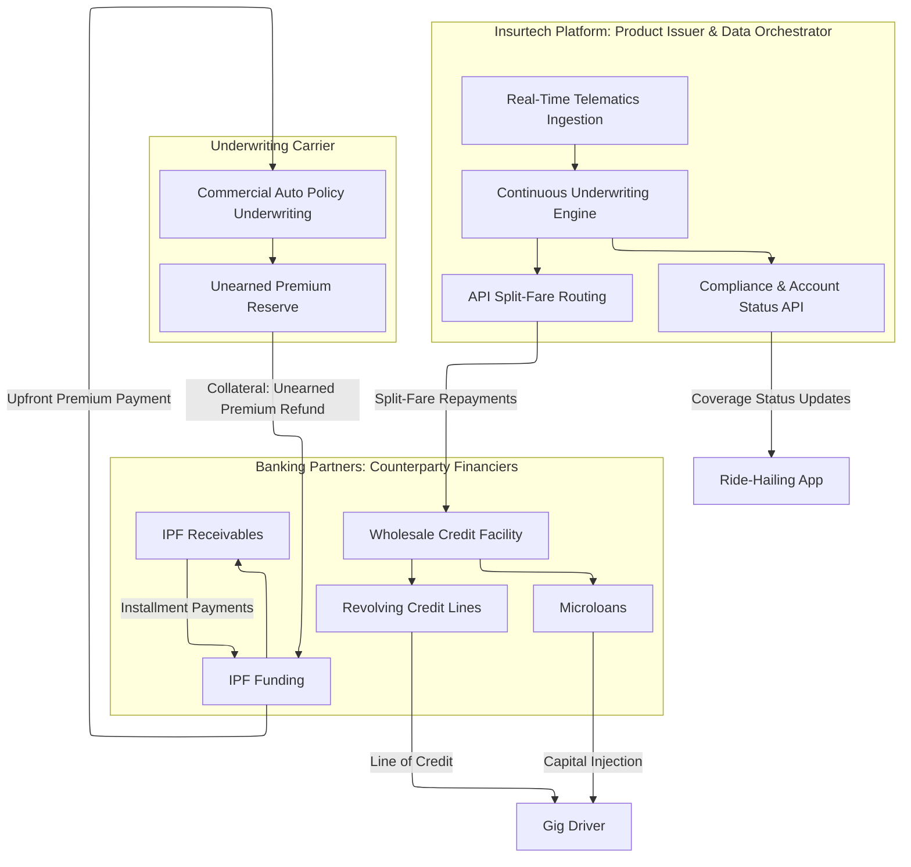

# Mwendo Pamoja: Continuous Underwriting Platform (Project Finance Memorandum)
## Bridging Continuous Underwriting and Institutional Capital for Gig-Economy Resilience

---

## Section 1: Executive Summary

Mwendo Pamoja is a continuous underwriting platform that stabilizes gig-economy cash flows to unlock safe institutional financing for African drivers. Traditional 30-day credit scoring fails gig workers. When a driver faces a minor shock - like a vehicle breakdown - they experience a total cash flow freeze, triggering simultaneous defaults on vehicle loans and Insurance Premium Financing (IPF).

To solve this, Mwendo Pamoja uses high-frequency telematics and macroeconomic data to predict a driver’s financial "suffocation threshold" in real-time. By proactively intervening before a default occurs, we keep drivers on the road. This safeguards rider livelihoods, secures predictable loan yields for banking partners, guarantees premium flows for underwriters (e.g., Jubilee, Britam), and protects transaction volumes for integrators like Oye Kenya.

Mathematically, our platform combines advanced AI (which learns complex, latent behavioral features) with an explainable, hierarchical risk model. This hybrid architecture eliminates opaque "black-box" credit decisions while maximizing predictive accuracy. To scale this safely, Mwendo Pamoja utilizes an institutional-grade project finance framework. By ring-fencing asset portfolios into bankruptcy-remote SPVs and modeling tail-risk dependencies, we ensure strict compliance with IFRS 9 (ECL) and IFRS 17 frameworks. This establishes a highly secure, scalable, and bankable conduit for institutional debt deployment into the rapidly growing African gig economy.

### 1.1 Partnership and Counterparty Structure
The operationalization of this project finance facility requires a tripartite partnership where each entity manages a specific portion of the value chain. 
*   **The Insurtech Platform (Mwendo Pamoja)** occupies the central node, maintaining API integrations with ride-hailing platforms and orchestrating split-fare cash-flow routing. Critically, Mwendo Pamoja does not fund these products from its own balance sheet, acting only as the underwriting agent and servicer.
*   **The Underwriting Carrier** (e.g., Jubilee, Britam) provides the licensed capacity to write the commercial auto policy, setting baseline actuarial pricing and holding the ultimate insurance risk.
*   **The Banking Partners** act as wholesale credit providers, funding the SPV and bearing the ultimate credit risk against these exposures.

 

**Figure 1: Integrated Ecosystem Architecture & Counterparty Orchestration**

---

## Section 2: Automated Risk Mitigation & Underwriting Architecture

Mwendo Pamoja’s proprietary underwriting platform serves as an automated risk governor for the asset portfolio, replacing slow, static credit bureau scoring with continuous risk pricing. This technology guarantees low default rates and protects institutional debt capital through a two-tiered framework.

### 2.1 Real-Time Cash Flow & Behavioral Ingestion
The platform continuously monitors borrower performance by integrating directly with vehicle sensors (telematics) and mobile wallets. By analyzing live indicators such as daily engine-on hours, operational fatigue, and immediate earnings velocity, the platform detects financial distress up to 14 days before a payment is missed. Data integrity is strictly maintained via an automated change-data-capture architecture that eliminates backtesting bias and ensures absolute data transparency for audit teams.

**The Data-to-Cash Lock (Direct Platform Escrows & Automated Split-Billing):** Crucial to protecting the SPV's cash flow, the data pipeline hooks directly into the ride-hailing platform's payment processor. Rather than relying on the driver to manually transfer funds, gross revenues are routed directly to an Insurtech-managed **escrow account**. This enables a multi-priority **Automated Split-Billing** system. 

**Collateralized Reserve Pockets:** At loan initiation, 5% of funded capital plus a 1% daily sweep of gross fares is instantly swept into a locked, yield-bearing reserve pocket to fund the SPV's Cash Reserve Account (CRA). The capital required to maintain the vehicle's operational status (insurance and debt service) is extracted at the source before the driver receives residual funds in their personal wallet.

**System Redundancy:** In the event that the high-frequency telematics stream drops or a vehicle sensor fails, the underwriting engine automatically falls back to 30-day transactional moving averages via the wallet ledger, ensuring continuous, uninterrupted credit governance.

**Microloan Repayment Mechanics:** Microloans are structured to minimize credit friction through automated, high-frequency repayment. For every completed transaction, the API intercepts the gross fare and splits it according to the contractually agreed repayment rate $r$. The repayment portion routes immediately to the SPV's escrow account. While this mechanism ensures near-zero payment friction during high-earnings periods, it creates a structural asymmetry during a macroeconomic shock (e.g., fuel spike): the deduction $r \cdot I_{\text{gross}}$ is proportional to gross earnings, but the driver's suffocation threshold depends on net earnings. This proportionality means automated deductions rise in lockstep with gross earnings, leaving the driver no leverage for survival. To prevent this from triggering a default cascade, the platform implements the dynamic exposure management detailed below.

### 2.2 Dual-Regime Risk Balancing
The risk engine evaluates borrower capacity across two distinct time horizons:
*   **Short-Term Behavioral Capacity (Real-Time Fraud & Capacity Monitoring):** Evaluates immediate driver performance, vehicle usage consistency, and daily income fluctuations to assess short-term repayment probability.
*   **Long-Term Macroeconomic Adjustments (Macroeconomic Stress Adjuster):** Tracks external shocks - including fuel price spikes, localized supply/demand shifts within the ride-hailing networks, and regulatory changes - to automatically adjust portfolio risk boundaries.

### 2.3 Regulatory Explainability & Credit Policy Rules
To meet Central Bank of Kenya (CBK) guidelines and DFI transparency requirements, the system uses a **Regulatory Compliance & Credit Policy Hard-Coding** layer (the Tabular Bypass). While advanced machine learning identifies subtle risk patterns, all final credit decisions are passed through an explicit, auditable layer governed by strict financial rules (e.g., absolute debt-to-income caps, wallet cash-flow balance). This eliminates the risk of algorithmic bias, provides clear reasons for credit declines, and guarantees auditable transparency for institutional co-investors.

### 2.4 Dynamic Portfolio Exposure Management & Cross-Product Caps
Credit limits and Insurance Premium Financing (IPF) exposures are never static. To prevent the **Adverse Utilization Trap** - where a driver begins using revolving credit as permanent income supplementation rather than a temporary working capital buffer - the platform calculates a dynamic aggregate exposure cap. The system dynamically recalibrates a driver’s revolving credit access daily based on their real-time liquidity and external economic stress. During macroeconomic downturns, the system automatically tightens portfolio leverage limits and adjusts the split-fare rate to preserve the driver's subsistence minimum, acting as an automated circuit breaker to protect the SPV’s principal capital from systemic defaults.

**Dynamic Premium Models (Usage-Based Insurance):** The fixed monthly IPF installment is structurally incompatible with highly variable weekly gig earnings. The partnership replaces it with a real-time UBI premium model: $\text{Premium}_{\text{daily}} = \text{Base}_{\text{static}} + \gamma \cdot \text{MilesDriven}_{\text{daily}}$. During low-earnings weeks, the mileage-based premium component drops to near zero. This explicitly eliminates the accumulation of large unpaid premium balances - which is the primary trigger for policy lapses and asset impoundment during economic downturns.

---

## Section 3: Project Finance Structure & Cash Flow Waterfall

To protect institutional debt capital and ensure absolute yield predictability, the financing architecture strictly isolates asset-backed portfolio risk from Mwendo Pamoja’s enterprise operational risk.

### 3.1 Bankruptcy-Remote SPV & True Sale
Mwendo Pamoja (the fintech Operating Company/HoldCo) operates solely as the technology platform originator, algorithmic underwriter, and portfolio servicer. All microloans and Insurance Premium Financing (IPF) receivables generated by the platform are legally transferred via a True Sale configuration to a newly incorporated, bankruptcy-remote **Special Purpose Vehicle (SPV)**. In the event of platform insolvency or regulatory intervention against the HoldCo, the SPV’s underlying receivables and daily cash collections remain ring-fenced, unencumbered, and exclusively accessible to debt investors.

### 3.2 Capital Stack & Credit Enhancement
The **$9.0M USD** SPV capital structure is split into distinct tranches to match institutional investor risk-return profiles, priced competitively against the Kenyan macroeconomic yield curve:

*   **Class A (Senior Debt | 75% / $6.75M):** Targeted at DFIs and Tier-1 Commercial Banks (e.g., NCBA, Standard Chartered). Priced at KES T-Bill + 200 bps. Holds first-priority rights to all interest and principal collections. Protected by 25% total subordination and a dedicated Cash Reserve Account (funded daily via the Split-Billing API). Structured as a 12-month revolving facility.
*   **Class B (Mezzanine Debt | 15% / $1.35M):** Targeted at structured credit and impact funds (e.g., FSD Africa, IFC). Target yield of 18%–22% (KES). Holds second-priority rights. Absorbs portfolio losses only after the equity tranche is fully depleted.
*   **Class C (First-Loss Equity | 10% / $0.90M):** 100% funded and retained by Mwendo Pamoja Venture Equity. This establishes direct alignment of interests; any underwriting errors or model miscalibrations completely wipe out the platform’s equity before Class A or B capital is impacted.

---

## Section 4: Risk Mitigation & Automated Credit Covenants

### 4.1 Systemic Tail-Risk Stress Framework & Credit Cushioning
Gig-economy drivers face highly correlated shocks (e.g., fuel price spikes or localized rideshare platform algorithmic changes). To protect Class A lenders from these systemic events, the SPV enforces a structural **Overcollateralisation (OC) ratio of 125%** alongside an active **Cash Reserve Account (CRA)** funded with 3 months of forward debt service. While the underlying assets are modeled using advanced mathematical tail-dependence models to map asset correlation, these physical financial buffers ensure senior debt remains absolutely insulated during a worst-case systemic default cascade.

### 4.2 Algorithmic Portfolio Governance & Triggers
The facility incorporates hard legal covenants tied directly to live underwriting telemetry to act as automatic portfolio circuit breakers:

*   **Population Stability Index (PSI) Covenant:** If the driver risk distribution drifts beyond a strict PSI threshold of 0.25 (signaling a structural market regime change), new originations freeze automatically until a third-party approved model recalibration occurs.
*   **Early Amortization Event:** If the SPV's cumulative Net Non-Performing Loan (NPL) ratio breaches 6.5% over a rolling 30-day period, the SPV instantly ceases purchasing new receivables. The portfolio enters mandatory liquidation, where 100% of incoming cash sweeps directly to pay down Class A principal.
*   **Concentration Limits:** The portfolio enforces structural diversification: max 25% exposure to any single rideshare platform ecosystem (e.g., Uber, Oye Kenya) and max 15% exposure within a single geographic urban cluster.

---

## Section 5: Regulatory Compliance & Financial Protections

### 5.1 IFRS 9 Dynamic Credit Loss Provisioning
For commercial banking partners, the underwriting platform fully automates the 3-Stage Expected Credit Loss (ECL) workflow under IFRS 9, utilizing live cash-flow telemetry to move assets between risk stages well ahead of traditional 30-day past-due bank definitions:

*   **Stage 1 (Normal Operations):** Stable cash-flow profiles and consistent wallet velocity. Standard loss provisioning applied; normal asset origination continues.
*   **Stage 2 (Significant Increase in Credit Risk - SICR):** Triggered immediately if cash-flow asymmetry rises or platform trip matching drops by more than 2 standard deviations (2$\sigma$). Origination halts for that specific driver cohort; surplus cash flows sweep to ring-fence senior notes.
*   **Stage 3 (Default/Impairment):** Triggered upon actual non-payment or breach of the driver's absolute cash survival threshold. Assets are written down, and automated legal/collateral recovery is activated.

### 5.2 Safeguarded Driver Interventions (ESG Additionality)
To satisfy DFI impact mandates, the platform integrates driver protections including Premium Holidays and Pay-Per-Mile options. Crucially, to protect debt investors, **the cost of all temporary driver leniencies is absorbed exclusively by Mwendo Pamoja's First-Loss Equity Tranche**. Lenders are guaranteed that driver-facing ESG concessions never interrupt or dilute the Senior Debt cash flow waterfall.

---

## Section 6: Portfolio Unit Economics & Yield Analysis

### 6.1 Premium Receivables Valuation & IFRS 9 Compliant Yield
The SPV operates strictly as a commercial credit provider purchasing high-frequency receivables books. While our insurance partners (Jubilee, Britam) utilize IFRS 17 frameworks for their internal policy books, the SPV accounts for its assets under IFRS 9. Portfolio cash flows are measured on a probability-weighted basis derived from our live Bayesian default distributions, adjusted dynamically for localized risk haircuts.

### 6.2 Macroeconomic Stress Testing
Monte Carlo simulations across extreme macroeconomic scenarios demonstrate the structural resilience of the Senior debt notes. Modeling assumes a highly conservative historical Net Recovery Rate (NRR) of 40% on deeply defaulted assets (via insurance claims or physical vehicle track-and-trace repossession):

| Macroeconomic Scenario | IPF Default Rate | Microloan Default Rate | Required Cash Provisioning | Class A Note Impact |
| :--- | :--- | :--- | :--- | :--- |
| **Base Case (Standard Market)** | 3.2% | 4.5% | 1.5% of Portfolio | Unimpaired (Full Target Yield) |
| **Mild Shock (Fuel Price Spike)** | 6.8% | 9.1% | 3.2% of Portfolio | Unimpaired (Protected by OC) |
| **Severe Contagion (Systemic Event)** | 14.5% | 22.0% | 8.5% of Portfolio | Principal Protected (Absorbed by Class B/C) |

### 6.3 Advance Rates and Net Interest Margin (NIM)
The SPV will advance capital against eligible driver receivables at a highly conservative **75% Advance Rate**. The blended cost of capital for the SPV across the tranches is targeted at **15.5%** (in KES equivalent). Because gig-economy short-term micro-credit and structured IPF portfolios command annualized yields exceeding 35%, the SPV generates a robust, highly predictable Net Interest Margin (NIM). This margin comfortably covers local KES interest obligations, third-party servicing costs, and automated capital provisioning while protecting investor returns.
