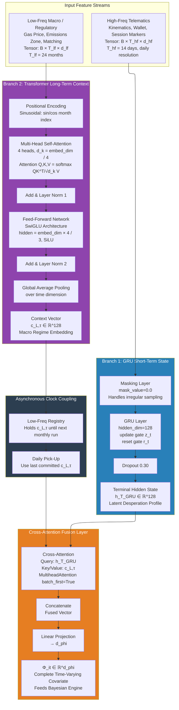
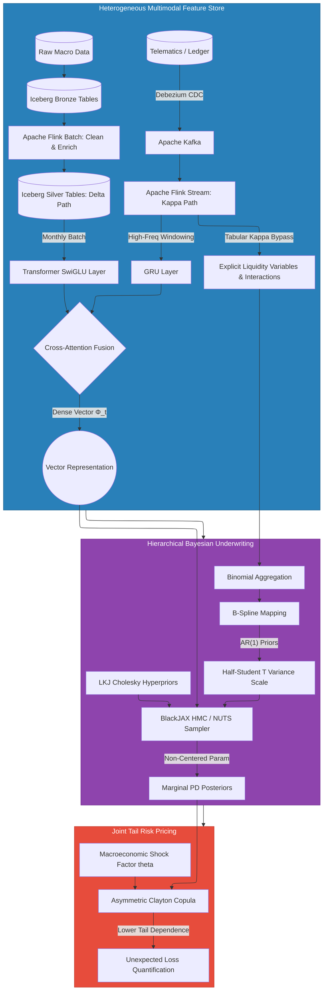

# Mwendo Pamoja HoldCo: Venture Capital Technical Pitch Memorandum

## Executive Vision & Mission

**Our Mission:** To become the fundamental underwriting infrastructure for the African gig economy, replacing exclusionary, backward-looking credit bureaus with real-time, mathematically rigorous risk engines. 

**Our Vision (The HoldCo Strategy):** We are not building a balance-sheet lender; we are building an irreplicable Artificial Intelligence and software holding company (**Mwendo Pamoja HoldCo**). Our vision is to quarantine the messy, capital-intensive lending risk into legally separate, debt-funded Special Purpose Vehicles (SPVs). This allows the HoldCo to remain asset-light, highly scalable, and focused purely on advancing our proprietary Deep Learning and Bayesian architectures. We aim to capture massive technology-driven upside through our HoldCo IP, while utilizing strictly isolated institutional debt to fund the actual gig-worker loan assets in the SPV.

---

## Section 1: Corporate Structure & Equity Financing (HoldCo vs. SPV)

This memorandum is addressed to Venture Capital (VC) and Private Equity (PE) partners evaluating an equity investment into the **Mwendo Pamoja HoldCo**. 

It is critical to distinguish the HoldCo equity structure from our operational debt facilities:
*   **The HoldCo (Where VCs Invest):** The Holding Company owns the intellectual property (IP), the proprietary Dual-Regime Neural Architecture, the codebase, and employs the engineering and underwriting teams. VC capital is deployed here to fund R&D, market expansion, and talent acquisition.
*   **The 51% Anti-Dilution Guarantee:** The founding sponsor enters Mwendo Pamoja through a parent holding entity that retains a strict, non-dilutable **51% controlling equity stake**. This structure ensures decisive corporate governance, protects founder vision, and guarantees continuity in our underwriting philosophy without risking dilution during subsequent VC funding rounds.
*   **The SPV (Where Banks Lend):** Completely separate from the HoldCo, we utilize a Bankruptcy-Remote Special Purpose Vehicle (SPV) to house the actual gig-worker loan assets. Institutional banks lend debt into this SPV. *This structure does not conflict with VC equity; it actively protects it.* If the loan portfolio underperforms, the losses are contained within the SPV, protecting the HoldCo's balance sheet and your VC equity from debt contagion.

### 1.1 Equity Distribution Strategy & Cap Table

Because the founding entity has locked in the 51% controlling stake, exactly **49%** of the equity pie remains to distribute. To ensure Mwendo Pamoja HoldCo remains highly attractive to Tier-1 Venture Capitalists, we have strategically divided that remaining 49% into specific tranches to attract top talent and align institutional incentives:

1. **The Employee Stock Ownership Plan (ESOP) Pool: 15%**
   * **Target:** Future AI/ML engineers, Chief Risk Officers, Actuaries, and key executives. 
   * **Strategic Purpose:** By defining a 15% ESOP pool at inception, we guarantee the HoldCo has the equity leverage required to hire world-class talent, preventing the "options pool shuffle" during term-sheet negotiations.

2. **The Venture Capital Allocation (The "Raise" Bucket): 20%**
   * **Target:** The Lead VC, syndicate investors, and strategic Private Equity. 
   * **Strategic Purpose:** We are allocating 20% of the HoldCo for the Seed/Series A capital injection. This provides institutional investors with substantial "skin in the game" to dedicate board resources, while leaving sufficient dilution room on the cap table for future rounds.

3. **Co-Founders and Key Early Management: 14%**
   * **Target:** The CTO, technical co-founders, and architects building the deep-tech IP. 
   * **Strategic Purpose:** This equity is placed on a standard 4-year vesting schedule with a 1-year cliff, heavily incentivizing technical leads to remain for the long term.

4. **Strategic Advisors & Ecosystem Partners: 0% (Warrants reserved)**
   * **Target:** Highly connected advisors (former bank executives, regulators) or critical ecosystem integrators. 
   * **Strategic Purpose:** Tiny fractions of equity (often issued as warrants rather than common stock) are reserved to unlock critical regulatory doors or secure exclusive data partnerships.

**Target Pre-Money Cap Table Profile**

When structuring the financing round, the equity capitalization strictly adheres to:

*   **Your Parent Company (Founder):** 51.0% *(Non-dilutable controlling stake)*

*   **Key Co-Founders / Early Execs:** 14.0% *(Subject to 4-year vesting)*

*   **Unallocated ESOP (Talent Pool):** 15.0% *(Reserved for future hires)*

*   **Available for VC Investment:** 20.0% *(What is being sold in this round)*
---

## Section 2: The Technological Moat & Proprietary Underwriting Engine

Mwendo Pamoja's proprietary underwriting engine constitutes an irreplicable Intellectual Property (IP) moat. It solves the structural flaws of gig-worker credit (temporal blindness and correlated default cascades) through a highly sophisticated **hybrid architecture** that combines advanced neural embeddings with an explainable hierarchical risk model.

### 2.1 Edge Capture and Data Engineering Pipeline
The foundation of the engine is a massive, real-time data ingestion pipeline. The driver's vehicle acts as a rolling sensor array, streaming data through a Lakehouse architecture designed for point-in-time correctness.

*   **Telematics (10Hz):** Inertial Measurement Units (IMUs) capture tri-axial acceleration and angular velocity, translating raw physical movement into behavioral indicators (e.g., harsh braking, cornering stress).
*   **Streaming CDC & Point-in-Time Correctness:** A Debezium Change Data Capture (CDC) layer streams wallet transactions and telematics into an Apache Flink processing engine. The architecture utilizes strict dual-timestamp "As-Of" joins to guarantee **Point-in-Time Correctness**. This mathematically prevents look-ahead bias, assuring financiers that the model's backtested accuracy is uncontaminated by data leakage.

### 2.2 The Dual-Regime Neural Architecture
The engine splits feature extraction into two temporal regimes, processed by distinct neural networks:

1.  **The High-Frequency GRU Branch:** A Gated Recurrent Unit processes 14 days of daily telematics and transactional kinematics. It measures metrics like **Circadian Fatigue Accumulation** (hours driven during biological sleep windows) and **Earnings Velocity** ($\nu_{\text{earn}}$). It outputs a latent "desperation profile" vector ($\mathbf{h}_T^{\text{GRU}}$).
2.  **The Low-Frequency Transformer Branch:** A Multi-Head Self-Attention Transformer processes 24 months of macroeconomic history. It tracks factors like fuel price indices, emissions zone restrictions, and **Algorithmic Matching Elasticity** (the localized density of platform trip dispatches). It outputs a structural market regime vector ($\mathbf{c}_{L,\tau}$).

These branches are asynchronously fused via Cross-Attention, dynamically weighting the driver's behavioral stress against the macroeconomic context.

 

**Figure 1: The Dual-Regime Neural Architecture**

### 2.3 Solving the "Black Box" Problem via the Tabular Bypass
Regulators and Development Finance Institutions demand explainability. A pure neural network is a regulatory "black box." Mwendo Pamoja solves this by mathematically isolating specific linear variables from the neural network and routing them via a **Tabular Bypass**. 

Variables such as **Wallet Cash-Flow Asymmetry (CFA)** (reliance on rare surge events) and explicit gig-economy interactions (e.g., ZEV mandate proximity $\times$ ICE vehicle ownership) bypass the neural encoder entirely. 

### 2.4 Continuous Underwriting via Hierarchical Bayesian Logic
The hybrid architecture takes the complex neural patterns (from the GRU/Transformer fusion) and feeds them, alongside the Tabular Bypass variables, into a **Hierarchical Bayesian Logistic Regression** layer. 

This Bayesian engine replaces a deterministic "credit score" with a full probability distribution of default, complete with explicit uncertainty quantification (Credible Intervals). By mapping the live posterior default probabilities against the driver's real-time liquidity, Mwendo Pamoja dynamically expands or compresses a driver's microloan limits. This acts as an automated risk governor, actively preventing the driver from becoming over-leveraged. **Crucially, this serves as our consumer hook: the predictive engine is utilized as an assistive financial health tool, explicitly avoiding the punitive debt traps of traditional legacy credit.**

 

**Figure 2: End-to-End Underwriting Pipeline (Data Engineering to Joint Tail Risk Pricing)**

### 2.5 The Deep-Tech Investment Precedent (Case Studies)

When evaluating Mwendo Pamoja’s architectural complexity, it is critical to observe historical venture capital precedents. The most outsized venture returns in fintech have stemmed from startups that replaced legacy infrastructure with "hard math" that incumbents could not replicate. Mwendo Pamoja is executing this exact playbook for the African gig economy.

*   **Stripe & The Ledger Abstraction:** Just as our consumer hook is our assistive predictive engine, Stripe's consumer hook was a simple "7-line API." However, its true structural moat was a globally distributed, idempotency-guaranteed ledger and a machine-learning fraud detection system (Stripe Radar) operating on a global transaction graph in milliseconds. Legacy mainframes could not match this speed [1], [2].
*   **Affirm & Machine Learning Underwriting:** Affirm discarded static FICO scores—which disadvantage thin-file consumers—and treated underwriting as a highly complex data science problem. They built proprietary ML algorithms (evaluating SKU-level data and checkout telemetry) to price loans dynamically, creating the Buy Now, Pay Later (BNPL) category without relying on punitive late fees [3], [4].
*   **Nubank & Alternative Data Graphs:** Operating in a market dominated by legacy monopolies charging 300%+ APRs, Nubank built a cloud-native architecture and utilized heavy behavioral modeling (e.g., *nuFormer*) and graph algorithms to underwrite millions of unbanked citizens using alternative data. This mathematical risk assessment allowed them to profitably capture over 90 million customers [5], [6].

*Mwendo Pamoja's Dual-Regime Neural Architecture and Bayesian logic serve as our irreplicable mathematical moat, insulating the HoldCo from both legacy African banks and simple application clones.*

**References (Deep-Tech Case Studies):**

*   [1] Stripe Engineering, "Designing robust and predictable APIs with idempotency," *Stripe Blog*. Available: https://stripe.com/blog/idempotency

*   [2] Stripe Engineering, "How we built it: Stripe Radar," *Stripe Blog*. Available: https://stripe.com/blog/how-we-built-it-stripe-radar

*   [3] M. Levchin, "The New Underwriting: Machine Learning vs. Traditional Scoring," *Affirm S-1 / Investor Day Presentations*, 2021. Available: https://investors.affirm.com/

*   [4] PYMNTS, "Affirm's Max Levchin On The Data Science Of Consumer Credit," *PYMNTS.com*. Available: https://www.pymnts.com/

*   [5] Nubank Engineering, "Building a cloud-native core banking system," *Nubank Engineering Blog*. Available: https://building.nubank.com.br/

*   [6] Nubank Data Science, "nuFormer: Sequential modeling for credit underwriting," *Nubank AI Publications*. Available: https://building.nubank.com.br/data-science/

---

## Section 3: Tail-Risk Modeling via Asymmetric Copulas

Gig workers are highly exposed to correlated macroeconomic shocks. A sudden ride-hailing platform algorithmic change could theoretically trigger simultaneous defaults across thousands of independent drivers. 

To prove that this contagion is contained, Mwendo Pamoja utilizes **Asymmetric Clayton Copulas**. Copulas are advanced statistical functions used to model the joint default probabilities between different product lines (IPF and microloans). The *asymmetry* of the Clayton Copula specifically models tail dependence, proving to risk teams that the platform correctly prices extreme, highly correlated downside shocks (like a localized driver strike).

## Section 4: Algorithmic Fairness & Redlining Prevention (ESG Compliance)

To satisfy regulatory mandates regarding consumer protection, anti-discrimination, and ESG (Environmental, Social, and Governance) impact goals, the neural engine embeds an **Equalized Odds** constraint. 

By applying Maximum Mean Discrepancy (MMD) regularization to the loss function, Mwendo Pamoja guarantees that variables like *Circadian Fatigue* do not become proxies for geographic redlining or demographic discrimination. For VC investors, this embedded fairness mathematically protects the HoldCo from regulatory fines and reputational damage while perfectly aligning with the impact-investing criteria of major DFIs.

---

## Appendix A: Comprehensive Technical Glossary

This glossary aggregates all specialized variables, economic concepts, and architectural components utilized by the underwriting engine.

### 1. Economic & Domain Concepts
*   **Correlated Default Cascade:** The phenomenon where a gig driver's default on a small microloan triggers a cascading inability to pay larger obligations (like vehicle leases or Insurance Premium Financing).
*   **Suffocation Threshold ($I_{\text{net}} < S$):** The critical boundary where a driver's net operational income falls below their minimum structural debt service requirements.
*   **Insurance Premium Financing (IPF):** A credit product that allows drivers to pay expensive annual insurance premiums in small daily/weekly installments, collateralized by the unearned premium.
*   **Algorithmic Redlining:** A statistical bias vulnerability where a neural network learns to penalize protected demographic groups. Mitigated via **Equalized Odds** and **MMD regularization**.

### 2. Engineered Variables: The Neural Pipeline
*   **Wallet Cash-Flow Asymmetry (CFA):** The ratio of a driver's top 5% outlier surge earnings to their baseline rolling average. 
*   **Earnings Velocity ($\nu_{\text{earn}}$):** The ratio of net earnings realized over the trailing 7 days compared to the driver's historical 90-day baseline. 
*   **Algorithmic Matching Elasticity:** A macroeconomic proxy measuring the localized density and availability of trip dispatches in a specific market.
*   **Circadian Fatigue Accumulation:** The integration of trailing hours driven during a driver's historical biological sleep window.

### 3. Engineered Variables: The Tabular Bypass
*   **Dynamic Debt-to-Liquidity Ratio (DLR):** Total short-term debt obligations divided by the 7-day rolling average net wallet balance. Modeled via explicit non-linear B-Splines.
*   **Repayment Velocity ($v_{\text{repay}}$):** Ratio of principal actually repaid to the contractually scheduled repayment. Modeled via explicit non-linear B-Splines.
*   **Explicit Interaction Set ($\mathcal{G}$):** Specific pairwise interactions routed directly to the Bayesian layer.

### 4. Deep Learning & Data Architecture
*   **Dual-Regime Neural Architecture:** The core predictive engine split into two temporal regimes: High-frequency telematics (GRU) and Low-frequency macro context (Transformer).
*   **Gated Recurrent Unit (GRU):** A sequential neural network that processes 14 days of daily telematics to output a terminal hidden state ($\mathbf{h}_T^{\text{GRU}}$).
*   **Multi-Head Self-Attention Transformer:** A parallel neural network that processes 24 months of macroeconomic and regulatory history to output a context vector ($\mathbf{c}_{L,\tau}$).
*   **Cross-Attention Feature Fusion:** The mechanism that dynamically weights which macro "Keys/Values" from the Transformer are most relevant to the driver's current GRU stress level.
*   **Point-in-Time Correctness:** An engineering guarantee (enforced via Debezium CDC) preventing look-ahead bias during model training.

### 5. Bayesian & Probabilistic Architecture
*   **Hierarchical Bayesian Logistic Regression:** The final underwriting engine outputting a full posterior probability distribution of default, explicitly quantifying uncertainty.
*   **B-Splines:** Mathematical functions used to explicitly model non-linear relationships directly in the Bayesian layer without using a neural network.
*   **Hamiltonian Monte Carlo (HMC):** The advanced Markov Chain Monte Carlo sampling algorithm used to efficiently compute the Bayesian posterior distributions.
*   **Asymmetric Clayton Copula:** A statistical function used to link the default probabilities of different products, specifically capturing *tail dependence*.
