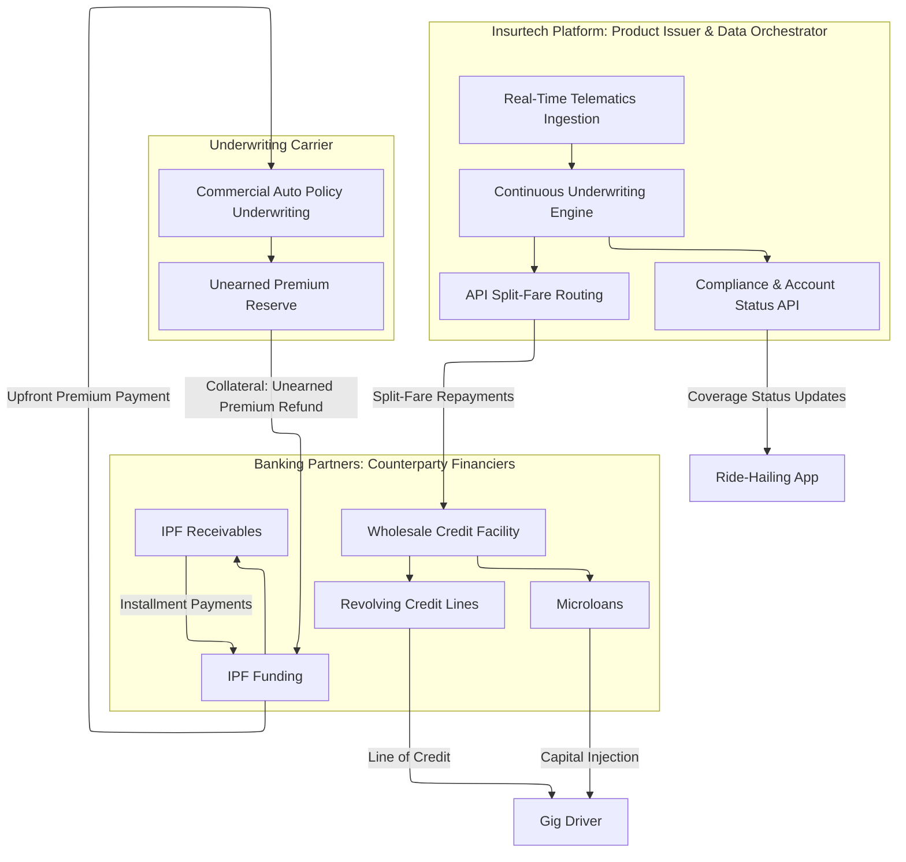
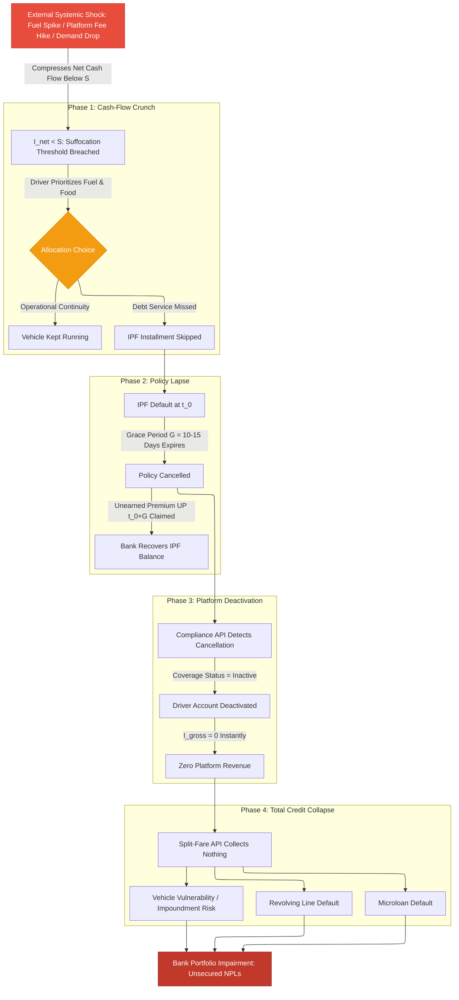
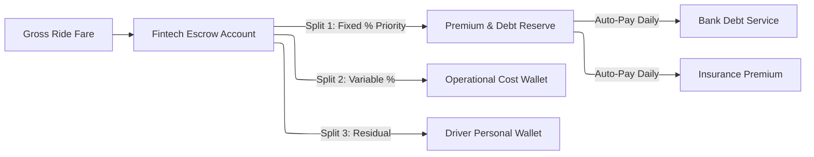

# Introduction to the Insurtech Product-Issuer Ecosystem

## The Gig Driver as a Unified Asset Class

*Core Architectural Question: How can InsureTech and Embedded Finance be employed to continuously understand, predict, and stabilize the cashflow of gig workers while enabling banking partners to embed and finance multiple products satisfying both banking and insurance regulatory frameworks?*

In the traditional consumer finance and commercial lending paradigms, risk underwriting relies on the structural separation of personal liabilities and corporate assets. Underwriters evaluate individual borrowers based on stable, predictable salary streams verified via tax returns, or corporate borrowers based on balance sheet strength and ring-fenced business cash flows. The gig-economy driver, however, defies this binary classification entirely, representing a highly volatile, hybrid economic entity that occupies neither category cleanly.

In this paper, the gig driver is defined as a **unified asset class** whose entire economic viability and capacity to service debt are concentrated within a single digital node: the active platform account on a ride-hailing or delivery application. This concentration is the root structural cause of all correlated default risk that follows. To solve this, the architecture proposed herein abandons punitive, extractive lending in favor of creating **shared value for all stakeholders and counterparties** - protecting the driver from default cascades while simultaneously safeguarding the balance sheets of lenders, insurers, and strategic platform partners.

For a gig driver, the primary income-generating asset is the vehicle. Under traditional frameworks, auto financing, auto insurance, and personal credit are treated as wholly separate consumer products, underwritten by different institutions against different risk factors. In the embedded finance ecosystem, however, the vehicle's operational status and the driver's platform account status are inextricably linked within a single, indivisible cash-flow chain. The driver's net daily fare volume  -  gross earnings minus the platform's take-rate and operating expenses  -  represents the sole cash-flow engine backing all financial commitments simultaneously.

Let $I_{\text{gross}}$ denote the driver's gross fare volume per day, $\tau_{\text{platform}}$ the platform commission rate, $C_{\text{ops}}$ daily operational costs (fuel, vehicle wear-and-tear, congestion charges), and $r$ the automated split-fare repayment deduction rate on outstanding debt. The driver's net take-home pay $I_{\text{net}}$ is then:

$$I_{\text{net}} = I_{\text{gross}} \cdot (1, \tau_{\text{platform}}), C_{\text{ops}}, r \cdot I_{\text{gross}}$$

Let $S$ be the driver's daily subsistence threshold  -  the minimum cash required to cover basic living expenses (food, shelter, personal health). The **cash-flow suffocation boundary** is crossed when:

$$I_{\text{gross}} \cdot (1, \tau_{\text{platform}}, r), C_{\text{ops}} < S$$

When this inequality holds, the automated split-fare deduction takes precedence over all other disbursements. The driver cannot defer the loan payment. There is no safety buffer, no alternative income stream, and no diversifying asset. This is the mathematical condition that triggers the entire default cascade described in Section 3 [2]. The driver's lack of asset diversification  -  the vehicle serving simultaneously as personal and professional asset  -  means that any credit extended to this population is exposed to the operational risks of the platform itself, the physical risks of the road, and macroeconomic variables affecting consumer ride demand, all within the same moment of failure.

## The Triple-Product Capital Stack

To enable and sustain a gig driver's operations, the embedded finance partnership deploys three distinct financial products forming a layered capital stack that addresses different operational needs, cash-flow cycles, and risk time horizons. Understanding the contractual mechanics of each product is prerequisite to understanding how a single external shock can cascade simultaneously across all three.

### Product 1: Insurance Premium Financing (IPF)

Commercial auto insurance is a mandatory regulatory and platform prerequisite for any driver carrying passengers or cargo. Commercial policies for high-utilization ride-hailing vehicles carry elevated actuarial risk and therefore substantial annual premiums  -  typically 150,000 to 300,000 Local Currency Units (LCU) per year depending on geography and driver risk profile. Most gig drivers lack the liquid capital to pay this premium upfront, creating the financing opportunity.

Under the IPF structure, the banking partner pays the entire annual premium $P_{\text{total}}$ directly to the underwriting carrier at $t = 0$. The driver then repays the bank in scheduled weekly or monthly installments. The bank's primary collateral security is the **Unearned Premium Reserve**: the portion of the premium the carrier must legally refund if the policy is cancelled mid-term. At any time $t$ during the policy term $T$ (typically 365 days), the unearned premium asset is:

$$UP(t) = P_{\text{total}} \cdot \left(1, \frac{t}{T}\right)$$

The bank structures the driver's repayment schedule such that the outstanding loan balance $L_{\text{outstanding}}(t)$ remains below the unearned premium value at all times:

$$L_{\text{outstanding}}(t) < UP(t) \cdot (1, \delta)$$

where $\delta$ is a safety-margin haircut (typically 10"“15%) absorbing administrative cancellation delays and accrued interest. If the driver defaults on an installment, the bank exercises its power of attorney, cancels the policy, and claims the unearned premium refund directly from the carrier to write down the outstanding balance.

This structure contains a critical operational vulnerability invisible to standard IPF models. If the driver misses an IPF payment, the policy does not cancel instantly; it enters a contractually mandated **grace period** of 10 to 15 days. During this window, the driver continues to operate the vehicle  -  which is now, for practical purposes, uninsured. Any accident during this window exposes the driver to full personal liability. In the gig-economy context, a major collision does not merely produce an insurance claim; it frequently destroys or impounds the vehicle itself, eliminating the primary income-generating asset and guaranteeing default on every other outstanding credit product simultaneously.

### Product 2: Microloans

Microloans are retail, high-frequency, short-duration capital injections  -  typically 5,000 to 25,000 LCU with maturities of 7 to 30 days  -  designed to cover acute, immediate cash-flow gaps. They are funded via the bank's wholesale financing of the Insurtech's short-term credit lines and are amortized through daily or weekly automated split-fare deductions.

The pro-cyclical structure of microloan repayment is the key risk feature. The split-fare deduction rate $r$ is fixed at origination. When gross fare volume $I_{\text{gross}}$ falls  -  due to fuel price shocks, algorithmic demand changes, or weather  -  the deduction rate remains constant. The driver's net take-home pay compresses mechanically, even as the marginal cost of every mile driven (fuel expense) increases. The suffocation boundary tightens from both sides simultaneously: $I_{\text{gross}}$ declines while $C_{\text{ops}}$ rises. This pro-cyclicality ensures that the period of maximum financial stress on the driver is precisely the period during which the automated repayment system is extracting cash from their wallet at the highest relative proportion of their reduced income.

### Product 3: Revolving Credit Lines

Revolving credit lines  -  typically 25,000 to 100,000 LCU  -  are working capital buffers designed to absorb lumpy operational shocks: major vehicle servicing, tire replacements, unexpected medical expenses, or vehicle licensing renewals. Under normal operating conditions, the driver draws down the line when needed and repays gradually as earnings recover, maintaining vehicle uptime and platform presence without interruption.

Let $U_i(t) = B_i(t) / L_i$ be the credit utilization rate for driver $i$ at time $t$, where $B_i(t)$ is the outstanding balance and $L_i$ is the total credit limit. Under normal conditions, $U_i(t)$ oscillates as the driver cycles draws and repayments. Under a sustained structural income shock, the behavioral dynamic changes fundamentally. The driver is no longer using the line to smooth temporary operational expense spikes; they are using it as permanent income supplementation to cover basic consumption (rent, groceries, school fees). This is the **adverse utilization trap**. Once entered, the probability of reaching maximum utilization converges to certainty:

$$\lim_{\Delta t \to \infty} P\left(U_i(t + \Delta t) = 1.0 \;\middle|\; I_{\text{net}} < S\right) = 1.0$$

When multiple drivers across a cohort simultaneously reach $U_i = 1.0$, the revolving portfolio ceases to revolve. The assets freeze, transitioning from liquid, short-duration revolving exposures into stagnant, non-amortizing term debt. The structural income downturn means drivers lack surplus cash flow to reduce balances. For the financing bank, this concentration produces a sharp simultaneous spike in both Exposure at Default (EAD)  -  every line fully drawn  -  and Loss Given Default (LGD), since these are unsecured claims with no physical collateral.

## Partnership and Counterparty Structure

The operationalization of this triple-product stack requires a tripartite partnership where each entity manages a specific portion of the value chain. The **Insurtech Platform** occupies the central operational node: it maintains direct API integrations with ride-hailing platforms and vehicle telematics hardware, issues the usage-based insurance (UBI) policy, hosts the driver-facing application, monitors driving behavior, and orchestrates split-fare cash-flow routing. Critically, the Insurtech does **not** fund any of these products from its own balance sheet. It acts as underwriting agent and servicer only.

The **Underwriting Carrier** provides the licensed capacity to write the commercial auto policy. It sets baseline actuarial pricing, holds the ultimate insurance risk, and is legally obligated to refund unearned premiums upon cancellation. The **Banking Partners** act as wholesale credit providers: they fund the microloan and revolving credit portfolios via warehouse lending facilities extended to the Insurtech, and they fund the IPF transactions by purchasing the premium finance receivables. Banks bear the ultimate credit risk and must hold regulatory capital against these exposures under Basel IV guidelines  -  while depending entirely on the Insurtech's data pipelines for real-time monitoring and underwriting signals.

# Siloed Product Mechanics and Structural Interdependencies

## Microloan Repayment Mechanics

Microloans in this context are structured to minimize credit friction through automated, high-frequency repayment. Rather than relying on the driver to manually initiate a bank transfer at month-end, the Insurtech utilizes a **split-fare API** linked directly to the ride-hailing platform's payment gateway. For every completed transaction, the API intercepts the gross fare and splits it according to the contractually agreed repayment rate $r$. The repayment portion routes immediately to the banking partner's escrow account, while the remainder deposits into the driver's digital wallet.

While this mechanism ensures near-zero payment friction during high-earnings periods, it creates a structural asymmetry. The deduction $r \cdot I_{\text{gross}}$ is proportional to gross earnings, but the suffocation threshold depends on the relationship between net earnings and the subsistence floor $S$. This proportionality means that during a fuel shock  -  when drivers must earn *more* gross volume simply to maintain the same net income  -  the absolute quantum of automated loan deductions rises in lockstep with their gross earnings, leaving them no leverage to redirect cash toward basic survival. The split-fare deduction is constitutionally senior to all other disbursements, including food and fuel.

## Revolving Credit Lines as Working Capital Buffers

Revolving credit lines are designed to act as operational shock absorbers. A transmission failure requiring an immediate 60,000 LCU repair would normally sideline the driver for weeks, eliminating all income. A revolving line allows immediate repair financing, platform return within 24"“48 hours, and balance repayment over several subsequent earnings cycles.

However, the revolving product's risk profile transforms fundamentally when a structural market-wide income downturn occurs. The diagnostic signature of this transition is an upward-sloping, non-reversing utilization trajectory combined with declining repayment velocity. A portfolio health monitoring system must distinguish between a driver experiencing a temporary operational shock (transient high utilization with strong repayment momentum) and a driver entering the adverse utilization trap (permanent draw with zero repayment).

## Insurance Premium Financing Operational Asset Structure

The unearned premium collateral mechanism that makes IPF structurally sound under normal conditions becomes a systemic amplifier under a cascade [3]. The grace period creates a dangerous window during which the bank's collateral position is technically intact  -  the unearned premium refund can still be claimed  -  but the driver's income-generating asset (the vehicle) is operating uninsured. A single high-severity collision during this window eliminates the vehicle, terminates the platform account, and simultaneously destroys the collateral for the IPF, the income source for microloan repayment, and the cash flow for revolving line service. All three credit products default at the same instant that the bank's security position is most impaired.

# The Mechanics of the Correlated Default Cascade

## Anatomy of an External Shock

The fundamental vulnerability of the hybrid insurtech-banking portfolio is its exposure to **systemic, non-diversifiable shocks** [4]. In a traditional commercial lending portfolio, a bank achieves diversification by lending across different industries. In the gig-economy portfolio, although the bank is lending to thousands of individual drivers, they all operate within the same micro-sector, rely on the same platform infrastructure, consume the same fuel markets, and are subject to the same regulatory environment. An external shock hitting any of these common factors hits all borrowers simultaneously.

Three primary shock categories are relevant:

1. **Macroeconomic Cost Shocks:** A sustained spike in global crude oil prices translates into localized fuel price increases. Fuel is the primary variable operating cost $C_{\text{ops}}$ for ride-hailing drivers. This shock immediately compresses net margins without any change in gross revenue, bringing drivers below the suffocation threshold $I_{\text{net}} < S$ en masse.

2. **Platform Algorithmic Shocks:** Ride-hailing platforms frequently adjust algorithms, changing base fare rates, surge pricing multipliers, or their own take-rates $\tau_{\text{platform}}$. A 5% increase in the platform's commission fee directly reduces every driver's net revenue without any corresponding change in passenger demand. The financial impact is equivalent to a proportional cut in gross fares, with no recourse for the driver.

3. **Consumer Demand Contractions:** A macroeconomic recession or drop in local economic activity reduces consumer discretionary spending on ride-hailing services. Longer inter-trip wait times reduce the driver's effective hourly earning rate even without any change in per-trip economics, causing $I_{\text{gross}}$ to decline as a function of platform utilization.

## The Multi-Product Default Domino Effect

When an external shock occurs, it triggers a sequential, multi-product default cascade. The mechanism is deterministic once the suffocation threshold is breached.

- **Phase 1  -  The Cash-Flow Crunch:** The external shock compresses $I_{\text{net}}$ below $S$. Faced with a rational choice between purchasing fuel to continue working tomorrow and paying the monthly IPF installment, the driver prioritizes operational continuity. The IPF payment is missed at time $t_0$.

- **Phase 2  -  The Policy Lapse:** The banking partner initiates the cancellation sequence. Once the grace period $[t_0, t_0 + G]$ expires without payment, the commercial auto policy is officially cancelled. The bank claims the unearned premium $UP(t_0 + G)$ from the carrier. The refund is applied to the outstanding IPF loan balance. The bank's direct exposure to IPF may be largely recovered  -  but the cascading consequences are about to dwarf this initial protection.

- **Phase 3  -  The Platform Deactivation:** The Insurtech's compliance monitoring system detects the policy cancellation event in real-time. Because ride-hailing platforms require continuous proof of active commercial coverage to permit driver logins, the Insurtech's compliance API transmits the cancellation status to the platform. The platform's automated compliance engine immediately deactivates the driver's account, blocking all ride acceptance. $I_{\text{gross}}$ drops to zero at the moment of deactivation.

- **Phase 4  -  Total Credit Collapse:** With the platform account deactivated, the split-fare API has no transactions to intercept. Microloan and revolving line repayments cease simultaneously. The driver has no alternative income source. Both credit products enter default at exactly the same moment  -  not sequentially, but in lockstep  -  precisely when the driver's earning capacity has been permanently severed.

## The Diversification Illusion: Endogenous Default Correlation

Traditional credit risk portfolio management relies on the assumption that a diverse portfolio of financial products is structurally hedged against individual obligor failures. The mathematical representation of portfolio variance $\sigma_p^2$ for a multi-asset portfolio is:

$$\sigma_p^2 = w_1^2 \sigma_1^2 + w_2^2 \sigma_2^2 + 2 w_1 w_2 \rho_{12} \sigma_1 \sigma_2$$

where $w_i$ are portfolio weights, $\sigma_i^2$ are individual product variances, and $\rho_{12}$ is the pairwise default correlation. In a standard retail banking portfolio, the correlation $\rho$ between auto insurance lapses, microloan defaults, and revolving credit card defaults is structurally low (typically $0.15 < \rho < 0.30$) because borrowers' income sources are diversified across different employers and economic sectors. A recession that impairs one borrower may leave another unaffected.

In the gig-economy insurtech-banking partnership, this diversification is an illusion. All three products are backed by the identical cash-flow engine  -  the single platform account. Under normal economic conditions, the products appear to behave independently because different drivers experience different idiosyncratic shocks (one driver's vehicle breaks down; another's does not). However, when a **systemic shock** occurs  -  a macro fuel spike, a platform-wide fee change  -  the default correlation is not merely elevated; it converges toward unity:

$$\lim_{\text{Shock} \to \infty} \rho_{ij} \to 1.0$$

Under these conditions, the joint probability of simultaneous default across all three products:
$$P(D_{\text{micro}} \cap D_{\text{revol}} \cap D_{\text{IPF}})$$
increases non-linearly. Standard credit risk models relying on Gaussian Copulas assume a constant, symmetric correlation matrix and therefore systematically underestimate this joint default probability. The Gaussian Copula exhibits symmetric tail dependence: it models identical co-movement in both good times and bad times. Empirically, gig-economy credit defaults cluster exclusively in the lower tail  -  bad times  -  not the upper tail. This asymmetric dependence structure motivates the **Clayton Copula framework** developed in Part 2b, which natively models lower tail dependence with zero upper tail dependence:

$$\lambda_L = 2^{-1/\alpha_c} > 0 \qquad \lambda_U = 0$$

As the macroeconomic shock severity increases, the Clayton parameter $\alpha_c$ increases, and $\lambda_L \to 1.0$  -  modeling absolute lockstep default across the entire triple-product stack.

# Portfolio-Level Strategic Risk Mitigation

To prevent the correlated default cascade from destroying the partnership, the Insurtech and its banking partners must implement four specific operational and financial controls designed to mathematically break the feedback loops identified above. These controls are not merely operational best practices; they directly suppress the Clayton Copula parameter $\alpha_c$ during stress periods by attenuating the common-shock transmission mechanism.

## Cross-Product Exposure Caps

Banks must abandon independent credit limits for individual products and instead calculate a **dynamic aggregate exposure cap** $EC_i(t)$ for each driver, continuously updated from real-time telematics and transaction data:

$$EC_i(t) = f\left(I_{\text{gross}, i}(t),\, U_i(t),\, \theta_i(t)\right)$$

where $I_{\text{gross},i}(t)$ is the trailing 7-day moving average of gross earnings, $U_i(t)$ is current revolving utilization, and $\theta_i(t)$ is the real-time Bayesian posterior probability of default generated by the underwriting engine (detailed in Part 2b). When $U_i(t) > 0.80$ or $\theta_i(t)$ crosses a regionally calibrated threshold, the system automatically freezes further revolving draws, reduces new microloan principal, and dynamically adjusts the split-fare rate $r$ to preserve $I_{\text{net}} > S$.

## Dynamic Premium Models (Usage-Based Insurance)

The fixed monthly IPF installment is structurally incompatible with highly variable weekly gig earnings. The partnership replaces it with a real-time UBI premium model:

$$\text{Premium}_{\text{daily}} = \text{Base}_{\text{static}} + \gamma \cdot \text{MilesDriven}_{\text{daily}}$$

where $\text{Base}_{\text{static}}$ is a minimal daily fee covering the vehicle while parked, $\gamma$ is a variable risk rate (per mile) computed from the driver's real-time telematics score (braking frequency, speeding, night-driving concentration), and $\text{MilesDriven}_{\text{daily}}$ is GPS-verified. During low-earnings weeks, the mileage-based premium component drops to near zero. This eliminates the accumulation of large unpaid premium balances  -  the primary trigger for policy lapses during economic downturns.

## Direct Platform Escrows

The partnership establishes direct API linkages with the ride-hailing platform's payment processor. Rather than routing gross fares to the driver's personal wallet and attempting debit later, the platform routes revenues directly to an Insurtech-managed escrow account operating a multi-priority split:

This priority carve-out guarantees that capital required to maintain the vehicle's operational status  -  insurance and debt service  -  is extracted at the source before the driver can access funds. The policy remains active, and the bank's cash-flow pipeline is protected, as long as *any* revenue flows through the platform.

## Collateralized Reserve Pockets

When a new microloan or credit facility is initiated, 5% of the funded capital plus a 1% daily sweep of gross fares routes automatically into a locked, yield-bearing reserve pocket pledged as collateral to the financing bank. Let $R_i(t)$ be the reserve pocket balance for driver $i$. On a missed payment:

$$R_i(t) \leftarrow R_i(t), \Delta P$$

where $\Delta P$ is the payment deficit. The pocket must be sized to cover at least two weeks of insurance premiums and microloan interest. This buffer gives the driver a temporary liquidity cushion during acute shocks  -  keeping the vehicle insured and the platform account active  -  while reducing the bank's net LGD. For the Bayesian underwriting engine, the reserve pocket balance enters directly as a component of the Dynamic Debt-to-Liquidity Ratio, updating the posterior PD in real time as the buffer depletes.

Part 2a details the data engineering pipeline - from edge telematics capture through Debezium, Kafka, and Apache Flink - and the multi-frequency feature extraction powering the GRU and Transformer branches feeding the Bayesian engine. Part 2b develops the complete Hierarchical Bayesian Logistic Regression framework, its MCMC scaling mechanics, and the Asymmetric Clayton Copula model for joint tail risk quantification. Part 3 translates these model outputs into regulatory capital frameworks (IFRS 9, Basel IV, Solvency II, IFRS 17), enforces algorithmic fairness via Equalized Odds constraints, and operationalizes the entire system as an assistive ecosystem that prevents the cascade rather than merely documenting it after the fact.

## References

[1] N. K. et al., "Exploring Bayesian Hierarchical Models for Multi-Level Credit Risk Assessment," *ResearchGate*, 2024. [Online]. Available: https://www.researchgate.net/publication/384155942_EXPLORING_BAYESIAN_HIERARCHICAL_MODELS

[2] "Credit Risk Modeling Using Bayesian Networks," *ResearchGate*, [Online]. Available: https://www.researchgate.net/publication/220063243_Credit_Risk_Modeling_Using_Bayesian_Networks

[3] M. Brenndoerfer, "Credit Default Swaps: Pricing, Hazard Rates & Valuation," [Online]. Available: https://mbrenndoerfer.com/writing/credit-default-swaps-cds-pricing-valuation

[4] "Smart risk prediction: The rise of Bayesian models in finance," *ResearchGate*, [Online]. Available: https://www.researchgate.net/publication/396237160_Smart_risk_prediction

[5] "AI-driven Credit Risk Modeling: Leveraging Big Data Analytics to Improve Financial Stability," *ResearchGate*, [Online]. Available: https://www.researchgate.net/publication/396449858_AI-driven_Credit_Risk_Modeling

