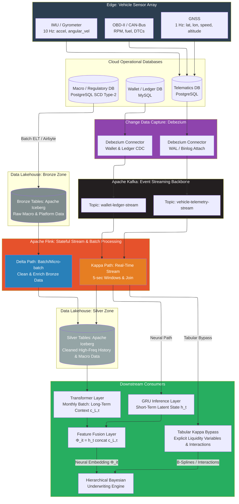
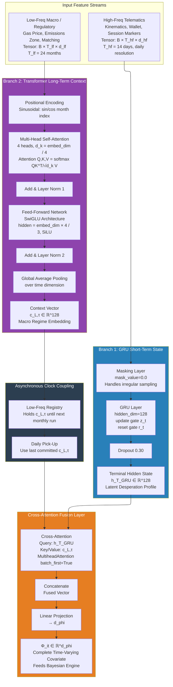

# Introduction to Continuous Underwriting Data Architectures

*Core Architectural Question: How can InsureTech and Embedded Finance be employed to continuously understand, predict, and stabilize the cashflow of gig workers while enabling banking partners to embed and finance multiple products satisfying both banking and insurance regulatory frameworks?*

Transitioning from the descriptive mechanics of the correlated default cascade outlined in Part 1, this section establishes the mathematical and computational architecture required to *predict and preempt* these failures before they materialize in the loss ledger. By doing so, the predictive architecture abandons punitive extraction and instead generates profound **shared value for all stakeholders and counterparties**: stabilizing the driver's cash flow, preserving the strategic partner's ecosystem, and protecting the ultimate underwriting insurers. The fundamental inadequacy of static credit bureau scores for the gig-economy population requires no lengthy argument: a driver's financial state can cross the suffocation threshold $I_{\text{net}} < S$ within 48 hours of a fuel price shock or a platform take-rate adjustment. A bureau score reflecting the driver's financial position three months prior carries zero predictive weight at this temporal resolution.

Two structural failure modes characterize static scoring for gig workers. First, **temporal blindness**: the score reflects state at the last bureau pull, not at the moment of credit decision. Second, **population mismatch**: bureau models are trained on salaried employment histories, where income follows Gaussian distributions. Gig income distributions are heavy-tailed and power-law: most drivers cluster around a median income, but extreme upside volatility (surge pricing windfall weeks) and extreme downside volatility (mechanical failures, weather disruptions) are orders of magnitude more common than Gaussian models predict. Fitting a Gaussian model to a power-law population produces a systematic underestimate of tail default risk — precisely the catastrophic failure mode that destroys the banking partner's capital position.

The architecture described in this section replaces the static bureau score with a **live posterior probability distribution** over each driver's default probability, updated daily from a dual-regime deep learning pipeline and passed to the Hierarchical Bayesian inference engine developed in Part 2b [6]. This framework splits the feature extraction pipeline into two distinct temporal regimes: **high-frequency behavioral dynamics** managed via Gated Recurrent Units (GRUs) operating on daily telematics, wallet transactions, and kinematic data [8]; and **low-frequency structural dependencies** managed via Multi-Head Self-Attention Transformers consuming monthly macro conditions, platform configuration changes, and regulatory regime shifts [9], [10]. Crucially, these two regimes operate on incompatible clock cycles and must be fused via an asynchronous hidden-state pipeline that guarantees point-in-time correctness — eliminating the look-ahead bias that would render any historically-backtested model unusable in production.


# Edge Capture: Hardware Layer and Raw Data Format

Before any streaming architecture can be discussed, the physical origin of the data must be understood precisely. The gig driver's vehicle is a rolling sensor array. At the telematics hardware level, three distinct sensor families generate the raw input streams:

**IMU / Gyrometer Layer:** The Inertial Measurement Unit records tri-axial linear acceleration ($a_x, a_y, a_z$) and tri-axial angular velocity ($\omega_x, \omega_y, \omega_z$ — roll, pitch, yaw rates). At a 10 Hz sampling rate, this yields 60 scalar measurements per second per vehicle. Hard braking events manifest as $|a_y| > 0.6g$ sustained over a 500-millisecond window. Cornering stress appears as elevated $|a_x|$ during low-speed, high-angular-velocity maneuvers (tight urban turns). Fatigue-induced lane drift manifests as oscillating low-amplitude $\omega_z$ at anomalous frequencies during highway segments.

**GNSS Layer:** The Global Navigation Satellite System receiver generates latitude, longitude, altitude, instantaneous speed (km/h), and heading at 1 Hz (1 sample per second). Speed data cross-validates the OBD-II reading, enables geofence computation, and provides the ground-truth mileage feed for the UBI per-kilometer premium calculation $\text{Premium}_{\text{daily}} = \text{Base}_{\text{static}} + \gamma \cdot \text{MilesDriven}_{\text{daily}}$.

**OBD-II / CAN-Bus Layer:** The On-Board Diagnostics interface exposes the vehicle's internal CAN bus, providing engine RPM, throttle position, fuel level (%), manifold air pressure, coolant temperature, and Diagnostic Trouble Codes (DTCs). DTCs are alphanumeric fault codes that indicate mechanical failures before they become operationally disabling — a P0301 cylinder misfire code, for instance, is a 72-hour leading indicator of an engine failure that will sideline the driver entirely.

On arrival at the cloud infrastructure, all sensor streams converge into tabular records in PostgreSQL or MySQL operational databases with the schema:

```
timestamp (BIGINT, unix microseconds)
vehicle_id (UUID)
lat (FLOAT8), lon (FLOAT8), altitude_m (FLOAT4), speed_kmh (FLOAT4)
accel_x, accel_y, accel_z (FLOAT4)    -- m/s^2
g_force_lateral, g_force_longitudinal (FLOAT4)
angular_vel_x, angular_vel_y, angular_vel_z (FLOAT4)   -- rad/s
rpm (INT), fuel_pct (FLOAT4)
dtc_codes (TEXT[])
```

A fleet of 50,000 active vehicles at 10 Hz generates approximately 30 billion raw rows per day. Periodic SELECT polling of this volume introduces multi-second query latency, creates lock contention on the operational database's write path, and is constitutionally incompatible with the sub-minute underwriting update cadence required for real-time credit limit management. A fundamentally different architecture is required.


# Architectural Implementation: Refined Data Engineering Pipeline

The Insurtech's data engineering backbone implements a modern **Lakehouse streaming architecture** organized around four sequential layers: Change Data Capture, Event Streaming, Real-Time Stream Processing, and Open-Format Lakehouse storage. This pipeline ensures that high-frequency telematics events are scored in near-real-time by the GRU inference layer, while simultaneously building the immutable long-term historical record that the Transformer queries for macro context encoding, as detailed in **Figure 1**.

<br>

**Figure 1: Multimodal Data Engineering Pipeline**


## Change Data Capture via Debezium

Debezium attaches directly to the PostgreSQL Write-Ahead Log (WAL) or MySQL binary log. Rather than querying the operational database on a schedule, Debezium receives a notification for every committed row-level INSERT, UPDATE, or DELETE event — typically within 50 milliseconds of the transaction commit. Each event is serialized into a structured **envelope** in Apache Avro or JSON format, containing: `before` (the row state prior to the change), `after` (the row state after), `op` (operation type: `c` = create, `u` = update, `d` = delete), `ts_ms` (the source database commit timestamp), and `ts_us` (the Debezium processing timestamp). This dual-timestamp structure is critical for point-in-time correctness, developed in Section 5.

No polling, no lock acquisition, no query latency. The telematics stream at 10 Hz propagates to the downstream pipeline within sub-second wall-clock latency.

## Apache Kafka: Fault-Tolerant Event Streaming

Debezium publishes all change events to dedicated Apache Kafka topics, organized by data domain. The `vehicle-telemetry-stream` topic is partitioned by `vehicle_id` key, guaranteeing that all events for a specific driver arrive at a specific partition in sequential commit order. This partition-level ordering invariant is essential for GRU temporal processing — the neural network requires that $\mathbf{x}_{t-1}$ is always processed before $\mathbf{x}_t$ for the same driver.

Kafka's retention policy implements a tiered storage strategy: a 7-day hot window on NVMe SSD for low-latency GRU stream consumption, with automated tiered offload to object storage (S3 or GCS) for long-term archival. The archived topics serve as the historical data source for Transformer training and periodic full-model retraining.

## Apache Flink: Stateful Real-Time Stream Processing

Apache Flink consumes the Kafka topics via the Flink SQL or DataStream API, executing four classes of real-time operations in parallel:

1. **Tumbling Window Aggregations:** 5-second tumbling windows aggregate raw telematics into the per-window statistics required for feature engineering — mean speed, peak G-force, count of hard-braking events, fuel consumption delta. These window outputs serve as the input vectors $\mathbf{x}_t^{\text{tele}}$ for the GRU layer.

2. **Hard-Braking and Operational Stress Rules:** Stateless rule evaluators flag individual events exceeding configurable thresholds. A hard-braking event is flagged when $|a_{\text{brake}}| > 0.6g$ sustained over 500ms. Fatigue detection fires when cumulative consecutive driving hours within a single session exceed a configurable threshold (typically 10 hours without a 30-minute break). DTC code detection flags any non-empty `dtc_codes` array, immediately triggering an alert to the underwriting engine.

3. **Temporal Table Joins for Point-in-Time Correctness:** Flink's `FOR SYSTEM_TIME AS OF` syntax implements zero-look-ahead joins between the high-frequency telematics stream and low-frequency macro state tables:

```sql
SELECT
    t.vehicle_id,
    t.window_end_ts,
    t.mean_speed_kmh,
    t.peak_g_force,
    m.gas_price_index,
    m.platform_commission_pct,
    r.zev_mandate_tier
FROM telematics_windows AS t
JOIN macro_table FOR SYSTEM_TIME AS OF t.window_end_ts AS m
    ON t.jurisdiction_code = m.jurisdiction_code
JOIN regulatory_table FOR SYSTEM_TIME AS OF t.window_end_ts AS r
    ON t.jurisdiction_code = r.jurisdiction_code
```

This join syntax guarantees that a telemetry window closing at `window_end_ts` receives the macro state valid at exactly that moment — not the state committed 30 minutes later by an ongoing data pipeline run.

4. **ACID Lakehouse Sink:** In parallel with GRU inference feeding, Flink sinks all processed records to the Lakehouse via Apache Iceberg's transactional write protocol. Iceberg's ACID guarantees ensure that Transformer training data reads a consistent snapshot of the historical record, uncontaminated by in-flight write operations.

## Data Lakehouse: Unified Tiered Storage (The Delta Architecture)

A Delta Architecture (often called a Data Lakehouse) is designed to store massive amounts of historical data reliably so that data scientists can train AI models on it offline. It uses a concept called the "Medallion Architecture" to represent data as it gets cleaner and more refined. The Lakehouse implements a three-tier table architecture:

*   **Bronze Tables (Raw Data / SCD Type 2):** This is the ultimate source of truth. When a new platform regulation or a raw fuel price change is detected, it is dumped here exactly as it arrived. It stores macroeconomic conditions, regulatory schedules, and platform configuration snapshots as Slowly Changing Dimension Type 2 records with `valid_from` and `valid_to` columns.
*   **Silver Tables (Cleaned & Filtered):** The data engineering pipeline (Apache Flink) cleans the Bronze data. It handles missing values, converts timestamps, and partitions the data by `vehicle_id` and `date`. Each partition contains the chronologically ordered sequence of Flink-windowed feature vectors for a specific driver. These are the input sequences consumed by the Transformer's monthly batch processing to construct the 12–24 month historical token window $\mathbf{X}^{\text{macro}}$.
*   **Gold Tables (Business-Level Aggregates):** These are highly refined tables used for reporting and analytics. For example, a Gold table might show "Average Monthly Default Rate per Geohash." These tables are explicitly consumed by business intelligence dashboards (e.g., Metabase, Tableau) for executive oversight and portfolio monitoring.

**The Problem with Delta for Underwriting:** 
Delta architecture relies on writing files to disk (like AWS S3 or GCS). Writing and reading from disk takes seconds or minutes. If a driver requests a microloan, the system cannot wait 30 seconds for the Delta Lake to retrieve their wallet balance.

## The Kappa Architecture (The "Stream")

The Kappa Architecture was invented to solve the speed problem. In a Kappa architecture, everything is treated as a continuous stream of events. There is no "batch" database to query for real-time decisions. When data streams in (like a Debezium CDC event showing a driver just spent $10), a stream processor like Apache Flink updates the driver's total wallet balance in its internal RocksDB memory (or an external high-speed memory cache like Redis) instantly. Because the data lives in active memory (not written to a slow disk), the inference engine can fetch the driver's exact wallet balance in under 2 milliseconds.

### The Mwendo Pamoja Case Study: Why Both Are Required

Consider a real-time scenario where a driver requests a microloan at 2:00 PM on a Tuesday. The system has 100 milliseconds to approve or deny it. This requires orchestrating data across both offline batch and real-time streaming architectures.

**1. The Transformer (Using Delta / Low-Frequency):** The Transformer model needs to know the macroeconomic context (fuel prices, inflation, platform commission rates over the last 24 months). This data changes very slowly. Once a month, the system trains the Transformer on the massive historical Silver Tables in the Delta Lake. The Transformer outputs a single dense "context vector" ($\mathbf{c}_{L,\tau}$) that represents the current economy. That vector just sits quietly waiting to be used.

**2. The GRU & Cross-Attention (Kappa / High-Frequency):** Simultaneously, the driver's real-time kinematic telemetry is processed by the GRU ($\mathbf{h}_T^{\text{GRU}}$). The system uses a Cross-Attention Fusion layer to fuse the GRU's current behavioral state with the Transformer's macro context vector, generating a single, unified neural representation of the driver's risk state ($\mathbf{\Phi}_{it}$).

**3. The Tabular Bypass (Using Kappa / Liquidity):** The Bayesian risk model *also* needs to know the driver's exact Wallet Cash-Flow Asymmetry (CFA) right at this second. The system cannot query the Delta Lake for this; it’s too slow. Instead, every time the driver earns or spends a cent, the Debezium stream updates the driver's CFA in a lightning-fast Redis cache (Kappa Architecture).

**The Moment of Decision:** At exactly 2:00 PM, the system fuses the two worlds. It pulls the fused neural vector ($\mathbf{\Phi}_{it}$) from the Cross-Attention layer and instantly grabs the live wallet CFA from the Redis cache (via the Kappa Bypass). It feeds them both into the Bayesian risk model, generating a mathematically rigorous approval/denial in 45 milliseconds. You use Delta to understand the past, and Kappa to react to the present.

## Low-Frequency Data Ingestion: Macro, Regulatory, and Platform Context

The Transformer's effectiveness depends on ingesting all structural factors that affect gig-driver earning capacity and credit risk on timescales longer than the GRU's daily window. Four categories are relevant:

- **Macroeconomic conditions** (gas price index, CPI, central bank policy rate): Monthly API pulls from BLS, World Bank, IMF. Python Airflow DAGs commit results to Bronze SCD Type 2 tables with the `effective_date` of the official publication.
- **Platform algorithmic regimes** (Uber/Bolt base fare floors, surge dampening coefficients, commission rates): Webhook integrations or read-replicas of platform configuration databases, updated every 1"“4 hours. Changes in platform configuration are the highest-velocity low-frequency inputs and must be reflected in the Transformer context within hours of a change, not months.
- **Regulatory and ZEV mandates** (gig-worker reclassification laws, metropolitan vehicle permit caps, zero-emission vehicle transition deadlines): Web-scraping pipelines and legal API feeds, committed with the regulatory `effective_date` and `jurisdiction_code`. Mapped to geohash zones for regional driver impact computation.
- **Urban infrastructure events** (prolonged highway reconstructions, corridor capacity changes): Open Street Map and city open-data feeds. Relevant because permanent road closures or capacity degradation durably depress hourly earning capacity for all drivers operating specific geohash corridors.


# Point-in-Time Correctness: The Asynchronous As-Of Join Matrix

The single greatest engineering hazard in building a retrospective underwriting model is **look-ahead bias**: inadvertently allowing a historical feature to contain information that was not yet available at the time of the decision the model is trained on. If a training record for a driver at `2024-03-15 11:30 AM` contains the gas price index that was only committed to the Lakehouse at `2024-03-15 12:00 PM` — due to pipeline ingestion latency — the model will learn spurious correlations that do not generalize to real-time deployment. The result is a model that appears highly accurate in backtesting but systematically fails in production.

The dual-timestamp structure embedded by Debezium — `ts_ms` (source event time $T_e$) and `ts_us` (Debezium system commit time $T_s$) — enables rigorous prevention. The operational constraint for every join is:

$$\max(T_s) \leq T_{hf}$$

That is, a high-frequency event at time $T_{hf}$ may only join to low-frequency records whose system commit time $T_s$ is strictly less than or equal to $T_{hf}$. This eliminates all forward injection regardless of pipeline latency. Flink's `FOR SYSTEM_TIME AS OF` syntax implements this constraint natively, using the Debezium `ts_us` field as the versioning key.

When no new low-frequency record has been committed since the last join, the pipeline applies a **Zero-Order Hold**: the last committed macro state is broadcast unchanged across all subsequent high-frequency events until a new commitment arrives. This is equivalent to the asynchronous decoupled clock cycle of the GRU/Transformer dual-regime architecture: the Transformer's $\mathbf{c}_{L,\tau}$ vector is held constant across all daily GRU cycles until a new monthly Transformer run produces $\mathbf{c}_{L,\tau+1}$.

The Feature Store pattern (implemented via Feast or Hopsworks) formalizes this into a production artifact: a **spine** entity DataFrame containing $(t, \text{vehicle\_id})$ tuples is submitted for point-in-time retrieval. The Feature Store executes an as-of join across three distinct Feature Views — the high-frequency telematics view, the low-frequency macro view, and the financial ledger view — each enforcing its own `valid_from`/`valid_to` boundary lookup. The returned training DataFrame is guaranteed to contain only information that was objectively available at each historical timestamp.


# Exhaustive Feature Engineering for the Gig-Economy

Before feeding data into the neural architectures, raw telemetry and transactional logs must be engineered into financially meaningful feature vectors. The gig driver's risk profile demands features that capture liquidity constraints, operational stress, behavioral degradation, and structural macro exposure simultaneously.

## High-Frequency Behavioral Stream (GRU Input Path)

**Kinematic features:** Speed EMA computed over 1-minute, 5-minute, and 15-minute trailing windows. Braking delta $\Delta|a_{\text{brake}}|$ (change in peak braking G-force between consecutive windows). Cornering lateral G-force. Angular velocity variance (yaw oscillation, indicative of fatigue-driven lane instability). These features collectively constitute the driver's real-time **operational stress signature**.

**Temporal session markers:** Consecutive driving hours within the current session (reset on breaks $> 30$ min). Shift-start time encoded as a cyclical feature: $\sin(2\pi h / 24)$, $\cos(2\pi h / 24)$ where $h$ is the hour of shift start. Hours since last 30-minute break. Circadian fatigue accumulation: integration of trailing 7-day hours driven during the driver's biological sleep window (the highest-stress but highest-surge-opportunity period).

**Wallet transaction microfeatures:** Daily net deposit velocity (net wallet balance change per hour of driving). Trip-to-trip income variance within a session (high intra-session variance indicates erratic demand, a precursor to DLR deterioration). Daily cash-out ratio (proportion of wallet balance withdrawn within 24 hours — high ratios indicate the driver is living on platform earnings with no buffer).

**Engineering transformations:** All EMA windows use decay $\lambda$ calibrated to the half-life of the underlying physical process (braking stress half-life $\approx$ 2 hours; wallet velocity half-life $\approx$ 3 days). Standard scaling is applied against a **rolling global parameter set** updated monthly from the full fleet distribution — preventing feature drift as the driver population expands. For irregularly sampled windows (sensor dropout, offline periods), a masking token $m_k \in \{0, 1\}$ is appended to the feature vector (detailed in Section 8).

**Input tensor:** $\mathbf{X}^{\text{tele}} \in \mathbb{R}^{B \times T_{hf} \times d_{hf}}$ where $B$ is batch size, $T_{hf} = 14$ days (daily resolution lookback), and $d_{hf}$ is the telematics feature dimension.

## Low-Frequency Structural Context (Transformer Input Path)

**Macroeconomic indicators:** Gas price index (7-day percentage change from 30-day trailing mean — removes level effects; captures rate-of-change signal). CPI-adjusted real wage index for the driver's metropolitan area (normalizes nominal earnings against purchasing power drift). Central bank policy rate (affects driver consumer demand through discretionary income compression).

**Platform configuration:** Surge dampening coefficient (weekly update frequency). Base fare floor percentage change from the previous month. New competitor market entry indicator (binary flag; entry of a new ride-hailing competitor typically compresses surge pricing across the market). Algorithmic matching elasticity (internal metric proxying the localized dispatch density).

**Regulatory environment:** Emissions zone restriction intensity for the driver's primary jurisdiction (ordinal encoding: 0 = no restriction, 1 = announced pricing, 2 = active tolling, 3 = complete combustion ban). Gig-worker classification statute status (binary: reclassified to employee status / independent contractor). Metropolitan vehicle permit utilization rate (fraction of total licensed permits currently active — a proxy for market saturation).

**Urban infrastructure:** Major corridor disruption indicator for geohashes where the driver operates more than 30% of their trips. Highway reconstruction duration in weeks (longer duration = permanent earning capacity depression for affected geohash corridors).

**Engineering:** Target encoding for categorical regulatory zone identifiers (smoothed target encoding using a Bayesian hierarchical mean to prevent overfitting to small jurisdiction groups). Percentage change from trailing 30-day average for all numerical macro indicators. **Input tensor:** $\mathbf{X}^{\text{macro}} \in \mathbb{R}^{B \times T_{lf} \times d_{lf}}$ where $T_{lf} = 24$ monthly tokens and $d_{lf}$ is the macro feature dimension.

## Driver Liquidity and Solvency Features (Tabular Bypass)

**Architectural Routing Note: Eliminating Structural Multicollinearity**
The most critical structural vulnerability in hybrid Neural-Bayesian models is **structural multicollinearity**: if the same raw financial data is fed into the deep neural embeddings *and* explicitly provided as a linear term to the Bayesian layer, the downstream coefficients become unidentifiable. To resolve this, continuous financial liquidity metrics strictly bypass the neural network. 

Unlike the macroeconomic variables which are read from the Bronze/Silver Delta tables (Lakehouse), the high-velocity Tabular Bypass variables (like real-time wallet balance and Dynamic DLR) utilize a strict **Kappa Architecture online path**. Flink processes the Debezium CDC streams and continuously materializes these live state variables into a **low-latency Online KV Store (e.g., Redis)**. At the moment of a credit decision, the inference service fetches these tabular variables in sub-milliseconds, routing them directly into the Hierarchical Bayesian risk model and completely bypassing the neural network.

**Wallet Cash-Flow Asymmetry (CFA):**

$$\text{CFA}_i(t) = \frac{\text{Sum of Top 5\% High-Surge Earnings}_i(t)}{\text{30-day Rolling Avg Net Wallet Balance}_i(t)}$$

A CFA exceeding 1.0 defines a boundary of extreme structural dependency on outlier surge events: the driver is sustaining their operational cash flow using rare algorithmic windfalls, with zero baseline stability. At CFA = 2.0, the driver would face immediate insolvency without those rare tail events — a manifestly unsustainable cash flow profile.

**Wallet Cash Flow Volatility ($\sigma_{\text{wallet}}$):** The 30-day rolling standard deviation of daily net earnings. This feature is critical because two drivers with identical mean earnings but different variances carry radically different cascade probabilities. High variance (even with an acceptable mean) dramatically elevates the probability of a single bad day triggering the suffocation threshold $I_{\text{net}} < S$.

**Time Since Last Zero-Balance Event — Exponential Recency Decay:**
A complete wallet depletion yesterday carries exponentially more predictive weight regarding an impending IPF lapse than a depletion from 24 months prior. This recency structure is captured via dual encoding:
- **Decay transform:** $e^{-\lambda \cdot \Delta T}$ where $\Delta T = T_{\text{current}}, T_{\text{last depletion}}$ in days and $\lambda = 0.01$ is calibrated to the empirical half-life of liquidity recurrence in gig-worker cohort survival analysis.
- **Binary indicator:** $\mathbf{1}[\text{has\_ever\_depleted}] \in \{0, 1\}$. Both features enter the model simultaneously — the decay captures recency, the indicator captures the permanent structural fragility signal.

**Earnings Velocity ($\nu_{\text{earn}}$):** The ratio of net earnings actually realized over the trailing 7 days to the 90-day moving average baseline:

$$\nu_{\text{earn}} = \frac{\text{Realized Earnings (7d)}}{\text{Historical Baseline (90d)}}$$

Velocity $< 1.0$ indicates cash-flow suffocation onset — the driver is falling behind their historical earning capacity. Velocity $> 1.0$ indicates overcoverage — the driver is overperforming, a strong negative PD signal. Decelerating velocity (velocity was $> 1.0$ but is trending toward $< 1.0$ over consecutive windows) is a leading indicator of impending cascade onset.

**Reserve Pocket Balance ($R_i(t)$):** The balance of the Collateralized Reserve Pocket as a fraction of the driver's total outstanding liability. A depleting reserve pocket (fraction declining toward zero) signals that the driver is already drawing the emergency buffer and has no remaining cushion.

**Processing:** These features completely bypass the neural embedding layers to avoid structural multicollinearity. They are modeled explicitly in the downstream Bayesian layer via B-Splines. To handle the extreme heteroskedastic structural breaks and fat-tailed outlier distributions typical in gig-worker cash flows, the B-spline coefficients are robustly regularized using **Half-Student T priors** on their variance hyperparameters [18], [19]. This acts as a heavy-tailed scale mixture that aggressively shrinks noise toward zero during stable periods while allowing extreme, localized liquidity shocks to escape shrinkage without penalty.

## Gig-Economy Specific Interaction Effects

Standard credit models include generic interaction terms. In the gig-economy context, four specific pairwise interactions carry structural economic meaning. To prevent structural multicollinearity with the neural embeddings (which dynamically model implicit interactions), these four specific explicit interaction pairs (forming the set $\mathcal{G}$) **strictly bypass the neural encoder**. They are routed directly to the Hierarchical Bayesian Logistic Regression layer as orthogonal linear terms:

1. **High revolving utilization ($U_i > 0.80$) Ã,  Prior delinquency indicator:** Captures the adverse utilization trap onset. A driver with prior delinquency who is now at 85% utilization is not merely at elevated risk — they are likely already inside the cascade mechanism, using the revolving line as income supplementation rather than operational smoothing.

2. **Platform commission increase event Ã,  High DLR:** Models the immediate cash-flow compression from take-rate increases on already-leveraged drivers. A driver at DLR = 0.90 (barely solvent) who experiences a 3% commission increase may cross DLR = 1.0 instantly. This interaction captures the non-linear amplification of platform shocks on marginal drivers.

3. **Late-night driving concentration Ã,  Microloan arrears:** The "desperation driving" profile — a driver who has shifted to late-night high-surge hours to maximize gross earnings precisely because they are behind on microloan payments. This interaction is a leading indicator of the final behavioral state before cascade: the driver is maximizing short-term cash at maximum personal risk, with zero remaining behavioral flexibility.

4. **ZEV mandate deadline proximity Ã,  ICE vehicle ownership:** Models the forced capital expenditure that diverts repayment cash flow. As ZEV transition deadlines approach, ICE vehicle owners face accelerated depreciation, mandatory compliance costs, and potential platform deactivation notices. This diversion of cash toward transition capital reduces the effective DLR headroom precisely as the driver faces structural uncertainty.


# The Dual-Regime Neural Architecture

The multi-scale feature extraction architecture processes the two neural feature streams - telematics (GRU) and macro (Transformer) - in parallel and fuses their outputs into a single high-dimensional covariate vector $\mathbf{\Phi}_{it}$. The financial liquidity variables completely bypass this neural network and are fed directly into the downstream Hierarchical Bayesian Logistic Regression engine alongside $\mathbf{\Phi}_{it}$, as illustrated in **Figure 2**.

<br>

**Figure 2: The Dual-Regime Neural Architecture**


## Branch 1: Gated Recurrent Units for Short-Term Latent State

The GRU processes the high-frequency telematics tensor $\mathbf{X}^{\text{tele}} = [\mathbf{x}_1^{\text{tele}}, \ldots, \mathbf{x}_{T_{hf}}^{\text{tele}}]$ sequentially, maintaining a hidden state $\mathbf{h}_t^{\text{GRU}} \in \mathbb{R}^{d_1}$ that accumulates the driver's behavioral trajectory. At each time step $t$, the GRU executes:

**Update gate** — determines how much of the previous hidden state to carry forward:
$$\mathbf{z}_t = \sigma(\mathbf{W}_z \mathbf{x}_t^{\text{tele}} + \mathbf{U}_z \mathbf{h}_{t-1}^{\text{GRU}} + \mathbf{b}_z)$$

**Reset gate** — controls how much of the previous hidden state is relevant to the candidate:
$$\mathbf{r}_t = \sigma(\mathbf{W}_r \mathbf{x}_t^{\text{tele}} + \mathbf{U}_r \mathbf{h}_{t-1}^{\text{GRU}} + \mathbf{b}_r)$$

**Candidate hidden state** — the proposed new content for the hidden state, modulated by the reset gate:
$$\tilde{\mathbf{h}}_t = \tanh(\mathbf{W}_h \mathbf{x}_t^{\text{tele}} + \mathbf{U}_h (\mathbf{r}_t \odot \mathbf{h}_{t-1}^{\text{GRU}}) + \mathbf{b}_h)$$

**Final hidden state** — interpolation between old and candidate states, controlled by the update gate:
$$\mathbf{h}_t^{\text{GRU}} = (1, \mathbf{z}_t) \odot \mathbf{h}_{t-1}^{\text{GRU}} + \mathbf{z}_t \odot \tilde{\mathbf{h}}_t$$

where $\sigma(\cdot)$ denotes the sigmoid function and $\odot$ the Hadamard (element-wise) product. The weight matrices $\mathbf{W}_z, \mathbf{W}_r, \mathbf{W}_h \in \mathbb{R}^{d_1 \times d_{hf}}$ operate on the input, while $\mathbf{U}_z, \mathbf{U}_r, \mathbf{U}_h \in \mathbb{R}^{d_1 \times d_1}$ operate on the recurrent state.

At the end of the evaluation window $T_{hf}$, the terminal hidden state $\mathbf{h}_{T}^{\text{GRU}} \in \mathbb{R}^{d_1}$ is extracted as the compressed, latent representation of the driver's short-term behavioral and operational risk profile. When a driver is accumulating fatigue hours, experiencing declining wallet velocity, and showing elevated braking G-forces simultaneously, the GRU's update gate learns to suppress the reset of relevant state dimensions — carrying forward the compounding distress signature across multiple days. This latent vector encodes the **desperation profile**: the unobserved state that links excessive driving hours, declining cash-flow velocity, and impending microloan arrears into a single high-dimensional representation.

GRUs are preferred over LSTMs in this deployment for three reasons: fewer learnable parameters (2 gate matrices vs. 3), lower per-step inference latency (critical for sub-minute underwriting update SLAs at API gateways), and equivalent or superior empirical performance on short-memory tasks where the lookback horizon is bounded.

## Branch 2: Multi-Head Self-Attention Transformers for Long-Term Context

The Transformer branch processes the low-frequency structural context sequence $\mathbf{X}^{\text{macro}}$ — a 24-month history of macro indicators, regulatory shifts, and platform configuration changes. Unlike the GRU, which processes tokens sequentially and accumulates state through recurrent connections, the Transformer processes all positions in the sequence simultaneously via self-attention. This parallel architecture eliminates the vanishing gradient problem over long sequences and allows the model to directly learn relationships between a regulatory change enacted 18 months ago and a current platform fee structure, regardless of temporal distance.

**Positional encoding** is applied before the attention layers to inject temporal ordering information that the position-agnostic attention mechanism cannot infer from content alone:

$$\text{PE}(\text{pos}, 2i) = \sin\left(\frac{\text{pos}}{10000^{2i/d_{\text{model}}}}\right), \quad \text{PE}(\text{pos}, 2i+1) = \cos\left(\frac{\text{pos}}{10000^{2i/d_{\text{model}}}}\right)$$

The core computation is scaled dot-product attention. The input sequence is linearly projected into Query ($\mathbf{Q}$), Key ($\mathbf{K}$), and Value ($\mathbf{V}$) matrices, each of dimension $d_k$:

$$\text{Attention}(\mathbf{Q}, \mathbf{K}, \mathbf{V}) = \text{softmax}\left(\frac{\mathbf{Q}\mathbf{K}^T}{\sqrt{d_k}}\right)\mathbf{V}$$

The $\sqrt{d_k}$ scaling term prevents the dot products from growing in magnitude with embedding dimension, which would push the softmax into saturation regions with near-zero gradients. With $H = 4$ parallel attention heads, the multi-head variant runs 4 independent attention computations on projected subspaces of dimension $d_k = d_{\text{model}} / H$ and concatenates the results, allowing different heads to specialize on different structural dependencies — one head may learn to track platform commission regime changes, another to track ZEV mandate escalation trajectories, another to track macro fuel price cycles.

Each Transformer block follows a pre-norm architecture: Layer Normalization → Attention → Residual Add → Layer Normalization → **SwiGLU Feed-Forward Network (SiLU activation)** → Residual Add [20], [21]. The legacy ReLU activation is replaced by the smooth, non-monotonic **SiLU (Swish)** function ($f(x) = x \cdot \sigma(x)$). By dynamically gating the linear projections, SwiGLU preserves subtle negative macroeconomic signals and provides superior representational capacity and smooth gradient flow compared to standard two-layer FFNs. Global average pooling over the time dimension aggregates the $T_{lf}$ token representations into a single dense context vector $\mathbf{c}_L \in \mathbb{R}^{d_2}$.

## Asynchronous Dual-Rate Clock Coupling

The GRU operates on a daily cycle: at midnight, the system processes the day's accumulated telematics and wallet vectors to produce $\mathbf{h}_t^{\text{GRU}}$. The Transformer operates on a monthly cycle (or event-triggered cycle upon receipt of a new macro/regulatory update): it ingests the updated 24-month token sequence and generates a new context vector $\mathbf{c}_{L,\tau+1}$.

The **low-frequency registry** holds the last completed Transformer output $\mathbf{c}_{L,\tau}$ as a static vector. At any given day $t$, the daily GRU pipeline queries the registry, retrieves $\mathbf{c}_{L,\tau}$ (the context from the last monthly run), and passes it to the fusion layer alongside $\mathbf{h}_t^{\text{GRU}}$:

$$\mathbf{e}_{it} = [\mathbf{h}_t^{\text{GRU}} \parallel \mathbf{c}_{L,\tau}]$$

This zero-order hold ensures: (1) the Transformer's expensive full-sequence computation runs only once per month (or on event trigger), not daily; (2) the daily GRU cycle has access to the most recent structural context without requiring daily macro recalibration; (3) point-in-time correctness is maintained — $\mathbf{c}_{L,\tau}$ was computed using macro data available strictly before $\tau$.

## Cross-Attention Feature Fusion

Naive concatenation $\mathbf{\Phi}_{it} = [\mathbf{h}_T^{\text{GRU}} \parallel \mathbf{c}_{L,\tau}]$ treats all feature sources as equally weighted and does not model cross-stream interactions. If a driver's telematics look healthy (low G-force, stable speed) but their financial indicators have just deteriorated and the macro Transformer has detected a fuel price spike, the naive concatenation provides no mechanism for the macro and financial signals to amplify each other in the downstream Bayesian layer.

**Cross-attention fusion** resolves this: the GRU output $\mathbf{h}_T^{\text{GRU}}$ serves as the **Query** (the question: "given my current behavioral state, which structural factors are most relevant?"). The Transformer vector $\mathbf{c}_{L,\tau}$ serves as the **Keys and Values** (the structural factors available to condition on). The cross-attention mechanism assigns dynamic attention weights that amplify macro-structural context precisely when the behavioral state signals imminent cascade onset. The result is projected through a linear layer to produce the final fused covariate vector $\mathbf{\Phi}_{it} \in \mathbb{R}^{d_\phi}$.


# Handling Asynchronous Clock Cycles and Missing Data

## Missing Data Strategies (MNAR: Missing Not At Random)

Low-frequency underwriting streams — credit bureau inquiries, regulatory employment registries, platform account verification records — are notoriously subject to structured missingness. In this context, missing data is almost never Missing Completely At Random (MCAR). A driver who has intentionally avoided credit bureau reporting to conceal prior debts is Missing Not At Random (MNAR): the absence of the data is itself a risk signal. Standard imputation methods (mean-substitution, median imputation) artificially compress the variance of the imputed distribution, systematically underestimating the risk signal embedded in the missingness pattern.

**Strategy A — Learned Masking Embedding Tokens:** For every low-frequency input feature $x_k$, a binary indicator $m_k \in \{0, 1\}$ is appended, where $m_k = 1$ signals a missing value. Both are passed through the Transformer's input projection layer:

$$z_k = W_x x_k + W_m m_k$$

The Transformer learns independent projection weights $W_m$ for each feature's missingness indicator. Through gradient descent, $W_m$ converges to a penalized attention weight that explicitly captures the risk signature of intentional data concealment. The model learns *what it means* for a specific feature to be absent — not just to ignore its absence.

**Strategy B — Bayesian Generative Imputation:** Missing structural variables are treated as unknown parameters within the Bayesian inference layer. Rather than imputing a point estimate, a hierarchical prior is defined using the broader distribution of the driver's geographic cohort $j$:

$$X_{\text{missing},j} \sim \mathcal{N}(\mu_{\gamma_j}, \sigma_{\gamma_j}^2)$$

The MCMC engine infers the missing parameters jointly with the probability of default during sampling. Crucially, the uncertainty of the missing value is fully propagated into the posterior distribution of the driver's PD: a driver with a missing bureau report will have a **wider credible interval** around their estimated PD than a driver with complete data. This wider interval automatically triggers the Uncertainty Kill-Switch (developed in Part 2b), compressing credit limits until more data streams in to narrow the distribution.

**Strategy C  -  Decoupled Multi-Head Cascade Engine:** Three pre-trained engine configurations are maintained simultaneously: the **Full Engine** (GRU + Transformer + Tabular Bypass), the **Behavioral-Only Engine** (GRU + Tabular Bypass, no macro context), and the **Macro-Only Engine** (Transformer + Tabular Bypass, no telematics). A real-time data quality router monitors the completeness of each incoming feature batch and hot-swaps the active inference engine based on which streams are available. The alternative engines are calibrated against wider prior distributions, automatically generating more conservative posterior PD estimates and compressed credit limits during periods of infrastructure outage or data pipeline failure.

## The Feature Fusion Vector as the Interface to Bayesian Inference

At the close of each daily evaluation interval, the cross-attention fusion layer outputs $\mathbf{\Phi}_{it} \in \mathbb{R}^{d_\phi}$  -  a dense, high-dimensional vector that encodes the driver's neural time-varying risk state: behavioral kinematics from the GRU and macro-structural context from the Transformer, fused with dynamic cross-modal attention weights. This vector enters the subsequent Bayesian inference layer alongside the explicit Tabular Bypass features.

The transition from deterministic neural embedding to probabilistic default estimation  -  the precise step at which the model generates not just a risk score but a **full posterior distribution over default probability** with explicit quantified uncertainty  -  is the subject of Part 2b.


## References

[1] M. Brenndoerfer, "Credit Default Swaps: Pricing, Hazard Rates & Valuation," [Online]. Available: https://mbrenndoerfer.com/writing/credit-default-swaps-cds-pricing-valuation

[2] "AI-driven Credit Risk Modeling: Leveraging Big Data Analytics to Improve Financial Stability," *ResearchGate*, [Online]. Available: https://www.researchgate.net/publication/396449858_AI-driven_Credit_Risk_Modeling

[3] "Smart risk prediction: The rise of Bayesian models in finance," *ResearchGate*, [Online]. Available: https://www.researchgate.net/publication/396237160_Smart_risk_prediction

[4] "Credit Risk Modeling Using Bayesian Networks," *ResearchGate*, [Online]. Available: https://www.researchgate.net/publication/220063243_Credit_Risk_Modeling_Using_Bayesian_Networks

[5] C. Xu, "Deep learning on mixed frequency data," *Journal of Forecasting*, 2023. [Online]. Available: https://onlinelibrary.wiley.com/doi/full/10.1002/for.3003

[6] "Exploring Bayesian Hierarchical Models for Multi-Level Credit Risk Assessment," *ResearchGate*, [Online]. Available: https://www.researchgate.net/publication/384155942_EXPLORING_BAYESIAN_HIERARCHICAL_MODELS

[7] "Credit risk assessment with Bayesian model averaging," *ResearchGate*, [Online]. Available: https://www.researchgate.net/publication/308042142_Credit_risk_assessment_with_Bayesian_model_averaging

[8] "Short-term power load hybrid forecasting using GRU and SCN," *ScienceDirect*, [Online]. Available: https://www.sciencedirect.com/science/article/pii/S0378778825011028

[9] "Advances in Dealing with Long-Term Dependencies: From Vanishing Gradients to Transformer Architectures and Beyond," *HAL*, [Online]. Available: https://hal.science/hal-04022830

[10] "A Time Series Transformer based method for the rotating machinery fault diagnosis," *ScienceDirect*, [Online]. Available: https://www.sciencedirect.com/science/article/pii/S0925231222005112

[11] "Bayesian Inference in IFRS 9: A Practical Example of Expected Credit Loss," *Medium*.

[12] "Mixture-of-Modules: Reinventing Transformers as Dynamic Assemblies of Modules."

[13] "Bayesian hierarchical modeling of credit risk linked to ESG-Proxy prudential indicators," *ResearchGate*. Available: https://www.researchgate.net/publication/407119404_Bayesian_hierarchical_modeling.

[14] N. K. et al., "Exploring Bayesian Hierarchical Models for Multi-Level Credit Risk Assessment," *ResearchGate*, 2024. Available: https://www.researchgate.net/publication/384155942_EXPLORING_BAYESIAN_HIERARCHICAL_MODELS.

[15] "Short-term power load hybrid forecasting using GRU and SCN," *ScienceDirect*. Available: https://www.sciencedirect.com/science/article/pii/S0378778825011028.

[16] "Advances in Dealing with Long-Term Dependencies: From Vanishing Gradients to Transformer Architectures and Beyond," *HAL*.

[17] "A Time Series Transformer based method for the rotating machinery fault diagnosis," *ScienceDirect*. Available: https://www.sciencedirect.com/science/article/pii/S0925231222005112.

[18] A. Gelman, "Prior distributions for variance parameters in hierarchical models," *Bayesian Analysis*, vol. 1, no. 3, pp. 515–534, 2006.

[19] C. M. Carvalho, N. G. Polson, and J. G. Scott, "The horseshoe estimator for sparse signals," *Biometrika*, vol. 97, no. 2, pp. 465–480, 2010.

[20] N. Shazeer, "GLU Variants Improve Transformer," *arXiv preprint arXiv:2002.05202*, 2020.

[21] H. Touvron et al., "LLaMA: Open and Efficient Foundation Language Models," *arXiv preprint arXiv:2302.13971*, 2023.
