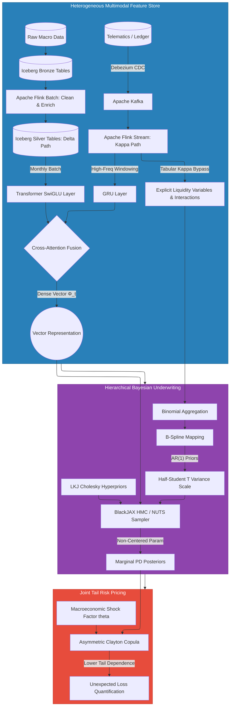

# Continuous Underwriting via Hierarchical Bayesian Logistic Regression

*Core Architectural Question: How can InsureTech and Embedded Finance be employed to continuously understand, predict, and stabilize the cashflow of gig workers while enabling banking partners to embed and finance multiple products satisfying both banking and insurance regulatory frameworks?*

## From Deterministic Embeddings to Posterior Distributions

The dual-regime neural architecture developed in Part 2a outputs a deterministic fused covariate vector $\mathbf{\Phi}_{it} \in \mathbb{R}^{d_\phi}$ for each driver $i$ at each daily evaluation interval $t$. This vector is a sufficient statistic for the driver's current observable risk state, encoding behavioral kinematics, macro-structural context, and financial liquidity into a single dense representation. It is, however, not a probability. A deterministic score does not tell the bank *how uncertain* it should be about its credit decision — an essential piece of information when managing a portfolio where default probabilities may be poorly identified for newly onboarded drivers, newly launched geographic clusters, or during unprecedented macro shocks.

The Hierarchical Bayesian Logistic Regression (HBLR) layer translates $\mathbf{\Phi}_{it}$ into an explicit **posterior probability distribution** over each driver's default probability [1][2]. This probabilistic layer offers three capabilities that no deterministic neural network or classical logistic regression can provide. First, it generates full credible intervals around the PD estimate, quantifying uncertainty in a way that directly informs automated credit limit decisions and the Uncertainty Kill-Switch. Second, it models the correlation structure across clusters of drivers operating in the same geographic zone and platform environment through partial pooling — allowing data from Nairobi's Westlands cluster to inform estimates for a newly launched Thika corridor cluster where defaults have not yet been observed. Third, it maintains an interpretable causal structure linking each component of $\mathbf{\Phi}_{it}$ to the default outcome, enabling the regulatory transparency required by IFRS 9 model governance, Basel IV internal model validation, and algorithmic fairness auditing. Ultimately, this transparency is what allows the architecture to transcend punitive scoring models, fostering a system based on **shared value for all stakeholders and counterparties**.

## The Partial Pooling Framework and Model Taxonomy

The choice of partial pooling — hierarchical Bayesian modeling — over alternative approaches requires precise justification, since it is a non-trivial modeling decision with substantial implications for both predictive performance and regulatory acceptability.

**Complete Pooling (standard logistic regression):** A single global coefficient vector $\boldsymbol{\beta}$ is estimated across all drivers, treating the portfolio as a homogeneous population. This ignores the structural heterogeneity of the gig-economy portfolio: a driver in a dense Nairobi CBD corridor faces fundamentally different surge patterns, traffic kinematics, and macro exposure than a driver in a peri-urban Kisumu route with degraded infrastructure and lower baseline demand. A single global $\boldsymbol{\beta}$ systematically mis-estimates PD for every specific cluster.

**No Pooling (independent models per cluster):** An independent logistic regression is fit for each cluster $j = [\text{geohash}, \text{platform}]$. For data-rich clusters (hundreds of observed defaults), this is unproblematic. For newly launched clusters (zero observed defaults in the first 60 days), the maximum likelihood estimate of the default probability is identically zero — the model learns that default is impossible in a new corridor simply because it hasn't happened yet. This is not a feature; it is catastrophic overfitting in sparse data.

**Partial Pooling (hierarchical Bayesian):** Cluster-specific parameters $[\alpha_j, \boldsymbol{\beta}_j]$ are treated as random variables drawn from a global portfolio-level distribution. Data-sparse clusters borrow statistical strength from the global posterior — their PD estimates are pulled toward the portfolio mean, preventing the zero-default pathology. Data-rich clusters have sufficient evidence to pull their estimates away from the mean, capturing genuine local heterogeneity. This is the Bayesian analogue of shrinkage estimation: sparse clusters are shrunk toward the global mean; dense clusters are shrunk less. The degree of shrinkage is not set by the analyst but is inferred from the data through the hyperprior on the between-cluster variance.

The three-level hierarchical structure is:

**Level 1 — Individual Driver Likelihood:**
$$Y_{ijt}^{(p)} \sim \text{Bernoulli}(\theta_{ijt}^{(p)})$$

for driver $i$ in cluster $j$, concerning product $p \in \{\text{micro}, \text{revol}, \text{IPF}\}$, at time $t$.

**Level 2 — Cluster Prior (Non-Centered Parameterization):**
To avoid **Neal's Funnel** geometry—a pathology in hierarchical models where gradient-based samplers (like HMC/NUTS) struggle as the scale parameter approaches zero, creating a narrow bottleneck—we utilize the "Matt trick" (non-centered parameterization). This mathematically detaches the dependence between the group-level effects and their overarching scale parameter, transforming a highly curved probability space into a smooth, isotropic Gaussian distribution.

The raw, independent standard normal noise components are defined as:
$$\tilde{\alpha}_j^{(p)} \sim \mathcal{N}(0, 1), \qquad \tilde{\boldsymbol{\beta}}_j^{(p)} \sim \mathcal{N}(\mathbf{0}, \mathbf{I})$$

The actual cluster-level effects are then deterministically shifted and scaled:
$$\alpha_j^{(p)} = \mu_\alpha^{(p)} + \sigma_\alpha^{(p)} \cdot \tilde{\alpha}_j^{(p)}$$
$$\boldsymbol{\beta}_j^{(p)} = \boldsymbol{\mu}_\beta^{(p)} + \boldsymbol{\sigma}_\beta^{(p)} \odot \tilde{\boldsymbol{\beta}}_j^{(p)}$$

**Level 3 — Portfolio Hyperpriors:**
$$\mu_\alpha^{(p)} \sim \mathcal{N}(0, 2), \qquad \boldsymbol{\mu}_\beta^{(p)} \sim \mathcal{N}(\mathbf{0}, 2\mathbf{I})$$
$$\sigma_\alpha^{(p)} \sim \text{Half-StudentT}(\nu=3, \sigma_0=1), \qquad \boldsymbol{\sigma}_\beta^{(p)} \sim \text{Half-StudentT}(\nu=3, \sigma_0=1)$$

The scale parameters ($\sigma$) are regularized using a **Half-Student T** prior. 
Its generalized probability density function is:

$$f(\sigma) = \frac{2}{\sigma_0} \frac{\Gamma(\frac{\nu+1}{2})}{\Gamma(\frac{\nu}{2}) \sqrt{\nu\pi}} \left(1 + \frac{1}{\nu}\left(\frac{\sigma}{\sigma_0}\right)^2\right)^{-\frac{\nu+1}{2}}, \quad \sigma > 0$$

*Structural Note on Tail Geometry:* While the non-centered parameterization fixes the underlying coordinate system, we must still carefully govern the scale prior. Setting the degrees of freedom to $\nu = 1$ collapses the Half-Student T into a **Half-Cauchy** distribution. While a Half-Cauchy(1) maximizes sparsity, its extreme heavy tails allow the scale parameter to drift into unproportionally large values when data is sparse, forcing the NUTS sampler to diverge across the wide body of the funnel. To gently curb this extreme tail behavior while preserving robustness to genuine structural breaks, we explicitly regularize the prior by setting $\nu=3$ (or alternatively, utilizing a Half-Normal). This achieves the optimal mathematical compromise between heavy-tailed adaptability and HMC sampling efficiency.

Unlike the Normal distribution (which would assign negative mass to variance parameters and requires truncation), and unlike the Inverse-Gamma distribution (which concentrates too much mass away from zero and over-regularizes in the presence of genuine between-cluster heterogeneity — the Gelman critique), the Half-Student T ($\nu=3$) allows the model to discover genuinely large inter-cluster variance when the data supports it without destabilizing the leapfrog integrator.

## Full Mathematical Model Specification

The complete log-odds predictor for driver $i$ in cluster $j$, product $p$, at time $t$ integrates the neural embedding, nonlinear functional forms, explicit gig-specific interactions, and the time-varying cohort shock effect:

$$\text{logit}(\theta_{ijt}^{(p)}) = \underbrace{\alpha_j^{(p)}}_{\text{cluster intercept}} + \underbrace{\left(\boldsymbol{\beta}_j^{(p)}\right)^T \mathbf{\Phi}_{it}}_{\text{neural embedding effect}} + \underbrace{\sum_{k=1}^{K} \zeta_k B_k(x_{it})}_{\text{B-spline nonlinear terms}} + \underbrace{\sum_{(m,n) \in \mathcal{G}} \gamma_{mn} x_{im} x_{in}}_{\text{gig-specific interactions}} + \underbrace{\gamma_{jt}}_{\text{AR(1) cohort shock}}$$

where:

- $\alpha_j^{(p)}$: cluster-specific baseline intercept, partially pooled from portfolio hyperprior.
- $\boldsymbol{\beta}_j^{(p)}$: cluster-specific sensitivity vector to the fused neural embedding $\mathbf{\Phi}_{it}$, partially pooled. (Note: The macroeconomic variables are explicitly encoded within this neural embedding via the Transformer's $c_{L,\tau}$ context vector; introducing a separate linear macro term would introduce severe multicollinearity).
- $B_k(x_{it})$: the $k$-th B-spline basis function evaluated on continuous singular covariates $x_{it}$ (DLR, repayment velocity $v_{\text{repay}}$, driver tenure); $\zeta_k$ are the corresponding spline coefficients.
- $\gamma_{mn} x_{im} x_{in}$: explicit pairwise gig-economy-specific interaction effects from the set $\mathcal{G}$. These multiplicative cross-terms bypass the B-Splines to cleanly capture combinatorial risk (e.g., Wallet Balance $\times$ Vehicle Age).
- $\gamma_{jt}$: time-varying latent cohort shock effect governed by an AR(1) prior. This captures *unobserved* local drift that the macro transformer misses.

## Nonlinear Functional Forms: B-Splines as Smooth Alternatives to Binning

Several key continuous covariates exhibit strongly nonlinear relationships with default probability that linear terms cannot capture:

- **DLR** ($\text{DLR}_i$): risk is approximately log-linear below 0.5, then accelerates non-linearly above the 1.0 solvency threshold. The relationship above DLR = 1.5 exhibits diminishing marginal returns (catastrophic default is already highly probable; further DLR increases add little incremental discrimination).
- **Repayment velocity** ($v_{\text{repay}}$): risk is protective below 1.0 (positive signal but with strong returns to scale), then rapidly plateaus above 1.5 — a driver paying at 200% of their scheduled amount is not meaningfully safer than one paying at 160%.
- **Driver tenure:** risk declines steeply in the first 90 days (the learning-period effect), then plateaus. A naive linear term would imply continuous, unbounded risk reduction with tenure, which is empirically false.

The diagnostic protocol follows a strict sequential workflow. First, a baseline linear model is estimated. Second, randomized quantile residuals $r_i = \Phi^{-1}(F(y_i | \hat{\theta}_i))$ are computed for each observation and plotted against each continuous covariate. Randomized quantile residuals from a correctly specified model should be iid $\mathcal{N}(0,1)$ regardless of the covariate values. A non-random, systematic pattern — a curved or U-shaped residual plot — is diagnostic evidence of nonlinearity in that covariate. Third, calibration curves are plotted: observed default rates in decile bins against predicted probabilities. A well-calibrated model produces a near-diagonal calibration curve; systematic bowing indicates model misspecification. Fourth, where diagnostic evidence supports, B-splines are introduced.

A B-spline of degree $d$ over a continuous covariate $x$ is defined by a knot sequence $\xi_0 < \xi_1 < \ldots < \xi_{K+d}$ and a set of $K$ basis functions $\{B_k(x)\}$ with the Cox-de Boor recursive definition:

$$B_{k,1}(x) = \mathbf{1}[\xi_k \leq x < \xi_{k+1}]$$
$$B_{k,d}(x) = \frac{x, \xi_k}{\xi_{k+d}, \xi_k} B_{k,d-1}(x) + \frac{\xi_{k+d+1}, x}{\xi_{k+d+1}, \xi_{k+1}} B_{k+1,d-1}(x)$$

The resulting smooth function $f(x) = \sum_{k=1}^{K} \zeta_k B_k(x)$ is a piecewise polynomial of degree $d$ with continuous derivatives up to degree $d-1$ at each interior knot. This is the critical distinction from binning (data aggregation into intervals): binning produces a step function — piecewise constant, with hard discontinuities at bin boundaries. Every observation within a bin receives an identical prediction regardless of within-bin variation. This is mathematically identical to a single-variable decision tree. B-splines produce a topologically continuous smooth curve, with no boundary collapse and no artificial hard threshold effects.

Adjacent B-spline coefficients $\{\zeta_k\}$ are not modeled as independent. Due to the overlapping support of adjacent basis functions, they are structurally correlated. The classical approach uses a First-Order Random Walk (RW1) prior. However, when financial data exhibits extreme out-of-distribution (OOD) outliers—such as an unprecedented spike in a driver's Earnings Velocity—standard deep learning models or basic random walks might extrapolate wildly, pushing the predicted default probability to arbitrary extremes.

To safely constrain OOD extrapolation, we model the spline coefficients using an **Autoregressive Order 1 (AR(1)) prior** [13], [14]:

$$\zeta_k \sim \mathcal{N}(\rho \zeta_{k-1}, \sigma_\zeta^2), \quad k = 2, \ldots, K$$

Because the mean-reversion parameter $|\rho| < 1$, as the variable moves into unobserved OOD territory, the coefficients decay exponentially back toward zero. This acts as an automatic mathematical kill-switch against catastrophic extrapolation, pulling predictions safely back to the global baseline intercept.

The innovation variance $\sigma_\zeta^2$ controls the degree of smoothing: $\sigma_\zeta \to 0$ forces all coefficients toward a flat line (maximum smoothing); large $\sigma_\zeta$ allows the function to fit the data without regularization. Crucially, $\sigma_\zeta$ is not set by the analyst but is **inferred from the data** as a hyperparameter — the Bayesian model automatically learns the appropriate degree of smoothing from evidence, rather than requiring arbitrary cross-validation over a grid of bandwidth values.

To handle the extreme heteroskedastic structural breaks and fat-tailed outlier distributions typical in gig-worker cash flows, the innovation variance $\sigma_\zeta^2$ is robustly regularized using a **Half-Student T prior** [15], [16]. This acts as a heavy-tailed scale mixture that aggressively shrinks noise toward zero during stable periods while allowing extreme, localized liquidity shocks to escape shrinkage without penalty.

For HMC sampling, the AR(1) prior must be non-centered parameterized to resolve funnel geometry. Define standard normal innovations and construct the chain using cumulative shifts. To prevent the splines from perfectly confounding with the global and cluster intercepts, the spline coefficients are subject to a **sum-to-zero constraint** over the observed data ($\sum_{i, k} \zeta_k B_k(x_{it}) = 0$). This ensures the spline isolates pure non-linear shape variation, leaving baseline risk exclusively to the intercepts.

This structural separation and rigorous prior selection eliminates the strong posterior correlation between the variance scale and the coefficient values, significantly stabilizing HMC convergence.

Model comparison between the baseline linear model and the B-spline specification uses **Leave-One-Out Cross-Validation** (LOO-CV) via Pareto-smoothed importance sampling, which avoids the computational cost of refitting the model $N$ times. The expected log predictive density (ELPD) difference and its standard error determine whether the more complex spline model is warranted. The **Widely Applicable Information Criterion** (WAIC) serves as a corroborating metric. The working principle is: introduce B-splines only where diagnostic evidence is unambiguous and LOO-CV confirms genuine predictive improvement. Unnecessary complexity increases sampling cost without improving downstream credit decisions.

## Time-Varying Coefficients: AR(1) Autoregressive Priors

IFRS 9 requires forward-looking Expected Credit Loss estimates that incorporate macroeconomic scenarios [12]. This means the model's macro-related coefficients $\boldsymbol{\delta}$ — encoding the sensitivity of PD to gas prices, platform commission rates, and ZEV transition — must be allowed to *evolve through time* as macroeconomic regimes change, rather than being fixed at their historical average values.

A static coefficient $\delta_k$ estimated on a 2020"“2023 training window will systematically misestimate the macro sensitivity of a 2025 portfolio operating under a radically different energy price regime, post-COVID demand recovery, and advanced ZEV regulatory environment. The solution is to model macro coefficients as time-indexed parameters governed by **First-Order Autoregressive (AR(1)) priors**:

$$\delta_{k,t} \sim \mathcal{N}\left(\mu_k + \rho_k(\delta_{k,t-1}, \mu_k),\, \sigma_{\delta_k}^2\right)$$

where:

- $\mu_k$ is the long-run stationary mean of the $k$-th macro coefficient — the baseline sensitivity when no regime shift has occurred.
- $\rho_k \in (-1, 1)$ is the persistence coefficient. For macroeconomic regime effects, $\rho_k \approx 0.85$"“$0.95$ is empirically appropriate: regimes are sticky (fuel prices do not revert to long-run equilibrium within a week), but the AR(1) stationarity condition $|\rho_k| < 1$ guarantees eventual mean-reversion and prevents unbounded drift.
- $\sigma_{\delta_k}^2$ is the innovation variance — the magnitude by which the coefficient can shift from one period to the next, controlling the sensitivity of the model to new macro information.

The AR(1) prior is stationary: in the absence of new data, the coefficient mean-reverts to $\mu_k$ and the uncertainty is bounded by $\text{Var}[\delta_{k,t}] = \sigma_{\delta_k}^2 / (1, \rho_k^2)$. This is in contrast to the **Random Walk (RW1) prior**, which is the special case $\rho_k = 1$:

$$\delta_{k,t} \sim \mathcal{N}(\delta_{k,t-1}, \sigma_{\delta_k}^2)$$

The RW1 is non-stationary: it has no natural mean-reverting force and allows the coefficient to drift arbitrarily far from its historical value. The RW1 is appropriate for a regime shift that is believed to be permanent — for example, the structural shift in the platform commission sensitivity of PD after a platform changes its fee structure permanently. The AR(1) is appropriate for cyclical regimes (fuel price cycles, seasonal demand patterns) where reversion is expected.

The **time-varying cohort shock effect** $\gamma_{jt}$ — the AR(1) prior on the cluster-level baseline risk — follows the same structure:

$$\gamma_{jt} \sim \mathcal{N}(\rho_j \gamma_{j,t-1}, \sigma_\gamma^2)$$

When an unobserved systemic shock hits cluster $j$ — a regional fuel supplier disruption, a localized labor strike, a geohash-specific platform algorithm change — the posterior estimate of $\gamma_{jt}$ shifts upward for the entire cluster simultaneously. A driver in cluster $j$ with a healthy GRU embedding (stable kinematics, reasonable DLR) nevertheless has their overall $\theta_{ijt}$ inflated by the cluster shock effect. This is the Bayesian mechanism that captures **default clustering**: the phenomenon where an unobserved common factor causes multiple drivers to default simultaneously, even though their individual observable characteristics would not predict a problem in isolation.

The persistence parameter $\rho_j$ is itself a cluster-specific random effect with a hyperprior $\rho_j \sim \text{Beta}(a_\rho, b_\rho)$ (restricted to $(0,1)$ for non-oscillating regime persistence). Clusters with historically high momentum in their default rates (fuel-price-sensitive long-haul corridors) will have posterior $\rho_j$ concentrated near 1.0; clusters with historically rapid recovery (CBD corridors with high demand diversity) will have $\rho_j$ concentrated near 0.5.


# Scaling to Large Policyholder Portfolios: MCMC Architecture

## The Bernoulli-to-Binomial Aggregation for Computational Scaling

As the Insurtech scales to portfolios of hundreds of thousands of active drivers, the computational cost of full MCMC over individual Bernoulli likelihoods becomes prohibitive. Each leapfrog step in Hamiltonian Monte Carlo requires evaluating the gradient of the log-posterior with respect to all model parameters. For a Bernoulli likelihood with $N$ observations, this gradient has $O(N)$ computational complexity. At $N = 200{,}000$ drivers with daily updates, the gradient cost renders NUTS infeasible at the required update cadence.

The primary scaling mechanism is **Bernoulli-to-Binomial aggregation** at the data level. Drivers sharing identical (or near-identical, after quantization) covariate patterns within a cluster $j$ are aggregated into groups. For a cluster $j$ with $n_j$ observations over a fixed epoch:

$$K_j = \sum_{i=1}^{n_j} Y_{ij} \sim \text{Binomial}(n_j, \bar{\theta}_j)$$

The $K_j$ defaults observed out of $n_j$ trials carry the same Fisher information about $\bar{\theta}_j$ as the $n_j$ individual Bernoulli observations — the aggregation is a sufficient statistic. This reduction from $N$ individual Bernoulli evaluations to $J$ Binomial evaluations (where $J \ll N$ is the number of distinct covariate-quantized groups) reduces gradient cost per leapfrog step from $O(N)$ to $O(J)$. The speedup is typically one to two orders of magnitude for portfolios with $N/J > 50$.

The aggregation sacrifices individual-level covariate resolution: within a Binomial group, all drivers are treated as having identical PD. To recover within-cluster heterogeneity in continuous driver-level covariates (DLR, repayment velocity, tenure), the B-spline basis functions $\{B_k(\bar{x}_j)\}$ are evaluated at group averages $\bar{x}_j$. The spline's smooth interpolation properties ensure that the within-group prediction varies smoothly with the covariate, even though individuals are grouped for likelihood computation.

## LKJ Cholesky Decompositions and the Funnel Geometry

The central computational pathology of hierarchical Bayesian models with complex covariance structures (like Normal-Inverse-Wishart priors) is **Neal's Funnel**. When group-level variances approach zero, all cluster parameters collapse toward the global mean. In this regime, the posterior distribution takes the shape of a narrow funnel with extremely high curvature at its neck. The HMC leapfrog integrator, using a fixed step size, cannot navigate this high-curvature region without taking steps that overshoot the posterior mass, producing divergent transitions and biased estimates of the hyperparameter.

To mitigate Neal's Funnel during high-dimensional BlackJAX sampling, the architecture Abandons the raw Inverse-Wishart prior entirely. Instead, it utilizes an **LKJ Cholesky Decomposition** coupled with an **Explicit Matrix Non-Centered Parameterization**.

By decomposing the covariance matrix into a vector of scale parameters (modeled via Half-Normal or Half-Student T distributions) and a lower-triangular correlation matrix (modeled via the LKJ prior), the variance components are completely decoupled from the correlation structure. The sampler draws raw standard normal noise and rotates it using the Cholesky factor.

This ensures the NUTS leapfrog integrator navigates a perfectly smooth, isotropic geometry. The practical diagnostic impact is striking: divergent transitions drop to zero, $\hat{R}$ (Gelman-Rubin) statistics drop to $\approx 1.003$, and Effective Sample Size for hyperparameters increases by a factor of 3–10, drastically accelerating GPU compilation times.

The probabilistic programming pseudocode (language-agnostic conceptual representation for PyMC/NumPyro/Stan architectures) implementing the full MCMC specification:

```text
ALGORITHM: Hierarchical Bayesian Logistic Regression with Non-Centered Parameterization

INPUTS:
  N: Binomial-aggregated observations
  J: Number of geographic/driver clusters
  K: Fused feature dimension (B-splines + neural embedding)
  PHI: [N x K] Feature matrix
  Y_count: [N] Binomial default counts
  trials: [N] Total trials per group

HYPERPRIORS:
  mu_alpha      ~ Normal(0, 2)
  mu_beta       ~ Normal(0, 2)
  sigma_alpha   ~ Half-StudentT(nu=3, scale=1)
  sigma_beta    ~ Half-StudentT(nu=3, scale=1)
  sigma_gamma   ~ Half-StudentT(nu=3, scale=1)
  rho           ~ Beta(8, 2)  // Prior concentrated near high persistence

NON-CENTERED PRIORS:
  alpha_raw     ~ Normal(0, 1)
  beta_raw      ~ Normal(0, 1)
  gamma_raw     ~ Normal(0, 1)

TRANSFORMATIONS (Non-Centered to Centered):
  For each cluster j:
    alpha[j] = mu_alpha + sigma_alpha * alpha_raw[j]
    beta[:, j] = mu_beta + sigma_beta * beta_raw[:, j]
    gamma[j] = (sigma_gamma * gamma_raw[j]) / sqrt(1 - rho^2)

LIKELIHOOD MODEL:
  For each observation n = 1 to N:
    j = cluster_id[n]
    // Linear Predictor (Note: Macro is implicitly inside PHI)
    logit_theta[n] = alpha[j] + dot_product(beta[:, j], PHI[n]) + gamma[j]
    
  Y_count ~ BinomialLogit(trials, logit_theta)
```

## Production Inference: BlackJAX on GPU/TPU

For production deployment at scale, the probabilistic model above is re-implemented in **BlackJAX** — a JAX-native library that compiles the NUTS kernel to XLA, enabling GPU/TPU acceleration. JAX's just-in-time compilation transforms the MCMC log-posterior gradient computation into a single fused GPU kernel, eliminating the Python interpreter overhead present in pure NumPy-based samplers. For a portfolio of 200,000 drivers aggregated into 4,000 Binomial groups, the XLA-compiled NUTS achieves approximately 50Ã,  wall-clock speedup over a CPU NUTS implementation.

**Control variate HMC** is deployed to reduce gradient variance from high-dimensional covariate matrices $\mathbf{\Phi}_{it}$. Standard NUTS uses the full log-posterior gradient at each leapfrog step, which has high variance when $d_\phi$ is large (typical $d_\phi = 256$). Control variates introduce a correction term based on the gradient at a fixed reference point, reducing gradient variance without introducing bias — enabling larger leapfrog step sizes and fewer divergent transitions.

**Incremental posterior updating** in production avoids the cold-chain burn-in cost that would be prohibitive for daily model updates. Each new day's feature vectors trigger a warm-start chain seeded from the previous day's posterior samples. The NUTS tuning phase is skipped (reusing yesterday's mass matrix and step size estimates), and only a short adaptation window is required to accommodate the daily feature update. This reduces effective daily update compute time from hours (cold chain) to minutes (warm start).


# MCMC Convergence Diagnostics and Model Validation

Before any posterior credible interval is propagated into regulatory capital calculations, IFRS 9 staging decisions, or automated credit limit adjustments, the quality of the NUTS posterior must be rigorously verified. The following diagnostics are mandatory prior to production deployment and must be re-executed upon every model update trigger (PSI ≥ 0.25, new geographic cluster launch, or regulatory regime change).

## $\hat{R}$ — Rank-Normalised Gelman-Rubin Convergence Statistic

NUTS is run across $M = 4$ parallel chains with different random initializations. The rank-normalized $\hat{R}$ statistic compares within-chain variance $W$ to between-chain variance $B$ to confirm that all chains have converged to the same posterior distribution:

$$\hat{R} = \sqrt{\frac{\frac{N-1}{N}W + \frac{1}{N}B}{W}}$$

For a well-converged model, $\hat{R} \to 1.0$. The production threshold is $\hat{R} < 1.005$ for all parameters. Scale hyperparameters $\sigma_\alpha^{(p)}$ are the parameters most susceptible to $\hat{R} > 1.01$, as they reside at the neck of the funnel geometry. Non-centered parameterization routinely resolves this.

## Effective Sample Size (ESS)

The Effective Sample Size corrects for autocorrelation within MCMC chains. Highly autocorrelated chains produce fewer informative samples per iteration. ESS is estimated from lag-$k$ autocorrelations $\rho_k$ of the sample sequence:

$$\text{ESS} = \frac{S}{1 + 2\sum_{k=1}^{\infty} \rho_k}$$

The production minimum is $\text{ESS} > 400$ per parameter for reliable 95% credible intervals. ESS is particularly important for the Half-Cauchy scale hyperparameters $\sigma_\alpha, \sigma_\beta$, which often exhibit high lag-1 autocorrelation in weakly identified models.

## Posterior Predictive Checks: Exhaustive Treatment

Posterior Predictive Checks (PPCs) answer the question: "If the model is correctly specified, can it reproduce the statistical properties of the observed data?" Each PPC generates simulated outcomes $\tilde{Y}^{(s)}$ from the posterior predictive distribution for $s = 1, \ldots, S$ MCMC samples, compares their distribution to the observed outcomes $Y^{\text{obs}}$, and reports a Bayesian p-value $p_B = P(T(\tilde{Y}) \geq T(Y^{\text{obs}}))$ for a test statistic $T$.

**PPC 1 — Central Tendency:** Test statistic $T(Y) = \text{mean}(Y)$ (overall default rate). The PPC compares the posterior predictive default rate distribution to the observed rate. Systematic underestimation indicates that the model's baseline intercepts $\mu_\alpha^{(p)}$ are incorrectly specified. A $p_B$ near 0.5 is ideal; $p_B < 0.05$ or $p_B > 0.95$ indicates poor central fit.

**PPC 2 — Tail-Risk Cascade Clustering:** Test statistic from the `.rmd` specification:

$$T(Y) = \max_{j} \left(\frac{1}{n_j} \sum_{i \in j} Y_{ij}\right)$$

This captures the maximum observed cluster-level default rate — the primary diagnostic for tail-risk default clustering. If the model's posterior predictive distribution cannot reproduce the extreme default spikes observed in specific clusters during macro shocks, the Clayton Copula's $\alpha_c$ parameter must be recalibrated upward to reflect stronger lower tail dependence. A Bayesian tail p-value near 0 indicates an underdispersed model that systematically under-predicts cascade severity.

**PPC 3 — Repayment Velocity Nonlinearity:** The predicted PD is computed at each observed value of $v_{\text{repay}}$, and the posterior mean prediction is plotted against empirical default rates in 10 quantile bins of $v_{\text{repay}}$. If systematic curvature remains after fitting (the empirical rate bows away from the model prediction in the region $0.8 < v_{\text{repay}} < 1.2$ — the critical transition zone), a B-spline on $v_{\text{repay}}$ is warranted. This PPC is run at every model update to detect emerging nonlinearity as the portfolio matures.

**PPC 4 — Cluster Heterogeneity:** The observed between-cluster default rate variance is compared to the posterior predictive distribution of between-cluster variance generated from the model's cluster intercepts $\alpha_j^{(p)}$. If the model's posterior $\hat{\sigma}_\alpha^2$ is systematically smaller than the observed between-cluster variance, the Half-Cauchy prior scale is too tight — increase the prior scale parameter from $s = 1$ to $s = 2$ and rerun. Over-regularized cluster effects mask genuine geographic heterogeneity, producing PD estimates that are too similar across different corridor types.

**PPC 5 — Time-Varying Cohort Effect:** For each calendar month in the validation window, the posterior predicted monthly default rate $\mathbb{E}[\theta_{j,t}]$ is compared to the observed monthly default rate per cluster. Residual temporal autocorrelation in the prediction error — a pattern where the model systematically over-predicts for several consecutive months and then under-predicts — indicates that the AR(1) persistence parameter $\rho_j$ is misspecified. The posterior distribution of $\rho_j$ should be updated with recent data, or the prior $\text{Beta}(a_\rho, b_\rho)$ adjusted to reflect the empirically observed persistence.

## Discrimination, Calibration, and Stability Metrics

**Kolmogorov-Smirnov (KS) Statistic:** Measures the maximum separation between the cumulative distribution of model scores for defaulters and non-defaulters. A minimum KS > 0.40 is required for the model to carry regulatory weight in IFRS 9 PD estimation.

**Gini Coefficient / AUC-ROC:** The area under the Receiver Operating Characteristic curve. Target AUC > 0.75 for acceptable discrimination. Bayesian posterior shrinkage in data-sparse clusters naturally prevents the overconfident score spikes that inflate AUC on training data but collapse on out-of-time validation.

**Brier Score:** $\text{BS} = \frac{1}{N}\sum_i (\theta_{ij}^{\text{pred}}, Y_{ij})^2$. The Brier Score penalizes overconfident predictions quadratically. The Hierarchical Bayesian model's posterior regularization — through partial pooling and Half-Cauchy hyperpriors — naturally suppresses extreme score values in data-sparse clusters, substantially outperforming classical logistic regression on Brier Score in newly launched geographic corridors.

**Population Stability Index (PSI) — Production Monitoring:** PSI measures the symmetrised KL-divergence between the model's current scoring distribution ($A_b$) and the training-time distribution ($E_b$) across $B$ score bins:

$$\text{PSI} = \sum_{b=1}^{B} (A_b, E_b) \ln\left(\frac{A_b}{E_b}\right)$$

| PSI Range | Interpretation | Action |
|---|---|---|
| PSI < 0.10 | Stable distribution | No action required |
| 0.10 ≤ PSI < 0.25 | Minor shift | Investigate; flag for model risk review |
| PSI ≥ 0.25 | Major shift | Immediate model retraining required |

A PSI ≥ 0.25 on the GRU stress embedding $\mathbf{h}_T^{\text{GRU}}$ constitutes a **material model change trigger** under SR 11-7 / Basel Model Risk governance. It indicates that the distribution of behavioral risk profiles in the current portfolio no longer resembles the distribution at training time — a structural regime change (ZEV fleet transition, new competitor market entry, regulatory employment reclassification) that has already affected driver behavior but has not yet propagated into the observed loss ledger. Immediate automated retraining is triggered before IFRS 9 Stage 3 impairments materialize.


# Real-Time Bayesian Decision Boundaries

## The Loss Function Framework: Expected Value Maximization

Traditional credit limits rely on a fixed point estimate of PD — approve if $\hat{\theta} < 5\%$, deny if $\hat{\theta} \geq 5\%$. This discards the posterior uncertainty information entirely. A driver with a posterior PD of $\mathcal{N}(4.5\%, 0.3\%)$ (tight distribution, high confidence) is structurally different from a driver with a posterior PD of $\mathcal{N}(4.5\%, 2.1\%)$ (wide distribution, thin-file uncertainty), yet both would receive identical treatment under a point-estimate threshold.

The Bayesian decision framework integrates over the entire posterior [5][6]. Define Action $a_1$ (approve a credit limit extension) and Action $a_0$ (deny). The asymmetric payoff structure for Action $a_1$ is:
- True outcome: No Default → gain $L_{\text{gain}}$ (interest income and fees on the extended credit)
- True outcome: Default → loss $L_{\text{loss}}$ (unrecovered principal)

The expected financial value of approval is computed by averaging the payoff over all $S$ MCMC posterior samples $\theta^{(s)}$:

$$\mathbb{E}[V(a_1)] = \frac{1}{S}\sum_{s=1}^{S}\left[(1, \theta^{(s)}) \cdot L_{\text{gain}}, \theta^{(s)} \cdot L_{\text{loss}}\right]$$

The expected cost of denial (opportunity cost of rejecting a creditworthy driver):
$$\mathbb{E}[V(a_0)] = \frac{1}{S}\sum_{s=1}^{S}\left[-(1, \theta^{(s)}) \cdot L_{\text{opp}}\right]$$

Setting $\mathbb{E}[V(a_1)] = \mathbb{E}[V(a_0)]$ and solving for the break-even posterior mean PD yields the **Bayesian action threshold** $p^*$:

$$p^* = \frac{L_{\text{gain}} + L_{\text{opp}}}{L_{\text{gain}} + L_{\text{opp}} + L_{\text{loss}}}$$

This threshold is not a fixed number: it is calibrated separately for each product, since the loss structure differs materially across the triple product stack.

**For Microloans (7"“30 day):**
- $L_{\text{gain}} = K \cdot r \cdot \text{days} / 365$ (annualized fee on principal $K$)
- $L_{\text{loss}} = K \cdot (1, R)$ (principal net of recovery rate $R$ from platform garnishment)
- $L_{\text{opp}} = K \cdot (\text{Alternative Portfolio Yield} / 26)$
- Result: $p^*_{\text{micro}} \approx 12\text{"“}18\%$ — relatively high threshold because fee income is thin but garnishment recovery is strong.

**For Revolving Credit Lines:**
- $L_{\text{gain}} = V_{\text{max}} \cdot U \cdot i + M$ (interest on utilized balance $U$ at rate $i$, plus monthly maintenance fee $M$)
- $L_{\text{loss}} = V_{\text{max}} \cdot \psi \cdot (1, R)$ (potential drawdown at distress, where contagion factor $\psi \to 1.0$ under cascade conditions)
- $L_{\text{opp}} = V_{\text{max}} \cdot (1, U) \cdot \text{Cost of Capital}$
- Result: $p^*_{\text{revol}} \approx 3\text{"“}6\%$ — low threshold because the potential loss at full drawdown is large relative to the fee income, and contagion risk is high.

## Three Automated Decision Rules

1. **Dynamic Soft Cap (Mean Trigger):** Approve credit limit extension if $\mathbb{E}[V(a_1)] > \mathbb{E}[V(a_0)]$. This is the primary approval criterion, continuously updated from the daily posterior.

2. **Uncertainty Kill-Switch (Variance Trigger):** Even if the posterior mean PD is below $p^*$, a wide posterior uncertainty may imply the 95% credible interval upper bound exceeds a regulatory safety threshold (e.g., 15%). In this case: freeze limit extensions automatically until additional GRU transactional data streams narrow the posterior variance. The kill-switch fires when:
$$P(\theta_{ijt}^{(p)} > \theta_{\text{cap}}) = \int_{\theta_{\text{cap}}}^{1} p(\theta | \text{Data}) \, d\theta > \epsilon_{\text{kill}}$$
for a configurable exceedance probability threshold $\epsilon_{\text{kill}}$ (typically 0.10 — if there is more than a 10% posterior probability of the true PD exceeding the cap, freeze the extension).

3. **Portfolio Shock Buffer (Cluster Trigger):** If the cohort shock parameter $\gamma_{jt}$ spikes for cluster $j$ (posterior mean increase > 2 standard deviations from the prior), initiate defensive limit rollbacks across the entire cluster before individual driver defaults propagate. This is the portfolio-level early warning system: the cluster-level AR(1) prior absorbs the shock immediately, adjusting all drivers' posterior PDs simultaneously based on the shared cluster signal.


# Actuarial Modeling of Clustered Failures via Asymmetric Copulas

## The Failure of Linear Correlation and Gaussian Copulas

The Hierarchical Bayesian engine generates accurate **marginal** posterior PD distributions for each product separately — $\theta_{ijt}^{(\text{micro})}$, $\theta_{ijt}^{(\text{revol})}$, $\theta_{ijt}^{(\text{IPF})}$. However, for the banking partner who holds all three products against the same driver, the relevant risk is the **joint** probability of simultaneous default across all three. Marginal probabilities cannot answer this question without a model of the dependency structure.

The portfolio variance under Gaussian dependency assumptions:

$$\text{Var}[\mathcal{L}] = \sum_p \text{Var}[\mathcal{L}_p] + \sum_{p \neq p'} \rho_{pp'} \sqrt{\text{Var}[\mathcal{L}_p]} \sqrt{\text{Var}[\mathcal{L}_{p'}]}$$

Under normal operating conditions, the Gaussian copula with $\rho_{pp'} \approx 0.25$ may be a reasonable approximation. But the cascade mechanics of Part 1 prove that under a systemic shock, the pairwise correlation $\rho_{pp'}$ converges toward 1.0 for all product pairs. Gaussian copulas assume **symmetric tail dependence**: the same degree of co-movement in the upper tail (joint performance) and the lower tail (joint default). Empirically, gig-economy credit collapses are lower-tail events. The upper tail — periods of strong joint performance — exhibits genuine diversification. The lower tail — periods of systemic stress — exhibits extreme co-movement approaching unit correlation. No Gaussian model can produce this asymmetry; it is a structural property of the generating mechanism (the common cash-flow engine).

## Sklar's Theorem and the Clayton Copula

By Sklar's Theorem, any multivariate joint distribution function $F$ can be uniquely decomposed into its marginal distributions and a copula $C$ that captures the dependency structure:

$$F(t^{\text{micro}}, t^{\text{revol}}, t^{\text{IPF}}) = C\left(F_1(t^{\text{micro}}), F_2(t^{\text{revol}}), F_3(t^{\text{IPF}});\, \alpha_c\right)$$

where $u_p = F_p(t^{(p)}) \in [0,1]$ are the probability integral transforms of each marginal distribution. The copula $C: [0,1]^3 \to [0,1]$ encodes the dependency structure independently of the marginal specifications. This separation is powerful: the Bayesian HBLR model provides the marginal distributions; the Clayton Copula provides the asymmetric dependency structure.

The **Clayton Copula** is an Archimedean copula generated by the function $\phi(t) = \frac{1}{\alpha_c}(t^{-\alpha_c}, 1)$ for $\alpha_c > 0$:

$$C(u_1, u_2, u_3; \alpha_c) = \left(u_1^{-\alpha_c} + u_2^{-\alpha_c} + u_3^{-\alpha_c}, 2\right)^{-1/\alpha_c}$$

The **lower tail dependence coefficient** — the probability that all three products default simultaneously, conditional on each being in the extreme lower tail — is:

$$\lambda_L = \lim_{u \to 0^+} P(U_2 \leq u, U_3 \leq u | U_1 \leq u) = 2^{-1/\alpha_c}$$

The **upper tail dependence coefficient** is identically zero: $\lambda_U = 0$. This is the asymmetric property that makes the Clayton Copula appropriate for this problem. As the macroeconomic shock severity increases, the Clayton parameter $\alpha_c$ increases, and $\lambda_L \to 1.0$ — modeling the absolute lockstep default across the triple-product stack described in Part 1's cascade mechanics.

**Stress-scenario modeling via Clayton parameter escalation:** Rather than replacing the Clayton Copula with a Gaussian MVN (which would reintroduce symmetric tail dependence), stress scenarios modulate $\alpha_c$ directly:

- **Scenario A  -  Localized Cluster Shock:** $\alpha_c$ increases from baseline 0.8 to 2.5 for the affected cluster. $\lambda_L$ rises from 0.57 to 0.82.
- **Scenario B  -  Macroeconomic Liquidity Crunch:** $\alpha_c$ escalates to 5.0 across all clusters in the affected jurisdiction. $\lambda_L \to 0.87$.
- **Scenario C  -  Systemic Tail-Risk Spillover:** $\alpha_c \to \infty$ (extreme limit). $\lambda_L \to 1.0$  -  the correlated default cascade of Part 1 modeled in its most severe form.

## Unexpected Loss Quantification and Regulatory Capital Linkage

**Unexpected Loss** (UL) is the volatility of losses around the expected value and is the true driver of regulatory capital. For the multi-product portfolio, UL is the standard deviation of the joint loss distribution $\mathcal{L}$ generated by the Clayton Copula:

$$\text{UL} = \sqrt{\text{Var}[\mathcal{L}]} = \sqrt{\sum_p \sum_{p'} \rho_{pp'}^{\text{Clayton}} \cdot \text{UL}_p \cdot \text{UL}_{p'}}$$

where $\rho_{pp'}^{\text{Clayton}}$ is the pairwise loss rank correlation implied by the Clayton Copula at the fitted $\alpha_c$. The asymmetric lower tail dependence $\lambda_L$ inflates the off-diagonal $\rho_{pp'}^{\text{Clayton}}$ terms during stress, causing UL to spike non-linearly. This non-linear UL spike is precisely the capital adequacy failure mode invisible to Gaussian capital models — it is the mathematical formalization of why the diversification illusion of Part 1 is catastrophic.

The **MCMC-based portfolio loss simulation** integrates Bayesian PD uncertainty with the Clayton Copula dependency structure:

1. For each MCMC sample $s = 1, \ldots, S$: compute marginal PD vector $(\theta_{\text{micro}}^{(s)}, \theta_{\text{revol}}^{(s)}, \theta_{\text{IPF}}^{(s)})$ from the posterior.
2. Apply probability integral transform: $u_p^{(s)} = \Phi(\theta_p^{(s)})$ (or the empirical CDF).
3. Generate Clayton Copula sample: $(v_1^{(s)}, v_2^{(s)}, v_3^{(s)})$ from the Clayton distribution with parameter $\alpha_c$.
4. Compute default indicators: $Y_p^{(s)} \sim \text{Bernoulli}(C^{-1}(v_p^{(s)}))$.
5. Compute portfolio loss: $L^{(s)} = \sum_p EAD_p \times LGD_p \times Y_p^{(s)}$.

Sorting $\{L^{(s)}\}_{s=1}^{S}$ and taking the relevant quantile yields the Value-at-Risk: $\text{VaR}_{0.95} = \text{Percentile}(\{L^{(s)}\}, 95)$. The 90% central Bayesian credible interval of the loss distribution $[L_{0.05}, L_{0.95}]$ is directly equivalent to the $\text{VaR}_{0.95}$, establishing the formal bridge between Bayesian posterior simulation and regulatory VaR reporting under Basel IV (**Figure 1**).

<br>

**Figure 1: End-to-End Underwriting Pipeline (Data Engineering to Joint Tail Risk Pricing)**


## References

[1] "AI-driven Credit Risk Modeling: Leveraging Big Data Analytics to Improve Financial Stability," *ResearchGate*. Available: https://www.researchgate.net/publication/396449858_AI-driven_Credit_Risk_Modeling.

[2] "Smart risk prediction: The rise of Bayesian models in finance," *ResearchGate*. Available: https://www.researchgate.net/publication/396237160_Smart_risk_prediction.

[3] "Exploring Bayesian Hierarchical Models for Multi-Level Credit Risk Assessment," *ResearchGate*. Available: https://www.researchgate.net/publication/384155942_EXPLORING_BAYESIAN_HIERARCHICAL_MODELS.

[4] "Application of Bayesian Hierarchical Models in Predicting Default Risk Across Different Industries," *ResearchGate*. Available: https://www.researchgate.net/publication/388947549_Application_of_Bayesian_Hierarchical_Models.

[5] "Credit risk assessment with Bayesian model averaging," *ResearchGate*. Available: https://www.researchgate.net/publication/308042142_Credit_risk_assessment_with_Bayesian_model_averaging.

[6] "Bayesian Statistics for Loan Default," *MDPI*. Available: https://www.mdpi.com/1911-8074/16/3/203.

[7] "Bayesian Logistic Regression for Credit Risk Modelling Among South African Loan Borrowers," *MDPI*. Available: https://www.mdpi.com/1911-8074/19/5/358.

[8] M. Brenndoerfer, "Credit Default Swaps: Pricing, Hazard Rates & Valuation." Available: https://mbrenndoerfer.com/writing/credit-default-swaps-cds-pricing-valuation.

[9] "Credit Risk Modeling Using Bayesian Networks," *ResearchGate*. Available: https://www.researchgate.net/publication/220063243_Credit_Risk_Modeling_Using_Bayesian_Networks.

[10] "Bayesian hierarchical modeling of credit risk linked to ESG-Proxy prudential indicators," *ResearchGate*. Available: https://www.researchgate.net/publication/407119404_Bayesian_hierarchical_modeling.

[11] "Calibrated Credit Intelligence: Shift-Robust and Fair Risk Scoring with Bayesian Uncertainty," *arXiv*.

[12] "Bayesian Inference in IFRS 9: A Practical Example of Expected Credit Loss," *Medium*.

[13] "Bayesian analysis for partly linear Cox model with measurement error and time-varying covariate effect," *Statistics in Medicine*, 2021. Available: https://onlinelibrary.wiley.com/doi/full/10.1002/sim.9531.

[14] "Bayesian splines versus fractional polynomials in network meta-analysis," *BMC Med Res Methodol*, 2020. Available: https://pmc.ncbi.nlm.nih.gov/articles/PMC7574305/.

[15] A. Gelman, "Prior distributions for variance parameters in hierarchical models," *Bayesian Analysis*, vol. 1, no. 3, pp. 515–534, 2006.

[16] C. M. Carvalho, N. G. Polson, and J. G. Scott, "The horseshoe estimator for sparse signals," *Biometrika*, vol. 97, no. 2, pp. 465–480, 2010.
