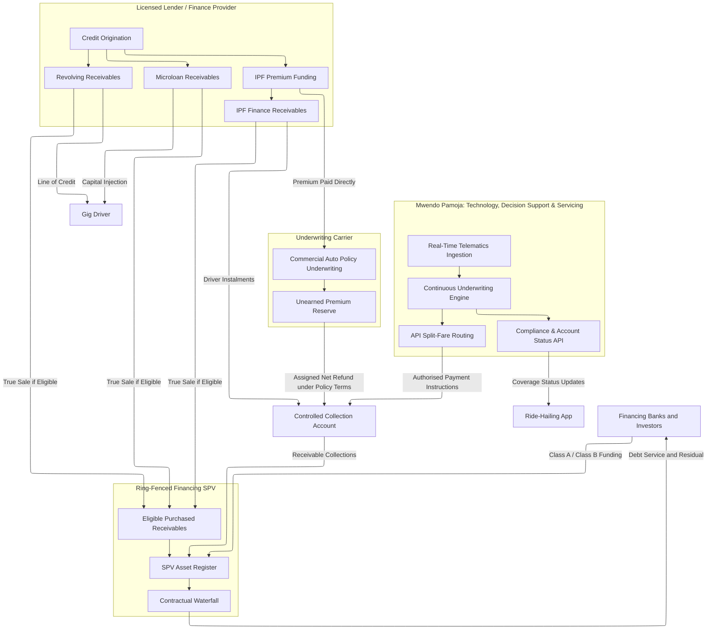
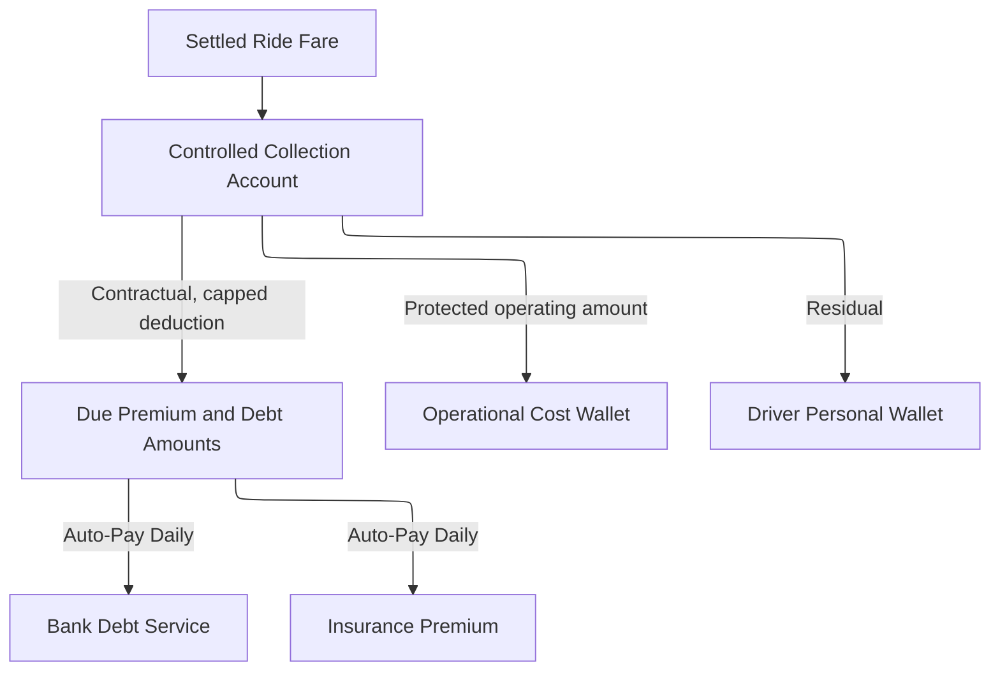

# 1. Introduction to the Insurtech Product-Issuer Ecosystem
## 1.1. The Gig Driver as a Unified Asset Class

*Core Architectural Question: How can InsureTech and Embedded Finance be employed to continuously understand, predict, and stabilize the cashflow of gig workers while enabling banking partners to embed and finance multiple products satisfying both banking and insurance regulatory frameworks?*

The question becomes tangible before it becomes technical. A driver who starts a morning shift with a functioning vehicle has an income-producing asset. If that vehicle is uninsured, under-fuelled, under repair, or deactivated by the platform, its financial value changes within hours. The driver does not experience those failures in the separate product silos used by lenders and insurers. They experience one inability to work.

In the traditional consumer finance and commercial lending paradigms, risk underwriting relies on the structural separation of personal liabilities and corporate assets. Underwriters evaluate individual borrowers based on stable, predictable salary streams verified via tax returns, or corporate borrowers based on balance sheet strength and ring-fenced business cash flows. The gig-economy driver, however, defies this binary classification entirely, representing a highly volatile, hybrid economic entity that occupies neither category cleanly.

In this paper, the driver and vehicle are analysed as a **unified operating system**, not literally as a tradeable asset class. Economic viability is concentrated in a small set of connected conditions: the vehicle must work, insurance must remain valid, fuel and maintenance must be affordable, and the platform account must remain active. This shared dependency is the root of the correlated default risk that follows. The proposed architecture seeks shared value by protecting a viable driver from avoidable cascades while safeguarding lenders, insurers, investors, and platform partners.

For many gig drivers, the vehicle is the primary income-generating operating asset. Auto finance, motor insurance, and personal credit are often assessed by different institutions against different files. In an embedded-finance ecosystem, the vehicle's condition, insurance status, platform access, trip activity, and wallet settlement can nevertheless form one tightly connected cash-flow chain. Net fare income, meaning gross earnings after platform deductions and operating costs, may support several commitments at once. It is not assumed to be the driver's sole source of cash unless the evidence establishes that fact.

Let $I_{\text{gross}}$ denote the driver's gross fare volume per day, $\tau_{\text{platform}}$ the platform commission rate, $C_{\text{ops}}$ daily operational costs (fuel, vehicle wear-and-tear, congestion charges), and $r$ the automated split-fare repayment deduction rate on outstanding debt. The driver's net take-home pay $I_{\text{net}}$ is then:

$$
I_{\text{net},t}
=I_{\text{gross},t}(1-\tau_{\text{platform},t})
-C_{\text{ops},t}
-R_t
-P_t,
$$

where \(R_t\) is the actual debt deduction and \(P_t\) is the actual premium deduction. If the contractual debt split is \(r_t\), it remains bounded by the amount due and the amount legally and operationally available:

$$
R_t
=
\min\left\{
r_t I_{\text{gross},t},
A_t^{\mathrm{due}},
I_{\text{gross},t}(1-\tau_{\text{platform},t})-C_{\text{ops},t}-S_t
\right\}_{+}.
$$

Let \(S_t\) be a calibrated sufficiency threshold representing disclosed and supportable minimum household and operating needs. The **cash-flow suffocation boundary** is crossed when:

$$
I_{\text{gross},t}(1-\tau_{\text{platform},t})
-C_{\text{ops},t}
-R_t
-P_t
<S_t.
$$

When the inequality holds persistently, a fixed automated deduction can compete with fuel, food, repair, and insurance. That does not make default deterministic: a driver may have savings, another platform, household support, a negotiated hardship arrangement, or an insurer-approved policy option. It does identify a state in which the marginal intervention matters. The platform's task is to estimate that state without claiming private facts it has not observed, then choose a lawful, proportionate response.

## 1.2. The Triple-Product Capital Stack

To enable and sustain a gig driver's operations, the embedded finance partnership deploys three distinct financial products forming a layered capital stack that addresses different operational needs, cash-flow cycles, and risk time horizons. Understanding the contractual mechanics of each product is prerequisite to understanding how a single external shock can cascade simultaneously across all three.

### 1.2.1. Product 1: Insurance Premium Financing (IPF)

Appropriate motor cover may be required by law, policy terms, vehicle use, or platform rules. The exact class and limit must be confirmed for each use case. High-utilisation ride-hailing vehicles can attract substantial annual premiums. A working range of KES 150,000 to KES 300,000 may be tested in the financial model, but it remains an illustrative assumption until quotations and portfolio data establish product, geography, vehicle, and driver effects. The financing opportunity arises when an otherwise viable driver cannot pay the annual amount upfront.

Under the proposed IPF structure, the finance provider pays an agreed premium amount to the insurer at inception. The driver repays under a weekly or monthly schedule. A cancellation refund may provide credit support, subject to policy wording, law, elapsed cover, taxes, commissions, fees, claims, notice, cancellation effectiveness, and insurer set-off. A simplified gross unearned-premium starting point is:

$$UP(t)=P_{\text{total}}\left(1-\frac{t}{T}\right)$$

The bank structures the driver's repayment schedule such that the outstanding loan balance $L_{\text{outstanding}}(t)$ remains below the unearned premium value at all times:

$$L_{\text{outstanding}}(t)\le UP_{\text{eligible}}(t)(1-\delta)$$

where $\delta$ is an approved haircut for timing, expenses, deductions, uncertainty, and other ineligible amounts. A 10 to 15 percent range is illustrative. Cancellation authority, notice, refund direction, coverage status, and application of proceeds must be established by the finance and insurance contracts. A missed instalment does not itself grant the platform a universal power to cancel cover.

The operational vulnerability lies in the interval between missed payment, notice, cure, cancellation, refund, and platform action. Its length and coverage effect are contractual facts, not a universal 10 to 15 day rule. In some arrangements cover may remain effective during a cure period; in others suspension or cancellation may occur after specified steps. The system must therefore ingest authoritative policy status rather than infer that a late payment means the vehicle is uninsured. A collision during genuine non-cover can impose a severe personal loss and interrupt earning capacity. It can then propagate into other products, but savings, support, another vehicle, claim outcome, restructuring, and recovery may interrupt the cascade.

### 1.2.2. Product 2: Microloans

Microloans are high-frequency, short-duration advances, with an illustrative range of KES 5,000 to KES 25,000 and tenors of 7 to 30 days, designed to cover immediate cash-flow gaps. The licensed lender originates the credit. Funding may later be provided or refinanced through the SPV, and authorised daily or weekly split-fare deductions may service the balance.

The potentially pro-cyclical repayment design is the key risk feature. If the split-fare deduction rate $r$ remains fixed while gross fare volume $I_{\text{gross}}$ falls because of fuel costs, demand, weather, or platform changes, the same contractual rule can consume a larger share of cash available after essential operating costs. The suffocation boundary tightens when $I_{\text{gross}}$ declines while $C_{\text{ops}}$ rises. A sufficiency floor, variable deduction, hardship pause, or payment cap can interrupt this mechanism; the product should test those controls rather than assume extraction has priority over the driver's ability to keep working.

### 1.2.3. Product 3: Revolving Credit Lines

Revolving credit lines, with an illustrative range of KES 25,000 to KES 100,000, are working-capital buffers for lumpy operating shocks such as servicing, tyre replacement, medical expense, or vehicle licensing. A viable driver may draw for a repair and repay as earnings recover. The line supports uptime only when the repair, limit, price, repayment design, and later income remain workable.

Let $U_i(t) = B_i(t) / L_i$ be the credit utilisation rate for driver $i$ at time $t$, where $B_i(t)$ is the outstanding balance and $L_i$ is the total credit limit. Under normal conditions, $U_i(t)$ can rise and fall as the driver cycles draws and repayments. Under a sustained structural income shock, the line may stop smoothing temporary operating costs and begin financing a persistent household or business deficit. This is the **adverse utilisation trap**. In the deliberately narrow stress model where the deficit persists, undrawn capacity remains available, no external support arrives, and draws mechanically fund the shortfall, utilisation approaches the limit:

$$
\lim_{h\to\infty}
P\!\left(
U_i(t+h)\ge u^*
\,\middle|\,
D_{i,t:t+h}>0,\ \text{draw access},\ \text{no cure}
\right)
=1.
$$

Here, $D_{i,t:t+h}>0$ denotes a persistent net deficit and $u^*$ is the operational full-utilisation threshold. This is a limiting mechanism under stated assumptions, not a claim that observed drivers inevitably max out. When many drivers approach $u^*$ together, revolving assets can extend in behavioural maturity and EAD can rise. LGD may also rise if the same shock weakens recoveries, but that relationship must be estimated rather than inferred from utilisation alone.

## 1.3. Partnership and Counterparty Structure

Operationalising the triple-product stack requires several counterparties, not a single synthetic "issuer." The **Mwendo Pamoja platform** occupies the central technology and servicing node: it maintains contracted integrations, hosts the driver experience, calculates features and decision-support outputs, and orchestrates authorised payment instructions. It does not issue insurance. It does not originate regulated credit unless the relevant entity has authority to do so. It may retain first-loss exposure or other contingent obligations, so the HoldCo should not be described as risk-free.

The **licensed insurer** writes the commercial motor policy, owns the actuarial and policy decision, holds insurance risk, and administers cancellation and any refund under the policy. The **licensed lender or finance provider** originates each microloan, revolving facility, or IPF exposure under its own authority and owns the customer credit terms before any eligible transfer. The three instruments remain legally and operationally distinct even when they protect the same productive vehicle.

The **SPV** is a ring-fenced financing and receivables-holding vehicle. It is not the insurer, the originating lender, the technology platform, or the customer-facing product issuer. Under a documented eligibility schedule, it may purchase only receivables and associated rights that the seller owns and can legally transfer. Eligibility should test executed documentation, payment and arrears status, currency, product and policy status where relevant, platform and geographic concentration, data completeness, prior security, and any other condition negotiated with investors. The trustee, account bank, servicer, backup servicer, calculation agent, and security trustee then perform the separate duties allocated in the transaction documents. Controlled accounts direct eligible collections through the agreed priority of payments.

The legal separation is achieved by substance, not by the SPV label. True sale, enforceability, perfection, account control, servicing continuity, commingling protection, set-off, tax, data transfer, and insolvency treatment require Kenyan legal and transaction analysis. Part 5 develops the capital stack, asset-liability management, matched-funding attribution, overcollateralisation, Cash Reserve Account, note pricing, waterfall, and investor cash-flow mechanics in detail.

IPF requires an additional distinction among **premium**, **premium funding**, and the resulting **finance receivable**. Section 156 of the Kenyan Insurance Act requires premium receipt by the insurer before risk is assumed and restricts an intermediary from receiving premium on the insurer's behalf [11]. The base architecture therefore routes the financed premium directly, or through another legally approved controlled mechanism, to the licensed insurer. Once that funding has occurred, the lender may hold a separate contractual receivable against the driver. The SPV may purchase that IPF finance receivable and validly assigned related rights if it generates an identifiable cash flow, is legally transferable, and satisfies the transaction's true-sale and eligibility requirements [12], [13]. It should not purchase or account for insurer-owned or unremitted premium money as an ordinary loan asset.

One financing SPV can therefore be designed to hold eligible microloan, revolving-credit, and IPF finance receivables without pretending that the three assets are homogeneous. Each product requires its own subledger, eligibility rules, collection code, loss and recovery curve, concentration test, and reporting line. IPF also requires a distinct premium-funding rail and cancellation-refund process. Any assigned net refund follows the policy, finance agreement, account-control arrangements, and waterfall. A separate IPF series, compartment, warehouse, or legal SPV remains available if counsel, a lender mandate, carrier exposure, asset-homogeneity analysis, or insolvency treatment makes stronger separation appropriate.

**Figure 1: Partnership and Counterparty Structure**




# 2. Siloed Product Mechanics and Structural Interdependencies
## 2.1. Microloan Repayment Mechanics

Microloans in this context can reduce payment friction through authorised, high-frequency repayment. Instead of relying only on a month-end transfer, a contracted **split-fare API** can allocate a defined share $r$ of eligible settlement cash. The repayment amount routes to a controlled collection account or product ledger under the actual account structure, while the residual reaches the driver's wallet. The mechanism requires clear authority, reversals, refunds, disputes, downtime handling, and a sufficiency control.

The mechanism can reduce payment friction during high-earnings periods, but it creates a structural asymmetry. The deduction $rI_{\text{gross}}$ follows eligible gross settlement, while the suffocation threshold depends on cash remaining after operating and essential commitments. During a fuel shock, a driver may need more gross fare merely to preserve the same net income. Without a floor or cap, deductions can then compete with the fuel required to earn tomorrow's fare. Priority is a contractual and policy choice, not a constitutional fact, and the platform should preserve enough working cash for a viable driver to continue operating.

## 2.2. Revolving Credit Lines as Working Capital Buffers

Revolving credit lines are intended to act as operational shock absorbers. A transmission failure requiring an illustrative KES 60,000 repair can sideline a driver and interrupt income. Where repair capacity, parts, and platform reactivation permit, a revolving line may finance the repair and support return within 24 to 48 hours, followed by repayment over later earnings cycles. Those timings and outcomes remain pilot assumptions.

The revolving product's risk profile can change during a persistent market-wide income downturn. A useful diagnostic is sustained rising utilisation combined with declining Repayment Velocity. Monitoring should distinguish a temporary operating shock, where utilisation later cures, from a persistent deficit, where draws remain high and repayment weakens. Neither state is inferred from one observation, and the policy response should account for uncertainty and the reason for the draw.

## 2.3. Insurance Premium Financing Operational Asset Structure

The cancellation-refund mechanism that supports IPF under ordinary conditions can still amplify a cascade [3]. After a missed payment, the policy may pass through notice, cure, cancellation, and refund states defined by its terms. Cover cannot be inferred from the loan status. If cover genuinely ends and the platform requires active proof, earning access may be suspended. A severe collision, cancellation, or platform block can then damage several products through their shared dependence on the vehicle and settlement stream. The products do not legally default at one instant; their arrears, cure, default, recovery, and accounting clocks remain distinct.


# 3. The Mechanics of the Correlated Default Cascade
## 3.1. Anatomy of an External Shock

The central vulnerability of the hybrid insurtech and embedded-finance portfolio is exposure to common shocks [4]. Thousands of drivers do not create full diversification when many depend on the same platforms, fuel markets, urban demand, payment rails, vehicle types, or regulatory setting. Exposure is still heterogeneous, and no shock affects every borrower identically. The portfolio model must estimate concentration and conditional dependence instead of treating borrower count as diversification by itself.

Three primary shock categories are relevant:

- **1. Macroeconomic Cost Shocks:** A sustained spike in global crude oil prices translates into localized fuel price increases. Fuel is the primary variable operating cost $C_{\text{ops}}$ for ride-hailing drivers. This shock immediately compresses net margins without any change in gross revenue, bringing drivers below the suffocation threshold $I_{\text{net}} < S$ en masse.

- **2. Platform Algorithmic Shocks:** Ride-hailing platforms frequently adjust algorithms, changing base fare rates, surge pricing multipliers, or their own take-rates $\tau_{\text{platform}}$. A 5% increase in the platform's commission fee directly reduces every driver's net revenue without any corresponding change in passenger demand. The financial impact is equivalent to a proportional cut in gross fares, with no recourse for the driver.

- **3. Consumer Demand Contractions:** A macroeconomic recession or drop in local economic activity reduces consumer discretionary spending on ride-hailing services. Longer inter-trip wait times reduce the driver's effective hourly earning rate even without any change in per-trip economics, causing $I_{\text{gross}}$ to decline as a function of platform utilization.

- **4. KESONIA and funding-cost shocks:** KESONIA reflects overnight unsecured KES interbank transactions and can affect floating-rate funding and, where contracts permit, customer rates [7]. Transmission is not instantaneous or universal. It depends on the product contract, reset date, compounding convention, margin, fixed-rate period, caps, customer notice, and applicable pricing rules. The cascade model therefore treats repricing as a timed scenario, not as an automatic jump.

## 3.2. The Multi-Product Default Domino Effect

An external shock can trigger a sequential, multi-product default cascade. The mechanism is path-dependent, not deterministic: reserves, another income source, insurer and lender hardship options, repair support, platform portability, and the timing of cancellation can interrupt it. Figure 2 maps the vulnerable path so the architecture can intervene at each edge.

**Figure 2: The Multi-Product Default Domino Effect**

```{.mermaid layout=fullpage}
%%{init: {"flowchart": {"defaultRenderer": "elk"}}}%%
graph TD
    Shock[External Systemic Shock: Fuel Spike / Platform Fee Hike / Demand Drop] -->|Compresses Net Cash Flow Below S| Phase1

    subgraph Phase 1 [Phase 1: Cash-Flow Crunch]
        Phase1[I_net < S: Suffocation Threshold Breached]
        Phase1 -->|Driver Prioritizes Fuel & Food| Choice{Allocation Choice}
        Choice -->|Operational Continuity| PayOps[Vehicle Kept Running]
        Choice -->|Debt Service Missed| PayIPF[IPF Installment Skipped]
    end

    PayIPF --> Phase2

    subgraph Phase 2 [Phase 2: Policy Status Transition]
        Phase2[IPF arrears at t_0] -->|Notice and cure under contract| Status{Authoritative policy status}
        Status -->|Cover remains active| Cure[Support, cure or continued monitoring]
        Status -->|Cancellation becomes effective| Lapse[Policy inactive]
        Lapse -->|Eligible refund after deductions and timing| BankRecovery[IPF balance partly recovered]
    end

    Lapse --> Phase3

    subgraph Phase 3 [Phase 3: Platform Deactivation]
        Phase3[Compliance API Detects Cancellation] -->|Coverage Status = Inactive| Deact[Driver Account Deactivated]
        Deact -->|Settlement from affected platform falls| ZeroRevenue[Reduced or zero platform revenue]
    end

    ZeroRevenue --> Phase4

    subgraph Phase 4 [Phase 4: Cross-Product Impairment Risk]
        Phase4[Split-fare collections weaken] --> DefMicro[Microloan arrears and possible default]
        Phase4 --> DefRevol[Revolver utilisation and possible default]
        Phase4 --> AssetLoss[Vehicle Vulnerability / Impoundment Risk]
    end

    DefMicro --> BankLoss[Bank Portfolio Impairment: Unsecured NPLs]
    DefRevol --> BankLoss
    AssetLoss --> BankLoss

    style Shock fill:#e74c3c,color:#fff,stroke:#c0392b
    style BankLoss fill:#c0392b,color:#fff,stroke:#922b21
    style Choice fill:#f39c12,color:#fff,stroke:#d68910
```

- **Phase 1, cash-flow crunch:** An external shock can compress $I_{\text{net}}$ below $S$. The driver may allocate scarce cash to fuel, food, repair, insurance, or debt according to urgency and available support. An IPF payment may become overdue at $t_0$.

- **Phase 2, policy-status transition:** The finance provider and insurer follow the notice, cure, cancellation, and refund process in the executed contracts. Cover may continue during a cure period. If cancellation becomes effective, an eligible net refund may reduce the IPF balance after timing, deductions, and other contract effects. The driver must receive accurate status and an opportunity to act where the terms provide it.

- **Phase 3, platform eligibility:** Where the mobility platform requires the affected cover, an authenticated cancellation event can enter its compliance process. The platform owns the eligibility decision, timing, notice, correction, and appeal. Deactivation can reduce settlement income from that platform, but the model must still observe other platforms and lawful income sources.

- **Phase 4 - Credit impairment risk:** With the platform account deactivated, that platform produces no settlement events. Microloan and revolving collections can fall together, especially where the driver has no substitute platform or income source. Arrears, default, and cure still follow their own contractual definitions and timing. The model must estimate those transitions rather than assume simultaneous legal default.

## 3.3. The Diversification Illusion: Endogenous Default Correlation

Traditional credit risk portfolio management relies on the assumption that a diverse portfolio of financial products is structurally hedged against individual obligor failures. The mathematical representation of portfolio variance $\sigma_p^2$ for a multi-asset portfolio is:

$$\sigma_p^2 = w_1^2 \sigma_1^2 + w_2^2 \sigma_2^2 + 2 w_1 w_2 \rho_{12} \sigma_1 \sigma_2$$

where $w_i$ are portfolio weights, $\sigma_i^2$ are product loss variances, and $\rho_{12}$ is pairwise dependence under a stated horizon and scenario. No universal 0.15 to 0.30 correlation is assumed for these products. Dependence varies with borrower overlap, platform, geography, vehicle, income source, policy status, fuel exposure, and the severity of the state being measured.

In the gig-economy insurtech-banking partnership, diversification can be overstated because products share the driver's earning system and portfolios share platforms, places, vehicles, and operating costs. KESONIA is a common factor only for exposures whose contractual pricing or funding resets to it. Under ordinary conditions, idiosyncratic events can dominate. Under a systemic shock, dependence can rise materially, but unity is a limiting stress idea rather than an empirical forecast:

$$
\rho_{ij}(x)\uparrow \rho_{ij}^{\mathrm{stress}}
\quad\text{as shock severity }x\text{ increases,}
\qquad 0\le \rho_{ij}^{\mathrm{stress}}\le 1.
$$

Under these conditions, the joint probability of simultaneous default across all three products:
$$P(D_{\text{micro}} \cap D_{\text{revol}} \cap D_{\text{IPF}})$$
can increase non-linearly. Simple constant-correlation specifications may understate joint downside risk when dependence changes by regime. A Gaussian copula has zero asymptotic tail dependence for correlation below one, although it can still exhibit finite-threshold association. The observed shape of gig-economy dependence must be estimated rather than declared. This motivates testing the **Clayton copula** in Part 2b alongside independence, Gaussian, Student-\(t\), rotated, mixture, and stress-overlay alternatives. Clayton supplies lower-tail dependence with zero upper-tail dependence:

$$\lambda_L = 2^{-1/\alpha_c} > 0 \qquad \lambda_U = 0$$

If fitted \(\alpha_c\) rises across stress regimes, estimated lower-tail dependence rises. That relation is a model output subject to marginal calibration, sample size, regime definition, and validation, not proof of absolute lockstep default.


# 4. Portfolio-Level Strategic Risk Mitigation

To reduce the probability and severity of a correlated cascade, the parties need controls at the points where one product transmits stress to another. The four mechanisms below are design proposals. Their effect on dependence must be measured through intervention experiments and portfolio outcomes; a control does not directly "set" a copula parameter.

## 4.1. Cross-Product Exposure Caps

Banks must abandon independent credit limits for individual products and instead calculate a **dynamic aggregate exposure cap** $EC_i(t)$ for each driver, continuously updated from real-time telematics and transaction data:

$$
EC_i(t)
=f\left(
EV_i(t),DLR_i(t),U_i(t),R_i(t),
PD_i^{\mathrm{cal}}(t),\mathcal U_i(t),X_t
\right),
$$

where \(EV\) is Earnings Velocity, \(DLR\) is the Dynamic Debt-to-Liquidity Ratio, \(U\) is utilisation, \(R\) is the driver reserve balance, \(PD^{\mathrm{cal}}\) is calibrated posterior default probability, \(\mathcal U\) is model uncertainty, and \(X_t\) is external stress. The function is bounded by licensed-lender product policy, affordability, consent, and contractual rules. Thresholds such as \(U_i(t)>0.80\) remain calibration candidates. The final Credit Policy and Compliance Gate, not the feature service or HLR alone, freezes draws or changes limits.

## 4.2. Dynamic Premium Models (Usage-Based Insurance)

The fixed monthly IPF instalment may be poorly aligned with variable weekly earnings. Subject to insurer ownership, approved rating, policy wording, floors, caps, and data quality, the partnership can test a usage-sensitive premium model:

$$\text{Premium}_{\text{daily}} = \text{Base}_{\text{static}} + \gamma \cdot \text{MilesDriven}_{\text{daily}}$$

where \(\text{Base}_{\text{static}}\) covers defined fixed exposure, \(\gamma\) is an actuarially approved variable rate, and \(\text{MilesDriven}_{\text{daily}}\) is a validated exposure measure. During a low-mileage period the variable component falls, but the fixed component, taxes, fees, and minimum premium may remain. The design can reduce payment mismatch; it cannot eliminate lapse risk.

## 4.3. Controlled Platform Collection Accounts

Where the driver, platform, originator, servicer, account bank, and other required parties have executed the necessary terms, the platform can send an authorised portion of settlement to a controlled collection account. The account should not be held out as "Insurtech-managed escrow" unless its legal status, owner, bank, trust or security arrangement, permitted withdrawals, reconciliation, and insolvency treatment support that description.

**Figure 3: Contractual split settlement through a controlled account**



The split reduces collection friction but does not guarantee policy continuity or debt service. Amounts due, sufficiency protection, reversals, refunds, hardship, disputes, platform downtime, cash payments, and other income sources must be handled. A collection mechanism should stabilise the productive system rather than remove so much working cash that it causes the failure it was meant to prevent.

## 4.4. Collateralized Reserve Pockets

One pilot design funds a driver reserve pocket with 5% of principal and a 1% fare sweep. These are illustrative parameters. Ownership, disclosure, withdrawal, yield, security, affordability, tax, exit, and treatment on default require written terms. The driver reserve is distinct from the SPV Cash Reserve Account. Let \(R_i(t)\) be the driver reserve balance. A permitted cure is:

$$
R_i(t+1)=\max\{0,R_i(t)-\Delta P_i(t)\},
$$

where \(\Delta P_i(t)\) is the authorised amount applied to the shortfall. A two-week target remains a pilot input. The reserve balance is an Explicit Liquidity Feature that enters the HLR directly, alongside a separately defined DLR. It should not be buried inside DLR in one paper and treated as an independent feature in another without an explicit decomposition.


Part 2a follows the information journey from edge capture through event-time processing and explicit feature ownership. Part 2b asks how neural representations and interpretable liquidity measures can enter a redundancy-controlled HLR, then tests candidate copulas for joint tail risk. Part 3 translates model outputs into interventions, accounting evidence, policy controls, and a Kenya-first governance map, using Basel, Solvency II, and foreign fair-lending frameworks as comparative references rather than automatically applicable Kenyan law.

The narrative has moved from a driver's working day to a portfolio dependence problem. The next part begins one level deeper: what exactly must be recorded, at what timestamp, and by which feature path, so that the mathematics does not learn from the future or count the same liquidity signal twice?

```{=latex}
\clearpage
```

## References

[1] N. K. et al., "Exploring Bayesian Hierarchical Models for Multi-Level Credit Risk Assessment," *ResearchGate*, 2024. [Online]. Available: https://www.researchgate.net/publication/384155942_EXPLORING_BAYESIAN_HIERARCHICAL_MODELS

[2] "Credit Risk Modeling Using Bayesian Networks," *ResearchGate*, [Online]. Available: https://www.researchgate.net/publication/220063243_Credit_Risk_Modeling_Using_Bayesian_Networks

[3] M. Brenndoerfer, "Credit Default Swaps: Pricing, Hazard Rates & Valuation," [Online]. Available: https://mbrenndoerfer.com/writing/credit-default-swaps-cds-pricing-valuation

[4] "Smart risk prediction: The rise of Bayesian models in finance," *ResearchGate*, [Online]. Available: https://www.researchgate.net/publication/396237160_Smart_risk_prediction

[5] "AI-driven Credit Risk Modeling: Leveraging Big Data Analytics to Improve Financial Stability," *ResearchGate*, [Online]. Available: https://www.researchgate.net/publication/396449858_AI-driven_Credit_Risk_Modeling

[6] International Labour Organization, *Digital Labour Platforms in Kenya: Exploring Women's Opportunities and Challenges Across Various Sectors*, Geneva, Switzerland, Mar. 2024. [Online]. Available: https://www.ilo.org/publications/digital-labour-platforms-kenya-exploring-women%E2%80%99s-opportunities-and. Accessed: Aug. 25, 2026.

[7] Central Bank of Kenya, "Kenya Shilling Overnight Interbank Average (KESONIA)." [Online]. Available: https://www.centralbank.go.ke/kesonia/. Accessed: Aug. 25, 2026.

[8] D. Dong, X. Huang, L. Chan, and Y. S. Choy, "Claim prediction and premium pricing for telematics auto insurance data using Poisson regression with Lasso regularisation," *Risks*, vol. 12, no. 9, Art. no. 137, 2024, doi: 10.3390/risks12090137.

[9] R. B. Nelsen, *An Introduction to Copulas*, 2nd ed. New York, NY, USA: Springer, 2006.

[10] Republic of Kenya, *Data Protection Act, 2019*, No. 24 of 2019. [Online]. Available: https://new.kenyalaw.org/akn/ke/act/2019/24. Accessed: Aug. 25, 2026.

[11] Republic of Kenya, *Insurance Act*, Cap. 487, sec. 156, rev. Sept. 15, 2023. [Online]. Available: https://new.kenyalaw.org/akn/ke/act/1985/1/eng%402023-09-15. Accessed: Aug. 25, 2026.

[12] Republic of Kenya, *Capital Markets Act*, Cap. 485A, Part IVB, secs. 30H-30L, rev. Nov. 4, 2025. [Online]. Available: https://new.kenyalaw.org/akn/ke/act/1989/17/eng%402025-11-04. Accessed: Aug. 25, 2026.

[13] Republic of Kenya, *The Capital Markets (Asset-Backed Securities) Regulations*, Legal Notice No. 184 of 2007, regs. 35-37, rev. Dec. 31, 2022. [Online]. Available: https://new.kenyalaw.org/akn/ke/act/ln/2007/184/eng%402022-12-31. Accessed: Aug. 25, 2026.
