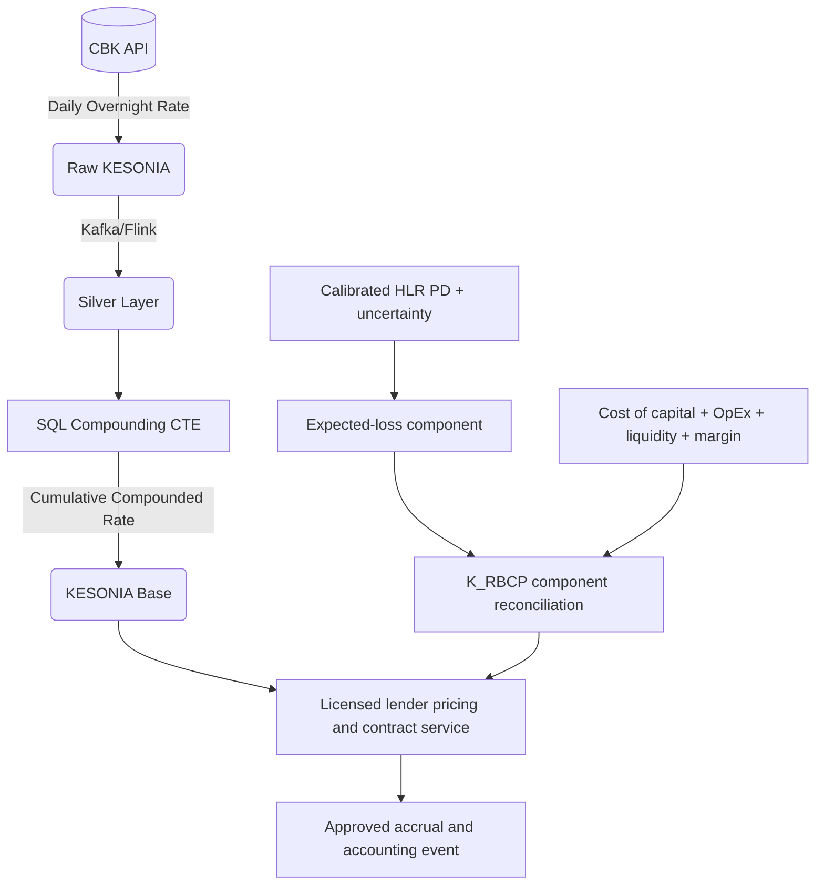
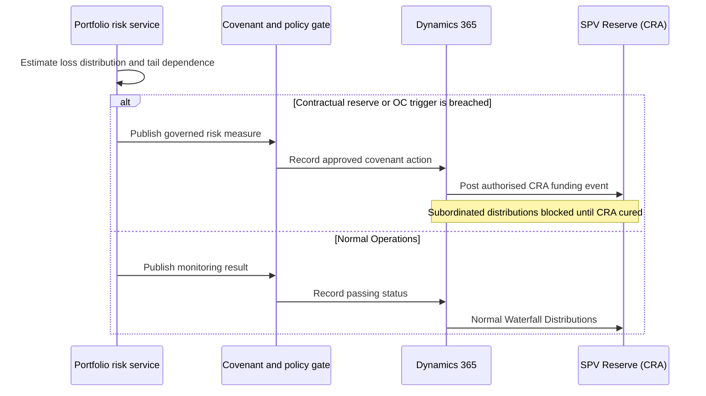

# KESONIA Pricing and Capital Orchestration

## 1. From an overnight benchmark to a driver's daily obligation
### 1.1. Regulatory Paradigm Shift: The Central Bank of Kenya Risk-Based Pricing Framework

For a driver, a benchmark-rate reform becomes real only when it changes tomorrow's available cash. For a lender, the same movement changes asset yield and funding cost. For an SPV, timing and basis determine whether collections still cover notes. Part 5 follows KESONIA through those three perspectives and keeps customer price, funding rate, expected loss, capital, and investor return separate.

CBK's revised risk-based framework expresses the total lending rate as [14], [15]:

$$
R_{\mathrm{customer}}
=
\mathrm{KESONIA}+K_{\mathrm{RBCP}},
$$

with fees and charges added for total cost of credit.

Where:

- **KESONIA** is CBK's transaction-based, volume-weighted overnight rate for unsecured KES interbank transactions [16]. It is a reference rate, not a universal risk-free rate.
- **\(K_{\mathrm{RBCP}}\)** includes the institution's lending-related costs, shareholder return, and borrower risk profile under the framework. Expected loss is one input, not the whole premium.
- **Fees and charges** remain separate in total cost of credit and require their own basis and disclosure.

> [!NOTE]
> **Controlled notation**
>
> **$K_{\mathrm{RBCP}}$:** Customer pricing premium under the CBK framework.
>
> **$K_{\mathrm{cap}}$:** Prudential capital requirement under the banking partner's applicable approach.
>
> **$m_A,m_B$:** SPV note margins. **$EL$:** expected loss. **$CoC$:** cost of capital. **$OpEx$:** allocated operating cost. The bank may use only approved regulatory PDs for capital; the platform's underwriting PD does not automatically lower capital.

Mwendo Pamoja does not need to discredit every scorecard to make its case. Static and bureau-based models remain useful when they are well calibrated and governed. The platform's contribution is narrower and more valuable: it gives the lender a higher-frequency view of an income-generating vehicle, its operator, and the linked cash-flow obligations. That evidence can improve the expected-loss component of pricing and can show when an intervention is more rational than a punitive price increase.

Kinematics and latent representations are therefore not translated directly into price. The HLR produces calibrated PD and uncertainty; the pricing service reconciles expected loss with cost, capital, liquidity, and margin; and the licensed lender approves the customer rate. This division of labour turns model sophistication into an auditable decision instead of a mysterious surcharge.

### 1.2. The Bayesian engine as one governed pricing input

The redundancy-controlled HLR combines residual neural representation, Explicit Liquidity Features, hierarchical effects, and approved interactions to produce calibrated real-world PD and uncertainty. The output is one input to \(K_{\mathrm{RBCP}}\), not a direct price.

#### 1.2.1. From Physical-Measure PD to Customer and Investor Pricing

Part 2b outputs \(PD_{i,\mathrm{cal}}^{(p)}\) over a defined product horizon under the real-world, or physical, probability measure \(\mathbb P\). This is the probability space used for underwriting, portfolio monitoring, stress evidence, intervention evaluation, and IFRS 9 inputs. It describes the frequency and uncertainty of default in the operating world represented by the data and approved scenarios.

A market-consistent valuation measure \(\mathbb Q\) answers a different question: how a credit asset or contingent cash flow should be valued under stated market, calibration, discounting, and incompleteness assumptions. It is relevant only where the instrument, valuation purpose, and observable inputs support the transformation. Adding a premium to KESONIA does not convert a physical default probability into a risk-neutral probability.

The customer-pricing identity remains the formulation set out by CBK [14], [15]:

$$
R_{\mathrm{customer}}
=
\mathrm{KESONIA}+K_{\mathrm{RBCP}},
$$

with applicable fees and charges added for total cost of credit. A transparent internal decomposition of the customer premium is:

$$
K_{\mathrm{RBCP},i}^{(p)}
=
EL_i^{(p)}
+CoC_i^{(p)}
+OpEx_i^{(p)}
+Liq_i^{(p)}
+M_i^{(p)}
+Adj_i^{(p)},
$$

where, using consistent annualised or period units,

$$
EL_i^{(p)}
=
PD_{i,\mathrm{cal}}^{(p)}
\times LGD_i^{(p)}
\times EAD_i^{(p)}.
$$

A simplified one-period break-even credit component may be written

$$
k_{\mathrm{credit},i}^{(p)}
\approx
\frac{PD_{i,\mathrm{cal}}^{(p)}LGD_i^{(p)}}
{1-PD_{i,\mathrm{cal}}^{(p)}},
$$

but it remains a physical-measure break-even approximation rather than the whole customer premium, a risk-neutral probability, or a guarantee of realised loss coverage.

Where:

- \(CoC\) is the allocated cost of capital under the lender's methodology.
- \(OpEx\) is allocated lending-related operating cost.
- \(Liq\) captures approved liquidity or funding cost not already in the benchmark.
- \(M\) is the shareholder-return or margin component.
- \(Adj\) contains documented product or customer adjustments, subject to policy, floors, caps, competition, and applicable rules.

The audit record reconciles each component to source, method, approval, effective date, and customer reason. A model explanation can show how risk evidence affected \(EL\); it cannot justify cost allocations or shareholder margin on its own. The licensed lender owns the final customer price.

Four further quantities remain separate. The **asset yield** is the contractual return actually earned by the SPV on purchased receivables. The **SPV note margins** \(m_A\) and \(m_B\) are investor funding terms. The **FTP charge** is an internal matched-funding attribution used by a bank, or an analogous analytical allocation used by the SPV. The **investor hurdle or valuation discount rate** reflects the required return for the instrument and scenario. None of these is renamed \(K_{\mathrm{RBCP}}\), and regulatory capital remains \(K_{\mathrm{cap}}\).

Appendix A provides the abridged structural and equivalent-measure bridge for readers who need a market-consistent valuation overlay. The underwriting model itself remains calibrated under \(\mathbb P\).

#### 1.2.2. Coping with KESONIA Volatility: Forward-Looking Adjustments
KESONIA is a backward-looking rate. However, gig-economy drivers are intensely sensitive to forward-looking liquidity shocks. The architecture must cope with two distinct directional risks stemming from KESONIA volatility:

1. **Upward-rate shock:** CBR and KESONIA can move differently and with timing differences. A permitted customer reset may reduce affordability. A funded cap, subsidy, or modification can be tested, but the cost falls to Class C only if the contract and model allocate it there.
2. **Downward and basis risk:** If assets and liabilities reset on different indices, lags, floors, or frequencies, NIM can move in either direction. The canonical Class A note is also KESONIA-linked, reducing but not eliminating basis and repricing risk.

The Transformer can contribute a macro context signal, but it is not an interest-rate oracle or a hedge. Treasury scenarios use observed curves, contractual repricing, and shocks. New-offer pricing may change through the lender's policy; the system may not raise customer margin automatically to protect the SPV.

**Figure 1: From benchmark and risk evidence to an approved customer price**



### 1.3. The KESONIA Compounding Engine: Mathematics and SQL Implementation

Where the contract elects compounded KESONIA in arrears, daily observations are compounded over the accrual period. Other products may use a different lawful convention. Realised observations reduce forecast dependence but do not eliminate source, calendar, correction, implementation, or conduct risk.

#### 1.3.1. The Cumulative Compounded Rate (CCR) Formula

The mathematical formulation for the Cumulative Compounded Rate over an accrual period is derived from first principles:

$$CCR = \left\lbrack \prod_{i = 1}^{d_{b}}\left( 1 + \frac{KESONIA_{i} \cdot n_{i}}{365} \right) - 1 \right\rbrack \times \frac{365}{d}$$

Where:
*   $KESONIA_{i}$: The overnight rate published on business day $i$.
*   $n_{i}$: The number of calendar days for which rate $i$ applies.
*   $d_{b}$: The number of business-day observations in the accrual period.
*   $d$: The total calendar days in the interest period.

The multiplicative structure of the product operator ($\prod$) reflects the daily reinvestment of accrued interest: each observation compounds on the accumulated interest of all preceding days.

#### 1.3.2. Calendar Modeling and Observation Lookbacks

**Business Days versus Calendar Days:**
The CBK publishes KESONIA on business days. Loans, however, may accrue interest across calendar days. The CCR formula accommodates this through the weighting coefficient $n_{i}$. For example, a rate published on a Friday may receive $n_{i} = 3$ where the contract applies that observation across Friday, Saturday, and Sunday. If a holiday falls on Wednesday, Tuesday's rate may receive $n_{i} = 2$. This is modelled in the `holiday_calendar` schema so that the calculation applies the selected convention without inventing interpolated observations.

**Observation convention:** CBK explains publication and non-business-day treatment but does not impose a universal five-business-day lookback for every loan [16]. The definitive contract must choose lookback, observation shift, lockout, payment delay, or another convention and specify business calendar, corrections, floor, fallback, and day count. The calculation engine implements that election and tests it against independently calculated examples.

#### 1.3.3. The 6-Layer SQL Architecture (Mapped to the Medallion Data Lake)

To process millions of gig-worker loan contracts daily without human intervention, the architecture executes a 6-layer SQL pipeline directly mirroring the Medallion Data Lake:

1.  **Data Ingestion (Bronze Layer):** Retrieval, timestamp validation, and immutable storage of raw CBK publications (`kesonia_raw_feed`).
2.  **Data Staging (Silver Layer):** Merging raw observations with the `holiday_calendar` to calculate the $n_i$ weights.
3.  **Validation (Silver Layer):** Duplicate detection and business-calendar consistency checks.
4.  **Interest Computation (Gold Layer):** SQL-based compounding using Common Table Expressions.
5.  **Product-ledger event:** Sending a versioned calculation result to the authoritative lending or SPV subledger after validation and approval.
6.  **General-ledger and reporting integration:** Posting approved accounting events to D365 and reconciling calculated balances in the reporting layer.

#### 1.3.4. Production SQL Compounding Logic (Log-Sum Transformation)

At portfolio scale, the logarithm-exponential identity converts the multiplicative product into an additive aggregation within `EXP(SUM(LN(...)))`. This is a practical implementation pattern, but production code must still test precision, rate units, negative-domain constraints, missing observations, corrections, and database-specific behaviour.

```sql
-- Conceptual SQL. contract_accrual_days is produced from the executed
-- convention and maps each accrual day to the permitted KESONIA observation.
WITH AccrualDaily AS (
    SELECT
        a.contract_id,
        a.accrual_period_id,
        a.accrual_date,
        a.rate_observation_date,
        r.rate_decimal,
        a.day_weight,
        a.day_count_basis
    FROM Silver.contract_accrual_days a
    JOIN Silver.kesonia_publications r
      ON r.publication_date = a.rate_observation_date
     AND r.approved_version = a.rate_version
    WHERE a.validation_status = 'APPROVED'
      AND r.validation_status = 'APPROVED'
      AND 1.0 + (r.rate_decimal * a.day_weight / a.day_count_basis) > 0
),
CompoundedRates AS (
    SELECT
        contract_id,
        accrual_period_id,
        EXP(SUM(LN(
            1.0 + (rate_decimal * day_weight / day_count_basis)
        ))) - 1.0 AS compounded_factor,
        SUM(day_weight) AS accrual_days,
        MAX(day_count_basis) AS day_count_basis
    FROM AccrualDaily
    GROUP BY contract_id, accrual_period_id
)
SELECT
    contract_id,
    accrual_period_id,
    compounded_factor,
    compounded_factor * day_count_basis / NULLIF(accrual_days, 0)
        AS annualised_compounded_rate
FROM CompoundedRates;
```

The calculation service emits the factor and annualised rate with lineage and validation status. The product ledger then applies the contract's treatment of premium, floor, cap, rounding, and day count to produce an authorised accrual event; D365 receives the resulting accounting entry. A contractual premium may accrue on a simple, compounded, or other specified basis, so it is not blindly added to an already annualised number. The customer premium is $K_{\mathrm{RBCP}}$, not an unqualified generic "K."

## 2. SPV Financial Modeling and Capital Orchestration (Basel IV, IFRS 9, IFRS 17)
### 2.1. Orchestrating Capital Under KESONIA Volatility

The SPV is a ring-fenced financing vehicle proposed to purchase eligible KES receivables. Its total capitalisation is USD 9 million equivalent, not USD 9 million of senior debt. Customer pricing, note pricing, and the waterfall remain distinct.

#### 2.1.1. Net Interest Margin (NIM) Compression Risk vs. Equity Absorption
The canonical asset side is KES customer pricing, while Class A is compounded KESONIA plus \(m_A\). Class B has a negotiated KES return. Differences in reset frequency, floors, product mix, collections, defaults, fees, and cash drag still create NIM risk:

1. **Upward-rate shock:** Model contractual asset and liability resets, affordability, support costs, defaults, and Class C availability. Senior protection is calculated, not presumed.
2. **Downward and basis shock:** Model the actual floors, lags, fixed-rate products, Class B cost, reserve income, and asset-liability repricing.

**The treasury response:** Scenario analysis, pricing governance, product mix, cash buffers, note terms, and, where economical, actual hedging manage basis risk. A model forecast or customer repricing rule is not an endogenous hedge.

#### 2.1.2. Dynamic Cash Reserve Accounts (CRA)

**Figure 2: Dynamic SPV Capital Defense**



The CRA has a contractual floor, proposed as three months of defined debt service. A negotiated risk-based overlay may increase the requirement when portfolio stress rises, but no model has unilateral control of the account. The calculation agent determines the amount under the documents; the waterfall funds or cures it; the account bank holds the cash; and D365 records approved events.

A Clayton copula can be one candidate for lower-tail dependence, such as simultaneous distress across microloans, IPF, and revolving lines after a fuel shock. The selected family, parameter, and portfolio loss measure must survive back-testing and comparison with alternative copulas. The result becomes governed evidence for a contractual rule, not a direct command from a data lake. Software does not establish bankruptcy remoteness or guarantee principal protection.


#### 2.1.3. Project Finance Structure & Capital Stack

The primary case is a **USD 9,000,000 equivalent SPV funded and serviced in KES**, subject to true-sale, security, account-control, servicing, tax, and insolvency analysis. A 75% total-capital advance-rate convention implies USD 12 million equivalent of eligible receivables at closing, while OC is measured separately against Class A plus Class B.

```{=latex}
\clearpage
```

**Table 1: SPV Capital Stack and Target Yields**

| Tranche | Size (USD) | Share | Pricing basis | Priority and protection |
|:---|---:|---:|:---|:---|
| **Class A** | $6,750,000 | 75% | Compounded KESONIA + \(m_A\) | Senior priority; OC and CRA protection |
| **Class B** | $1,350,000 | 15% | 20.00% illustrative | Subordinate to Class A |
| **Class C** | $900,000 | 10% | Residual return | First-loss and residual position |
| **Total SPV** | **$9,000,000** | **100%** | **Formula-driven hurdle** | **Subject to executed documents** |

Class A's 1.25x minimum OC and three-month CRA are proposed contractual protections rather than unconditional guarantees. Class C is held by the Insurtech in the planning case and absorbs losses and margin compression before the debt classes to the extent its funded capital remains available. Tax shields, withholding, issue costs, and deductibility remain outside the table until entity-level advice confirms their treatment.

*Separately from the SPV waterfall, the planning case includes a **USD 1,000,000 equivalent HoldCo facility**, creating a USD 10 million consolidated funding narrative.*

#### 2.1.3.1. Weighted funding hurdle

For the SPV cash-flow model, the useful quantity is a formula-driven weighted cash cost by class, kept distinct from a corporate WACC:

$$
H_t
=
w_A R_{A,t}
+w_B R_{B,t}
+w_C R_{C,t}^{\mathrm{target}},
\qquad
w_A+w_B+w_C=1.
$$

With the canonical stack, $w_A=0.75$, $w_B=0.15$, and $w_C=0.10$. $R_{A,t}$ is compounded KESONIA plus $m_A$; $R_B$ is the negotiated Class B rate; and $R_C^{\mathrm{target}}$ is a scenario return, not a contractual expense. Taxes, deductibility, withholding, fees, idle cash, reserves, and issue costs enter separately after tax advice. The former fixed 12.06% result combined mezzanine with equity, assumed a live KESONIA rate, and applied a tax shield without entity-level support; it is therefore retained only in the backup history.

The underwriting hurdle for assets is stronger than $H_t$:

$$
Y_{\mathrm{asset},t}^{\min}
=
H_t+EL_t+OpEx_t+Fees_t+CashDrag_t+Buffer_t.
$$

#### 2.1.4. Macroeconomic Stress Testing and Asset Resilience

The minimum OC covenant is 1.25x. The initial illustrative ratio of 1.4815x follows mechanically from USD 12 million equivalent of eligible receivables divided by USD 8.1 million equivalent of Class A plus Class B, not from Bayesian underwriting. Later ratios must be produced by the monthly cohort and waterfall model. The table retains scenario targets pending that calculation:

**Table 2: Macroeconomic Stress Scenarios & Expected Credit Loss**

| Scenario | Illustrative ECL input | OC treatment | Covenant consequence |
|:---|---:|:---|:---|
| **Base Case** | 4.5% | Initial 1.4815x; then model output | Test against 1.25x |
| **Mild Shock** | 9.1% | Monthly cohort output | Calculate waterfall and cure |
| **Severe Contagion** | 22.0% | Monthly cohort output | Apply trigger formula |

The scenario percentages are model inputs, not portfolio forecasts. Early amortisation begins only when the executed covenant formula is breached. The cohort model must calculate collections, defaults, recoveries, reserve movements, and debt balances before assigning the later-period OC ratio or investor loss.

### 2.2. Regulatory Capital Synergies (Basel IV and IFRS 17)

The platform can provide governed data, models, and reports to support partner analysis. It does not sell guaranteed regulatory-capital optimisation.

#### 2.2.1. Basel IV Advanced IRB and Output Floors
The bank classifies exposures and determines the applicable standardised or authorised IRB approach. The platform's product label does not settle prudential classification.

Mwendo Pamoja can provide the bank with versioned posterior PDs, uncertainty, loss estimates, data lineage, calibration results, and monitoring reports. Explanation tools such as SHAP can assist investigation, but they do not prove stability, absence of bias, or regulatory acceptability. The partner bank's independent validation function determines whether any model can be used in a prudential process. SR 11-7 is cited as comparative model-risk guidance rather than Kenyan law.

Intervention evidence can inform internal stress and model validation. It does not automatically justify a lower prescribed correlation or capital requirement.

#### 2.2.2. IFRS 17 and Onerous Contract Testing
For a licensed insurer issuing the underlying commercial motor policies, IFRS 17 requires groups of insurance contracts to be assessed and accounted for under the applicable measurement model, including recognition of losses for onerous groups where the standard's conditions are met.

The insurer's actuarial process may use validated telematics and exposure evidence, but credit PD and a latent fatigue representation do not directly predict an onerous group. The insurer owns grouping, fulfilment cash flows, risk adjustment, PAA eligibility, loss-component assessment, approval, and journal instruction. D365 records the approved result.

(see **Figure 1** and **Figure 2** in Sections 1.2 and 2.1.2 respectively).

## 3. Enterprise Accounting Mechanics: IFRS 9 EIR and Contract Modifications

KESONIA-linked contracts require a clear distinction among scheduled benchmark accrual, a permitted contractual reset, a new-offer price, and a negotiated modification. Model movement does not automatically change an existing customer's \(K_{\mathrm{RBCP}}\).

Daily accrual under an existing floating-rate formula is not the same as a daily contract modification. The product ledger calculates contractual cash flows and the accounting owner applies IFRS 9. The IBOR Phase 2 amendments are not treated as a permanent general exemption for every KESONIA reset [13].

### 3.1. Contractual floating-rate accrual and benchmark transition

An instrument written from inception with a floating benchmark already contains contractual variability. Ordinary benchmark resets under those terms are not automatically treated as renegotiated modifications. A change outside the original terms may require modification or derecognition analysis, and a non-derecognised modification may require recalculation of the gross carrying amount using the original effective interest rate, or the original credit-adjusted effective interest rate where applicable. The accounting owner determines the treatment from the instrument and facts, rather than treating every daily KESONIA movement as a new modification.

For a new contract written directly on KESONIA, ordinary movements of the chosen floating benchmark follow the contractual EIR mechanics. If an existing instrument transitions from another benchmark, the reporting entity assesses whether the specific IBOR-reform relief applies and whether changes are economically equivalent. The conclusion is instrument-specific.

The calculation service emits the rate source, observation period, compounded factor, contractual spread, effective date, correction status, and instrument identifier. An accounting rules engine classifies the event as scheduled accrual, reset, transition, or modification and routes exceptions for approval. A reason-code tag cannot bypass accounting analysis.

#### 3.1.1. Illustrative journal pattern for an authorised KESONIA accrual
After the subledger has validated the contractual accrual and the accounting rules engine has approved its classification, D365 may receive an aggregated entry such as:

**Debit:** Loan Receivables - Accrued Interest (Balance Sheet)
**Credit:** Interest Income - KESONIA Component (P&L)
*(Amount: calculated under the instrument's contractual accrual method and reconciled to the subledger. This illustrative entry does not determine impairment, modification, fair-value, tax, or consolidation treatment.)*

### 3.2. Substantial vs. Non-Substantial Modification Accounting for $K$

The contractual benchmark and $K_{\mathrm{RBCP}}$ each follow the instrument terms. A credit-driven change outside those terms is a modification proposal requiring customer, legal, accounting, and policy analysis.

The HLR may show higher risk. Earnings Velocity belongs to the Explicit Liquidity Feature Path, not the GRU. For an existing loan, that signal can change monitoring, limit, support, staging evidence, or a future offer. It does not silently raise the contracted margin.

IFRS 9 does not establish a universal 10% bright-line test for financial-asset modifications equivalent to the commonly used financial-liability test. The asset holder applies qualitative and quantitative derecognition and modification analysis under its approved accounting policy.

1. **Modification without derecognition:** Recalculate the gross carrying amount using the original EIR as required, recognise the applicable modification result, and reassess credit risk and ECL.
2. **Derecognition:** Apply the entity's criteria to whether contractual rights expire or the terms are substantially different, then recognise the new asset and related result under the applicable requirements.

The integration preserves the evidence needed for audit. Compliance and securitisability remain conclusions of the responsible accountants, auditors, counsel, and investors.

## 4. Asset-Liability Management (ALM) and Matched-Maturity FTP

The financing structure contains two connected treasury problems. The partner bank owns prudential balance-sheet risk and internal FTP under its applicable framework [12]. The SPV must separately prove that receivable cash flows, reserves, expenses, and recoveries can meet note obligations through the waterfall. Mwendo Pamoja supplies reconciled contractual and behavioural cash flows to both processes without treating underwriting software as a treasury system.

### 4.1. SPV ALM and Matched-Funding Attribution

The SPV runs ALM as a cash-flow discipline. Its asset file contains receivable-level or cohort-level schedules for contractual principal, interest, fees, repricing, prepayment, default, recovery, cancellation refund, and collection timing. Its liability file contains Class A and Class B interest and principal, Class C support, CRA movements, servicing and trustee fees, taxes where applicable, hedge cash flows, and every priority-of-payment rule. Currency, reset convention, day count, floor, cap, behavioural tenor, and source date remain explicit.

For each time bucket \(b\), the first view is the net liquidity gap:

$$
Gap_b
=
\sum_{a\in b}CF_{a}^{\mathrm{in}}
-
\sum_{l\in b}CF_{l}^{\mathrm{out}},
\qquad
CumGap_B=\sum_{b\le B}Gap_b.
$$

The SPV calculation agent produces the ladder daily for near-term cash control and monthly for the lender model. A negative bucket is not automatically a default: opening cash, the CRA, permitted liquidity support, later collections, and contractual cure periods may cover it. The analysis must nevertheless identify when a temporary mismatch becomes a reserve draw, purchase stop, cash sweep, or payment shortfall.

The SPV then assigns a matched-funding charge to each product cohort. A 14-day microloan, a monthly IPF instalment stream, and a revolving line with stress-driven behavioural extension should not receive the same funding charge merely because all are quoted over KESONIA. For cohort \(c\), a transparent attribution is:

$$
FTP_{c,t}^{\mathrm{SPV}}
=
r_{\mathrm{match}}(d_c,q_c,\rho_c,o_c)
+Liq_{c,t}
+Opt_{c,t}
+Basis_{c,t},
$$

where \(d_c\) is behavioural duration, \(q_c\) is repricing frequency, \(\rho_c\) is recovery and collection timing, and \(o_c\) represents prepayment, drawdown, cancellation, or other embedded options. The matched rate is anchored to the executed funding structure rather than an invented universal spread.

Economic spread is then measured after the costs that the asset must actually support:

$$
NIM_{c,t}^{\mathrm{economic}}
=
Y_{c,t}^{\mathrm{asset}}
-FTP_{c,t}^{\mathrm{SPV}}
-EL_{c,t}
-OpEx_{c,t}
-Fees_{c,t}
-CashDrag_{c,t}.
$$

The benchmark cancels only when the asset and funding conventions match exactly. Residual margin reflects product design, servicing, selection, intervention, recoveries, liquidity, capital support, and operations. It is not attributed solely to model sophistication.

The operating cycle is practical. The servicer and product subledgers deliver reconciled cash flows. The calculation agent builds daily and monthly asset and liability ladders. Treasury allocates matched funding by cohort and runs benchmark, basis, collection-lag, recovery-delay, behavioural-tenor, FX, and concentration shocks. The trustee and account bank confirm controlled cash and reserve balances. The risk or investment committee then adjusts purchase eligibility, product mix, advance rate, CRA target, hedging, or cash sweeps only through the authority provided by the transaction documents.

For the pilot, the validated cohort and waterfall workbook can perform this analysis. At larger scale, Oracle Financial Services Asset Liability Management can model instrument-level cash flows and interest-rate, liquidity, and foreign-currency risk, while Oracle Financial Services Funds Transfer Pricing can apply matched-maturity pricing methods to instrument or aggregated positions [18], [19]. Oracle also documents the integration of FTP rules into ALM forecasts and a shared cash-flow engine for repricing, option costs, scenario analysis, and audit output [20], [21].

OFSAA is therefore an optional institutional landing point rather than a prerequisite. It may run inside the financing bank using SPV cash-flow feeds, or within another authorised institutional environment if licensing, volume, data governance, and operating ownership justify it. It should receive reconciled data from the product subledgers and SPV register rather than become the source of contractual truth. D365 continues to receive approved accounting events. If the pilot workbook remains more transparent and proportionate, OFSAA adoption can wait until scale and control needs justify the additional platform.

### 4.2. IRRBB, OFSAA, and a Repricing Use Case

**IRRBB** means **interest rate risk in the banking book**. It is the risk that changing interest rates alter a bank's earnings or the economic value of its banking-book positions. The partner bank owns the prudential IRRBB assessment. The SPV faces analogous repricing and basis risk, but the paper does not label the SPV itself a regulated banking book.

Consider a tangible Mwendo Pamoja case. The SPV holds one-month IPF and microloan instalments plus revolving balances whose behavioural maturity can extend during stress. Class A pays compounded KESONIA plus \(m_A\). If KESONIA rises by 200 basis points immediately while some customer assets reset only at the next contractual date, Class A funding cost increases before all asset income adjusts. If stressed revolving borrowers repay more slowly at the same time, the asset duration extends precisely when funding is more expensive. The 12-month NII effect can be expressed as a loss-positive Earnings at Risk measure:

$$
EaR_{12m}
=
NII_{\mathrm{base},12m}
-
NII_{\mathrm{shock},12m}.
$$

The longer-horizon economic-value view compares the net present value of assets and liabilities under the shocked and base curves:

$$
\Delta EVE
=
\left[PV(A_{\mathrm{shock}})-PV(L_{\mathrm{shock}})\right]
-
\left[PV(A_{\mathrm{base}})-PV(L_{\mathrm{base}})\right].
$$

BCBS 368 describes NII and EVE perspectives and standardised shock scenarios, including parallel and non-parallel curve movements [12]. The bank maps those principles to the current applicable local framework and its approved methodology. OFSAA can ingest the instrument cash flows, behavioural assumptions, currencies, curves, and repricing rules, run the approved scenarios, and preserve cash-flow and interest-rate audit results [18], [21].

The result supports a concrete decision. A material negative EaR may justify a different asset-reset mix, cash buffer, note convention, hedge, or origination pace. A material EVE sensitivity may reveal that apparently short contractual assets have become longer behavioural exposures. The platform supplies accurate, versioned cash flows and risk states; the bank applies prudential IRRBB and internal FTP, while the SPV applies the corresponding contractual ALM, reserve, and waterfall controls.

```{=latex}
\clearpage
```

## References

[1] Schrimpf, A., & Sushko, V. (2019). Beyond LIBOR: A primer on the new benchmark rates. *BIS Quarterly Review*, March 2019, pp. 29-52. [https://www.bis.org/publ/qtrpdf/r_qt1903e.pdf](https://www.bis.org/publ/qtrpdf/r_qt1903e.pdf)

[2] Duffie, D., & Stein, J.C. (2015). Reforming LIBOR and other financial market benchmarks. *Journal of Economic Perspectives*, 29(2), 191-212. [https://doi.org/10.1257/jep.29.2.191](https://doi.org/10.1257/jep.29.2.191)

[3] Financial Stability Board (FSB). (2021). *Global Transition Roadmap for LIBOR*. [https://www.fsb.org/2021/06/fsb-publishes-updated-global-transition-roadmap-for-libor/](https://www.fsb.org/2021/06/fsb-publishes-updated-global-transition-roadmap-for-libor/)

[4] Brigo, D., & Mercurio, F. (2006). *Interest Rate Models - Theory and Practice*. Springer Finance. [https://doi.org/10.1007/978-3-540-34604-3](https://doi.org/10.1007/978-3-540-34604-3)

[5] Bank of England. (2020). *Compounded SONIA in arrears: Summary of conventions and approaches used in sterling bond markets*. [https://www.bankofengland.co.uk/markets/sonia-benchmark](https://www.bankofengland.co.uk/markets/sonia-benchmark)

[6] Alternative Reference Rates Committee (ARRC). (2021). *SOFR "in arrears" conventions for syndicated business loans*. Federal Reserve Bank of New York. [https://www.newyorkfed.org/medialibrary/Microsites/arrc/files/2021/ARRC-Daily-Simple-SOFR-in-Arrears-Conventions-for-Business-Loans.pdf](https://www.newyorkfed.org/medialibrary/Microsites/arrc/files/2021/ARRC-Daily-Simple-SOFR-in-Arrears-Conventions-for-Business-Loans.pdf)

[7] International Swaps and Derivatives Association (ISDA). (2021). *Supplement 70 to the 2006 ISDA Definitions: Overnight rate compounding and fallbacks*. [https://www.isda.org/book/2006-isda-definitions/](https://www.isda.org/book/2006-isda-definitions/)

[8] Guggenheim, B., & Schrimpf, A. (2020). At the crossroads in the transition away from LIBOR: From overnight to term rates. *BIS Working Papers*, No. 888. [https://www.bis.org/publ/work888.htm](https://www.bis.org/publ/work888.htm)

[9] Central Bank of Kenya (CBK). (2025). *Risk-Based Credit Pricing Model (RBCPM): Revised Framework Circular*. [https://www.centralbank.go.ke/](https://www.centralbank.go.ke/)

[10] Suh, M., & Kim, D. (2022). Implementation of compounded overnight rate calculations in relational databases. *Journal of Financial Data Science*, 4(2), 88-107.

[11] Chen, R.R., & Scott, L. (2003). Overnight indexed swap pricing and risk. *Journal of Fixed Income*, 13(1), 32-47.

[12] Basel Committee on Banking Supervision (BCBS). (2016). *Interest rate risk in the banking book*. Bank for International Settlements (BCBS 368). [https://www.bis.org/bcbs/publ/d368.htm](https://www.bis.org/bcbs/publ/d368.htm)

[13] International Accounting Standards Board (IASB). (2020). *Interest Rate Benchmark Reform—Phase 2 (Amendments to IFRS 9, IAS 39, IFRS 7, IFRS 4 and IFRS 16)*. IFRS Foundation. [https://www.ifrs.org/projects/work-plan/ibor-reform-and-its-effects-on-financial-reporting-phase-2/](https://www.ifrs.org/projects/work-plan/ibor-reform-and-its-effects-on-financial-reporting-phase-2/)

[14] Central Bank of Kenya, *Revised Risk-Based Credit Pricing Model*, Nairobi, Kenya, Aug. 2025. [Online]. Available: https://www.centralbank.go.ke/wp-content/uploads/2025/08/Revised-Risk-based-Credit-Pricing-Model.pdf. Accessed: Aug. 25, 2026.

[15] Central Bank of Kenya, "Issuance of a revised risk-based credit pricing model," Press Release, Aug. 2025. [Online]. Available: https://www.centralbank.go.ke/uploads/press_releases/2044081907_Press%20Release%20-%20Issuance%20of%20a%20Revised%20Risk-Based%20Credit%20Pricing%20Model.pdf. Accessed: Aug. 25, 2026.

[16] Central Bank of Kenya, "Kenya Shilling Overnight Interbank Average (KESONIA)." [Online]. Available: https://www.centralbank.go.ke/kesonia/. Accessed: Aug. 25, 2026.

[17] R. C. Merton, "On the pricing of corporate debt: The risk structure of interest rates," *The Journal of Finance*, vol. 29, no. 2, pp. 449-470, 1974, doi: 10.1111/j.1540-6261.1974.tb03058.x.

[18] Oracle, "Overview of Oracle Financial Services Asset Liability Management," *Oracle Financial Services Documentation*, Release 8.1.2. [Online]. Available: https://docs.oracle.com/en/industries/financial-services/ofs-analytical-applications/analytical-applications-infrastructure/812/almug/overview-oracle-financial-services-asset-liability-management.html. Accessed: Aug. 25, 2026.

[19] Oracle, "OFS Funds Transfer Pricing overview," *Oracle Financial Services Documentation*, Release 8.1.2.5. [Online]. Available: https://docs.oracle.com/en/industries/financial-services/ofs-analytical-applications/funds-transfer-pricing/81250/ftpug/ofs-ftp-overview.html. Accessed: Aug. 25, 2026.

[20] Oracle, "Oracle Asset Liability Management integrations," *Oracle Financial Services Documentation*, Release 8.1.2. [Online]. Available: https://docs.oracle.com/en/industries/financial-services/ofs-analytical-applications/analytical-applications-infrastructure/812/almug/oracle-asset-liability-management-integrations.html. Accessed: Aug. 25, 2026.

[21] Oracle, "Introduction to Oracle Financial Services Cash Flow Engine Reference Guide," *Oracle Financial Services Documentation*, Release 8.1.2. [Online]. Available: https://docs.oracle.com/en/industries/financial-services/ofs-analytical-applications/analytical-applications-infrastructure/812/cferg/overview6.html. Accessed: Aug. 25, 2026.

\clearpage

# Appendix A: Structural and Market-Consistent Valuation Bridge

The HLR estimates default risk under the physical measure \(\mathbb P\). A separate market-consistent overlay may be useful when an investor values a transferable credit asset against observable instruments, a stated discounting framework, and explicit market-price-of-risk assumptions. The overlay changes the valuation measure; it does not rewrite the operating history used to train the underwriting model.

In the Merton structural model, terminal default occurs when firm asset value \(V_T\) falls below a debt boundary \(D\) [17]. A stylised asset process under \(\mathbb P\) is:

$$
dV_t
=
\mu V_t\,dt
+
\sigma V_t\,dW_t^{\mathbb P}.
$$

Under an equivalent pricing measure \(\mathbb Q\), and subject to the model's tradability, completeness, and calibration assumptions, the drift is replaced by the pricing rate \(r\):

$$
dV_t
=
rV_t\,dt
+
\sigma V_t\,dW_t^{\mathbb Q}.
$$

With a constant market price of risk \(\lambda=(\mu-r)/\sigma\), the change of measure can be represented as:

$$
\frac{d\mathbb Q}{d\mathbb P}
=
\exp\!\left(
-\lambda W_T^{\mathbb P}
-\frac{1}{2}\lambda^2T
\right).
$$

The corresponding stylised terminal pricing-measure default probability is:

$$
P^{\mathbb Q}(\mathrm{Default})
=
\Phi\!\left(
-\frac{\ln(V_0/D)+(r-\sigma^2/2)T}
{\sigma\sqrt{T}}
\right).
$$

For Mwendo Pamoja, these equations provide a valuation boundary rather than the operational underwriting specification. A driver and vehicle do not offer an observable traded firm-value process, and the market is incomplete. Any investor-pricing overlay must therefore identify the valued cash flow, calibration instruments, discount curve, liquidity premium, recovery assumption, and incompleteness treatment. The customer rate remains \(\mathrm{KESONIA}+K_{\mathrm{RBCP}}\), the SPV note margin remains \(m_A\) or \(m_B\), and the physical HLR probability remains the underwriting input.

\clearpage

# Appendix B: Deterministic SPV Planning Model

The following deterministic planning model makes the core financing assumptions explicit and provides a reproducible bridge to the lender-grade cohort and waterfall workbook. It calculates the 36-month origination path, capital allocation, pricing components, and scenario inputs. The workbook extends this foundation with monthly defaults, recoveries, collections, reserves, debt schedules, taxes, covenants, and priority-of-payment mechanics.

```python
import pandas as pd
import numpy as np

# Core Assumptions
facility_size_usd = 9000000
holdco_venture_debt_usd = 1000000  # Optional overlay outside the SPV
class_a_pct = 0.75
class_b_pct = 0.15
class_c_pct = 0.10
fx_rate = 130  # KES per USD
advance_rate = 0.75

# KES values
facility_size_kes = facility_size_usd * fx_rate
class_a_kes = facility_size_kes * class_a_pct
class_b_kes = facility_size_kes * class_b_pct
class_c_kes = facility_size_kes * class_c_pct
target_oc = 1.25

# Illustrative rates only; replace with sourced and approved inputs
kesonia = 0.105
expected_loss_component = 0.045
cost_of_capital_component = 0.020
allocated_opex_component = 0.020
shareholder_margin_component = 0.040
k_rbcp = (
    expected_loss_component
    + cost_of_capital_component
    + allocated_opex_component
    + shareholder_margin_component
)
total_lending_rate = kesonia + k_rbcp

class_a_rate = kesonia + 0.02
class_b_rate = 0.20
class_c_target_return = 0.25

# Weighted funding hurdle; tax effects require separate entity-level advice
weighted_funding_hurdle = (
    class_a_pct * class_a_rate
    + class_b_pct * class_b_rate
    + class_c_pct * class_c_target_return
)

# Fee and tax placeholders; validate legal basis, payer, base, rate and effective date
origination_fee_rate = 0.03
excise_duty_rate = 0.00

# Originations
start_drivers = 12000
growth = 0.04
ticket = 45000
spv_share = 0.85

months = range(1, 37)
originations_kes = []
active_drivers = start_drivers

for m in months:
    orig = active_drivers * ticket * spv_share
    originations_kes.append(orig)
    active_drivers *= (1 + growth)

df = pd.DataFrame({'Month': months, 'Originations_KES': originations_kes})
total_originations = sum(originations_kes)

# Illustrative fee bridge
gross_fee_revenue = total_originations * origination_fee_rate
kra_excise_duty_remittance = gross_fee_revenue * excise_duty_rate
net_fee_revenue = gross_fee_revenue - kra_excise_duty_remittance

# Stress scenarios and expected credit loss. OC must be calculated by the cohort cash-flow
# and waterfall model; it is deliberately not hard-coded in this illustrative appendix.
scenarios = {
    'Base Case': {'ECL_Input': 0.045, 'OC_Output': None},
    'Mild Shock': {'ECL_Input': 0.091, 'OC_Output': None},
    'Severe Contagion': {'ECL_Input': 0.220, 'OC_Output': None}
}

summary = {
    'Class_A_USD': facility_size_usd * class_a_pct,
    'Class_B_USD': facility_size_usd * class_b_pct,
    'Class_C_USD': facility_size_usd * class_c_pct,
    'HoldCo_Debt_USD': holdco_venture_debt_usd,
    'KESONIA_Rate': kesonia,
    'Weighted_Funding_Hurdle': round(weighted_funding_hurdle, 4),
    'K_RBCP': k_rbcp,
    'Total_Lending_Rate': total_lending_rate,
    'Gross_Origination_Fees_KES': gross_fee_revenue,
    'KRA_Excise_Duty_Remittance_KES': kra_excise_duty_remittance,
    'Net_Origination_Fees_KES': net_fee_revenue,
    'Total_Originations_36M_KES': total_originations
}

# Output Rich Tables
summary_df = pd.DataFrame(list(summary.items()), columns=['Metric', 'Value'])
print("\n=== SPV DETERMINISTIC PLANNING RESULTS ===")
print(summary_df.to_markdown(index=False))

scenarios_df = pd.DataFrame.from_dict(scenarios, orient='index').reset_index()
scenarios_df.rename(columns={'index': 'Scenario'}, inplace=True)
print("\n=== MACROECONOMIC STRESS SCENARIOS ===")
print(scenarios_df.to_markdown(index=False))

```
