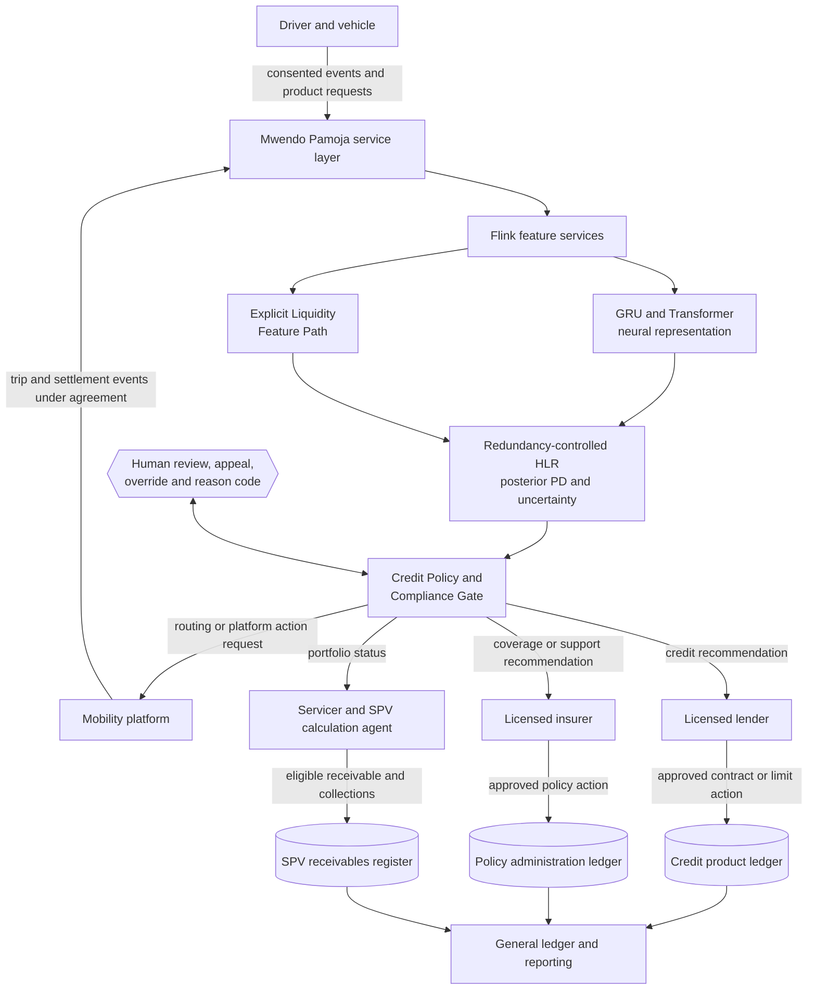

# Implementation Roadmap and Execution

## 1. The first live decision

At 6:17 on a Tuesday morning, a driver accepts the first airport trip of the day. The vehicle is insured, yesterday's fuel purchase has already reduced the wallet balance, and an instalment is due before the evening peak. Nothing has yet gone wrong. The platform's value is not that it can label the driver risky faster than a conventional lender. Its value is that it can recognise a tightening operating margin early enough to preserve the driver's ability to work, while still protecting the people who funded the receivable and the insurer who carries the motor risk.

That apparently simple moment contains almost the whole implementation problem. The platform must know which driver, vehicle, policy, facility, wallet, platform account, and consent record belong together. It must distinguish a delayed platform settlement from a genuine income collapse. It must compute an interpretable liquidity signal without leaking future information into the past. It must combine that signal with a constrained neural representation without counting the same financial fact twice. It must send a recommendation to the correct decision owner. If an action is approved, it must preserve the original evidence, communicate fairly with the driver, change the right product ledger, post the right accounting event, and eventually reconcile the cash that reaches the SPV waterfall.

The roadmap therefore does not begin with an ERP installation or a neural network. It begins by proving that one decision can be made lawfully, intelligibly, and reversibly from source event to cash result. Enterprise software, structured finance, and automated reporting enter only when the underlying product truth can survive reconciliation.

> [!IMPORTANT]
> This is a stage-gated implementation plan, not a promise that calendar time alone produces readiness. The proposed horizon is 18 months for a controlled pilot and transaction-ready evidence pack. A gate may take longer if data rights, legal opinions, model validation, accounting policy, or partner approvals are incomplete.

### 1.1. The implementation thesis

Seven principles govern the sequence.

1. **A decision has an owner.** The model produces evidence. A licensed lender, insurer, platform, servicer, trustee, or SPV calculation agent performs the action allocated to it.
2. **A ledger has an authority.** Product subledgers and the SPV receivables register hold contractual detail. Dynamics 365, if selected, is the general-ledger and enterprise-control destination, not a substitute for every product system.
3. **A feature has one engineered owner.** CFA, DLR, Earnings Velocity, Repayment Velocity, wallet volatility, reserve balance, time since depletion, utilisation, and approved interactions belong to the Explicit Liquidity Feature Path. Raw wallet-event sequences may inform a neural representation, but those engineered metrics are not duplicated there.
4. **A model must earn complexity.** The explicit-only baseline goes live first. Neural and copula components begin as challengers and are promoted only when out-of-time and out-of-group evidence shows incremental value, stability, and fairness.
5. **Accounting follows contracts and evidence.** An HLR output is not an IFRS 9 stage, an IFRS 17 loss component, a journal, or a prudential capital number. The responsible reporting entity applies its policy and approval.
6. **A covenant is not a dashboard threshold.** Advance rate, OC, CRA, concentration, and early-amortisation rules become operational only through executed transaction documents and a controlled calculation process.
7. **Scale follows a reconciled pilot.** The programme will not onboard hundreds of thousands of drivers merely because the streaming layer can process their events.

### 1.2. The stage-gated journey

**Figure 1: An 18-month path from product truth to controlled scale**

```{.mermaid layout=landscape}
flowchart LR
    subgraph P0["0 | Mandate and permissions<br/>Months 0 to 2"]
        A1[Partner mandate] --> A2[Driver research] --> A3[Data rights and DPIA] --> A4[Decision-rights map]
    end
    subgraph P1["1 | Event and ledger truth<br/>Months 2 to 4"]
        B1[Canonical identities] --> B2[Event contracts] --> B3[Product subledgers] --> B4[Cash reconciliation]
    end
    subgraph P2["2 | Transparent baseline<br/>Months 4 to 6"]
        C1[Explicit liquidity features] --> C2[Baseline score and policy gate] --> C3[Support workflow] --> C4[Shadow decisions]
    end
    subgraph P3["3 | Calibrated challengers<br/>Months 6 to 9"]
        D1[GRU and Transformer] --> D2[Residualised HLR] --> D3[Calibration and fairness] --> D4[Copula comparison]
    end
    subgraph P4["4 | Controlled product pilot<br/>Months 8 to 12"]
        E1[IPF and microloan cohorts] --> E2[KESONIA calculation] --> E3[Human approvals] --> E4[Driver outcomes]
    end
    subgraph P5["5 | Institutional landing<br/>Months 10 to 15"]
        F1[Accounting rules] --> F2[D365 and reporting] --> F3[SPV legal and financial model] --> F4[Independent validation]
    end
    subgraph P6["6 | SPV pilot and scale<br/>Months 15 to 18+"]
        G1[Eligible receivable purchase] --> G2[Waterfall and covenants] --> G3[Servicing continuity] --> G4[Measured expansion]
    end
    P0 -->|Gate A| P1 -->|Gate B| P2 -->|Gate C| P3
    P3 -->|Gate D| P4 -->|Gate E| P5 -->|Gate F| P6
    H1{{Privacy, security, model risk, audit and driver communication}}
    H1 -. continuous control .-> P0
    H1 -. continuous control .-> P2
    H1 -. continuous control .-> P4
    H1 -. continuous control .-> P6
```

The phases overlap deliberately. Legal structuring does not wait until Month 10, and data engineering does not stop at Month 4. The labels show where each workstream becomes the critical path and where a formal decision should prevent premature escalation.

## 2. Phase 0: mandate, lived experience, and permissions

The first deliverable is not code. It is a signed operating hypothesis shared by the platform, licensed lender, insurer, mobility platform, sponsor, and proposed servicer. Each party should be able to explain the same customer journey in plain language: what the driver receives, who owns the receivable, who may change a limit, who may cancel or reinstate insurance, who holds cash, and who answers a complaint.

### 2.1. Begin with the driver and the operating asset

Interview drivers across vehicle type, platform, city, gender, tenure, financing history, and income volatility. The research should follow a full working week rather than a single survey. It should observe how fuel, commission, repairs, insurance, household needs, and debt compete for the same wallet. The purpose is not to turn personal hardship into another feature. It is to identify where the proposed intervention is useful, where it is intrusive, and where the product design itself creates avoidable fragility.

The research team converts those journeys into testable service blueprints. A premium holiday, for example, must specify who funds the temporary shortfall, whether cover continues, how the insurer approves it, what the driver is told, how it affects future instalments, and what happens if income does not recover. A micro-reward bridge must specify whether it is a grant, rebate, credit, or platform incentive. Ambiguity at this stage becomes customer harm and accounting error later.

### 2.2. Establish legal and data authority

Create a source-to-use register for every proposed field. Each row records the source controller, collection purpose, lawful basis, notice language, retention period, approved users, model role, policy role, sharing path, security class, and deletion or anonymisation rule. Because continuous telematics and financial behaviour can create high risks to data-subject rights, the programme should complete a Data Protection Impact Assessment before pilot processing and update it when purpose, scale, or model use changes [3], [10].

Consent must not be treated as a universal cure. The analysis should identify where processing relies on contract, legal obligation, legitimate interest, consent, or another permitted basis, and whether the power relationship makes a purported choice meaningful. Driver-facing notices should explain material data uses and consequences without presenting a neural architecture diagram as an explanation.

### 2.3. Freeze the first decision-rights map

**Figure 2: Evidence may be shared; authority is not**



Gate A is passed only when the parties approve the service blueprint, entity and decision-rights matrix, data map, DPIA plan, complaints and appeal design, initial accounting position papers, and a narrow pilot mandate. A cloud subscription or memorandum of understanding is not a substitute.

## 3. Phase 1: make events and money agree

The second phase constructs a small but trustworthy spine. The system should be able to trace one trip, one wallet settlement, one premium instalment, one loan repayment, and one reserve movement from source event to product balance and bank cash.

### 3.1. Canonical identity and bitemporal event contracts

Create immutable identifiers for the driver, vehicle, device, policy, credit agreement, wallet, platform, receivable, SPV purchase, and accounting event. Identity resolution should preserve effective-from and effective-to dates so that a vehicle change or policy replacement does not rewrite history.

Every material event requires an event identifier and type; source system and source record; event time, source-recorded time, ingestion time, and processing time; subject and contract identifiers; amount, currency, sign, unit, and measurement basis where relevant; schema version and quality status; correction, reversal, and predecessor identifiers; purpose and permitted-use tags; and cryptographic integrity metadata where appropriate.

Point-in-time joins must use only information available at the decision cutoff. If $t_i^{\mathrm{event}}$ is the economic event time, $t_i^{\mathrm{known}}$ is when the platform could have known it, and $t_d$ is the decision time, a training feature is eligible only when

$$
t_i^{\mathrm{known}} \le t_d.
$$

This condition prevents a late-arriving repayment or corrected trip record from leaking future knowledge into a historical underwriting example.

### 3.2. Product subledgers before the enterprise GL

Build or nominate authoritative subledgers for IPF, microloans, revolving credit, wallet reserve pockets, insurance policies, and SPV receivables. These systems hold schedules, contractual rates, limits, drawdowns, arrears, cancellation state, allocations, and reversals. Dynamics 365 may later receive summarised and approved accounting events, but it should not be forced to impersonate every operational product engine.

For each subledger, daily reconciliation should satisfy

$$
B_t^{\mathrm{close}}
=
B_{t-1}^{\mathrm{close}}
+O_t+C_t+I_t+F_t
-P_t-W_t-R_t,
$$

where the terms are defined for that product and signs remain consistent. For a receivable, for example, $O_t$ can be originations, $I_t$ interest, $F_t$ fees, $P_t$ principal collections, $W_t$ write-offs, and $R_t$ reversals or recoveries as the accounting policy requires. The exact bridge matters more than the acronym.

Gate B requires reconciled sample journeys, versioned schemas, data-quality thresholds, correction procedures, lineage evidence, and proof that a product balance can be reproduced from its events.

The same gate now requires five connected credit-state ledgers: identity and exposure; obligations and contractual state; decisions and actions; outcomes and label maturity; and recoveries and cash flows. Each record carries event, availability, decision, label-maturity, accounting, and cash-realisation times. The team must reproduce both a matured fixed-horizon label and a right-censored at-risk episode from the same source history before advanced modelling begins.

## 4. Phase 2: launch the transparent baseline first

The first shadow underwriting service should use the Explicit Liquidity Feature Path and a deliberately simple baseline model. This gives operations a system they can understand while the programme learns which data are reliable and which interventions actually help.

### 4.1. Canonical feature ownership

Flink computes CFA, DLR, Earnings Velocity, Repayment Velocity, wallet volatility, reserve balance, time since depletion, utilisation, and the approved interactions. Definitions include window, denominator, missingness rule, winsorisation, currency treatment, event cutoff, refresh frequency, and owner. The online and training implementations must share the same specification and be tested for skew.

The Credit Policy and Compliance Gate remains downstream. It applies debt caps, affordability or sufficiency rules, uncertainty limits, product eligibility, insurance status, data-quality fallback, concentration controls, and intervention permissions. A feature is evidence; a policy rule is an authorised response to evidence.

### 4.2. A baseline that can lose gracefully

Begin with a regularised logistic or monotonic additive model using the explicit features, existing bureau information where lawfully available, and essential product metadata. Run it in shadow mode against the partner's current process. Record disagreement, not merely average accuracy.

Nonlinear explicit effects begin with governed P-splines: a moderately rich B-spline basis, a documented difference penalty, centred effects, validated support, and product deviations only where partial pooling and evidence justify them. The knot protocol, penalty order, smoothing-scale prior, boundary rule, and back-transformation are versioned. B-spline RW1 and AR1 formulations remain appendix challengers so that the team can compare shape and time assumptions without silently discarding the earlier research.

The baseline is acceptable only if it passes out-of-time and out-of-group validation, shows usable calibration by product and material subgroup, and supports operational reason codes. Useful diagnostics include the Brier score

$$
\operatorname{BS}=\frac{1}{N}\sum_{i=1}^{N}(p_i-y_i)^2,
$$

and a calibration model

$$
\operatorname{logit}\Pr(Y_i=1)=a+b\operatorname{logit}(p_i),
$$

where ideal held-out calibration is approximately $a=0$ and $b=1$. These are diagnostics, not statutory thresholds.

Gate C requires stable feature computation, a documented model card, product-specific calibration, error analysis, adverse-impact investigation, manual-review workflows, fallback logic, and evidence that a support action does not silently become a credit sanction.

## 5. Phase 3: let complexity compete for its place

Only after the explicit baseline is stable should the programme introduce the GRU, Transformer, hierarchical Bayesian layer, and tail-dependence models. They begin in shadow mode as challengers.

### 5.1. The redundancy-controlled HLR

The canonical underwriting equation is

$$
\operatorname{logit}(p_i)
=
\alpha+u_{g(i)}+v_{s(i)}+\tau_{t(i)}
+\mathbf q_i^{\top}\boldsymbol\beta_z
+\widetilde{\mathbf h}_i^{\top}\boldsymbol\beta_h
+\boldsymbol\gamma^{\top}\mathbf r_i
+\boldsymbol\delta^{\top}\mathbf x_i.
$$

Here, $\mathbf q_i$ is a centred, scaled, and QR-orthogonalised spline basis for the Explicit Liquidity Features; $\mathbf h_i$ is a low-dimensional neural bottleneck; $\mathbf r_i$ contains a small, pre-registered set of economically meaningful interactions; and $\mathbf x_i$ contains essential contract metadata. The hierarchy terms $u$, $v$, and $\tau$ pool geography, platform or cohort, and time effects rather than creating thousands of unrelated local models.

To reduce duplicate signal, estimate the neural residual only inside each training fold:

$$
\widetilde{\mathbf h}_i
=
\mathbf h_i
-\widehat{\mathbb E}_{-k(i)}
\left[\mathbf h_i\mid\mathbf q_i,\mathbf x_i\right].
$$

The expectation is trained without fold $k(i)$ and applied to observations in that fold. This cross-fitted residualisation makes the neural block compete on information not already represented by explicit liquidity and essential metadata. It does not mathematically guarantee zero collinearity, so the programme also uses a narrow neural bottleneck and whitening within the training fold; separate regularising priors for explicit, neural, hierarchy, and interaction blocks; strong heredity for interactions; posterior-correlation and variance-inflation diagnostics; explicit-only, neural-only, and combined ablations; and out-of-time calibration and stability testing before promotion.

If the combined model does not improve decision-relevant held-out performance after complexity and operational cost, the explicit-only model remains champion. Innovation is preserved by testing it honestly, not by making deployment inevitable.

### 5.2. Offline inference and the timing challenger

Full posterior estimation remains offline. The reference implementation uses NUTS or HMC, while Pólya-Gamma augmentation is benchmarked as a blocked Gibbs strategy for the complete HLR. Conditional on the Pólya-Gamma variables and scale parameters, the global, spline, residual-neural, hierarchy, interaction, and selected time blocks receive sparse Gaussian updates. Partial pooling remains intact. The comparison reports posterior agreement, calibration, tail behaviour, group shrinkage, effective sample size per second, and operational reproducibility.

Production loads a signed posterior artifact containing the approved feature schema, basis and penalty, residualisation and whitening transforms, posterior representation, hierarchy mappings, calibration, support ranges, reason concepts, and fallback. It performs no MCMC during a credit request.

A hierarchical piecewise-exponential proportional-hazards model enters as a timing challenger. The risk-set builder uses entry, event, censoring, intervention, modification, closure, and time-valid covariate intervals. Its survival curve must reconcile to the HLR at shared horizons. A Gamma frailty or shared longitudinal-liquidity component remains an advanced challenger, used only when repeated matured episodes and measurement-error evidence support the additional structure.

### 5.3. Complete the loss chain before dependence

Before a copula is promoted, the programme builds separate EAD, cure, LGD, ordinary recovery, IPF-refund, recovery-cost, and recovery-delay components. Each component has its own target, horizon, source, validation, and owner. The cash-flow engine converts fixed-horizon or marginal default probabilities into monthly product cohorts, then one-year loss, ultimate loss, ECL cash shortfalls, economic-capital views, and SPV waterfall results.

Dependence is layered in order: observed common factors, hierarchical platform and geography effects, within-driver multi-product linkage, and only then residual copula dependence. This ordering reduces the chance that one tail parameter absorbs omitted factors and duplicated signal.

### 5.4. Copulas as portfolio challengers

Fit Clayton, survival Clayton, Gumbel, Gaussian, Student-$t$, and other defensible candidates where data support them. Compare tail fit, parameter stability, conditional loss estimates, and stress behaviour. The selected model informs portfolio scenarios and a negotiated reserve overlay; it does not automatically change a customer's price, the advance rate, or the CRA.

Gate D requires independent model review, reproducible training, model and feature registries, P-spline and residualisation validation, agreement testing between NUTS and any Pólya-Gamma implementation, censoring and risk-set review, HLR-survival horizon reconciliation, EAD and recovery validation, approval of the champion-challenger result, fairness analysis, data-drift response, uncertainty limits, and a documented decision on whether residual copula evidence is mature enough for transaction use.

## 6. Phase 4: a controlled product pilot

The live pilot should be small enough to supervise and broad enough to reveal operational failure. A staged cohort can begin with one or two mobility partners, defined geographies, limited product limits, and pre-agreed insurer and lender capacity. It should not begin with every product and every intervention.

### 6.1. The intervention loop

**Figure 3: One risk signal, several accountable outcomes**

```{.mermaid layout=landscape}
sequenceDiagram
    actor D as Driver
    participant E as Event and product ledgers
    participant F as Flink feature services
    participant M as HLR and calibration
    participant G as Policy and compliance gate
    participant H as Human decision owner
    participant P as Product system
    participant C as Collections and support
    participant A as Audit trail

    D->>E: Trip, wallet, repayment and policy events
    E->>F: Point-in-time eligible event stream
    F->>M: Neural representation and explicit liquidity features
    M->>G: Calibrated PD, uncertainty and cohort signal
    G->>G: Eligibility, sufficiency, data quality and mandate checks
    alt Support may preserve earning capacity
        G->>H: Premium holiday or bridge recommendation
        H->>P: Approve, amend or reject under delegated authority
        P->>D: Plain-language terms and confirmation
        P->>C: Updated schedule and service instruction
    else Exposure should not increase
        G->>H: Limit reduction, freeze or review recommendation
        H->>P: Approved action with reason and appeal route
        P->>D: Notice and support channel
    else Evidence is incomplete or uncertain
        G->>H: Manual review or safe fallback
    end
    M->>A: Model, features, calibration and version
    G->>A: Rules, reason codes and decision
    P->>A: Contract and ledger outcome
```

Measure outcomes at driver, product, and portfolio level. Driver measures include uninterrupted insured days, days able to work, net cash sufficiency after essential commitments, complaints, overrides, and repeat distress. Product measures include arrears cure, roll rates, cancellation, utilisation, repayment, loss, recovery, and modification cost. Portfolio measures include concentration, liquidity, cash timing, and expected versus realised loss.

Every offer, restriction, referral, override, and intervention enters an action ledger with the pre-action score and uncertainty, eligible population, decision owner, customer response, executed terms, exposure change, cost bearer, outcome window, censoring, cure, default, recovery, complaint, and appeal. The evaluation design accounts for selective labels created by approvals, declines, freezes, and treatments. Where feasible, phased rollout, randomised encouragement, or another lawful comparison design estimates the effect of support rather than attributing every later cure to the model.

### 6.2. KESONIA without hidden repricing

For applicable new variable-rate customer contracts, the pricing bridge follows the CBK formulation [1]:

$$
R_{\mathrm{customer},i,t}
=
\mathrm{KESONIA}_t
+K_{\mathrm{RBCP},i},
$$

with fees and charges disclosed separately in total cost of credit. The calculation service stores publication source, observation period, business-day convention, compounded factor, correction status, contractual premium, floor, cap, and effective date. An HLR update does not silently change an existing contractual premium. New-offer pricing, contractual reset, and modification remain distinct.

The pilot independently recomputes sample accruals using CBK examples and reconciles them to the product ledger [1], [2]. A missing or corrected benchmark observation enters an exception queue under a documented fallback rather than being guessed.

Gate E requires demonstrated customer communication, safe manual operations, reconciled cash and accruals, complaint handling, intervention funding, performance and fairness evidence, incident drills, and a formal go or no-go decision by every licensed product owner.

## 7. Phase 5: institutional landing and transaction readiness

Enterprise integration begins when the product systems can already explain themselves. This avoids configuring an expensive ERP around assumptions that later change.

### 7.1. Accounting architecture

The lender or SPV asset holder owns IFRS 9 classification, effective-interest-rate treatment, modification and derecognition analysis, staging policy, and expected credit loss [4]. The insurer owns IFRS 17 grouping, measurement, fulfilment cash flows, risk adjustment, onerous-group analysis, and journal instruction [5]. The platform supplies governed evidence and approved events but does not collapse those standards into one model output.

D365 receives approved journal events with contract, product, legal entity, currency, accounting date, source ledger, model version where relevant, rule version, and reversal lineage. It does not accept an `IFRS9_Stage_Override` merely because middleware sent one. A stage recommendation enters an accounting control that preserves days-past-due backstops and other approved evidence.

For every posting batch $b$, the control objective is

$$
\sum_{j\in b}\operatorname{Debit}_j
=
\sum_{j\in b}\operatorname{Credit}_j,
$$

and the aggregate general-ledger movement must reconcile to the underlying product subledger within an approved tolerance and timing window. Exceptions remain visible until resolved; they are not cleared merely to make a dashboard green.

### 7.2. The SPV is a legal and cash-flow project

The primary structure is USD 9 million equivalent of KES-funded SPV capital: USD 6.75 million equivalent Class A, USD 1.35 million Class B, and USD 0.90 million Class C. A separate USD 1 million HoldCo facility creates the optional USD 10 million consolidated funding view. HoldCo operating cash does not enter the SPV waterfall.

Before a receivable is purchased, counsel and transaction parties must settle true sale, eligibility, perfection, account control, servicing, commingling, set-off, data transfer, tax, insolvency, replacement servicing, and enforcement. The financial model then represents the documents rather than inventing them.

At closing, if the transaction adopts a 75 percent total-capital advance convention, eligible receivables are

$$
ER_0=\frac{9.0}{0.75}=12.0
\quad\text{million USD equivalent}.
$$

OC is separately measured against debt notes:

$$
OC_t=\frac{ER_t}{A_t+B_t},
$$

which gives an initial illustrative ratio of $12.0/8.1=1.4815$ before haircuts, timing, ineligibility, or other transaction adjustments. The covenant floor is proposed at 1.25 times. The CRA floor is proposed as three months of contractually defined debt service:

$$
CRA_t^{\min}=3\times DS_t^{\mathrm{defined}}.
$$

The cohort model must calculate whether collections, recoveries, reserve cures, and subordination protect Class A under each scenario. “Senior principal protected” is an output conditional on assumptions, not a slogan.

### 7.3. Reporting adapters, not invented regulatory messages

Power BI may present management, lender, servicing, and audit views. Regulatory submissions must use formats actually prescribed by the relevant authority. ISO 20022 is a governed financial-message standard with a formal catalogue and community-specific usage [8]. It can be used for payment or partner-message adapters when an applicable scheme requires it. The programme will not invent tags, call them native ISO 20022, or claim that CBK accepts a continuous model-risk feed without a published specification and onboarding process.

Gate F requires signed accounting position papers, audited reconciliations, independent model validation, draft transaction documents, a validated 36-month cohort and waterfall model, servicing and business-continuity tests, investor diligence materials, and clear outstanding conditions precedent.

## 8. Phase 6: SPV pilot and measured scale

The first SPV purchase should use a limited eligibility box and a portfolio whose data history has already been observed during the product pilot. The opening month is treated as a controlled closing, not a marketing launch.

### 8.1. Daily, monthly, and event-driven controls

Daily controls include cash receipt matching, benchmark ingestion, failed payments, insurance status, data quality, product limits, ledger balance, and unresolved exceptions. Monthly controls include receivables roll-forward, waterfall, debt schedule, CRA, OC, concentration, ECL, collections vintage, and investor reporting. Event-driven controls cover servicer failure, data outage, policy cancellation, suspected fraud, benchmark unavailability, material model drift, cyber incident, concentration breach, and early amortisation.

The waterfall follows the executed priority of payments. At a minimum, the model distinguishes statutory and trustee costs, servicing, Class A interest and principal, Class B interest and principal, reserve cure, contractual sweeps, and Class C residual. Equity distributions stop whenever the documents require them to stop.

### 8.2. Scale is earned by stable cohorts

Expansion should be authorised in increments by platform, geography, product, and vehicle type. Each increment requires enough observation to assess data completeness, customer outcomes, loss emergence, recovery, concentration, and servicing capacity. If a new platform cannot provide settlement timing with the required quality, the answer may be a lower limit, a slower ramp, or no purchase, even if aggregate demand is attractive.

Gate G is not a final certification. It establishes a repeatable scale decision. The investment and risk committees receive a pack showing cohort economics, scenario survival, covenant headroom, model monitoring, fairness investigation, operational incidents, complaints, overrides, reconciliation breaks, and unresolved diligence. Approval states the permitted expansion and the conditions that would reverse it.

## 9. Workstreams, owners, and definitions of done

| Workstream | Accountable owner | Pilot definition of done | Evidence retained |
|---|---|---|---|
| Driver proposition | Product committee with driver-research lead | Terms, support, appeal, and communications tested with target users | Research protocol, findings, approved service blueprint |
| Credit product | Licensed lender | Eligibility, pricing, limits, collections, modification, and complaints approved | Product paper, delegated authorities, sample decisions |
| Insurance product | Licensed insurer | Policy, IPF, cancellation, support, and claims interfaces approved | Policy wording, actuarial approval, interface tests |
| Data protection | Each controller, coordinated by DPOs | DPIA and source-to-use register approved; data-subject controls operational | DPIA, notices, agreements, retention tests |
| Data engineering | Platform technology owner | Point-in-time event spine and reconciled product feeds meet service levels | Schemas, lineage, skew tests, quality reports |
| Underwriting | Lender model owner with platform model team | Champion approved; challenger evidence documented; fallback tested | Model card, validation, calibration, fairness analysis |
| Policy gate | Product and compliance committees | Rules map to authority, contract, rationale, test, and reason code | Versioned rulebook and approval log |
| Accounting | Reporting entity finance owners | Product subledgers reconcile to approved GL postings | Position papers, journals, reconciliations |
| SPV | Sponsor, arranger, counsel, trustee, servicer | Legal structure and cash mechanics match the financial model | Opinions, documents, model, servicing plan |
| Security and resilience | Security and operations owners | Threat model, key management, recovery, incident, and vendor controls tested | Test results, runbooks, incident exercises |
| Independent assurance | Validation, audit, counsel, actuarial and tax reviewers | Material assumptions and controls reviewed by the correct discipline | Reports, findings, remediation and sign-offs |

RACI labels alone are not enough. Each owner must have authority, competence, access to evidence, and a defined escalation route. A platform cannot assign an accounting conclusion to a data scientist or a credit decision to a dashboard.

## 10. Engineering, security, and operating standards

### 10.1. Service-level objectives and safe degradation

Set service levels by decision need, not by technological ambition. Fraud or draw-control signals may need seconds; an IFRS 9 ECL close may need hours with stronger reconciliation. Track event freshness, feature availability, model latency, product-ledger posting time, cash-match completion, recovery-point objective, recovery-time objective, exception age, and manual fallback capacity.

A degraded neural service should fall back to an approved explicit-only model or manual process. A degraded data feed should not convert missingness into evidence of concealment. A failed KESONIA feed should invoke the contractual fallback and exception procedure. Every fallback has an owner, start time, customer effect, and recovery test.

### 10.2. Security and privacy by design

Segment raw telematics, identity, wallet, model, product, and accounting zones. Use least privilege, managed identities, encryption in transit and at rest, secret rotation, monitored privileged access, tamper-evident audit records where justified, and tested restoration. AES-GCM is an authenticated-encryption mode with strict nonce requirements; naming it does not by itself create secure evidence [9].

Model registries should retain code version, configuration, training-data snapshot or reproducible reference, feature definitions, evaluation, approval, deployment, and rollback. Cryptographic hashes can demonstrate that an artefact has not changed since hashing, but they cannot prove that its source data were accurate or its use lawful.

### 10.3. Testing as a portfolio of evidence

Testing includes unit and property tests for formulas, calendars, signs, rounding, and boundaries; contract tests for source APIs and event schemas; point-in-time and online-offline feature consistency tests; model calibration, discrimination, uncertainty, stability, subgroup, and stress tests; policy-rule decision tables and counterfactual edge cases; ledger, bank, GL, waterfall, debt, reserve, and covenant reconciliations; security, privacy, penetration, backup, restoration, and incident exercises; user acceptance with drivers, operations, complaints, finance, risk, and partner teams; and independent reproduction of KESONIA accruals and SPV scenario outputs.

No single dashboard proves readiness. Readiness is the consistent intersection of legal permission, product clarity, data truth, calibrated prediction, governed decisions, reconciled accounting, resilient operations, and financeable cash flow.

## 11. The first eighteen months in human terms

By Month 2, the programme should know whose problem it is solving and what it has permission to observe. By Month 4, it should reproduce a small number of driver and product journeys from event to cash. By Month 6, it should have a transparent shadow decision that operations can challenge. By Month 9, the innovative model should have shown whether it adds signal beyond the explicit path without reintroducing the same variables through a neural side door. By Month 12, a controlled cohort should have experienced real support, real repayment, real exceptions, and real appeals. By Month 15, accountants, validators, counsel, insurers, lenders, and the SPV parties should be looking at the same reconciled evidence. By Month 18, the transaction should be capable of purchasing a limited pool and reporting what actually happened.

The endpoint is not a machine that predicts distress beautifully. It is a system in which an early sign of strain can lead to a proportionate intervention, the driver can understand the consequence, the product owner can defend the decision, the ledger can reproduce the balance, and an investor can follow collections through the waterfall. That is how the microeconomic story, the insurance proposition, the embedded-finance product, the computation, and the project-finance structure become one operating institution.

```{=latex}
\clearpage
```

## References

[1] Central Bank of Kenya, *Revised Risk-Based Credit Pricing Model*, Aug. 2025. [Online]. Available: https://www.centralbank.go.ke/wp-content/uploads/2025/08/Revised-Risk-based-Credit-Pricing-Model.pdf. Accessed: Aug. 25, 2026.

[2] Central Bank of Kenya, “Kenya Shilling Overnight Interbank Average (KESONIA).” [Online]. Available: https://www.centralbank.go.ke/kesonia/. Accessed: Aug. 25, 2026.

[3] Office of the Data Protection Commissioner, Kenya, *Guidance Note on Data Protection Impact Assessment*, 2023. [Online]. Available: https://www.odpc.go.ke/wp-content/uploads/2024/02/ODPC-Guidance-Note-on-Data-Protection-Impact-Assessment-1.pdf. Accessed: Aug. 25, 2026.

[4] IFRS Foundation, *IFRS 9 Financial Instruments: Project Summary*, July 2014. [Online]. Available: https://www.ifrs.org/content/dam/ifrs/project/fi-hedge-accounting/ifrs-standard/project-summary.pdf. Accessed: Aug. 25, 2026.

[5] IFRS Foundation, “IFRS 17 Insurance Contracts.” [Online]. Available: https://www.ifrs.org/issued-standards/list-of-standards/ifrs-17-insurance-contracts/. Accessed: Aug. 25, 2026.

[6] Basel Committee on Banking Supervision, *Principles for the Sound Management of Operational Risk*, revised ed., Bank for International Settlements, Mar. 2021. [Online]. Available: https://www.bis.org/bcbs/publ/d515.pdf. Accessed: Aug. 25, 2026.

[7] Board of Governors of the Federal Reserve System and Office of the Comptroller of the Currency, *Supervisory Guidance on Model Risk Management*, SR Letter 11-7, Apr. 2011. [Online]. Available: https://www.federalreserve.gov/supervisionreg/srletters/sr1107a1.pdf. Accessed: Aug. 25, 2026. Comparative model-risk guidance; not Kenyan law.

[8] ISO 20022 Registration Authority, “Catalogue of messages.” [Online]. Available: https://www.iso20022.org/catalogue-messages. Accessed: Aug. 25, 2026.

[9] M. Dworkin, *Recommendation for Block Cipher Modes of Operation: Galois/Counter Mode (GCM) and GMAC*, NIST Special Publication 800-38D, Nov. 2007. [Online]. Available: https://csrc.nist.gov/pubs/sp/800/38/d/final. Accessed: Aug. 25, 2026.

[10] Republic of Kenya, *Data Protection Act, No. 24 of 2019*. [Online]. Available: https://kenyalaw.org/kl/fileadmin/pdfdownloads/Acts/2019/TheDataProtectionAct__No24of2019.pdf. Accessed: Aug. 25, 2026.
